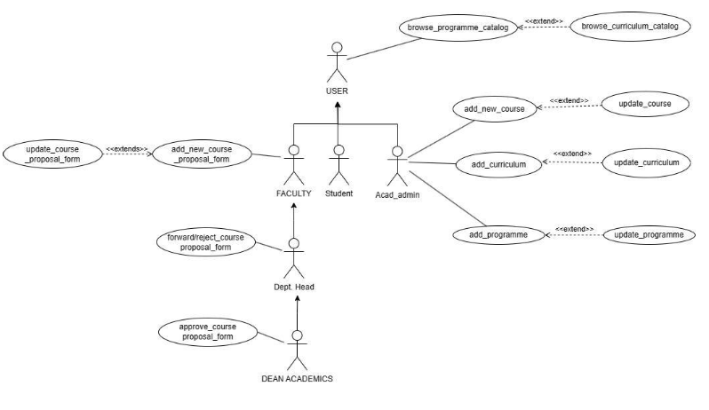

# Software Requirements Specification for AC-1 (Web Application) Programme and Curriculum

**Prepared by:**
- 21BCS126-Mamidi Ravi Chendraa
- 21BCS066-Chilukuri Surya Manikanta Chowdary
- 21BCS082-G Srinath Reddy
- 21BCS081-Duggireddy Gnana Sainath Reddy
- 21BCS125-Maloth Ritesh Pragnu Naik
- 21BCS197-Shubh Mehta (Student mentor)

**Faculty Mentor:** Dr. Vinod Kumar Jain (Head CSE)

## Table of Contents
1. [Introduction](#1-introduction)  
   1.1 [Introduction about the Fusion](#11-introduction-about-the-fusion)  
   1.2 [Purpose of the Module](#12-purpose-of-the-module)  
   1.3 [Scope of the Module](#13-scope-of-the-module)
2. [User/Actor Description (Characteristics)](#2-useractor-description-characteristics)
3. [Functional Requirements](#3-functional-requirements)  
   3.1 [Use Case Diagram](#31-use-case-diagram)  
   3.2 [Use Case Description](#32-use-case-description)  
   3.3 [Other Functional Requirements](#33-other-functional-requirements)  
   3.4 [Other Constraints](#34-other-constraints)  
   3.4.1 [User Interfaces](#341-user-interfaces)  
   3.4.2 [Software (Tech) Stack Used](#342-software-tech-stack-used)  
   3.4.3 [Business Rules](#343-business-rules)
4. [Non-Functional Requirements](#4-non-functional-requirements)
5. [Module Dependencies with Other Fusion Modules](#5-module-dependencies-with-other-fusion-modules)  
   5.1 [UI Level](#51-ui-level)  
   5.2 [DB Level Dependencies](#52-db-level-dependencies)  
   5.3 [Module Level Dependencies](#53-module-level-dependencies)

## 1. Introduction

### 1.1 Introduction about the Fusion
FusionIIIT stands as a testament to the seamless integration and automation of diverse functions within PDPM Indian Institute of Information Technology, Design and Manufacturing, Jabalpur. Crafted with precision using Python 3.8 and powered by the Django Web framework, this initiative is a student-driven endeavor designed to elevate the institute's operational landscape. Encompassing everything from efficient administration management to academic prowess and miscellaneous departmental tasks, FusionIIIT is a holistic solution that harmonizes the intricacies of campus life.

Imagine it as a digital wizard that takes care of everything, from organizing the administrative stuff to making academics smoother. It's not just limited to the usual tasks; FusionIIIT jumps into various departments and sections, making sure every corner of campus life runs smoothly.

In the admin side, it handles the complicated paperwork and processes. For academics, it brings a digital touch, making learning and managing courses easier. But it doesn't stop there; FusionIIIT is like a friendly companion for all the different parts of the campus, making sure everything works well.

In simpler terms, FusionIIIT is not just a tool – it's a helpful friend, making life at PDPM IIITDM Jabalpur more organized and enjoyable for everyone.

### 1.2 Purpose
The objective of this module is to provide addition of new programmes and effective management of various curriculum for different programmes offered in the institute. Each programme could update its curriculum for respective batch.

This module not only serves the above purpose but in addition to that, viewing the various programmes and curriculums, batches, disciplines offered in the institute is also provided along with viewing timetable and academic calendar too.

### 1.3 Product Scope
The scope of the application covers the entire Programmes & its Curriculums offered by the Institute where the user can view their desired curriculum, programme, discipline and batch, along with academic calendar and timetable.

## 2. User/Actor Description (characteristics)

### 2.1 Student:
Represents individuals who intend to browse program catalog, browsing curriculum catalog.  
**Role:** Can browse program catalog, browse curriculum catalog.  
**Specific Functionalities:**  
- Can search specific programme, curriculum, courses, based on name or discipline.  
- Can view course info in detail.

### 2.2 ACAD ADMINISTRATOR:
Responsible for managing and updating information related to academic program and curriculum.  
**Role:** Add and update programme, curriculum, courses.  
**Specific Functionalities:**  
- Can add or modify the contents of Programme, Curriculum, Courses.

### 2.3 HEAD OF DEPARTMENT:
Represents individuals who are the head of certain departments in the institute.  
**Role:** Same as a User's roles and also forwards or rejects the course proposal form to the Dean of academics.  
**Specific Functionalities:**  
- Forwards/rejects the course proposal form to the dean academics.

### 2.4 DEAN ACADEMICS:
Represents an individual who is a high-ranked academic official and oversees all the major academic operations including curriculum, workloads, approval of courses, evaluating and supervising departments of the institute.  
**Role:** Browse the program catalog, browse the curriculum catalog (same as a generic user) and also approve or reject the course proposal form.  
**Specific Functionalities:**  
- Approves or rejects the course proposal form.

### 2.5 FACULTY:
Represents individuals who can view the current semester courses and can request for course addition/updation.  
**Role:** Browse the program catalog, browse the curriculum catalog, and can apply for addition/modification of a course.  
**Specific Functionalities:**  
- Can apply for addition or modification of courses through the course proposal form.

## 3. Functional Requirements

### 3.1 Use case Diagram

### 3.2 Use Case

Here is the requested information formatted in Markdown:

### 3.2.1 Browse_programme_catalog

| **UCID**             | UC#1                        |
|----------------------|-----------------------------|
| **Use Case Name**     | Browse_programme_catalog     |
| **Actor**            | Student, Acad Admin, HOD, Faculty, Dean |
| **Description**      | The user of the system can browse the available programmes categorically. |
| **Pre Condition**    | The User must be logged-in through their credentials. |
| **Main Flow**        | 1. The Actor logs into the system. 2. The Actor then opens the Programme and Curriculum module. 3. The Actor can see the available Programmes the Institute can offer. [S1] |
| **Sub Flow**         | S1. Extend “browse_curriculum_catalogue”. |
| **Post Condition**   | The necessary details of the Programmes are displayed. |

---

### 3.2.2 Browse_curriculum_catalog

| **UCID**             | UC#2                         |
|----------------------|------------------------------|
| **Use Case Name**     | Browse_curriculum_catalogue   |
| **Actor**            | Student, Acad Admin, HOD, Faculty, Dean |
| **Description**      | The user of the system can browse the available curriculums categorically. |
| **Pre Condition**    | The User must be logged-in through their credentials. |
| **Main Flow**        | 1. The Actor logs into the system. 2. The Actor then opens the Programme and Curriculum module. 3. The Actor then selects the desired programme. 4. The Actor can see the various curriculums for that programme by clicking the curriculum link. |
| **Post Condition**   | The necessary details of the curriculum are displayed. |

---

### 3.2.3 Add_programme

| **UCID**             | UC#3                         |
|----------------------|------------------------------|
| **Use Case Name**     | Add_programme                |
| **Actor**            | Acad Admin                   |
| **Description**      | The Acad Admin can add a new programme that the institute can offer. |
| **Pre Condition**    | The User must be logged-in through their credentials. |
| **Main Flow**        | 1. The User logs into the system. 2. The actor then opens the programme and curriculum module and clicks on the add programme option. [S1] 3. The Actor then adds the discipline, batch year, and the number of semesters. 4. The Actor can add courses/elective courses or labs in each semester, along with the academic load of a particular course. 5. After entering the details, the Actor clicks on Submit. |
| **Sub Flow**         | S1. Extend “update_programme”. |
| **Post Condition**   | The programme is added successfully and saved in the database. The programme needs to be assigned a curriculum and discipline. |

---

### 3.2.4 Update_programme

| **UCID**             | UC#4                         |
|----------------------|------------------------------|
| **Use Case Name**     | Update_programme             |
| **Actor**            | Acad Admin                   |
| **Description**      | The Acad Admin can update a programme that the institute can offer. |
| **Pre Condition**    | The User must be logged-in through their credentials. |
| **Main Flow**        | 1. The User logs into the system. 2. The actor opens the programme and curriculum module and clicks on the update programme option. 3. The Actor makes the desired changes. 4. After updating the details, the Actor clicks on Submit. |
| **Post Condition**   | The programme is updated successfully and saved in the database. |

---

### 3.2.5 Add_new_course_proposal_form

| **UCID**             | UC#5                         |
|----------------------|------------------------------|
| **Use Case Name**     | Add_new_course_proposal_form |
| **Actor**            | Faculty                      |
| **Description**      | The user of the system can apply for the addition or modification of a course. |
| **Pre Condition**    | The User must be logged-in through their credentials. |
| **Main Flow**        | 1. The Actor logs into the system. 2. The Actor opens the programme and curriculum module. 3. The Actor selects the “course proposal form”. 4. The Actor fills in the necessary details and submits the form. [S1] |
| **Sub Flow**         | S1. Extend “update_course_proposal_form”. |
| **Post Condition**   | The form is submitted successfully and forwarded to the respective head of department. |

---

### 3.2.6 Update_course_proposal_form

| **UCID**             | UC#6                         |
|----------------------|------------------------------|
| **Use Case Name**     | Update_course_proposal_form  |
| **Actor**            | Faculty                      |
| **Description**      | The user of the system can apply for the addition or modification of a course. |
| **Pre Condition**    | The User must be logged-in through their credentials. |
| **Main Flow**        | 1. The Actor logs into the system. 2. The Actor opens the programme and curriculum module. 3. The Actor selects “course modification form”. 4. The Actor updates the necessary details and submits the form. |
| **Post Condition**   | The form is submitted successfully and forwarded to the respective head of department. |

---

### 3.2.7 Forward/reject_course_proposal_form

| **UCID**             | UC#7                         |
|----------------------|------------------------------|
| **Use Case Name**     | Forward/reject_course_proposal_form |
| **Actor**            | Head of Department            |
| **Description**      | The user of the system can forward or reject the course addition or modification proposal applied by the faculty. |
| **Pre Condition**    | The User must be logged-in through their credentials. |
| **Main Flow**        | 1. The Actor logs into the system. 2. The Actor opens the notifications module. 3. The Actor checks notifications related to course addition or modification proposals. 4. The Actor verifies and decides to forward or reject. |
| **Post Condition**   | The course proposal form is forwarded to the dean academics for approval or rejected by the Head of Department. |

---

### 3.2.8 Approve/reject_course_proposal_form

| **UCID**             | UC#8                         |
|----------------------|------------------------------|
| **Use Case Name**     | Approve/reject_course_proposal_form |
| **Actor**            | Dean academics                |
| **Description**      | The user of the system can approve or reject the course addition or modification proposal applied by the faculty. |
| **Pre Condition**    | The User must be logged-in through their credentials. |
| **Main Flow**        | 1. The Actor logs into the system. 2. The Actor opens the notifications module. 3. The Actor checks notifications related to course addition or modification proposals. 4. The Actor verifies and decides to approve or reject. |
| **Post Condition**   | The course proposal form is approved and the Acad Admin is notified to add or modify the course. |

---

### 3.2.9 Add_curriculum

| **UCID**             | UC#9                         |
|----------------------|------------------------------|
| **Use Case Name**     | Add_curriculum               |
| **Actor**            | Acad Admin                   |
| **Description**      | The Acad Admin can add a new curriculum. |
| **Pre Condition**    | The User must be logged-in through their credentials. |
| **Main Flow**        | 1. The Actor logs into the system. 2. The Actor opens the Programme and Curriculum module. 3. The Actor clicks on the ‘Add curriculum’ option. 4. The Actor selects disciplines/elective courses, number of semesters, labs in each semester, and the academic load of a particular course. 5. After adding the details, the Actor clicks Submit. [S1] |
| **Sub Flow**         | S1. Extend “update_curriculum”. |
| **Post Condition**   | The new curriculum is added with the mentioned details. |

---

### 3.2.10 Update_curriculum

| **UCID**             | UC#10                        |
|----------------------|------------------------------|
| **Use Case Name**     | Update_curriculum            |
| **Actor**            | Acad Admin                   |
| **Description**      | The user of the system can update the existing course. |
| **Pre Condition**    | The User must be logged-in through their credentials. |
| **Main Flow**        | 1. The Actor logs into the system. 2. The Actor opens the Programme and Curriculum module. 3. The Actor clicks on the “Update curriculum” option. 4. The Actor updates the necessary details. 5. After making the changes, the Actor clicks Submit. |
| **Post Condition**   | An update notification is displayed and the curriculum is successfully updated. |

---

### 3.2.11 Add_new_course

| **UCID**             | UC#11                        |
|----------------------|------------------------------|
| **Use Case Name**     | Add_course                   |
| **Actor**            | Acad Admin                   |
| **Description**      | The user of the system can add

 new courses. |
| **Pre Condition**    | The User must be logged-in through their credentials. |
| **Main Flow**        | 1. The Actor logs into the system. 2. The Actor opens the Programme and Curriculum module. 3. The Actor clicks on the “Add course” option. 4. The Actor adds the course details. 5. The Actor assigns the course to the curriculum. |
| **Post Condition**   | The new course is successfully added and assigned to the curriculum. |

---

### 3.2.12 Update_course

| **UCID**             | UC#12                        |
|----------------------|------------------------------|
| **Use Case Name**     | Update_course                |
| **Actor**            | Acad Admin                   |
| **Description**      | The user of the system can update existing courses. |
| **Pre Condition**    | The User must be logged-in through their credentials. |
| **Main Flow**        | 1. The Actor logs into the system. 2. The Actor opens the Programme and Curriculum module. 3. The Actor clicks on the “Update course” option. 4. The Actor updates the course details. 5. The Actor clicks Submit after making the necessary changes. |
| **Post Condition**   | The course is updated successfully, and the system reflects the new changes. |

---

## 3.3 Other Functional Requirements:
#### 3.3.1 Search Functionality
#### 3.3.2 Filter and Sort
#### 3.3.3 Integration with other modules like course registration.

## 3.4 Other Constraints:
### 3.4.1 User Interfaces:
A user will be logged in with the password and user-id he/she has with him/her and proceeding further to his home page (Programme and Curriculum Management Module) where he/she will be shown his/her profile by default beside that the programme name (B-Tech/B-Des, M-Tech/M-Des, etc) will be also displayed. Then the user has to click on any program. After clicking, a new page will come, where he/she needs to fill in the details of the branch, batch, semester, etc in order to view the particular curriculum.

### 3.4.2 Tech Stack Used:
- **Database:** PostgreSql  
- **Backend:** Django

---

## 4. Non-Functional Requirements:
### 4.1 Performance:
The system should respond to user interactions quickly. Response time for viewing programmes, curriculums, timetables, and academic calendar, updates, and notifications should be less.

### 4.2 Scalability:
The system should handle a mass of concurrent users. System performance should be evaluated under increasing load conditions.

### 4.3 Availability:
The system should be available 99.9% of the time.

### 4.4 Security:
Ensure data confidentiality and integrity. Role-based authorization ensures that users can only perform actions relevant to their designated roles.

---
## 5. Module dependencies with other fusion modules:

### 5.1. UI Level
- **User Authentication and Authorization:**
  - **Dependency:** Implementing a secure and role-based authentication system is crucial. Students should have read-only access, while academic administrators should have permissions to update or add new courses.
  
- **Search and Filtering Functionality:**
  - **Dependency:** Users, especially students, need the ability to search for programs and courses easily. Admins should have filtering options for efficient course management.
  - **Implementation:** Include search bars, filters, and sorting options to enhance the user experience. Ensure that admins have convenient tools for quickly finding and managing courses.
  - **Example:** Full-text search (fts) in a web application involves using a search engine or a database feature that allows searching through the content of textual data efficiently.
  
- **Data Presentation and Visualization:**
  - **Dependency:** Effective presentation of program details, courses, and curriculum is essential for user understanding. Admins need user-friendly interfaces to add or update course information.
  - **Implementation:** Use visually appealing and organized layouts to display program details. Implement forms and interfaces for admins to interact with data, including features for adding, updating, and deleting courses.

### 5.2 DB Level Dependencies:
The schemas that are needed by other modules are:
1. course
2. programme_curriculum_course
3. programme_curriculum_course_prerequisite_courses
4. programme_curriculum_course_disciplines

### 5.3 Module Level Dependencies:
- **Course registration, notifications and course management modules** are the modules dependent on this module.
- The course registration module will require various details like course name, course id, discipline offered, prerequisites of the course.
- The course management module will require course name, course id and discipline offered, prerequisites of the course.
- The notifications module will require to generate several important notifications like modification of course, curriculum to the respective users.
