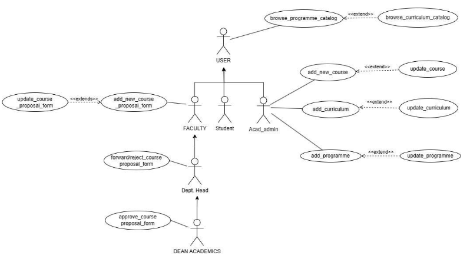

# Software Requirements Specification for

## Programme and Curriculum Management Mobile Application (AC-1)

### Prepared By: 
- ARPAN KARJEE (21bcs032)
- KANCHANDEEP KAUR (21bcs107)
- MAYUK SARKAR (21bcs132)
- SHIYA SHIVANI (21bcs193)
- UDITI DAS (21bcs232)

**Team Mentor:** ABHIKUMAR GUPTA (21bcs089)

---

## 1. Introduction

#### 1.1 Introduction about the Fusion – A brief Description

FusionIIIT stands as a testament to the seamless integration and automation of diverse functions within PDPM Indian Institute of Information Technology, Design and Manufacturing, Jabalpur. Crafted with precision using Python 3.8 and powered by the Django Web framework, this initiative is a student-driven endeavor designed to elevate the institute's operational landscape. Encompassing everything from efficient administration management to academic prowess and miscellaneous departmental tasks, FusionIIIT is a holistic solution that harmonizes the intricacies of campus life.

Imagine it as a digital wizard that takes care of everything, from organizing the administrative stuff to making academics smoother. It's not just limited to the usual tasks; FusionIIIT jumps into various departments and sections, making sure every corner of campus life runs smoothly.

In the admin side, it handles the complicated paperwork and processes. For academics, it brings a digital touch, making learning and managing courses easier. But it doesn't stop there; FusionIIIT is like a friendly companion for all the different parts of the campus, making sure everything works well.

In simpler terms, FusionIIIT is not just a tool – it's a helpful friend, making life at PDPM IIITDM Jabalpur more organized and enjoyable for everyone.

#### 1.2 Purpose of the module

The primary goals of this application revolve around facilitating the addition of new programs and overseeing the curriculum management process for various academic offerings provided by the Institute. The application aims to empower each program to efficiently update and manage its curriculum, specifically catering to different batches within the program. Through this platform, programs can seamlessly introduce new courses and enhance the educational content for improved academic experiences across multiple batches.

#### 1.2 Scope of the module

The application's scope encompasses the comprehensive range of programs and their respective curriculums offered by the Institute. Users are provided with the capability to seamlessly access and review the curriculum and program requirements relevant to their academic pursuits. Through the application, users can effortlessly navigate and explore the specific curriculum details associated with each program, gaining a clear understanding of the educational components required for successful completion of their chosen academic paths.

---

## 2. User/Actor Characteristics

#### 2.1 User (general)

A general user who can browse the programme and curriculum catalogs to view the available courses and their details.

##### Specific Functionalities:
1. **Browse_programme_catalog**: The user can view the list of programmes offered by the academic institution, along with their details such as duration, eligibility, fees, etc.
2. **Browse_curriculum_catalog**: The user can view the list of curricula for each programme, along with their details such as courses, credits, prerequisites, etc.

#### 2.2 Faculty

A faculty member who can propose new courses or update existing ones, and also approve or forward the proposals to the next level of authority.

##### Specific Functionalities:
1. **Update_course_proposal**: The faculty can modify the details of an existing course proposal, such as title, description, objectives, outcomes, syllabus, etc.
2. **Add_new_course_proposal**: The faculty can create a new course proposal by filling in the required details, such as title, description, objectives, outcomes, syllabus, etc.
3. **Forward_course_proposal**: The faculty can either approve or forward a course proposal to the department head, depending on their role and authority.

#### 2.3 Student

A student who can enroll in courses can browse their courses list but has no direct interaction with the course proposal and approval process.

#### Specific Functionalities:
- Student does not have any additional functionalities; all functionalities of student are covered in the general user.

#### 2.4 Academic Admin

An academic administrator who can add, update, or delete courses, curricula, and programmes in the system, and also assign faculty members to courses.

#### Specific Functionalities:
1. **Add_new_course**: The academic admin can add a new course to the system, based on the approved course proposal.
2. **Update_course**: The academic admin can update the details of an existing course, such as title, description, objectives, outcomes, syllabus, etc.
3. **Add_curriculum**: The academic admin can add a new curriculum to the system, by specifying the courses, credits, prerequisites, etc.
4. **Update_curriculum**: The academic admin can update the details of an existing curriculum, such as courses, credits, prerequisites, etc.
5. **Add_programme**: The academic admin can add a new programme to the system, by specifying the duration, eligibility, fees, curriculum, etc.
6. **Update_programme**: The academic admin can update the details of an existing programme, such as duration, eligibility, fees, curriculum, etc.

#### 2.5 Department Head

A department head who can approve or forward the course proposals to the dean of academics, and also view the status of the proposals.

#### Specific Functionalities:
1. **Approve/forward_course_proposal**: The department head can either approve or forward a course proposal to the dean of academics, depending on their role and authority.
2. **View_course_proposal_status**: The department head can view the status of each course proposal, such as pending, approved, forwarded, rejected, etc.

#### 2.6 Dean of Academics

A dean of academics who can give the final approval for the course proposals, and also view the status of the proposals.

#### Specific Functionalities:
1. **Approve_course_proposal**: The dean of academics can give the final approval for a course proposal, based on their role and authority.
2. **View_course_proposal_status**: The dean of academics can view the status of each course proposal, such as pending, approved, forwarded, rejected, etc.

---

## 3. Functional Requirements

### 3.1 Use Case Diagram

### 3.2 Use Case

### 3.2.1 Browse_programme_catalog

| UC ID   | UC#1 |
|---------|------|
| **Use Case Name** | Browse_programme_catalog |
| **Actor**         | All User |
| **Description**   | The user of the system can browse the available programmes categorically. |
| **Precondition**  | The user must be logged-in. |
| **Main Flow**     | 1. The Actor logs into the system.   2. The Actor then opens the Programme and Curriculum module.   3. The Actor can see the available Programmes the Institute can offer. |
| **Post Condition**| The necessary details of the Programmes are displayed. |

---

### 3.2.2 Browse_curriculum_catalog

| UC ID   | UC#2 |
|---------|------|
| **Use Case Name** | Browse_curriculum_catalog |
| **Actor**         | All User |
| **Description**   | The user of the system can browse the available curriculum categorically. |
| **Precondition**  | The user must be logged-in. |
| **Main Flow**     | 1. The Actor logs into the system.   2. The Actor then opens the Programme and Curriculum module.   3. The Actor selects the desired Programme. [S1]   4. The Actor selects the desired Curriculum.   5. The Actor is now able to see the different Courses available for the different semesters. |
| **Sub Flow**      | S1. Extend 'Browse_programme_catalog' |
| **Post Condition**| The necessary details of the different Curriculums with their courses are displayed. |

---

### 3.2.3 Add_new_course

| UC ID   | UC#3 |
|---------|------|
| **Use Case Name** | Add_new_course |
| **Actor**         | Acad Admin |
| **Description**   | The Acad Admin can add a new course that is not included in the curriculum along with the faculty who will be teaching. |
| **Precondition**  | The Acad Admin must be logged-in. |
| **Main Flow**     | 1. The Actor logs into the system.   2. The Actor then opens the Programme and Curriculum module.   3. Actor clicks on the ‘Add new course’ option.   4. Actor then selects the Programme.   5. Actor enters the course name along with all the meta data like Course code, Faculty name, etc.   6. The Actor can add the syllabus of a particular course.   7. After successfully filling the details, the Actor clicks on Submit. |
| **Post Condition**| The course code is generated and the course is saved in the Database. |

---

### 3.2.4 Update_course

| UC ID   | UC#4 |
|---------|------|
| **Use Case Name** | Update_course |
| **Actor**         | Acad Admin |
| **Description**   | The Acad Admin can update an already added course or the faculty who is teaching a particular course. |
| **Precondition**  | ● The Acad Admin must be logged-in.   ● The Acad Admin must know the code of the course to be updated. |
| **Main Flow**     | 1. The Actor logs into the system.   2. The Actor then opens the Programme and Curriculum module.   3. Actor clicks on the ‘Update course’ option.   4. Acad Admin enters the course code.   5. Acad Admin can update the necessary meta-data of the course.   6. The Acad Admin can update the syllabus of a particular course.   7. After successfully updating the details, the Actor clicks on Submit. |
| **Post Condition**| The course is updated and saved in the Database. |

---

### 3.2.5 Update_curriculum

| UC ID   | UC#5 |
|---------|------|
| **Use Case Name** | Update_curriculum |
| **Actor**         | Acad Admin |
| **Description**   | The Acad Admin can update the curriculum, including the number of credits, number of courses/labs, in each semester for a particular discipline and year. |
| **Precondition**  | ● The Acad Admin receives a notification every 3 to 5 years that the curriculum needs to be updated.   ● The Acad Admin must be logged-in. |
| **Main Flow**     | 1. The Actor logs into the system.   2. The Actor then opens the Programme and Curriculum module.   3. Actor clicks on the ‘Update curriculum’ option.   4. Acad Admin selects the desired Programme.   5. Changes can be made to the number of discipline/elective courses, labs in each Semester, and the academic load of a particular course.   6. After successfully updating the details, click on Submit. [S1][S2] |
| **Sub Flow**      | S1. Include ‘add_new_courses’   S2. Include ‘update_courses’ |
| **Post Condition**| The curriculum is updated and saved in the Database. |

---

### 3.2.6 Add_curriculum

| UC ID   | UC#6 |
|---------|------|
| **Use Case Name** | Add_curriculum |
| **Actor**         | Acad Admin |
| **Description**   | The Acad Admin can add a new curriculum with a new Branch, specifying the number of credits, courses, and labs for each semester. |
| **Precondition**  | The Acad Admin must be logged-in. |
| **Main Flow**     | 1. The Actor logs into the system.   2. The Actor opens the Programme and Curriculum module.   3. The Actor clicks on the ‘Add curriculum’ option.   4. The Actor specifies the number of Semesters.   5. The Actor adds the number of disciplines/elective courses, labs in each Semester, and the academic load of a particular course.   6. After successfully adding the details, click on Submit. [S1][S2] |
| **Sub Flow**      | S1. Include ‘add_new_courses’   S2. Include ‘update_courses’ |
| **Post Condition**| The new curriculum is added to the Database. |

---

### 3.2.7 Add_programme

| UC ID   | UC#7 |
|---------|------|
| **Use Case Name** | Add_programme |
| **Actor**         | Acad Admin |
| **Description**   | The Acad Admin can add a new programme to the list of programmes offered by the Institute. |
| **Precondition**  | The Acad Admin must be logged-in. |
| **Main Flow**     | 1. The Actor logs into the system.   2. The Actor opens the Programme and Curriculum module.   3. The Actor clicks on the ‘Add Programme’ option.   4. The Actor specifies the discipline, batch year, and the number of semesters.   5. The Actor adds the courses, elective courses, and labs for each Semester, along with the academic load of a particular course.   6. After successfully adding the details, click on Submit. [S1] |
| **Sub Flow**      | S1. Include ‘add_curriculum’ |
| **Post Condition**| The programme and curriculum are added to the Database. |

---

### 3.2.8 Update_programme

| UC ID   | UC#7 |
|---------|------|
| **Use Case Name** | Update_programme |
| **Actor**         | Acad Admin |
| **Description**   | The Acad Admin can update a programme offered by the Institute. |
| **Precondition**  | ● The Acad Admin receives a notification whenever the programme needs to be updated.   ● The Acad Admin must be logged-in. |
| **Main Flow**     | 1. The Actor logs into the system.   2. The Actor opens the Programme and Curriculum module.   3. The Actor clicks on the ‘Update Programme’ option.   4. The Acad Admin selects the desired Programme.   5. The Acad Admin can change the required programme or course details.   6. After successfully updating the details, click on Submit. [S1][S2] |
| **Sub Flow**      | S1. Include ‘add_curriculum’ |
| **Post Condition**| The programme and curriculum are updated and saved in the Database. |

## 3.3. Other Functional Requirements
1. This module will make use of the communication module for sending notifications and alerts to various actors involved in the module suitably for course adding, updating , deleting confirmations, rejections, or modifications, etc.
2. Automated email or SMS notifications for Course, Program, Timetables updates, modifications.
3. Alerts for actions to take.

## 3.4 Other Constraints

### 3.4.1 User Interface
Certainly! After successfully logging in, the user will be directed to their personalized home page within the Programme and Curriculum Management Module. The home page will not only showcase the user's profile but will also prominently feature the associated program name, providing immediate visibility to details like BTech/B-Des, M-Tech/M-Des, and more. To proceed further, the user is required to click on a specific program of their choice. This action will navigate them to a new page dedicated to the selected program. On this page, the user will be prompted to input essential details such as branch, batch, semester, and other relevant information. These details are integral as they tailor the curriculum viewing experience to the user's specific academic context, ensuring a more personalized and targeted exploration of the curriculum content.

### 3.4.2 Tech Stack Used
- Flutter
- Django
- Rest api(Django-Rest-Framework)
- SQLite3

## 4. Non- Functional Requirements
### 4.1 Performance:
The system should respond to user interactions quickly.
### 4.2 Scalability:
The system should handle a mass of concurrent users. System performance should be evaluated under increasing load conditions.
### 4.3 Availability:
The system should be available 99.9% of the time.
### 4.4 Security:
Ensure data confidentiality and integrity. Role-based authorization ensures that users can only perform actions relevant to their designated roles.

## 5. Module dependencies with other fusion modules

### 5.1. UI Level
The integration of our module, AC1, is intricately connected with AC2 (Course Registration) and AC3 (Course Management) within the system. Our module serves as the prelude to the overall workflow, establishing a foundational step. It is imperative that users interact with our UI pages before accessing the AC2 and AC3 module pages. Our module, AC1, essentially sets the stage for subsequent processes in the system. Users, upon logging in, must first engage with the UI pages of AC1. This initial interaction provides a crucial context and groundwork for the subsequent actions related to AC2 (Course Registration) and AC3 (Course Management). By ensuring users navigate through our module's UI pages before proceeding to AC2 and AC3, we not only establish a logical sequence in the workflow but also guarantee that users have a comprehensive understanding of the system's functionalities from the outset. This approach enhances user experience and ensures a smooth transition into the course registration and management aspects of the system.

### 5.2 DB Level Dependencies
For the mobile version of AC1, its dependency is currently limited to the (AC2 and AC3) Course Registration and management and Examination modules. The data for our module is sourced from a CSV file, and to enhance the system's efficiency and connectivity, we are actively in the process of developing an API (Application Programming Interface). To facilitate seamless communication between the frontend and backend, we are in the midst of constructing Django Rest Framework (DRF) serializers. These serializers play a pivotal role in transforming complex data types, such as Django model instances, into native Python data types that can be easily rendered into JSON and consumed by the frontend. This approach ensures a standardized and efficient exchange of data between the different components of the system. The integration of DRF serializers is a crucial step in establishing a robust connection between the backend, which fetches data from the CSV file, and the frontend of our module. By adopting this method, we aim to enhance the overall performance, maintainability, and extensibility of our system, ultimately providing a more seamless and responsive experience for mobile users interacting with AC1 and its associated modules.

### 5.3. Module Level Dependencies
The integration of our AC1 module is closely tied to the Notification module and the Authentication module. These modules serve as essential pillars supporting the functionalities within AC1. Additionally, our module currently acts as a dependency for the Course Registration and Examination modules. To delve into the specifics, the Notification module plays a vital role in ensuring effective communication within AC1. It facilitates the delivery of timely alerts, updates, and notifications relevant to the activities and processes encapsulated in our module. Moreover, seamless integration with the Authentication module ensures secure and authorized access, safeguarding the integrity of user interactions within AC1. In terms of dependencies, aside from the overarching reliance on the Notification and Authentication modules, AC1 is currently instrumental in enhancing the workflows of the Course Registration and Examination modules. This interdependence underscores the significance of AC1 as a foundational element in the broader system architecture, playing a key role in shaping the user experience and overall functionality of the integrated modules.
