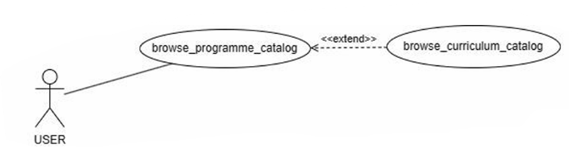
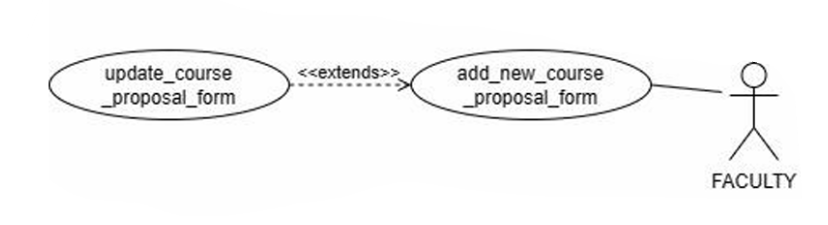
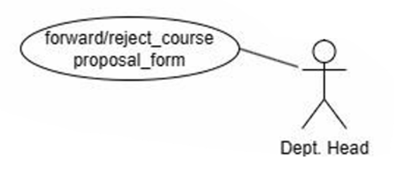
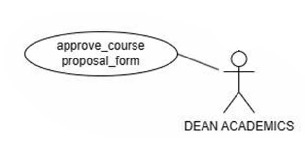
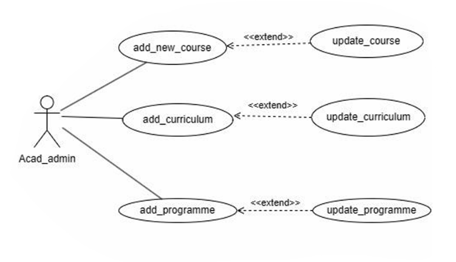

# Figma Profiles for AC-1 (Web Application)
## Programme and Curriculum

### Prepared by:
- 21BCS126 - Mamidi Ravi Chendraa
- 21BCS066 - Chilukuri Surya Manikanta Chowdary
- 21BCS082 - G Srinath Reddy
- 21BCS081 - Duggireddy Gnana Sainath Reddy
- 21BCS125 - Maloth Ritesh Pragnu Naik
- 21BCS197 - Shubh Mehta (Student mentor)

**Faculty Mentor-** Dr. Vinod Kumar Jain (Head CSE)

---

## Module Description:
The purpose of the project entitled as **PROGRAMME AND CURRICULUM MANAGEMENT** is to provide addition of new programmes and effective management of various curriculum for different programmes offered in the institute. Each programme could update its curriculum for each batch. The scope of the application covers the entire Programmes and its curriculums offered by the Institute where the user can view their desired curriculum, programme, discipline, and batch.
- **Curriculums Management**
- **Forwarding of course proposal forms**
- **Addition and updation of courses**

---

### 3.2 Use Case

#### Actors

#### USE CASE DIAGRAM:

---

### 2.1 Generic User
Represents individuals who intend to browse program catalog, browsing curriculum catalog.  
**Role**: Can browse program catalog, browse curriculum catalog.  
**Specific Functionalities**: Can search specific programme, curriculum, courses, based on name or discipline, can view course info in detail.

[Generic User Work Flow](https://www.figma.com/proto/6PAgHY84y1gfnjy0XwA8bK/AC-1-Programme-and-Curriculum-WEB-TEAM?type=design&node-id=0-1&t=dgrgm15v4xVCveqa-0&scaling=min-zoom&starting-point-node-id=53%3A42&show-proto-sidebar=1)

---

### 2.2 Faculty
Represents individuals who can view the current semester courses and can request for course addition/updation.  
**Role**: Browse the program catalog, browse the curriculum catalog, and can apply for addition/modification of a course.  
**Specific Functionalities**: Can apply for addition or modification of courses through the course proposal form.

[Faculty Course Proposal Form Work Flow](https://www.figma.com/proto/6PAgHY84y1gfnjy0XwA8bK/AC-1-Programme-and-Curriculum(WEB-TEAM)?type=design&node-id=250-111&t=uh50nQkoxKPhGrNy-0&scaling=min-zoom&page-id=0%3A1&starting-point-node-id=250%3A111&show-proto-sidebar=1)

---

### 2.3 Head of the Department
Represents individuals who are the head of certain departments in the institute.  
**Role**: Same as a User's roles and also forwards or rejects the course proposal form to the Dean of academics.  
**Specific Functionalities**: Forwards/rejects the course proposal form to the dean academics.

[HOD Forward/Reject Course Form Work Flow](https://www.figma.com/proto/6PAgHY84y1gfnjy0XwA8bK/AC-1-Programme-and-Curriculum-WEB-TEAM?type=design&node-id=0-1&t=dgrgm15v4xVCveqa-0&scaling=min-zoom&starting-point-node-id=169%3A172&show-proto-sidebar=1)

---

### 2.4 Dean Academics
Represents an individual who is a high-ranked academic official and oversees all the major academic operations including curriculum, workloads, approval of courses, evaluating, and supervising departments of the institute.  
**Role**: Browse the program catalog, browse the curriculum catalog (same as a generic user) and also approve or reject the course proposal form.  
**Specific Functionalities**: Approves or rejects the course proposal form.

[Dean Academics Approve/Reject Course Form Work Flow](https://www.figma.com/proto/6PAgHY84y1gfnjy0XwA8bK/AC-1-Programme-and-Curriculum-WEB-TEAM?type=design&node-id=0-1&t=dgrgm15v4xVCveqa-0&scaling=min-zoom&starting-point-node-id=174%3A564&show-proto-sidebar=1)

---

### 2.5 Acad Admin
Responsible for managing and updating information related to academic program and curriculum.  
**Role**: Add and update programme, curriculum, courses.  
**Specific Functionalities**: Can add or modify the contents of Programme, Curriculum, Courses.

[Acad-Admin Workflow](https://www.figma.com/proto/6PAgHY84y1gfnjy0XwA8bK/AC-1-Programme-and-Curriculum-WEB-TEAM?type=design&node-id=0-1&t=dgrgm15v4xVCveqa-0&scaling=min-zoom&starting-point-node-id=38%3A11&show-proto-sidebar=1)
