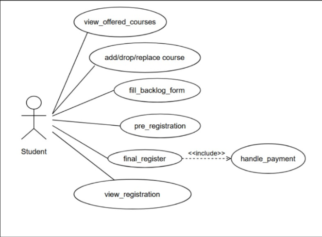
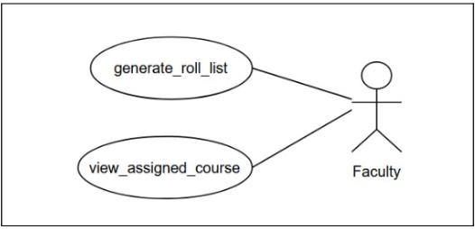
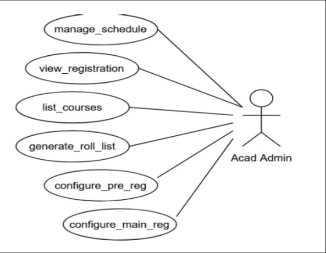

# Figma Profiles for AC-2 Course Registration

### 1. Module Description
The purpose of the Course Registration module is to streamline and enhance the overall user experience of the students, allowing them to register courses seamlessly. The module seeks to automate all the course registration activities for the Academic Section, students, and faculties.

**Use case specifications of the module** - SRS - AC-2 Course Registration.docx

### 2. Actors 

#### 2.1 Actor #1: Student
Represents individuals who intend to use this module for course registration, pre-registration, adding/dropping/replacing courses, viewing registration, backlog forms, etc. Students are divided based on the programme, discipline, year of joining, etc.

**Role:** Initiates the course registration process including replace/drop courses.

**Specific Functionalities:**
- Login into the app to gain access and perform the available operations.
- **UC#2:** View the offered core and elective course list for each semester along with the course details including credits, number of lectures, labs, etc.
- **UC#4:** Select from the list of available courses and submit them, thus completing pre-registration.
- Select the courses/electives for the current semester assigning priority to each course available in the course list.
- **UC#5:** View the list of selected courses entered during the registration process for a particular semester.
- **UC#1:** Perform Add/Drop of courses.
- **UC#3:** Perform Replace of courses.
- **UC#6:** Can apply/register for backlog courses.
- **UC#7:** Perform final registration.

**FIGMA Profile Link:** [Figma Profile for Student](https://www.figma.com/file/bceLd1tpX7tpYUHuGTzEM5/Fusion-APP-(Copy)?type=design&node-id=0%3A1&mode=design&t=H3fWEfPYCuwLdklf-1)

---

#### 2.2 Actor #2: Faculty
Can view the courses assigned and check the students enrolled in his/her course.

**Specific Functionalities:**
- **UC#13:** View the generated roll list of the students enrolled in his/her course.
- **UC#14:** View the courses assigned to him/her.

**FIGMA Profile Link:** [Figma Profile for Faculty](https://www.figma.com/file/bceLd1tpX7tpYUHuGTzEM5/Fusion-APP-(Copy)?type=design&node-id=0%3A1&mode=design&t=H3fWEfPYCuwLdklf-1)

---

#### 2.3 Actor #3: Academic Administration
Supervises the overall operations of the pre-registration and course registration for each semester.

**Role:** Manages the overall operations of the course registration process, scheduling registration timings, generating course lists, updating academic curriculum, etc.

**Specific Functionalities:**
- **UC#11,12:** Can add or remove courses from the list of available courses for the next semester.
- **UC#10:** Update the faculty details who will be taking the course.
- **UC#8:** Generate a roll list after the successful course registration process.
- **UC#9:** Enable pre-registration and course registration according to the Academic Calendar.

**Figma Profile Link:** [Figma Profile for Academic Administration](https://www.figma.com/file/bceLd1tpX7tpYUHuGTzEM5/Fusion-APP-(Copy)?type=design&node-id=0%3A1&mode=design&t=H3fWEfPYCuwLdklf-1)
