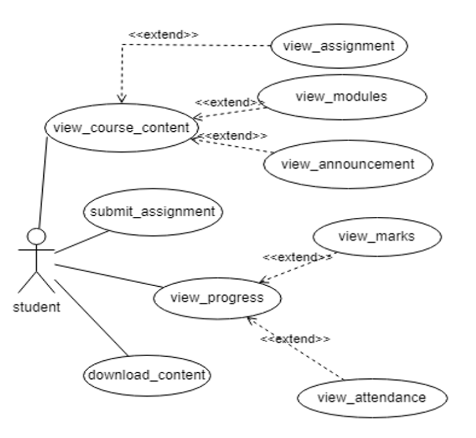
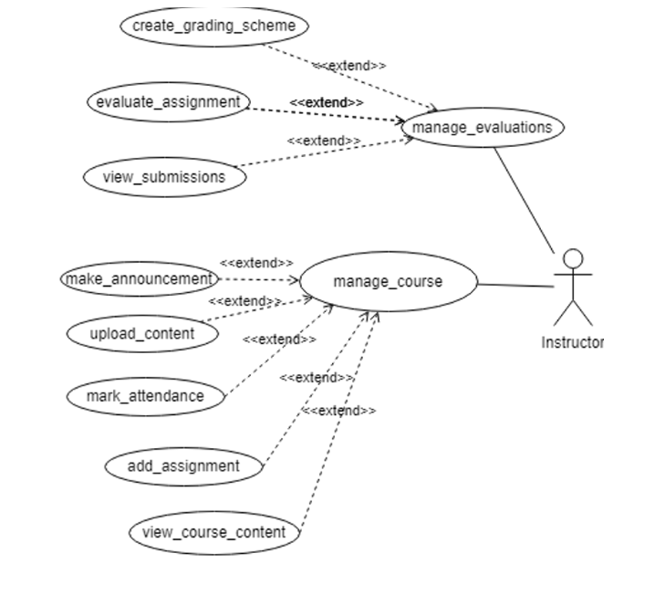
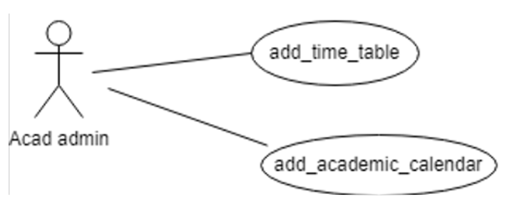

# Figma Profiles for AC3 - Course Management (Web)

## Module Description
The module is designed to provide a platform for instructors and students to work together more efficiently. The primary objective of the module is to streamline and enhance course management, benefiting both students and faculty. Instructors can upload course-related documents, assignments, quizzes, and announcements, while students can view their performance, course content, submit assignments, and ask related queries. The application also allows instructors to evaluate assignments and projects allotted to students and recommends optimal grades for each student. The module includes features such as the ability to showcase courses with details such as name, code, instructor, and schedule. The system also addresses the optimal display of courses. A dedicated section for each course facilitates easy access to course materials and resources in various file formats.

## Use Case Specifications

### Actors 

#### 2.1 Student 
Represents all the students who intend to complete the course and receive all the important announcements and course updates (attendance, course timetable, assignments, projects, and their marks) made by the Instructor.

**Role:** Enroll in the course and access the content provided by the instructor. Access course content and details, download the assignment, and see previous quiz performance.

**Use cases -**
- view_course_content [UC#3]
- submit_assignment [UC#4]
- view_progress [UC#5]
- download_content [UC#6]

**Figma profile -** 
[Student Figma Profile](https://www.figma.com/file/eoua8MVTWoCUPv1B7hRrir/AC3---Course-Management-(Web)?type=design&node-id=0-1&mode=design&t=qafgzddne90Rfs7H-0)

#### 2.2 Instructor
Represents all the Instructors who intend to provide the course content, announcements, and projects/assignments to the students who can access them at a common portal in Fusion.

**Role:** Share the course link/portal with the students and all the important information and contents on the portal.

**Use cases -**
- manage_evaluations [UC#1]
- manage_course [UC#2]

**Figma profile -** 
[Instructor Figma Profile](https://www.figma.com/file/eoua8MVTWoCUPv1B7hRrir/AC3---Course-Management-(Web)?type=design&node-id=15-533&mode=design&t=qafgzddne90Rfs7H-0)

#### 2.3 Acad Admin
Represents the Academic Administrator of the college responsible for managing other academic procedures such as creating a time table and creating an academic calendar.

**Role:** Add the necessary information on the portal required for efficient flow of academic procedures.

**Use cases -**
- add_time_table [UC#7]
- add_academic_calendar [UC#8]

**Figma profile -** 
[Academic Admin Figma Profile](https://www.figma.com/file/eoua8MVTWoCUPv1B7hRrir/AC3---Course-Management-(Web)?type=design&node-id=11-2663&mode=design&t=qafgzddne90Rfs7H-0)
