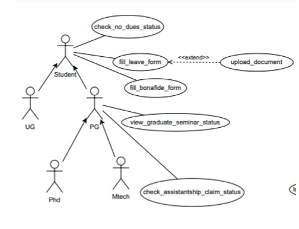
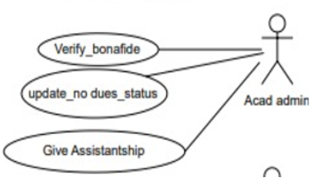
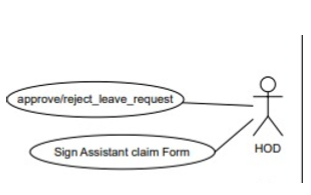
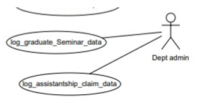

# Figma Profiles for AC-4 (App Application) Other Academic Procedures  

**Prepared by:**  

- 21BCS041-Ashish Kol  
- 21BCS060-Bikash Sabar  
- 21BCS083-Gadam Omkar  
- 21BCS086-Gaurav Singh  
- 21BCS192-Shivam Kumar  
- 21BCS159-Prakash Dwivedi (Student mentor)  

**Faculty Mentor - Dr. Ayan Seal**  

## Module Description:  
The Academic Procedures system is itself a subsystem of the College System. Software will take input from the College Database of Students and Faculty. There are specifically 6 Actors in the System, Students, Assistant, HOD, PG Students, concerned authorities and Faculty. Different Activities are performed by different actors Like leave form, bonafide form, graduate seminar status, assistance claim status, no-dues status. Accessing the information and performing the activities will be easy using the Software.  

### Actors  
## USE CASE DIAGRAM:  

### 2.1 Students (UG and PG):  
Represents individuals enrolled in academic programs within the institution.  
**Role:** Engages in various academic procedures necessary for their academic journey.  

[Student Work flow](https://www.figma.com/design/PNsCNPNW12PzovK2DL2CkQ/Student(Actor)?node-id=1-350&node-type=frame&t=0Ipm2For5sLiin8x-0)  

---
### 2.2 Academic Administration:  
Represents individuals responsible for assisting in administrative tasks within academic departments.  
**Role:** Facilitates the processing of academic procedures on behalf of students and faculty.  

[Acad workflow](https://www.figma.com/design/VNb3C0nt6bO1vrNg0GCGvl/Assistant(Actor)?node-id=0-1&node-type=canvas&t=uYh4kLoxO4qZqsRB-0)  

---
### 2.3 Head of Department (HOD):  
Represents academic department heads responsible for overseeing and approving certain academic procedures.  
**Role:** Ensures the integrity and adherence to departmental policies in academic processes.  

[HOD work flow](https://www.figma.com/design/3wSrCq3ZZthySScSILFCLI/Faculty(Actor)?node-id=0-1&node-type=canvas&t=J1TOQK7EDX5lRGmb-0)  

---

### 2.4 Department Administrator:  
Represents individuals responsible for administrative oversight and support at the departmental level.  
**Role:** Manages and facilitates the coordination of academic procedures within the department.  

[Dept work flow](https://www.figma.com/design/VNb3C0nt6bO1vrNg0GCGvl/Assistant(Actor)?node-id=0-1&node-type=canvas&t=otdkQBGVynf5QsfX-0)  
