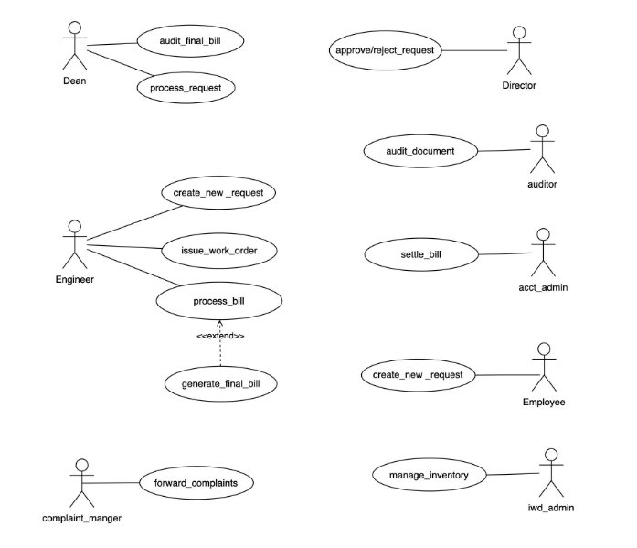

# Institute Work Department ERP 

# Software Requirements Specification 

**Faculty Mentor:**  Dr Durgesh Singh  Student Mentor:  Gagan Singh - 21BCS084 

**Prepared by:**            

Kunal Raj – 21BCS118 Vidyadhar - 21BCS239 

Rishabh Nigam – 21BCS173 Kunal Marmat – 21BSM030 Vijay Kumar Saharan - 21BCS240 

## **1 Introduction** 

**1. Introduction about the Institute Work Department ERP** 

Fusion IIIT exemplifies the seamless integration and automation of diverse functions within the realm of Android development at PDPM IIITDM JABALPUR. Developed with precision using Python 3.8 and driven by the Django framework for the backend and Flutter for frontend, this initiative is a student-led venture designed to enhance the institute's operational capabilities in the Android app development sphere. From client administration management to academic prowess and various departmental tasks, Fusion IIIT serves as a comprehensive solution that harmonizes the intricacies of Android development.  

Visualize it as a digital wizard specifically tailored for the world of Android app development. It not only streamlines administrative processes but also ensures a smoother workflow for app development projects. Fusion IIIT extends its reach beyond conventional tasks, delving into various departments and sections to guarantee the seamless execution of every aspect of Android development on campus. On the administrative side, it adeptly manages complex paperwork and processes, while on the development side, it introduces efficiency to coding and project management. Fusion IIIT is more than just a development tool; it acts as a supportive companion, ensuring that the Android development environment at PDPM IIITDM Jabalpur operates seamlessly.  

In essence, Fusion IIIT for Android development is more than a mere tool – it's a dedicated ally that contributes to making the app development process at PDPM IIITDM Jabalpur more organized and enjoyable for everyone involved. 

**2. Purpose of the module** 

The IWD Module, seamlessly integrated into Fusion, assumes a dedicated role in overseeing the maintenance of campus property to ensure its efficient and effective upkeep. This specialized module takes on the primary responsibility of not only monitoring the condition of on-site assets but also promptly addressing any malfunctions that may arise. In doing so, it plays a crucial role in guaranteeing the smooth functioning of all physical elements on the campus, contributing to a well-maintained and operational environment. 

**3. Scope of the module**

The IWD module is integral to campus property management, going beyond basic maintenance. It ensures not only the preservation of assets but also implements strategic measures for enhanced efficiency. Proactively addressing issues related to malfunctioning property, the module optimizes overall functionality. Additionally, through meticulous planning and resource coordination, it contributes to a well-equipped and seamlessly operating campus environment. This comprehensive approach enhances the overall effectiveness and sustainability of campus infrastructure, fostering an optimal environment for learning and various activities within the campus community. 

## 2 User/Actor characteristics 

**1. Dean**

Role: Processes the requests from the engineer and passes it on to the director and he is the one who audits the final bill generated. 

Specific Functionalities: 

1. Efficiently processes the requests from the engineer.
1. Audits the final bill and keeps a comprehensive record of all the items used.  
**2. Director** 

Role: The director is the one who approves or rejects the requests from the engineer, processed by the dean.  

Specific Functionalities: 

1. Efficiently processes the requests from the engineer.
1. Audits the final bill and keeps a comprehensive record of all the items used. 

  **3. Auditor**

Role: The auditor reviews all submitted documents comprehensively. Specific Functionalities: 

1. The auditor reviews all the documents.
1. The auditor verifies the authenticity and accuracy of all the submitted documents.  
**4. Account Admin**

**Role:** The account admin settles the bill generated from the engineer and then sends it to the dean for a final audit. 

Specific Functionalities: 

1. The account admin settles the generated bill. 
1. The auditor verifies the authenticity of all the items mentioned in the bill. 
**5. Employee**

**Role:** The employee initiates a new work request.                                                    Specific Functionalities: 

1\. The employee can raise a new work request if there is a malfunction in any of the property. 

**6. IWD Admin**

**Role:** The IWD Admin oversees the inventory, providing engineers with access to manage and utilize the available resources. 

Specific Functionalities: 

1\.The IWD Admin manages the inventory. 

2\.The IWD Admin provides all the resources available to the engineers. 

**7. Complaint Manager**

**Role:** The complaint manager is responsible for forwarding the complaints received to the relevant authorities. 

Specific Functionalities: 

1\. The Complaint Manager systematically organizes, and stores all received complaints for easy reference. 

**8. Engineer**

**Role:** The Engineer initiates a new service request, issues the corresponding work order, facilitates the processing of the associated bill to be submitted to higher authorities. 

Specific Functionalities: 

1. The Engineer initiates a new request and the corresponding work order. 
1. The Engineer processes the bill to the higher authorities. 

3 Functional Requirements 

1. Use Case Diagram

## 2. Use Case Description

This section describes each use case Description in the use case diagram in all details. 

1\. 
|UC ID |UC #1 |
| - | - |
|Use Case Name  |create\_new\_request  |
|Description  |The “Create new request” use case is used to create a new request to the higher authorities. |
|Actor  |Engineer, Employee |
|Precondition  |The engineer or the employee is logged into the portal. |

<table><tr><th colspan="1"></th><th colspan="2"></th></tr>
<tr><td colspan="1" rowspan="4" valign="top">Main Flow  </td><td colspan="1">M1 </td><td colspan="1" valign="top">The employee or the engineer goes to the “Create new request” tab. </td></tr>
<tr><td colspan="1">M2 </td><td colspan="1" valign="top">
They fill all the necessary and relevant Informa on 

related to their request. 
</td></tr>
<tr><td colspan="1">M3 </td><td colspan="1" valign="top">They click on the submit button. </td></tr>
<tr><td colspan="1">M4 </td><td colspan="1" valign="bottom">The request is now submitted to the higher authorities. </td></tr>
</table>

||||
| :- | :- | :- |
|Post Condi on  |The request is now submitted to the higher authority. ||
|Sub Flow  |NIL  ||
|Global Alternate Flow  |GA1 |
If a technical error occurs during the execution of any action (e.g., database failure, server issues), the

` `system displays an error message, and the request will not be submitted. 
|

2\. 

<table><tr><th colspan="1" valign="top"><b>UC ID</b> </th><th colspan="2" valign="top">UC#2 </th></tr>
<tr><td colspan="1"><b>Mark as read</b> <b>Use Case Name</b> </td><td colspan="2" valign="top">Issue_work_order </td></tr>
<tr><td colspan="1" valign="top"><b>Description</b> </td><td colspan="2" valign="bottom">The “issue_work_order” use case is used to Issue work order after the engineer’s or the employee's request is approved. </td></tr>
<tr><td colspan="1" valign="top"><b>Actor</b> </td><td colspan="2" valign="bottom">Engineer </td></tr>
<tr><td colspan="1" valign="top"><b>Precondition</b> </td><td colspan="2" valign="top">The engineer should be logged into the portal and the request must be approved by the director. </td></tr>
<tr><td colspan="1" rowspan="2" valign="top"><b>Main Flow</b> </td><td colspan="1">1 </td><td colspan="1" valign="bottom">The request is approved by the higher authorities. </td></tr>
<tr><td colspan="1">2 </td><td colspan="1" valign="bottom">Then the engineer issues the corresponding work order for the approved request. </td></tr>
</table>

|**Post conditions** |The work order for the approved request is issued. ||
| - | :- | :- |
|**Sub Flow** |NIL ||

3\. 

||**UC ID** |UC#3 |
| :- | - | - |
||**Use Case Name** |Process\_bill |
||**Description** |
The “process\_bill” use case is used 

To list down all the items used and submit it to the higher 
|
|||Authorities for verification. |

<table><tr><th colspan="1"></th><th colspan="1"><b>Actor</b> </th><th colspan="1"></th><th colspan="3" valign="top">Engineer </th></tr>
<tr><td colspan="1"></td><td colspan="1"><b>Precondition</b> </td><td colspan="1"></td><td colspan="3" valign="top">The engineer should be logged into the Portal and the bill must be generated. </td></tr>
<tr><td colspan="1"></td><td colspan="1"></td><td colspan="1"></td><td colspan="3"></td></tr>
<tr><td colspan="1"></td><td colspan="1"></td><td colspan="1"></td><td colspan="1" valign="top">1 </td><td colspan="2" valign="top">The engineer should navigate to the “Process_Bill” Section. </td></tr>
<tr><td colspan="1" rowspan="2"></td><td colspan="1" rowspan="2" valign="top"><b>Main flow</b> </td><td colspan="1"></td><td colspan="1"></td><td colspan="2"></td></tr>
<tr><td colspan="1"></td><td colspan="1" valign="top">2 </td><td colspan="2">The engineer should then submit the bill of all the </td></tr>
<tr><td colspan="1"></td><td colspan="1"></td><td colspan="1"></td><td colspan="1"></td><td colspan="2" valign="top">items used. </td></tr>
<tr><td colspan="1"></td><td colspan="1"></td><td colspan="1"></td><td colspan="1"></td><td colspan="2"></td></tr>
<tr><td colspan="1"></td><td colspan="1"></td><td colspan="1"></td><td colspan="1" valign="top">3 </td><td colspan="2" valign="top">The engineer should submit the form. </td></tr>
<tr><td colspan="1"></td><td colspan="1"></td><td colspan="1"></td><td colspan="1"></td><td colspan="2"></td></tr>
<tr><td colspan="1"></td><td colspan="1"><b>Post conditions</b> </td><td colspan="1"></td><td colspan="3">The bill will be submitted to the higher authorities for a final audit. </td></tr>
<tr><td colspan="1"></td><td colspan="1" valign="top"><b>Global Alternate Flow</b> </td><td colspan="1"></td><td colspan="1"></td><td colspan="1"></td><td colspan="1">NIL </td></tr>
<tr><td colspan="1"></td><td colspan="1" valign="top"><b>Sub Flow</b> </td><td colspan="1"></td><td colspan="1"></td><td colspan="1"></td><td colspan="1">NIL </td></tr>
</table>

4\. 

||**UC ID** |UC#4 ||
| :- | - | - | :- |
||**Use case Name** |Audit\_final\_bill ||
||**Description** |The “audit\_final\_bill” use case is used to audit the bill submitted by the engineer. ||
|||||
||**Actor** |Dean ||
||**Precondition** |The dean should be logged into the portal and the bill should be submitted by the engineer. ||
|||||
||**Main Flow** |1 |The dean navigates to the “Bills” tab. |

|||2 |The dean then audits the bill. ||||
| :- | :- | - | - | :- | :- | :- |
||||||||
||**Post Condition** |The final bill will be generated. |||||
||||||||
||**Alternate Flow** |A1 |1 |There might be corrections needed in the bill, so the bill will be sent back to the |||
|||||engineer |||
|||||and |||
|||||will be asked to correct it. |||
||**Sub Flow** |NIL |||||
||**Global Alternate Flow** |NIL |||||
5\. 

||**UC ID** |UC#4 ||
| :- | - | - | :- |
||**Use case Name** |Process\_request ||
||**Description** |The “process\_request” use case is used to process the request created by the engineer and pass it on to the director for ||
|||approval ||
|||or rejection. ||
||**Actor** |Dean ||
||**Precondition** |The dean should be logged into the portal and there should be at least one new request created by the engineer. ||
|||||
||**Main Flow** |1 |The dean navigates to the “New\_Requests” tab. |

||2 |The dean processes the new request and sends it to the director. ||||
| :- | - | :- | :- | :- | :- |
|**Post Condition** |The processed request will be submitted to the director for approval or rejection. |||||
|**Alternate Flow** |A1 |1 |
The dean might not process the newly created 

request by the engineer. 
|||
|**Sub Flow** |NIL |||||
|**Global Alternate Flow** |NIL |||||
6\. 

<table><tr><th colspan="1"></th><th colspan="1"><b>UC ID</b> </th><th colspan="2">UC#4 </th></tr>
<tr><td colspan="1"></td><td colspan="1" valign="top"><b>Use case Name</b> </td><td colspan="2" valign="top">Approve/reject_request </td></tr>
<tr><td colspan="1"></td><td colspan="1" valign="top"><b>Description</b> </td><td colspan="2" valign="top">The “approve/reject_request” use case is used to approve or reject the request processed by the dean. </td></tr>
<tr><td colspan="1"></td><td colspan="1"></td><td colspan="2"></td></tr>
<tr><td colspan="1"></td><td colspan="1"><b>Actor</b> </td><td colspan="2" valign="top">Director </td></tr>
<tr><td colspan="1"></td><td colspan="1" valign="top"><b>Precondition</b> </td><td colspan="2" valign="top">The director should be logged into the portal and there should be at least one request processed by the dean. </td></tr>
<tr><td colspan="1"></td><td colspan="1"></td><td colspan="2"></td></tr>
<tr><td colspan="1"></td><td colspan="1" valign="top"><b>Main Flow</b> </td><td colspan="1" valign="top">1 </td><td colspan="1" valign="top">The director navigates to the “Requests” tab. </td></tr>
<tr><td colspan="1" rowspan="2"></td><td colspan="1" rowspan="2"></td><td colspan="1"></td><td colspan="1"></td></tr>
<tr><td colspan="1" valign="top">2 </td><td colspan="1" valign="top">The director then approves or rejects the request. </td></tr>
</table>

|**Post Condition** |The request if approved then will be passed on to the engineer to issue the work order. ||
| - | :- | :- |
|**Alternate Flow** |NIL ||
|**Sub Flow** |NIL ||
|**Global Alternate Flow** |NIL ||
7\. 

<table><tr><th colspan="1"></th><th colspan="1"><b>UC ID</b> </th><th colspan="4">UC#4 </th></tr>
<tr><td colspan="1"></td><td colspan="1" valign="top"><b>Use case Name</b> </td><td colspan="4" valign="top">Audit_document </td></tr>
<tr><td colspan="1"></td><td colspan="1" valign="top"><b>Description</b> </td><td colspan="4" valign="top">The “audit document” use case is used to audit all the submitted documents for their authenticity. </td></tr>
<tr><td colspan="1"></td><td colspan="1"></td><td colspan="4"></td></tr>
<tr><td colspan="1"></td><td colspan="1"><b>Actor</b> </td><td colspan="4" valign="top">Auditor </td></tr>
<tr><td colspan="1"></td><td colspan="1"><b>Precondition</b> </td><td colspan="4" valign="top">The auditor should be logged into the portal and there should be documents submitted to be verified. </td></tr>
<tr><td colspan="1"></td><td colspan="1"></td><td colspan="4"></td></tr>
<tr><td colspan="1"></td><td colspan="1" valign="top"><b>Main Flow</b> </td><td colspan="3" valign="top">1 </td><td colspan="1" valign="top">The auditor navigates to the “Documents” tab. </td></tr>
<tr><td colspan="1" rowspan="2"></td><td colspan="1" rowspan="2"></td><td colspan="3"></td><td colspan="1"></td></tr>
<tr><td colspan="3">2 </td><td colspan="1">The auditor then audits all the submitted </td></tr>
<tr><td colspan="1"></td><td colspan="1"></td><td colspan="3"></td><td colspan="1" valign="top">documents. </td></tr>
<tr><td colspan="1"></td><td colspan="1"></td><td colspan="3"></td><td colspan="1"></td></tr>
<tr><td colspan="1"></td><td colspan="2" valign="top"><b>Post Condition</b> </td><td colspan="3" valign="top">If the auditor feels the submitted documents are valid, he/she may ask the user to submit the documents again. </td></tr>
<tr><td colspan="1"></td><td colspan="2"><b>Alternate Flow</b> </td><td colspan="1">NIL </td><td colspan="2"></td></tr>
</table>

|**Sub Flow** |NIL ||
| - | - | :- |
|**Global Alternate Flow** |NIL ||
8\. 

<table><tr><th colspan="1"></th><th colspan="1"><b>UC ID</b> </th><th colspan="4">UC#4 </th></tr>
<tr><td colspan="1"></td><td colspan="1" valign="top"><b>Use case Name</b> </td><td colspan="4" valign="top">settle_bill </td></tr>
<tr><td colspan="1"></td><td colspan="1" valign="top"><b>Description</b> </td><td colspan="4" valign="top">The “settle_bill” use case is used to settle the bill and send it to the dean for further audits. </td></tr>
<tr><td colspan="1"></td><td colspan="1"></td><td colspan="4"></td></tr>
<tr><td colspan="1"></td><td colspan="1"><b>Actor</b> </td><td colspan="4" valign="top">account Admin </td></tr>
<tr><td colspan="1"></td><td colspan="1" valign="top"><b>Precondition</b> </td><td colspan="4" valign="top">The account admin should be logged into the portal. </td></tr>
<tr><td colspan="1"></td><td colspan="1"></td><td colspan="4"></td></tr>
<tr><td colspan="1"></td><td colspan="1" valign="top"><b>Main Flow</b> </td><td colspan="3" valign="top">1 </td><td colspan="1" valign="top">The account admin navigates to the “Bills” tab. </td></tr>
<tr><td colspan="1" rowspan="2"></td><td colspan="1" rowspan="2"></td><td colspan="3"></td><td colspan="1"></td></tr>
<tr><td colspan="3">2 </td><td colspan="1">The account admin then settles the final bill and </td></tr>
<tr><td colspan="1"></td><td colspan="1"></td><td colspan="3"></td><td colspan="1" valign="top">then sends it to the dean for a final audit. </td></tr>
<tr><td colspan="1"></td><td colspan="1"></td><td colspan="3"></td><td colspan="1"></td></tr>
<tr><td colspan="1"></td><td colspan="2" valign="top"><b>Post Condition</b> </td><td colspan="3" valign="top">The bill will be issued and then sent to the dean. </td></tr>
<tr><td colspan="1"></td><td colspan="2"></td><td colspan="3"></td></tr>
<tr><td colspan="1"></td><td colspan="2"><b>Alternate Flow</b> </td><td colspan="1">NIIL </td></tr>
<tr><td colspan="1"></td><td colspan="2"><b>Sub Flow</b> </td><td colspan="3">NIL </td></tr>
</table>

|**Global Alternate Flow** |NIL ||
| - | - | :- |
9\. 

<table><tr><th colspan="1"></th><th colspan="1"><b>UC ID</b> </th><th colspan="4">UC#4 </th></tr>
<tr><td colspan="1"></td><td colspan="1" valign="top"><b>Use case Name</b> </td><td colspan="4" valign="top">Manage inventory </td></tr>
<tr><td colspan="1"></td><td colspan="1" valign="top"><b>Description</b> </td><td colspan="4" valign="top">The “Manage inventory” use case is used to manage all the available resources by the IWD admin. </td></tr>
<tr><td colspan="1"></td><td colspan="1"></td><td colspan="4"></td></tr>
<tr><td colspan="1"></td><td colspan="1"><b>Actor</b> </td><td colspan="4" valign="top">IWD admin </td></tr>
<tr><td colspan="1"></td><td colspan="1" valign="top"><b>Precondition</b> </td><td colspan="4" valign="top">The IWD admin should be logged into the portal. </td></tr>
<tr><td colspan="1"></td><td colspan="1"></td><td colspan="4"></td></tr>
<tr><td colspan="1"></td><td colspan="1" valign="top"><b>Main Flow</b> </td><td colspan="3" valign="top">1 </td><td colspan="1" valign="top">The IWD admin navigates to the “Inventory” tab. </td></tr>
<tr><td colspan="1" rowspan="2"></td><td colspan="1" rowspan="2"></td><td colspan="3"></td><td colspan="1"></td></tr>
<tr><td colspan="3">2 </td><td colspan="1">The IWD admin then ensures all the important </td></tr>
<tr><td colspan="1"></td><td colspan="1"></td><td colspan="3"></td><td colspan="1" valign="top">resources are available and well managed. </td></tr>
<tr><td colspan="1"></td><td colspan="1"></td><td colspan="3"></td><td colspan="1"></td></tr>
<tr><td colspan="1"></td><td colspan="2" valign="top"><b>Post Condition</b> </td><td colspan="3" valign="top">The inventory is fully equipped. </td></tr>
<tr><td colspan="1"></td><td colspan="2"></td><td colspan="3"></td></tr>
<tr><td colspan="1"></td><td colspan="2"><b>Alternate Flow</b> </td><td colspan="1">NIL </td></tr>
<tr><td colspan="1"></td><td colspan="2"><b>Sub Flow</b> </td><td colspan="3">NIL </td></tr>
<tr><td colspan="1"></td><td colspan="2" valign="top"><b>Global Alternate Flow</b> </td><td colspan="1" valign="top">NIL </td><td colspan="2"></td></tr>
</table>

10\. 
<table><tr><th colspan="1"></th><th colspan="1"><b>UC ID</b> </th><th colspan="4">UC#4 </th></tr>
<tr><td colspan="1"></td><td colspan="1" valign="top"><b>Use case Name</b> </td><td colspan="4" valign="top">Forward complaints </td></tr>
<tr><td colspan="1"></td><td colspan="1" valign="top"><b>Description</b> </td><td colspan="4" valign="bottom">The “Forward complaints” use case is used to forward any complaint issued which is related to the property inside the </td></tr>
<tr><td colspan="1"></td><td colspan="1"></td><td colspan="4" valign="top">campus. </td></tr>
<tr><td colspan="1"></td><td colspan="1"><b>Actor</b> </td><td colspan="4" valign="top">Complaint manager </td></tr>
<tr><td colspan="1"></td><td colspan="1" valign="top"><b>Precondition</b> </td><td colspan="4" valign="top">The complaint manager should be logged into the portal and there should be complaints issued. </td></tr>
<tr><td colspan="1"></td><td colspan="1"></td><td colspan="4"></td></tr>
<tr><td colspan="1"></td><td colspan="1" valign="top"><b>Main Flow</b> </td><td colspan="3" valign="top">1 </td><td colspan="1">The complaint manager navigates to the </td></tr>
<tr><td colspan="1"></td><td colspan="1"></td><td colspan="3"></td><td colspan="1" valign="top">“Complaints” tab. </td></tr>
<tr><td colspan="1" rowspan="2"></td><td colspan="1" rowspan="2"></td><td colspan="3"></td><td colspan="1"></td></tr>
<tr><td colspan="3">2 </td><td colspan="1">The complaint manager then forwards the </td></tr>
<tr><td colspan="1"></td><td colspan="1"></td><td colspan="3"></td><td colspan="1" valign="top">complaints to the higher authorities. </td></tr>
<tr><td colspan="1"></td><td colspan="1"></td><td colspan="3"></td><td colspan="1"></td></tr>
<tr><td colspan="1"></td><td colspan="2" valign="top"><b>Post Condition</b> </td><td colspan="3">The issued complaint will be forwarded to the respected authority. </td></tr>
<tr><td colspan="1"></td><td colspan="2"><b>Alternate Flow</b> </td><td colspan="1">NIL </td></tr>
<tr><td colspan="1"></td><td colspan="2"><b>Sub Flow</b> </td><td colspan="3">NIL </td></tr>
<tr><td colspan="1"></td><td colspan="2" valign="top"><b>Global Alternate Flow</b> </td><td colspan="1" valign="top">NIL </td><td colspan="2"></td></tr>
</table>

### 3. Other Functional Requirements 
   1. Utilization of the IWD module will be mandatory for all modules, whether to generate work orders or report issues concerning the institute's property. 
   1. The Super Admin in Fusion must have the capability to allocate roles to IWD-Admin and other participants within the IWD module. 
   1. The system must operate continuously to facilitate prompt registration of requests, ensuring efficient management of the institute's property. 
### 4. Other Constraints 
**1. User Interfaces** 

The user interface must adhere to the color scheme and dashboard design standards set by FUSION IIIT. Users should experience seamless navigation between different functionalities, ensuring smooth inter-module transitions. All functionalities should be user-friendly, requiring no specific training for module usage. 

**2. Tech Stack Used** 

Backend: Django (Python-Based Framework). Frontend: Flutter 

**3. Business Rules (If Any)** NIL 

   ## 4 Non-Functional Requirements 

**1. Performance:**

The system is expected to promptly respond to user interactions. Response times for activities such as creating new requests and generating bills should be minimized.

**2. Scalability:**

The system must be capable of handling many concurrent users. Performance evaluations should be conducted under increasing load conditions to ensure scalability. 

**3. Availability:**

The system is required to maintain a high level of availability, aiming for 99.9% uptime. 

**4. Security:**

Data confidentiality and integrity are paramount. Role-based authorization should be implemented to ensure that users can only perform actions relevant to their assigned roles 

## **5.Module Dependencies within Fusion Modules** 

**1. UI Level Integration in Fusion:**

At the UI level, the IWD Module seamlessly integrates with other modules by adopting the exact theme followed by those modules.

**2. DB Level Dependencies:** 

The databases used in the IWD module operate independently and are not reliant on the databases of other modules.

**3. Module Level Dependencies:** 

The IWD module interacts with the "Purchase and Store" module to efficiently manage resources and collaborates with the "Complaint Management System" module to escalate registered complaints to higher authorities.
