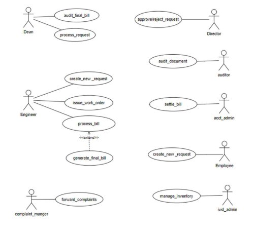

# Software Requirements Specification

# GAD-2 IWD (WEB)

**Team Details**

1. M. Harshitha Reddy (21BCS139) 
1. N.V.V.N. Bruhath (21BCS149) 
1. Srivatsa Potdar (21BCS206) 
1. S.V.R. Puneeth Kumar (21BCS215) 
1. Thota Vamsi Krishna (21BCS222)  

**Student Mentor**  : Kushagra Yadav (21BCS121) 

**Faculty Mentor**  : Dr. Durgesh Singh 

## 1\. Introduction

**1. Introduction about the Fusion** 

Fusion IIIT stands as a testament to the seamless integra  on and automa  on of diverse func  ons within IIIITDM JABALPUR Cra  ed with precision using Python 3.8 and powered by the Django Web framework, this ini  a  ve is a student-driven endeavour designed to elevate the ins  tute's opera  onal landscape. 

Encompassing everything from the client administra  on management to academic prowess and miscellaneous departmental tasks, Fusion IIIT is a holis  c solu  on that harmonizes the intricacies of campus life. 

Imagine it as a digital wizard that takes care of everything, from organizing the administra  ve to making academics smoother. It's not just limited to the usual tasks Fusion IIIT jumps into various departments and sec  ons, making sure every corner of campus life runs smoothly. In the admin side, it handles the complicated paperwork and processes. For academics, it brings a digital touch, making learning and managing courses easier. But it doesn't stop there, Fusion IIIT is like a friendly companion for all the different parts of the campus, making sure everything works well. 

In simpler terms, Fusion IIIT is not just a tool – it's a helpful friend, making life at PDPM IIITDM Jabalpur more organized and enjoyable for everyone. 

**2. Purpose of the module** 

The IWD Module within Fusion is dedicated to overseeing the upkeep of campus property, ensuring that it is efficiently maintained. 

Its primary responsibility is to guarantee the smooth func  oning of all on-site assets, promptly addressing any malfunc  ons that may arise. 

**3. Scope of the module**

The scope of the IWD module extends to comprehensive property management within the campus. This encompasses not only the maintenance of exis  ng assets but also the implementa  on of measures to enhance their efficiency. The module’s preview includes proac  vely addressing any issues related to 

malfunctioning property and implemen  ng solu  on to op  mize the overall 

functionality of campus assets.  

Additionally, it involves strategic planning and coordina  on of resources to ensure a well-equipped and smoothly opera  ng campus environment. 

## 2\.User/Actor Descrip  on(characteris  cs):

**1. Dean :**

Role: Processes the requests from the engineer and passes it on to the director and he is the one who audits the final bill generated. 

Specific Func  onali  es:

1. Efficiently processes the requests from the engineer. 
1. Audits the final bill and keeps a comprehensive record of all the items used. 
**2. Director :**

Role: the director is the one who approves or rejects the requests from the engineer, processed by the dean. 

Specific Func  onali  es:

1\.  The director on his/her will can approve or reject the request a  er thoroughly 

examining the request. 

**3. Auditor :**

Role: The auditor reviews all submi  ed documents comprehensively. 

Specific Func  onali  es:

1. The auditor reviews all the documents. 
1. The auditor verifies the authen  city and accuracy of all the submi  ed documents. 
4. Account Admin :

Role: The account admin se  les the bill generated from the engineer and then sends it to the dean for a final audit. 

Specific Func  onali  es:

1. The account admin se  les the generated bill. 
1. The auditor verifies the authen  city of all the items men  oned in the bill. 
**5. Employee :**

Role: The employee ini  ates a new work request. 

Specific Func  onali  es:

1\.  The employee can raise a new work request if there is a malfunc  on in any 

of the property. 

**6. IWD Admin :**

Role: The IWD Admin oversees the inventory, providing engineers with access to manage and u  lize the available resources. 

Specific Func  onali  es:

1. The IWD Admin manages the inventory. 
1. The IWD Admin provides all the resources available to the engineers. 
**7. Complaint Manager :**

Role: The complaint manager is responsible for forwarding the received complaints to the relevant authori  es. 

Specific Func  onali  es:

1\. The Complaint Manager systema  cally organises and stores all received complaints for w=easy reference. 

**8. Engineer :**

Role: The Engineer ini  ates a new service request, issues the corresponding work work order, facilitates the processing of the associated bill to be submi  ed to higher authori  es. 

Specific Func  onali  es:

1. The Engineer ini  ates a new request and the corresponding work order. 
1. The Engineer process the bill to the higher authori  es. 
1. Func  onal Requirements
1. Use Case Diagram 

### 2. Use case Descrip  on 

This sec  on describes each use case Descrip  on in the use case diagram in all details. 

\1) 

|UC ID||UC#1||
| - | :- | - | :- |
|||||
|||||
|Use Case Name ||create\_new\_request ||
|||The “Create new request” use case is used to create a ||
|Descrip  on||new request to the higher authori  es. ||
|||||
|Actor||Engineer, Employee ||
|Precondi  on ||The engineer or the employee is logged into the  ||
|||portal. ||
|||M1|The employee or the engineer goes to the |
||||“Create new request” tab. |
|||||
|||||
|||M2|They fill all the necessary and |
||||` `relevant Informa  on  |
|Main Flow |||related to their request. |
|||||
|||M3|They click on the submit bu  on. |
|||||
|||M4|The request is now submi  ed to  |
||||The higher authori  es. |
|||||
|||||

|Post Condi  on |The request is now submi  ed to the higher           authority. |||
| - | - | :- | :- |
|Sub Flow|NIL|||
|
`            `Global Alternate 

`                     `Flow
|GA1|If a technical error occurs during the execu  on of  any ac  on (e.g., database failure, server issues), the  system displays an error message and the request  will not be submi  ed. ||

\2)

<table><tr><th colspan="1">UC ID</th><th colspan="2">UC#2</th></tr>
<tr><td colspan="1" valign="top">
mark as read

Use Case Name 
</td><td colspan="2" valign="top">Issue_work_order </td></tr>
<tr><td colspan="1" valign="top">Descrip  on</td><td colspan="2" valign="top">
The “issue_work_order” use case is used to                             Issue work order a  er the engineer’s or 

`                           `The emplyee’s request is approved. 
</td></tr>
<tr><td colspan="1">Actor</td><td colspan="2" valign="top">Engineer </td></tr>
<tr><td colspan="1" valign="top">Precondi  on</td><td colspan="2" valign="top">The engineer should be logged into the portal and the request must be approved by the director. </td></tr>
<tr><td colspan="1" rowspan="2" valign="top">Main Flow </td><td colspan="1" valign="top">1</td><td colspan="1" valign="top">`         `The request is approved by the higher authori  es. </td></tr>
<tr><td colspan="1" valign="top">2</td><td colspan="1" valign="top">Then the engineer issues the corresponding work order for the approved request. </td></tr>
</table>

|Post condi  ons |The work order for the approved request is issued.|
| - | - |
|Sub Flow|NIL|

\3)

<table><tr><th colspan="1">UC ID</th><th colspan="3">UC#3</th></tr>
<tr><td colspan="1" valign="top">Use Case Name </td><td colspan="3" valign="top">process_bill </td></tr>
<tr><td colspan="1" valign="top">Descrip  on</td><td colspan="3" valign="top">
The “process_bill” use case is used  

To list down all the items used and submit it to the higher  Authori  es for verfifica  on. 
</td></tr>
<tr><td colspan="1">Actor</td><td colspan="3" valign="top">Engineer </td></tr>
<tr><td colspan="1" valign="top">Precondi  on</td><td colspan="3" valign="top">`             `The engineer should be logged into the                 Portal and the bill must be generated. </td></tr>
<tr><td colspan="1" rowspan="2" valign="top">Main flow </td><td colspan="1" valign="top">1</td><td colspan="2" valign="top">The engineer should navigate to the “Process Bill”  Sec  on. </td></tr>
<tr><td colspan="1" valign="top">2</td><td colspan="2" valign="top">The engineer should then submit the bill of all the items used. </td></tr>
<tr><td colspan="1"></td><td colspan="1" valign="top">3</td><td colspan="2" valign="top">The engineer should submit the form. </td></tr>
<tr><td colspan="1">Post condi  ons </td><td colspan="3">The bill will be submi  ed to the higher authori  es for a final audit.</td></tr>
<tr><td colspan="1" valign="top">Global Alternate Flow </td><td colspan="1"></td><td colspan="1"></td><td colspan="1">NIL </td></tr>
</table>

|Sub Flow|NIL|
| - | - |

\4)

<table><tr><th colspan="1" valign="top">UC ID</th><th colspan="5" valign="top">UC#4</th></tr>
<tr><td colspan="1" valign="top">Use case Name </td><td colspan="5" valign="top">Audit_final_bill </td></tr>
<tr><td colspan="1" valign="top">Descrip  on</td><td colspan="5" valign="top">The “audit_final_bill” use case is used to audit the bill submi  ed by the engineer. </td></tr>
<tr><td colspan="1">Actor</td><td colspan="5" valign="top">Dean </td></tr>
<tr><td colspan="1" valign="top">Precondi  on</td><td colspan="5" valign="top">The dean should be logged into the portal and the bill should be submi  ed by the engineer. </td></tr>
<tr><td colspan="1" rowspan="2" valign="top">Main Flow</td><td colspan="3" valign="top">1</td><td colspan="2" valign="top">The dean navigates to the “Bills” tab. </td></tr>
<tr><td colspan="3" valign="top">2 </td><td colspan="2" valign="top">The dean then audits the bill. </td></tr>
<tr><td colspan="2" valign="top">Post Condi  on </td><td colspan="4" valign="top">The final bill will be generated. </td></tr>
<tr><td colspan="2" valign="top">Alternate Flow</td><td colspan="1" valign="top">A1</td><td colspan="2" valign="top">1</td><td colspan="1" valign="top">There might be correc  ons needed in the bill, so the bill will be sent back to the engineer and </td></tr>
</table>

||||will be asked to correct it. |
| :- | :- | :- | - |
|Sub Flow|NIL|||
|Global Alternate Flow|NIL|||
\5)

<table><tr><th colspan="1">UC ID</th><th colspan="2">UC#4</th></tr>
<tr><td colspan="1" valign="top">Use case Name </td><td colspan="2" valign="top">Process_request </td></tr>
<tr><td colspan="1" valign="top">Descrip  on</td><td colspan="2" valign="top">
The “process_request” use case is used to process the request created by the engineer and pass it on to the director for approval 

or rejec  on. 
</td></tr>
<tr><td colspan="1" valign="top">Actor</td><td colspan="2" valign="top">Dean </td></tr>
<tr><td colspan="1" valign="top">Precondi  on</td><td colspan="2" valign="top">The dean should be logged into the portal and there should be at least one new request created by the engineer. </td></tr>
<tr><td colspan="1" rowspan="2" valign="top">Main Flow</td><td colspan="1" valign="top">1</td><td colspan="1" valign="top">The dean navigates to the “New Requests” tab. </td></tr>
<tr><td colspan="1" valign="top">2 </td><td colspan="1" valign="top">The dean processes the new request and sends it to  the director. </td></tr>
</table>

|Post Condi  on |The processed request will be submi  ed to the director for approval or rejec  on. |||
| - | :- | :- | :- |
|Alternate Flow|A1|1|The dean might not process the newly created request by the engineer. |
|Sub Flow|NIL|||
|Global Alternate Flow|NIL|||
\6)

|UC ID|UC#4|
| - | - |
|Use case Name |Approve/reject\_request |
|Descrip  on|The “approve/reject\_request” use case is used to approve or reject the request processed by the dean. |
|Actor|Director |
|Precondi  on|The director should be logged into the portal and there should be at least one request processed by the dean. |

<table><tr><th colspan="1" rowspan="2" valign="top">Main Flow</th><th colspan="3" valign="top">1</th><th colspan="1" valign="top">The director navigates to the “Requests” tab. </th></tr>
<tr><td colspan="3" valign="top">2 </td><td colspan="1" valign="top">The director then approves or rejects the request. </td></tr>
<tr><td colspan="2" valign="top">Post Condi  on </td><td colspan="3" valign="top">The request if approved then will be passed on to the engineer to issue work order. </td></tr>
<tr><td colspan="2">Alternate Flow</td><td colspan="1" valign="top">NIL </td><td colspan="2"></td></tr>
<tr><td colspan="2" valign="top">Sub Flow</td><td colspan="3" valign="top">NIL</td></tr>
<tr><td colspan="2" valign="top">Global Alternate Flow</td><td colspan="1" valign="top">NIL</td><td colspan="2"></td></tr>
</table>
\7)

|UC ID|UC#4|
| - | - |
|Use case Name |Audit\_document |
|Descrip  on|The “audit\_document” use case is used to audit all the submi  ed documents for its authen  city. |
|Actor|Auditor |

<table><tr><th colspan="1" valign="top">Precondi  on</th><th colspan="4" valign="top">The auditor should be logged into the portal and there should be documents submi  ed to be verified. </th></tr>
<tr><td colspan="1" rowspan="2" valign="top">Main Flow</td><td colspan="3" valign="top">1</td><td colspan="1" valign="top">The auditor navigates to the “Documents” tab. </td></tr>
<tr><td colspan="3" valign="top">2 </td><td colspan="1" valign="top">The auditor then audits all the submi  ed documents. </td></tr>
<tr><td colspan="2" valign="top">Post Condi  on </td><td colspan="3" valign="top">If the auditor feels the submi  ed documents are valid, he/she may ask the user to submit the documents again. </td></tr>
<tr><td colspan="2">Alternate Flow</td><td colspan="1" valign="top">NIL </td><td colspan="2"></td></tr>
<tr><td colspan="2" valign="top">Sub Flow</td><td colspan="3" valign="top">NIL</td></tr>
<tr><td colspan="2" valign="top">Global Alternate Flow</td><td colspan="1" valign="top">NIL</td><td colspan="2"></td></tr>
</table>
\8)

<table><tr><th colspan="1">UC ID</th><th colspan="4">UC#4</th></tr>
<tr><td colspan="1" valign="top">Use case Name </td><td colspan="4" valign="top">se  le_bill </td></tr>
<tr><td colspan="1" valign="top">Descrip  on</td><td colspan="4" valign="top">The “se  le_bill” use case is used to se  le the bill and send it to the dean for further audits. </td></tr>
<tr><td colspan="1">Actor</td><td colspan="4" valign="top">account Admin </td></tr>
<tr><td colspan="1" valign="top">Precondi  on</td><td colspan="4" valign="top">The account admin should be logged into the portal. </td></tr>
<tr><td colspan="1" rowspan="2" valign="top">Main Flow</td><td colspan="3" valign="top">1</td><td colspan="1" valign="top">The account admin navigates to the “Bills” tab. </td></tr>
<tr><td colspan="3" valign="top">2 </td><td colspan="1" valign="top">The account admin then se  les the final bill and then sends it to the dean for a final audit. </td></tr>
<tr><td colspan="2" valign="top">Post Condi  on </td><td colspan="3" valign="top">The bill will be issued and then sent to the dean. </td></tr>
<tr><td colspan="2">Alternate Flow</td><td colspan="1" valign="top">NIIL </td><td colspan="2"></td></tr>
<tr><td colspan="2">Sub Flow</td><td colspan="3">NIL</td></tr>
<tr><td colspan="2" valign="top">Global Alternate Flow</td><td colspan="1" valign="top">NIL</td><td colspan="2"></td></tr>
</table>
\9)

<table><tr><th colspan="1" valign="top">UC ID</th><th colspan="4" valign="top">UC#4</th></tr>
<tr><td colspan="1" valign="top">Use case Name </td><td colspan="4" valign="top">Manage_inventory </td></tr>
<tr><td colspan="1" valign="top">Descrip  on</td><td colspan="4" valign="top">The “Manage_inventory” use case is used to manage all the available resources by the IWD admin. </td></tr>
<tr><td colspan="1" valign="top">Actor</td><td colspan="4" valign="top">IWD admin </td></tr>
<tr><td colspan="1" valign="top">Precondi  on</td><td colspan="4" valign="top">The IWD admin should be logged into the portal. </td></tr>
<tr><td colspan="1" rowspan="2" valign="top">Main Flow</td><td colspan="3" valign="top">1</td><td colspan="1" valign="top">The IWD admin navigates to the “Inventory” tab. </td></tr>
<tr><td colspan="3" valign="top">2 </td><td colspan="1" valign="top">The IWD admin then ensures all the important resources are available and well managed. </td></tr>
<tr><td colspan="2" valign="top">Post Condi  on </td><td colspan="3" valign="top">The inventory is fully equipped. </td></tr>
<tr><td colspan="2">Alternate Flow</td><td colspan="1" valign="top">NIL </td><td colspan="2"></td></tr>
<tr><td colspan="2" valign="top">Sub Flow</td><td colspan="3" valign="top">NIL</td></tr>
</table>

|Global Alternate Flow|NIL||
| - | - | :- |
\10)

<table><tr><th colspan="1" valign="top">UC ID</th><th colspan="4" valign="top">UC#4</th></tr>
<tr><td colspan="1" valign="top">Use case Name </td><td colspan="4" valign="top">Forward_complaints </td></tr>
<tr><td colspan="1" valign="top">Descrip  on</td><td colspan="4" valign="top">The “Forward_complaints” use case is used to forward any complaint issued which is related to the property inside the campus. </td></tr>
<tr><td colspan="1">Actor</td><td colspan="4" valign="top">Complaint_manager </td></tr>
<tr><td colspan="1" valign="top">Precondi  on</td><td colspan="4" valign="top">The complaint manager should be logged into the portal and there should be complaints issued. </td></tr>
<tr><td colspan="1" rowspan="2" valign="top">Main Flow</td><td colspan="3" valign="top">1</td><td colspan="1" valign="top">The complaint manager navigates to the “Complaints” tab. </td></tr>
<tr><td colspan="3" valign="top">2 </td><td colspan="1" valign="top">The complaint manager then forwards the complaints to the higher authori  es. </td></tr>
<tr><td colspan="2" valign="top">Post Condi  on </td><td colspan="3" valign="top">The issued complaint will be forward to the respected autohority. </td></tr>
<tr><td colspan="2">Alternate Flow</td><td colspan="1" valign="top">NIL </td><td colspan="2"></td></tr>
<tr><td colspan="2" valign="top">Sub Flow</td><td colspan="3" valign="top">NIL</td></tr>
</table>

|Global Alternate Flow|NIL||
| - | - | :- |
## 3\. Other Func  onal Requirements  

1) All the modules will make use of the IWD module for issuing work order or if they want to report a problem related to the ins  tute’s property. 
1) The Super admin of Fusion should be able to assign roles for IWD-Admin and all the other actors of the IWD module. 
1) The system should be running all the   me for the quick registra  on of requests to efficiently manage the ins  tute’s property. 
### 4. Other constraints 
**1. User Interfaces** 

The user interface should comply with the colour scheming and dashboard design of the FUSION IIIT. Users should be able to navigate from one func  onality to other. Inter module naviga  on should be smooth. All the func  onali  es should be easy to use and no specific training should be required for the usage of the module. 

**2. Tech Stack Used**
1) Backend: Django(Python Based Web-Framework). 
1) Frontend:( HTML ,CSS , JavaScript ). 

   **3. Business rules (if any)** NIL 

     ## 4. Non- Func  onal Requirements
**1. Performance:**

The system should respond to user interac  ons quickly. Response   me for crea  ng new requests, genera  on of bills etc. should be less. 

**2. Scalability:**

The system should handle a mass of concurrent users. System performance should be evaluated under increasing load condi  ons. 

**3. Availability:**

The system should be available 99.9% of the   me.

**4. Security:**

Ensure data confiden  ality and integrity. Role-based authoriza  on ensures that users can only perform ac  ons relevant to their designated roles. 

## 5. Module dependencies with other fusion modules
**1. UI Level**

Integra  on in Fusion :-      

At UI level, IWD Module will seamlessly integrates with other Modules, As It followed exact theme followed by other modules.  

**2. DB Level Dependencies:**

1\.  This databases used in the IWD module are not dependent on the database of 

the other modules. 

**3. Module Level Dependencies:**

The IWD module will be interac  ng with the “Purchase and Store” module for efficient management of resources and with the “Complaint Management System” module for forwarding the registered complaints to the higher authori  es.  
