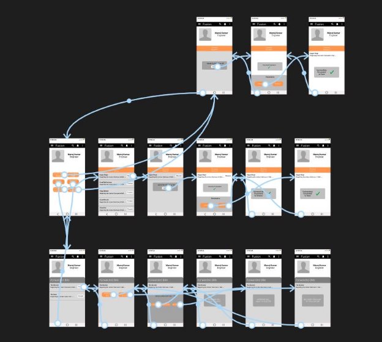
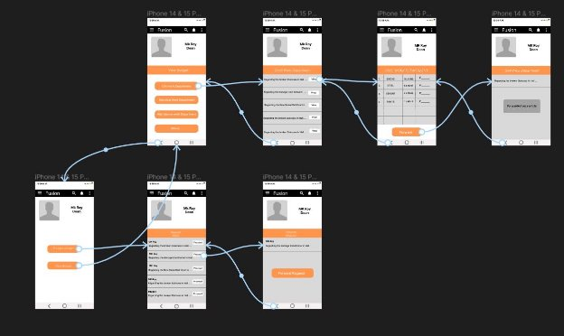
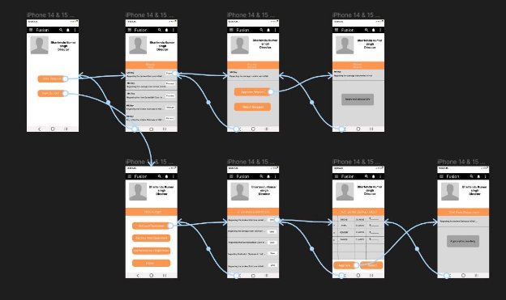
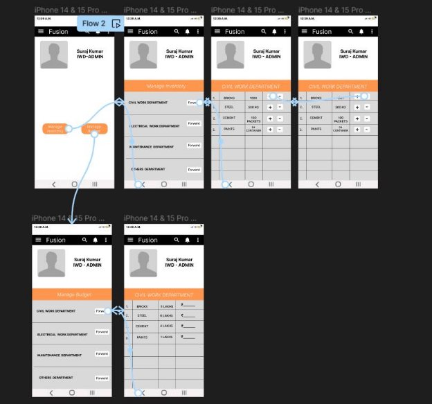
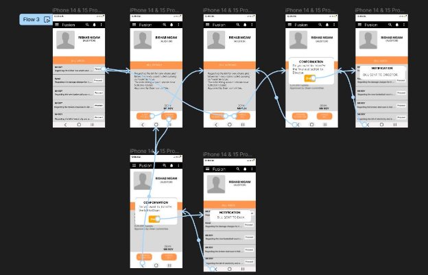
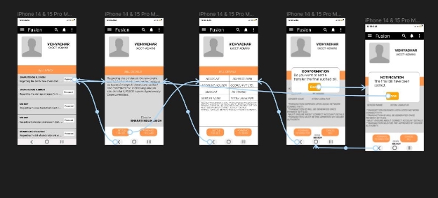

# **Institute Work Department (IWD GAD-2)**

**Faculty Mentor:** Dr. Durgesh Singh  
**Student Mentor:** Gagan Singh (21BCS084)

### **Prepared by:**
- Kunal Raj (21BCS118)
- Vidyadhar Rishabh Nigam (21BCS239)
- Kunal Marmat (21BCS173)
- Vijay Kumar Saharan (21BSM030)
- (21BCS240)

---

## **Figma Profiles for IWD (GAD-2)**

### **1. Module Description:**

The Institute Work Department module serves as the nerve center of our esteemed institute's operational excellence, where precision and collaboration intersect to uphold standards of efficiency and resource utilization. Within this pivotal framework, stakeholders including the dean, director, employees, and administrative personnel converge to orchestrate seamless processes and ensure optimal allocation of resources.

At the helm, the dean and director wield decision-making authority, guiding the approval or rejection of requests vital to our institute's functioning. Meanwhile, employees serve as catalysts for innovation, initiating requests that reflect frontline perspectives. Administrative personnel, adept at financial stewardship and inventory management, ensure fiscal integrity through diligent budget oversight, audit compliance, and meticulous inventory supervision.

United in our commitment to excellence, we strive to propel the institute towards new horizons of achievement. With strategic oversight and collaborative engagement, the Institute Work Department module stands as a testament to our collective determination to thrive in an ever-evolving landscape.

---

### **2. Actors**

#### 1. **ENGINEER :-**

#### 2. **DEAN :-**

#### 3. **DIRECTOR :-**

#### 4. **IWD ADMIN :-**

#### 5. **AUDITOR :-**

#### 6. **ACCOUNT ADMIN :-**

---

## **Figma Profile Design Guidelines and Additional Considerations**

1. **Cross-Platform Compatibility:**
   - Verify that Figma designs and features are compatible across app version only.

2. **Dimension Standardization:**
   - All Figma designs have the same dimensions around 360px width for mobile.

3. **Actor-Oriented Use Case-Based Design:**
   - All Figma designs are strictly based on use cases of actors and have a maintained consistency with previous and newly added designs.
   - Each actor has a different page in Figma profiles.

---

**Figma Link:**  
[PR IWD Figma](https://www.figma.com/file/BtzObStu5I2G9ymx2FBGpD/PR-IWD?type=design&node-id=0-1&mode=design&t=duiCPiqFDn6q15Pe-0)
