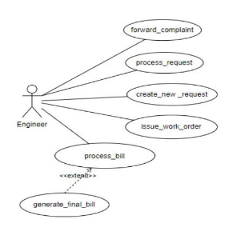
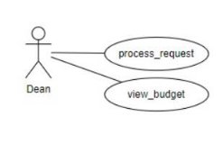
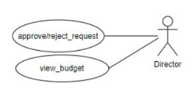
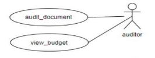
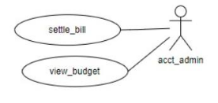
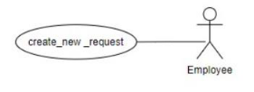
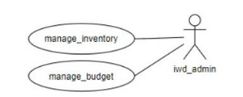

**Figma Profiles for GAD-2 IWD (Web)** 

1. **Module Description:**  

The IWD Module within Fusion plays a crucial role in overseeing the upkeep of campus property and ensuring its efficient maintenance. Its primary responsibility is to guarantee the smooth functioning of all on-site assets, promptly addressing any malfunctions that may arise.  

Additionally, the IWD Module actively oversees and manages the construction of new properties, demonstrating a comprehensive approach to both maintaining existing assets and facilitating the development of new ones on the campus. 

This dual focus reinforces its commitment to the overall well-being and advancement of the campus infrastructure.

[GAD-2 IWD Use Case Specifications ](https://docs.google.com/document/d/1RkqFgSMCQy3FLpzJ5aYf903HNKyPsBHDczrxVLfBsiY/edit?usp=sharing)[GAD-2 IWD Figma ](https://www.figma.com/file/TxWEHzOMPx6PfSYEYYTjf4/GAD-2-IWD?type=design&node-id=0%3A1&mode=design&t=lcPPPmDURlZnBGNI-1)

2. **Actors** 
1. **Engineer** 

The Engineer initiates a new service request, issues the corresponding work order, facilitates the processing of the associated bill to be submitted to higher authorities.

2. **Dean:** 

Processes the requests from the engineer and passes it on to the director and the dean can even view the budget.

3. **Director:** 

The director is the one who approves or rejects the requests from the engineer, processed by the dean. 

4. **Auditor:** 

The auditor reviews all submitted documents comprehensively.  

5. **Account Admin:** 

The account admin settles the bill generated from the engineer. 

6. **Employee:** 

The employee initiates a new work request.  

7. **IWD Admin:** 

The IWD Admin manages the budget and oversees the inventory, providing engineers with access to manage and utilize the available resources.  

[GAD-2 IWD Figma ](https://www.figma.com/file/TxWEHzOMPx6PfSYEYYTjf4/GAD-2-IWD?type=design&node-id=0%3A1&mode=design&t=lcPPPmDURlZnBGNI-1)
