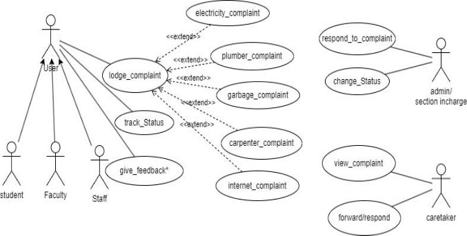

**FUSION ERP** 

**Software Requirements Specification** 

**for** 

**GAD-3-COMPLAINT MANAGEMENT(APP)** 

**Prepared by: Ananya Sharma(21BCS020) Armin Patel(21BCS031) Chahit Kolte(21BCS062) Harsh Chauhan(21BCS094) Harshith Sudar(21BCS097)** 

**Student Mentor: Hardik Pratap Singh(21BCS090) Faculty Mentor: Dr. Avinash Chandra Pandey** 

**Table of Contents**

**1.   Introduction** 

1. Introduction about the Fusion – A brief Description 
1. Purpose of module 
1. Scope of module 

**2.User/Actor Characteristics** 

3. **System Features (Functional Requirements)** 
1. Use Case Diagram 
1. UC 1 
1. UC 2 
1. UC 3 
1. UC 4 
1. UC 5 
1. UC 6 
1. UC 7** 
4. **Non-Functional Requirements** 
   1. Performance 
   1. Scalability 
   1. Availability 
   1. Security 
5. **Dependencies** 
1. **Introduction** 
1. **Introduction about the Fusion – A brief Description:** 

FusionIIIT  at  PDPM  Indian  Institute  of  Information  Technology,  Design,  and Manufacturing, Jabalpur, exemplifies the seamless integration and automation of diverse functions. Developed by students using Python 3.8 and powered by the Django Web framework, this initiative is a testament to the institute's commitment to improving operational efficiency and enriching campus life. In the administrative domain,  FusionIIIT  manages  intricate  paperwork  and  processes,  simplifying administrative tasks for a more streamlined approach. On the academic side. 

It introduces a digital facet to learning and course management, enhancing the educational experience. However, its impact extends beyond the conventional, reaching various departments and sections to ensure the smooth operation of every aspect of campus life.  

Visualize FusionIIIT as a digital wizard that not only organizes administrative processes  and  elevates  academic  experiences  but  also  lends  support  to miscellaneous departmental tasks. It acts as a supportive companion, overseeing the seamless functioning of every facet of campus life.  

Beyond being a mere tool, FusionIIIT emerges as a reliable friend dedicated to enhancing organization and enjoyment in the lives of everyone at PDPM IIITDM Jabalpur. 

2. **Purpose of the module:** 

The central complaint system is designed to efficiently manage and resolve issues pertaining to electricity, hostels, and cleanliness in each campus building. The primary goal of this software is to provide a swift and effective mechanism for addressing concerns raised by individuals within the campus community, ensuring a  seamless  resolution  process.  Additionally,  it  serves  as  a  communication platform,  facilitating  a  direct  connection  between  users  and  the  relevant Caretaker/Supervisor for each department.

3. **Scope of the module :** 

The complaint management system by offering a comprehensive and  

efficient  platform  for  students  to  register  their  concerns.  Beyond  simple registration, the system facilitates real-time tracking and visibility of complaints for respective authorities. 

2. **User/Actor Characteristics** 
1. **Student / Faculty / Staff** 

Individuals who would lodge the complaints. **Role:** Creation of complaint 

**Specific Functionalities:**  

- Lodge complaint through the Fusion portal 
- Specify details of the complaint 
- Choose the complaint category 
- Track Complaint status 
- Provide Feedback 
2. **Admin / Section In-Charge** 

Admin or Section In-Charge of the service. 

**Role:** Oversee the complaints, able to respond and change the status of complaints 

**Specific Functionalities:** 

- View Complaints 
- Respond to complaints 
- Change the status of complaints 
- Manage worker/caretaker 
3. **Caretaker** 

Caretaker of the particular service like internet, electricity. **Role:** View and resolve complaints, manage worker **Specific Functionalities:** 

- View Complaints 
- Respond to complaints 
- Assign worker 
3. **Functional Requirements** 
1. **Use Case Diagram **

2. **Use Case Description** 

**Use Case #1** 

<table><tr><th colspan="1">UC ID </th><th colspan="1">UC #1 </th></tr>
<tr><td colspan="1">Use Case Name </td><td colspan="1">lodge_complaint </td></tr>
<tr><td colspan="1" valign="top">Description </td><td colspan="1">Report issues to the concerning administration </td></tr>
<tr><td colspan="1">Actor(s) </td><td colspan="1">Staff, Student, Faculty </td></tr>
<tr><td colspan="1">Pre-Condition </td><td colspan="1">User must be logged in </td></tr>
<tr><td colspan="1" rowspan="2" valign="top">Main Flow </td><td colspan="1"><b>1)</b> The user fills all the necessary columns and clicks on the submit button. </td></tr>
<tr><td colspan="1"><b>2)</b> System Displays the message of the complaint being successfully received. </td></tr>
<tr><td colspan="1" valign="top">Post-Condition</b> </td><td colspan="1">The complaint is successfully received by the system and stored in the database.</b> </td></tr>
<tr><td colspan="1" valign="top">Alternate Flow </td><td colspan="1">If the User is not logged in, the system prompts them to log in </td></tr>
<tr><td colspan="1">Sub Flow </td><td colspan="1">none </td></tr>
<tr><td colspan="1">Global Alternate Flow </td><td colspan="1">none </td></tr>
</table>

**Use Case #7** 

<table><tr><th colspan="1">UC ID </th><th colspan="1">UC #2 </th></tr>
<tr><td colspan="1">Use Case Name </td><td colspan="1">track_status </td></tr>
<tr><td colspan="1">Description </td><td colspan="1">Check the status of the complaint </td></tr>
<tr><td colspan="1">Actor(s) </td><td colspan="1">Staff, Student, Faculty </td></tr>
<tr><td colspan="1" valign="top">Pre-Condition </td><td colspan="1">The  user  must  have  a  complaint registered. </td></tr>
<tr><td colspan="1" rowspan="2" valign="top">Main Flow </td><td colspan="1"><b>1)</b> User checks the complaint history for the status. </td></tr>
<tr><td colspan="1"><b>2)</b> User checks his complaint whether it has  been  overlooked/resolved  by  the caretaker within a given timestamp or not. </td></tr>
<tr><td colspan="1">Post-Condition</b> </td><td colspan="1">none </td></tr>
<tr><td colspan="1">Alternate Flow </td><td colspan="1">none </td></tr>
<tr><td colspan="1">Sub Flow </td><td colspan="1">none </td></tr>
<tr><td colspan="1">Global Alternate Flow </td><td colspan="1">none </td></tr>
</table>

<table><tr><th colspan="1">UC ID </th><th colspan="1">UC #3 </th></tr>
<tr><td colspan="1">Use Case Name </td><td colspan="1">give_feedback </td></tr>
<tr><td colspan="1">Description </td><td colspan="1">Rate resolution of the complaint </td></tr>
<tr><td colspan="1">Actor(s) </td><td colspan="1">Staff, Student, Faculty </td></tr>
<tr><td colspan="1">Pre-Condition </td><td colspan="1">User must have a complaint lodged  </td></tr>
<tr><td colspan="1" rowspan="3" valign="top">Main Flow </td><td colspan="1"><b>1)</b> The user selects the complaint they want to provide feedback on. </td></tr>
<tr><td colspan="1" valign="top"><b>2)</b> The user enters their feedback. </td></tr>
<tr><td colspan="1" valign="top"><b>3)</b> The system stores the feedback. </td></tr>
<tr><td colspan="1">Post-Condition</b> </td><td colspan="1">none </td></tr>
<tr><td colspan="1">Alternate Flow </td><td colspan="1">none </td></tr>
<tr><td colspan="1">Sub Flow </td><td colspan="1">none </td></tr>
<tr><td colspan="1">Global Alternate Flow </td><td colspan="1">none </td></tr>
</table>

<table><tr><th colspan="1">UC ID </th><th colspan="1">UC #4 </th></tr>
<tr><td colspan="1">Use Case Name </td><td colspan="1">view_complaint </td></tr>
<tr><td colspan="1">Description </td><td colspan="1">View complaint details </td></tr>
<tr><td colspan="1">Actor(s) </td><td colspan="1">Caretaker </td></tr>
<tr><td colspan="1">Pre-Condition </td><td colspan="1">Caretaker must be logged in. </td></tr>
<tr><td colspan="1" rowspan="2" valign="top">Main Flow </td><td colspan="1" valign="top"><b>1)</b> Caretaker clicks on view complaints. </td></tr>
<tr><td colspan="1"><b>2)</b> New page with all complaints and their complainter appears. </td></tr>
<tr><td colspan="1" valign="top">Post-Condition</b> </td><td colspan="1">Caretaker chooses a complaint to assign worker to it. </td></tr>
<tr><td colspan="1">Alternate Flow </td><td colspan="1">none</b> </td></tr>
<tr><td colspan="1">Sub Flow </td><td colspan="1">none</b> </td></tr>
<tr><td colspan="1">Global Alternate Flow </td><td colspan="1">none</b> </td></tr>
</table>

|UC ID |UC #5 |
| - | - |
|Use Case Name |forward/respond |
|Description |Forward the complaint to admin/section in charge. |
|Actor(s) |caretaker |
|Pre-Condition |Caretaker  cannot  handle  problem  by himself. |
|Main Flow |**1)** Caretaker forwards the complaint |
|Post-Condition** |Problem is to be manage by admin/section in charge |
|Alternate Flow |none |
|Sub Flow |none |
|Global Alternate Flow |none |

<table><tr><th colspan="1">UC ID </th><th colspan="1">UC #6 </th></tr>
<tr><td colspan="1">Use Case Name </td><td colspan="1">respond_to_complaint </td></tr>
<tr><td colspan="1" valign="top">Description </td><td colspan="1">Respond / comment on the complaint by the administration </td></tr>
<tr><td colspan="1">Actor(s) </td><td colspan="1">Caretaker, admin </td></tr>
<tr><td colspan="1">Pre-Condition </td><td colspan="1">User is authorized to view the complaint </td></tr>
<tr><td colspan="1" rowspan="2" valign="top">Main Flow </td><td colspan="1" valign="top"><b>1)</b>     Caretaker views the complaint </td></tr>
<tr><td colspan="1"><b>2)</b>  Caretaker  takes  necessary  action  to resolve  the  complaint  and  responds accordingly </td></tr>
<tr><td colspan="1">Post-Condition</b> </td><td colspan="1">none </td></tr>
<tr><td colspan="1">Alternate Flow </td><td colspan="1">none </td></tr>
<tr><td colspan="1">Sub Flow </td><td colspan="1">none </td></tr>
<tr><td colspan="1">Global Alternate Flow </td><td colspan="1">none </td></tr>
</table>

<table><tr><th colspan="1">UC ID </th><th colspan="1">UC #7 </th></tr>
<tr><td colspan="1">Use Case Name </td><td colspan="1">change_status </td></tr>
<tr><td colspan="1">Description </td><td colspan="1">Update complaint status as needed </td></tr>
<tr><td colspan="1">Actor(s) </td><td colspan="1">Admin, caretaker </td></tr>
<tr><td colspan="1" valign="top">Pre-Condition </td><td colspan="1">User is logged in with role of admin or caretaker </td></tr>
<tr><td colspan="1" rowspan="2" valign="top">Main Flow </td><td colspan="1" valign="top">1) Selects a complaint </td></tr>
<tr><td colspan="1" valign="top">2) Selects a new status for the complaint </td></tr>
<tr><td colspan="1">Post-Condition</b> </td><td colspan="1">System updates the complaint status </td></tr>
<tr><td colspan="1">Alternate Flow </td><td colspan="1">none </td></tr>
<tr><td colspan="1">Sub Flow </td><td colspan="1">none </td></tr>
<tr><td colspan="1">Global Alternate Flow </td><td colspan="1">none </td></tr>
</table>

**4 NON-FUNCTIONAL REQUIREMENTS** 

1. **Performance:** 

The system should respond to user interactions quickly. Response time for booking actions, inventory updates, and notifications should be less. 

2. **Scalability:** 

The system should handle a mass of concurrent users. System performance should be evaluated under increasing load conditions. 

3. **Availability:** 

The system should be available 99.9% of the time. 

4. **Security:** 

Ensure data confidentiality and integrity. Role-based authorization ensures users can only perform actions relevant to their designated roles. 

**Module dependencies with other fusion modules**

- **Integration at the UI Level:****  

  Users log into the Fusion application and land on the main dashboard. The user (student, staff, faculty, and other community members of IIITDMJ ) can add a complaint by filling in the required input fields. Lodgers can also see the complaint status and history. 

  Navigation should include direct links or buttons in Fusion's menu, ensuring a clear path for each actor (Student, Staff, Section Incharge) to access their specific functionalities within the Complaint Module.   

- **Database Level:** 

  Data dependencies of the Complaint registration module:  

|S.no |Table Name |Foreign Key |Referenced Table |
| - | - | - | - |
|1 |complaint\_system\_caretaker |staff\_Id\_Id |globals\_extrainfo |
|2 |complaint\_system\_hall |staff\_id\_id |globals\_extrainfo |
|3 |complaint\_system\_studentcompl aint |complainer\_id |globals\_extrainfo |
|4 |complaint\_system\_supervisior |sup\_id\_id |globals\_extrainfo |
|5 |complaint\_system\_workers |caretaker\_id\_id |complain\_system\_c aretaker |

- **Module Level:** 

  Complaint registration Module interacts with Notification, Dashboard, and file transferring system.
