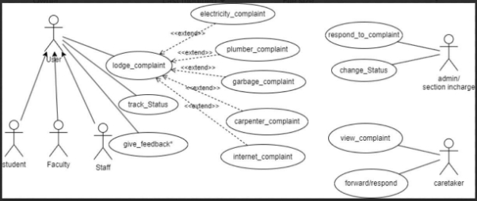

# Fusion ERP Software Requirements Specification for GAD 3 – Complaint Management System 

**Faculty Mentor:** Dr. Avinash Chandra Pandey 

**Prepared by:** 
Ayushi Mourya (21BCS050)  
Bachuwar Esha (21BCS052)  
Kirankumar G (21BCS116)  
Nidhi Barapatre (21BCS146)  
Sadanand Jaiswal (21BCS180) 

**Mentor:** Pratik Kumar (21BCS164) 

## 1. Introduction 

### 1.1 Introduction about the Fusion – A brief Description 

FusionIIIT stands as a testament to the seamless integration and automation of diverse functions within PDPM Indian Institute of Information Technology, Design and Manufacturing, Jabalpur. Crafted with precision using Python 3.8 and powered by the Django Web framework, this initiative is a student-driven endeavor designed to elevate the institute's operational landscape. Encompassing everything from efficient administration management to academic prowess and miscellaneous departmental tasks, FusionIIIT is a holistic solution that harmonizes the intricacies of campus life. 

Imagine it as a digital wizard that takes care of everything, from organizing the administrative stuff to making academics smoother. It's not just limited to the usual tasks; FusionIIIT jumps into various departments and sections, making sure every corner of campus life runs smoothly. 

In the admin side, it handles the complicated paperwork and processes. For academics, it brings a digital touch, making learning and managing courses easier. But it doesn't stop there; FusionIIIT is like a friendly companion for all the different parts of the campus, making sure everything works well. 

In simpler terms, FusionIIIT is not just a tool – it's a helpful friend, making life at PDPM IIITDM Jabalpur more organized and enjoyable for everyone. 

### 1.2 Purpose of the module 

The Centralized complaint system combines the issues related to Computer Center, Hostels, and Cleanliness under one roof. This software aims at solving problems of students as well as staff as soon as possible by providing a platform to connect them directly to the Warden/Caretaker/Supervisor of the respective departments. It will allow immediate addressal of complaints.

### 1.3 Scope of the module 

This module aims to provide a comprehensive solution for efficiently managing and documenting user complaints within our institute. This system is designed to replace traditional paper-based complaint tracking methods, ensuring a centralized and organized approach to handling user complaints and their feedback. 

## 2. User / Actor Characteristics 

### 2.1 User (Student, Faculty, Staff) 

Represents individuals who intend to lodge a complaint regarding various issues of hostels. 

**Specific Functionalities:**  

- Users can lodge complaints. 
- Users can track the status of their complaints. 
- Users can give feedback. 

### 2.2 Admin / Section Incharge 

Represents individuals who intend to respond to complaints registered by the Users only when the complaint has been forwarded by the caretaker or has not been handled by the caretaker within a specified time period. 

**Specific Functionalities:** 

- Admin/ Section Incharge can respond to the complaints. 
- Admin/ Section Incharge can change the status of complaints. 

### 2.3 Caretaker 

Represents individuals who will be receiving all the complaints and taking actions accordingly. If the complaint remains unresolved or cannot be handled at this level, it will be forwarded to the higher concerned authorities (Admin/ Section Incharge). 

**Specific Functionalities:** 

- Caretaker can view the complaints registered by the users. 
- Caretaker can respond to the complaints. 
- Caretaker can forward the complaints to the respective higher authorities. 

## 3. Functional Requirements 

### 3.1 Use Case Diagram 

The figure represents the use case diagram for the module features.  

### 3.2 Use Case Description 

#### 3.2.1 Use Case #1 

| UC ID | UC#1 |
|-------|------|
| **Use Case Name** | lodge_complaint | 
| **Actor** | Student, Staff, Faculty |
| **Pre-Condition** | The user must fill all the necessary fields in the complaint page. |
| **Main Flow** | 1. User fills all the necessary columns and clicks on the submit button.   2. System displays a message that the complaint has been successfully received. |
| **Post-Condition** | The complaint is successfully received by the system and stored in the database. |

#### 3.2.2 Use Case #2 

| UC ID | UC#2 |
|-------|------|
| **Use Case Name** | track_Status | 
| **Description** | After logging into the system, the user can see the complaint history and the status of the respective complaints. |
| **Actor** | Student, Staff, Faculty |
| **Pre-Condition** | User must be logged-in. |
| **Main Flow** | 1. User chooses the Complaint History to check the status of the complaints.   2. System displays the page showing the status of all the complaints, i.e., whether the complaint has been addressed by the caretaker or not, with the time and date when the user registered the complaint.   3. User can see which of their complaints are resolved, kept on hold, and complaints that are declined. |
| **Alternate Flow** | NIL |

#### 3.2.3 Use Case #3 

| UC ID | UC#3 |
|-------|------|
| **Use Case Name** | give_feedback | 
| **Description** | User has the option to give feedback on the service after their complaint has been resolved. |
| **Actors** | Student, Staff, Faculty |
| **Pre-Condition** | User must be logged-in. |
| **Main Flow** | 1. User chooses the feedback option given on the first page.   2. System shows the next page.   3. User chooses the type of feedback, i.e., whether the feedback is about CC (Library+CC), hostel, residential, or garbage.   4. User gives the feedback.   5. User submits the feedback.   6. System displays the initial page. |
| **Post-Condition** | Feedback is successfully received by the system and stored in the database. |
| **Alternate Flow** | NIL |

#### 3.2.4 Use Case #4 

| UC ID | UC#4 |
|-------|------|
| **Use Case Name** | change_status | 
| **Description** | Admin/Section Incharge can change the status of the complaint. |
| **Actor** | Admin/Section Incharge |
| **Pre-Condition** | The user must be logged-in. Then they must click on the unresolved complaints, thereafter on Hold Complaints. |
| **Main Flow** | 1. System displays the page of on-hold complaints.   2. User clicks on the change status button at the corner.   3. User changes the state of work from unresolved to resolved. |
| **Post-Condition** | Student/Staff gets notified with the changed status of the complaint. |
| **Alternate Flow** | NIL |

#### 3.2.5 Use Case #5 

| UC ID | UC#5 |
|-------|------|
| **Use Case Name** | respond_to_complaint | 
| **Description** | Enables Admin/Section Incharge to efficiently respond to a complaint forwarded by the caretaker. |
| **Actor** | Admin/Section Incharge |
| **Pre-Condition** | The user must be logged-in. There should be an existing unresolved complaint. |
| **Main Flow** | 1. User navigates to the “View Complaint” section.   2. Chooses a complaint.   3. Drafts and submits a response to the complaint. |
| **Post-Condition** | Successfully respond to the complaint. |
| **Alternate Flow** | If no complaints are available, the system notifies the admin/section in charge that there are no complaints to view. |

#### 3.2.6 Use Case #6 

| UC ID | UC#6 |
|-------|------|
| **Use Case Name** | view_complaint | 
| **Description** | Caretaker can view the complaint details. |
| **Actor** | Caretaker |
| **Pre-Condition** | The Caretaker must be logged-in. There should be an existing complaint submitted by the User. |
| **Main Flow** | 1. Caretaker logs into the Complaint Management System.   2. Navigates to the “View Complaint” section.   3. Selects a complaint from the list. |
| **Post-Condition** | NIL |
| **Alternate Flow** | If no complaints are available, the system notifies the caretaker that there are no complaints to view. |

#### 3.2.7 Use Case #7 

| UC ID | UC#7 |
|-------|------|
| **Use Case Name** | forward_respond | 
| **Description** | Caretaker can forward the complaint to concerned higher authorities or respond to the complaint if it has been resolved or will be resolved without the interference of higher authorities. |
| **Actor** | Caretaker |
| **Pre-Condition** | The Caretaker must be logged-in. There should be an existing complaint submitted by the User. |
| **Main Flow** | 1. Caretaker logs into the Complaint Management System.   2. Navigates to the “View Complaint” section.   3. Selects a complaint from the list.   4. Chooses to forward the complaint or to respond directly.   5. If forwarding, selects the appropriate authority to forward to.   6. If responding, drafts and submits a response. |
| **Post-Condition** | Complaint is either forwarded or a response is provided to the User. |
| **Alternate Flow** | If no complaints are available, the system notifies the caretaker that there are no complaints to view. |

## 4. Non-functional Requirements 

### 4.1 Usability 

- The system must have a user-friendly interface that facilitates easy navigation and complaint submission. 

### 4.2 Performance 

- The system should be able to handle up to 1000 simultaneous users without significant performance degradation. 

### 4.3 Reliability 

- The system should be available 99.9% of the time and must provide a means of data recovery in case of failures. 

### 4.4 Security 

- The system should ensure that all user data is encrypted and secured against unauthorized access. 

### 4.5 Maintainability 

- The system should be designed in a way that allows for easy updates and maintenance without significant downtime. 

### 4.6 Scalability 

- The system should be able to scale up to accommodate future growth in user base and additional features. 

### 4.7 Compatibility 

- The system must be compatible with various web browsers, including Chrome, Firefox, and Safari. 

### 4.8 Regulatory Compliance 

- The system must comply with relevant data protection regulations, including GDPR.

## 5. Assumptions and Dependencies 

- It is assumed that all users will have basic knowledge of how to use web applications. 
- The system will depend on an underlying database to store complaint records and user information.

## 6. Glossary 

- **User:** An individual who submits a complaint. 
- **Caretaker:** An individual responsible for addressing complaints. 
- **Admin/Section Incharge:** An authority that oversees the complaint management process. 
- **Complaint:** A formal expression of dissatisfaction raised by a user regarding services.

## 7. References 

- [Fusion ERP Documentation](https://github.com/KNsreeja07/Fusion)
