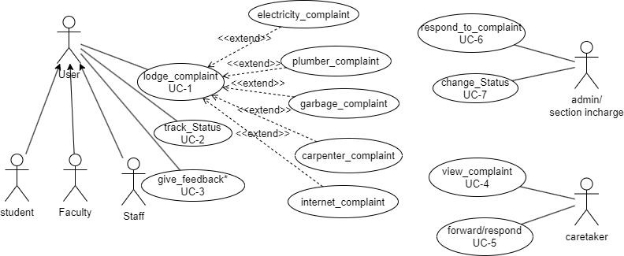

**Figma Profiles for Complaint Management System (GAD-3)**

**(Mobile)**

1. **Complaint Management System:**

The complaint management system by offering a comprehensive and efficient platform for students ,faculty and staff to register their concerns. Beyond simple registration, the system facilitates real-time tracking and visibility of complaints for respective authorities. The central complaint system is designed to efficiently manage and resolve issues pertaining to electricity, hostels, and cleanliness in each campus building. The primary goal of this software is to provide a swift and effective mechanism for addressing concerns raised by individuals within the campus community, ensuring a seamless resolution process. Additionally, it serves as a communication platform, facilitating a direct connection between users and the relevant Caretaker/Supervisor for each department.

[https://docs.google.com/document/d/1dJHY26FsPyBjdr-SN4Ajc971ur-s9l WsFapipFiXNKk/edit](https://docs.google.com/document/d/1dJHY26FsPyBjdr-SN4Ajc971ur-s9lWsFapipFiXNKk/edit)

FigmaLink:[https://www.figma.com/file/6BO0R8Aw4w1K4YDv66fehx/app_student-(Co py)?type=design&node-id=0%3A1&mode=design&t=tPq1CZUvVmxrsO8a-1](https://www.figma.com/file/6BO0R8Aw4w1K4YDv66fehx/app_student-\(Copy\)?type=design&node-id=0%3A1&mode=design&t=tPq1CZUvVmxrsO8a-1)

2. **Actors**

1. **Complainer(Student ,Faculty ,Staff)**

   User (who must be logged in to complain)Each actor has a specific role or action within the scenario.Staff, Students, and Faculty: They are users who can lodge complaints.User: This refers to any user who is logged in and wishes to complain. Overall, the actors involved in this scenario are the individuals who can lodge complaints (Staff, Student, Faculty) and the users who must be logged in to complain.

[https://www.figma.com/proto/hf18Oo2Jp4OBNcNm488eMr/app_student?type=design&node-i d=101-2&t=1gvRBCWZgufpWqnM-1&scaling=scale-down&page-id=0%3A1&starting-point-n ode-id=101%3A2&mode=design](https://www.figma.com/proto/hf18Oo2Jp4OBNcNm488eMr/app_student?type=design&node-id=101-2&t=1gvRBCWZgufpWqnM-1&scaling=scale-down&page-id=0%3A1&starting-point-node-id=101%3A2&mode=design)

2. **Admin / Section In-Charge**

The Admin or Section In-Charge aims to utilize the system to efficiently oversee and manage complaints within their designated area, such as hostels. They seek to view, respond to, and update the status of complaints and manage workers or caretakers assigned to address these issues effectively.

[https://www.figma.com/proto/mqrcZncc2cJ1YD0t1ip9U8/app_supervisor?type=design&node-i d=1-50&t=DgaNWXU3Y9WQ6IDw-1&scaling=min-zoom&page-id=0%3A1&starting-point-nod e-id=1%3A50&mode=design](https://www.figma.com/proto/mqrcZncc2cJ1YD0t1ip9U8/app_supervisor?type=design&node-id=1-50&t=DgaNWXU3Y9WQ6IDw-1&scaling=min-zoom&page-id=0%3A1&starting-point-node-id=1%3A50&mode=design)

3. **Caretaker**

The Caretaker is the individual who is responsible for viewing complaint details within the system. The Caretaker is a user with specific privileges related to managing complaints.The Caretaker must be logged into the system to view complaints.Once logged in, the Caretaker clicks on the option to view complaints.A new page is generated, displaying all the complaints along with details such as the complainant's information.The Caretaker can then choose a specific complaint from

the list and proceed to assign a worker to address it.

[https://www.figma.com/proto/zNkKIdmdRvKSrvrPTQiLWk/app_caretaker?type=design&node-id =3-68&t=ICBY9xeIIrw6EaHQ-1&scaling=min-zoom&page-id=0%3A1&starting-point-node-id=3% 3A68&mode=design](https://www.figma.com/proto/zNkKIdmdRvKSrvrPTQiLWk/app_caretaker?type=design&node-id=3-68&t=ICBY9xeIIrw6EaHQ-1&scaling=min-zoom&page-id=0%3A1&starting-point-node-id=3%3A68&mode=design)

**Figma Profile Design Guidelines and Additional Considerations**

1. **Cross-Platform Compatibility:**
- Verify that Figma designs and features are compatible across web and app versions.
2. **Dimension Standardization:**
- Ensure all Figma designs have the same dimensions: 1920 x 1080 for web and around 360px width for mobile.

  **3.3Actor-oriented Use Case-Based Design:**

- Strictly base all Figma designs on the use cases of actors and maintain consistency with previous and newly added designs.

  -- Each actor should have a different page in Figma

- If the Figma profiles already exist make sure all the actors have their own Figma profiles and also wireframe those across all use cases for that actor
- Figma link (only) for reference (Figma Layout):

[https://www.figma.com/file/pzhw34xBvEK0hm5Yx4bh0P/Fusion-APP?type=design&nod e-id=0%3A1&mode=design&t=J0f6T5YoUiKbp17u-1](https://www.figma.com/file/pzhw34xBvEK0hm5Yx4bh0P/Fusion-APP?type=design&node-id=0%3A1&mode=design&t=J0f6T5YoUiKbp17u-1)
