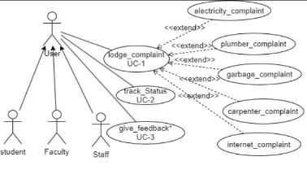
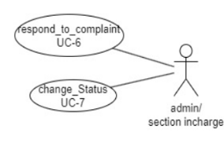
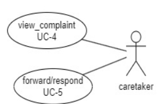

# **Complaint Management System**

## **Mentor Name:** Pratik kumar(21bcs164)
## **Faculty Mentor:** Dr. Avinash Chandra Panday

**Team Members:** Ayushi Mourya(21bcs050) Bachuwar Esha(21bcs052) Kirankumar G(21bcs116) Nidhi Barapatre(21bcs146) Sadanand Jaiswal(21bcs180)

# **Figma Profiles for Complaint management system**

## 1. **Module Description:**

The Centralized complaint system combines the issues related to Computer Center, Hostels and Cleanliness under one roof. This software aims at solving problems of students as well as staff as soon as possible by providing a platform to connect them directly to the Warden/Caretaker/Supervisor of the respective departments. It will allow immediate addressal of complaints.

**LINK:[https://docs.google.com/document/d/16STOV_4FzIiVFrsdtY0BtX3BByxNRI-B4CF AaE6vlwQ/edit?usp=sharing**](https://docs.google.com/document/d/16STOV_4FzIiVFrsdtY0BtX3BByxNRI-B4CFAaE6vlwQ/edit?usp=sharing)**

## 2. **Actors**
### 2.1 **User (Student, Faculty, Staff):**

Represents individuals who intend to lodge a complaint regarding various issues of hostels.

Specific Functionalities:

- Users can lodge complaints.
- Users can track status of their complaints.
- Users can give feedback.

**FigmaLink:[https://www.figma.com/file/vWbQ5GL6FLWNjumuttIALr/User?type=design&no de-id=0-1&mode=design&t=rdzD8P2SvZBEMI02-0**](https://www.figma.com/file/vWbQ5GL6FLWNjumuttIALr/User?type=design&node-id=0-1&mode=design&t=rdzD8P2SvZBEMI02-0)**

### 2.2 **. Admin /Section Incharge:**

Represents individuals who intend to respond to complaint registered by the Users only when the complaint has been forwarded by the caretaker or not been handled by the caretaker within a specified time period.

Specific Functionalities:

- Admin/ Section Incharge can respond to the complaints.
- Admin/ Section Incharge can change the status of complaint:

USE CASE:

**FigmaLink:[https://www.figma.com/file/cofPpnUXgw4xD09UfRMKSc/Admin%2FS ection-Incharge?type=design&node-id=1%3A12&mode=design&t=mXfrAPfoclP RNYhE-1**](https://www.figma.com/file/cofPpnUXgw4xD09UfRMKSc/Admin%2FSection-Incharge?type=design&node-id=1%3A12&mode=design&t=mXfrAPfoclPRNYhE-1)**

### **2.3. Caretaker:**

Represents individuals who will be receiving all the complaints and taking actions accordingly. If the complaint remains unresolved or can not be handled at this level, it will be forwarded to the higher concerned authorities (Admin/ Section Incharge).

Specific Functionalities:

- Caretaker can view the complaints registered by the users.
- Caretaker can respond to the complaints.
- Caretaker can forward the complaints to the respective higher authorities.

## USE CASE:

**FigmaLink:[https://www.figma.com/file/rCt6pciPSBmwqryM09TQnk/Caretaker?type=desig n&node-id=19-211&mode=design&t=KBbAfjTSHndE0s8P-0**](https://www.figma.com/file/rCt6pciPSBmwqryM09TQnk/Caretaker?type=design&node-id=19-211&mode=design&t=KBbAfjTSHndE0s8P-0)**
