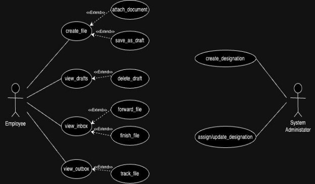

# Fusion ERP Software Requirements Specification for GAD- 4 - FILE TRACKING SYSTEM

**Prepared by:**

- Divyansh Tripathi - 21BCS078
- Siddhant Raj - 21BCS199
- Advay Sagarkar - 21BCS011
- Samruddhi Khade - 21BCS115
- Bhakti Balanse - 21BCS053
- Yash Rastogi - 21BCS249
- Aishwarya Saxena - 21BCS013
- Kallam Yashwanth - 21BCS106
- Venkatesh Kumar - 21BCS127
- Sudhanshu - 21BCS210

**Faculty Mentor:** Avinash Chandra Pandey  
**Student Mentor:** Priyanshu Agarwal-21bcs167, Vansh Mittal-21bcs234

---

## 1. Introduction

### 1.1 Introduction about the Fusion – A Brief Description

Fusion IIIT is a special project at PDPM Indian Institute of Information Technology, Design, and Manufacturing in Jabalpur. It's like a smart helper created by students using Python 3.8 and Django Web framework. The goal is to make things easier and better at the institute.

Fusion IIIT does many things. First, it helps with administrative tasks, making paperwork and processes simpler and more organized. It's like a superhero for efficient management. Second, in academics, it adds a digital touch to make learning better and easily manage courses. But Fusion IIIT doesn't stop there; it helps in different departments and sections, making sure everything runs smoothly on campus.

### 1.2 Purpose of the module

The primary objective of the file tracking module is to establish, uphold, and oversee the creation, maintenance, and management of files, while systematically tracking their progress. This module facilitates the seamless transfer and receipt of files related to IIIT work, empowering students, faculty members, or designated individuals to engage in efficient file-related activities within the system.

Designed for simplicity and user interaction, this module aims to create a user-friendly experience for all members utilizing the system. Whether it involves transferring or receiving files pertinent to IIIT-related tasks, the module ensures a smooth and straightforward process, fostering effective collaboration and streamlined file management within the IIIT community.

### 1.3 Scope of the module

The scope of the File Tracking System encompasses several key aspects to enhance user experience and ensure security. This includes creating a user-friendly interface tailored for employees, establishing a secure mode for system interactions, and implementing secure processes for file creation, tracking, and visualizing the entire file flow. The system prioritizes secured storage of confidential data on the server and grants appropriate privileges to different authorities. Additionally, it aims to efficiently handle a large number of files. Moreover, authenticated users will have the privilege to modify their account settings, such as the registered email address and login password, contributing to a more personalized and secure user environment.

---

## 2. User/Actor Characteristics

### 2.1 Employee

Represents individuals who are employed by the institution such as Faculty and Staff Members who wish to share important files.

**Role:** They are responsible for managing files and attaching extra information so that further actions can be taken on them.

**Specific Functionalities:**

- Create files and attach documents necessary to them
- Receive files from other employees and forward them with documents attached
- Tracks files that are sent or forwarded by the individual to other employees
- Can finish file whose objective has been achieved and send them to archive
- Save unfinished files to draft so that they can be edited later

### 2.2 System Administrator

**Role:** Supervises and manages the designations of employee accounts 

**Specific Functionalities:**

- Creating new designations
- Managing mapping of designations of employees

---

## 3. Functional Requirements

### 3.1 Use Case Diagram

**([useCase draw.io](https://app.diagrams.net/#G1zSkuoL04nwgNblDc3lMn0HgREDf1S66O))**

We have incorporated a few changes in the use case diagram by introducing new use cases - view_inbox, view_outbox to differentiate between the received and sent files respectively.

The use cases - forward_file, finish_file have been included in the view_inbox giving these functionalities to the user, either to forward the received file or to add remarks placing it to archives.

### 3.2 Use Case Description

Documentation of various use cases is as follows:

| **UC ID** | UC#1 |
|-----------|------|
| **Use case Name** | create_file |
| **Description** | The "create file" use case allows the employee to create a new file, give a description to it, attach files and add remarks to it. The employee can then send the created file to another employee by entering their name and designation through the Fusion portal. |
| **Actor** | Employee |
| **Precondition** | The employee is logged in into the portal. |
| **Main Flow** | 1. The employee navigates to the "create file" section.   2. The system displays the sections to add descriptions, content, remarks and attach files.   3. The employee fills the respective sections and then enters the name and designation of the next employee to whom the file is to be sent.   4. The employee has the option to save the created file as a draft or send it to the next employee. [A1] |
| **Postconditions** | The created file is sent to the next employee and an entry is made in the tracking section. |
| **Alternate Flow** | A1   1. The file is saved as draft in the drafts folder. |
| **Sub Flow** | NIL |
| **Global Alternate Flow** | NIL |

| **UC ID** | UC#2 |
|-----------|------|
| **Use case Name** | view_drafts |
| **Description** | The view_drafts use case allows the user to view drafts that have been saved by the user and allows them to complete it. |
| **Actor** | Employee |
| **Precondition** | The employee is logged in into the system. |
| **Main Flow** | 1. The employee navigates to the "Drafts" section and selects his designation to view the saved drafts.   2. The system displays the list of drafts saved by the user.   3. The employee can complete the draft or delete it. [A1][A2] |
| **Postconditions** | The created file is sent to the next employee and an entry is made in the tracking section. |
| **Alternate Flow** | A1   1. The user completes the file and sends it to the next user.   A2   1. The user deletes the draft and it is removed from the drafts section. |
| **Sub Flow** | NIL |
| **Global Alternate Flow** | NIL |

| **UC ID** | UC#3 |
|-----------|------|
| **Use case Name** | view_inbox |
| **Description** | The view_inbox use case allows the user to view the files that have been received by the user and allows them to add remarks and forward it to the next user. |
| **Actor** | Employee |
| **Precondition** | The employee is logged in into the system. |
| **Main Flow** | 1. The employee navigates to the "inbox" section and selects his designation to view the inbox.   2. The system displays the list of files, who sent it along with file ID.   3. The employee can add remarks to the file or forward it to the next employee. [A1][A2] |
| **Postconditions** | The file is sent to the next employee and an entry is made in the tracking section. |
| **Alternate Flow** | A1   1. The user adds remarks and forwards the file. |
| **Sub Flow** | NIL |
| **Global Alternate Flow** | NIL |

## UC#4: view_outbox
| **UC ID** | UC#4 |
|-----------|------|
| **Use case Name** | view_outbox |
| **Description** | The view_outbox use case allows the user to view files that have been sent by them to other employees. |
| **Actor** | Employee |
| **Precondition** | The employee is logged in into the system. |

### Main Flow
1. The employee navigates to the "Outbox" section and selects his designation to view the files sent.
2. The system displays the list of files sent by the user. [A1]

| **Postconditions** | The user has successfully viewed the outbox and now can track the files. |
|--------------------|-----------------------------------------------------|
| **Alternate Flow**  |  |
| A1                  | 1. The user can track the file by seeing the status in outbox. |
| **Sub Flow**       | NIL |
| **Global Alternate Flow** | NIL |

---

## UC#5: create_designation
| **UC ID** | UC#5 |
|-----------|------|
| **Use case Name** | create_designation |
| **Description** | The create_designation use case allows the SA to create new users and assign designation to them. |
| **Actor** | System administrator (SA) |
| **Precondition** | The administrator is logged in into the system. |

### Main Flow
1. The SA enters the details for the new user such as PFId [A1], email address [A1], full name [A1], password [A1], confirm password [A2], and indicates whether the new user account is of a new system administrator or not.
2. Click the “Create User” button. A success message is displayed back.
3. The SA will be redirected to the Dashboard.

| **Postconditions** | A new user will be created successfully and entry will be made into the database. |
|--------------------|-----------------------------------------------------|
| **Alternate Flow**  |  |
| A1                  | 1. PFId, new password and retype new password fields should not be empty and should contain valid PFid, valid password. |
| A2                  | 1. The confirm (retype) password and password fields must be the same. If not, an error pops up. |
| **Sub Flow**       | NIL |
| **Global Alternate Flow** | NIL |

---

## UC#6: assign/update designation
| **UC ID** | UC#6 |
|-----------|------|
| **Use case Name** | assign/update designation |
| **Description** | The assign/update designation use case allows the user to view files that have been sent by them to other employees. |
| **Actor** | System administrator (SA) |
| **Precondition** | The administrator is logged in into the system. |

### Main Flow
1. The SA assigns or updates the existing designations. [A1][A2]
2. Click the “Save” button. A success message is displayed back.
3. The SA will be redirected to the Dashboard.

| **Postconditions** | The designation is successfully updated and assigned. |
|--------------------|-----------------------------------------------------|
| **Alternate Flow**  |  |
| A1                  | 1. The SA updates the designation. |
| A2                  | 1. The SA assigns the designation. |
| **Sub Flow**       | NIL |
| **Global Alternate Flow** | NIL |

---

# Other Functional Requirements

1. The user should be able to attach a variety of types of files with the file they are sending and should be able to view them easily as well.
2. The user must be able to browse their computer and attach the required attachments to the main file.
3. The **Super admin** as well as the System Administrator of Fusion should be able to assign designations, and the inbox of the designations should be different as well.
4. The notifications generated should be able to redirect the user into the inbox.
5. The file tracking module must be able to integrate multiple workflows into the system.

# Other Constraints

## User Interfaces
The user interface should comply with the color scheming and dashboard design of the FUSIONIIT. Users should be able to navigate from one functionality to another. Intermodule navigation should be smooth. All the functionalities should be easy to use, and no specific training should be required for the usage of the module.

## Tech Stack Used
- Django Web Framework
- Django Rest Framework

# Business Rules

1. System Administrator can only manage user accounts, but cannot perform any operations on their files.
2. Only authenticated users with proper credentials are allowed access to the File Tracking System of only those files that are associated with them.
3. User roles and permissions determine the actions they can perform within the system.
4. Each file must follow a standardized workflow for processing, ensuring consistency.
5. Only administrators can modify system-wide settings.

# Non-Functional Requirements

## Security
Ensure data confidentiality and integrity. Role-based authorization provided by Django ensures that users can only perform actions relevant to their designated roles. This ensures that only authorized users with the correct designation can access the files that are associated with the actor.

# Module Dependencies with Other Fusion Modules

## UI Level
- The File tracking interface is accessed through the dashboard and therefore has a dependency on the dashboard UI.
- The File Tracking System is also dependent on the notifications tab of a user, to showcase notifications when they are received for an incoming file.

## DB Level Dependencies
### Outbound Dependencies:
| Sr No. | DB Model | Owner           | User         |
|--------|----------|----------------|--------------|
| 1      | File     | file tracking   | office_module |

### Inbound Dependencies:
| Sr No. | DB Model         | Owner | User         |
|--------|------------------|-------|--------------|
| 1      | ExtraInfo        | global| file tracking|
| 2      | Designation      | global| file tracking|
| 3      | HoldsDesignation  | global| file tracking|

## Module Level Dependencies
- The File Tracking module has a dependency on the notifications module for the generation of notifications.
