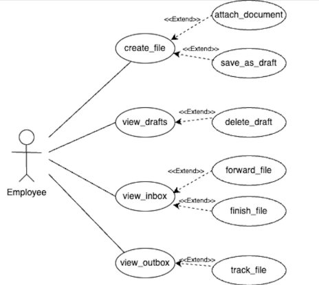
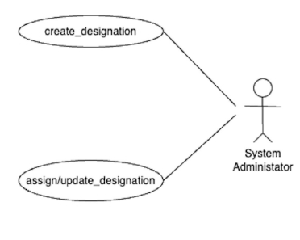

**Figma Profiles for GAD4 [File Tracking Module]**

**1. Module Description:**

The primary objective of the file tracking module is to establish, uphold, and oversee the creation, maintenance, and management of files, while systematically tracking their progress. This module facilitates the seamless transfer and receipt of files related to IIIT work, empowering students, faculty members, or designated individuals to engage in efficient file-related activities within the system.

The System allows people to share, view, track, and forward files and can be used by other modules to implement a specific ‘file-motion’ workflow.

**Use case specification:**

**UC1# create\_file:**

The "create file" use case allows the employee to create a new file, give a description to it, attach files and add remarks to it. The employee can then send the created file to another employee by entering their name and designation through the Fusion portal.

**UC2# view\_drafts:**

The view\_drafts use case allows the user to view drafts that have been saved by the user and allows them to complete it.

**UC3# view\_inbox:**

The view\_inbox use case allows the user to view the files that have been received by the user and allows them to add remarks and forward it to the next user.

**UC4# view\_outbox:**

The view\_outbox use case allows the user to view files that have been sent by them to other employees.

**UC5# create\_designation:**

The create\_designation use case allows the SA to create new users and assign designation to them.

**UC6# assign/update designation:**

The assign/update designation use case allows the user to view files that have been sent by them to other employees.

**Actors**

1. **Employee(Staff)**

Employees aim to use the system for managing various aspects of file creation, tracking, and communication. They may use it to organize documents, collaborate with others, track tasks, and ensure the smooth flow of information within their workflow or organization.

**Use Case for Employee(Staff) -**

Figma Profile - [Employee](https://www.figma.com/file/oHcPnpdJgHgBhy2abHOQAt/FTS-mobile?type=design&node-id=0-1&mode=design&t=oZp3gsWetkhkqYue-0)

2. **System Administrator**

System Administrator aims to use the system to streamline file management

processes by assigning specific roles and responsibilities to users. Bydefining and assigning designations within the system, they ensure that the right people have access to the appropriate files and that workflows are efficiently managed. This actor could be a system administrator or a file management coordinator within the organization, responsible for organizing and optimizing file tracking procedures.

**Use Case for System Administrator -**

Figma Profile -[ System Administrator](https://www.figma.com/file/oHcPnpdJgHgBhy2abHOQAt/FTS-mobile?type=design&node-id=531-37&mode=design&t=oZp3gsWetkhkqYue-0)

**Figma Profile Design Guidelines and Additional Considerations**

1. **Cross-Platform Compatibility:**
- Yes, figma designs are compatible with both web and app versions.
2. **Dimension Standardization:**
- Yes, all Figma designs have the dimensions around 360px width for mobile.

**5.3Actor-oriented Use Case-Based Design:**

- No figma designs were made previously, we have made them from scratch.

Employee use-case Based Design - [https://www.figma.com/file/oHcPnpdJgHgBhy2abHOQAt/FTS-mobile?type=design&nod e-id=0-1&mode=design&t=oZp3gsWetkhkqYue-0](https://www.figma.com/file/oHcPnpdJgHgBhy2abHOQAt/FTS-mobile?type=design&node-id=0-1&mode=design&t=oZp3gsWetkhkqYue-0)

System Administrator use-case Base Design - [https://www.figma.com/file/oHcPnpdJgHgBhy2abHOQAt/FTS-mobile?type=design&nod e-id=531-37&mode=design&t=oZp3gsWetkhkqYue-0](https://www.figma.com/file/oHcPnpdJgHgBhy2abHOQAt/FTS-mobile?type=design&node-id=531-37&mode=design&t=oZp3gsWetkhkqYue-0)
