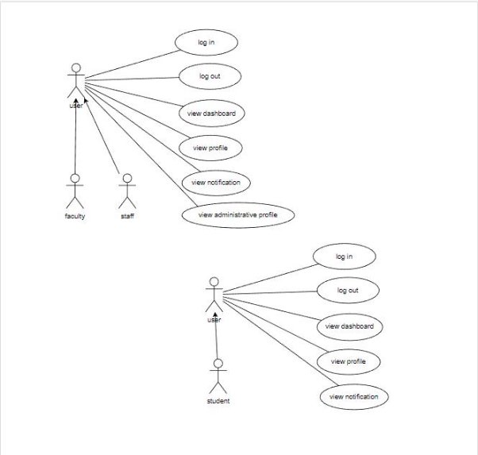

**Fusion ERP**

**Software Requirements Specification**

**for**

**GAD-5-DASHBOARD**

**Prepared by:**

**Pranjal Jha – 21BCS161 Sukul Sarve -21BCS213 Suraj Kanojiya – 21BCS216 Tushar Gupta – 21BCS223 Nikhil Gupta – 21BCS147 Arpit Tak – 21BCS034**

**1 Introduction**

1. **Introduction about the Fusion – A brief Description**

FusionIIIT stands as a testament to the seamless integration and automation of diverse functions within PDPM Indian Institute of Information Technology, Design and Manufacturing, Jabalpur. Crafted with precision using Python 3.8 and powered by the Django Web framework, this initiative is a student-driven endeavor designed to elevate the institute's operational landscape. Encompassing everything from efficient administration management to academic prowess and miscellaneous departmental tasks, FusionIIIT is a holistic solution that harmonizes the intricacies of campus life.

Imagine it as a digital wizard that takes care of everything, from organizing the administrative stuff to making academics smoother. It's not just limited to the usual tasks; FusionIIIT jumps into various departments and sections, making sure every corner of campus life runs smoothly.

In the admin side, it handles the complicated paperwork and processes. For academics, it brings a digital touch, making learning and managing courses easier. But it doesn't stop there; FusionIIIT is like a friendly companion for all the different parts of the campus, making sure everything works well.

In simpler terms, FusionIIIT is not just a tool – it's a helpful friend, making life at PDPM IIITDM Jabalpur more organized and enjoyable for everyone.

2. Purpose of the Module:

The primary purpose of the FusionIIIT Dashboard Module is to provide an intuitive and efficient platform for different user roles to access and manage their profiles, navigate to specific modules, and receive notifications from various departments. It aims to streamline administrative processes, enhance academic management, and foster communication across different levels within the institute.

3. Scope of the Module:

The Dashboard Module encompasses profile management for users such as Students, Head of Department, Dean Academics, Dr Acad, Chairperson, Director, and Faculty. It allows users to view and manage their profiles, access specific modules based on their roles, and receive notifications from different departments. Administrative profiles are accessible for all roles except students.

2. **User/Actor Characteristics**
1. Student:

Role: Accesses academic and personal information. Specific Functionalities:

Views and updates personal profile.

Navigates to academic modules.

Receives notifications related to academics.

2. Staff

Role: Manages administrative functions for the department. Specific Functionalities:

Views and manages administrative profiles.

Navigates to department-specific modules.

Receives department-related notifications.

3. Faculty:

Role: Manages academic-related tasks and receives notifications. Specific Functionalities:

Views and manages academic profiles.

Navigates to academic modules.

Receives academic-related notifications.

3. **Functional Requirements**
1. **Use Case Diagram**

2. **Use case Description**

Use Case 1: Access Dashboard

|UC ID|UC#1|
| - | - |
|Use Case Name|Access Dashboard|
|Description|Users with different roles access the FusionIIIT Dashboard to perform role-specific functions and view relevant information.|
|Actors|Student, HOD, Dean Academics, Dr Acad, Chairperson, Director, Faculty|
|Precondition|Users are logged in with valid credentials.|
|Main Flow|
1. The user logs in to the system.

2. The system authenticates the user's credentials.

3. The user is directed to the Dashboard

4. Based on the user's role, specific modules and information are displayed.
|
|Post conditions|The user is successfully logged into the Dashboard and can access role-specific functionalities.|
|Alternate Flow|NIL|

Use Case 2: View Profile

|UC ID|UC#2|
| - | - |
|Use Case Name|View Profile|
|Description|Users can view and update their personal profiles through the FusionIIIT Dashboard.|
|Actors|Student, HOD, Dean Academics, Dr Acad, Chairperson, Director, Faculty|
|Precondition|Users are logged in with valid credentials.|
|Main Flow|
1. The user navigates to the "View Profile" section on the Dashboard

2. The system displays the user's profile information

3. The user has the option to update their profile information.
|
|Post conditions|The user's profile information is displayed, and updates are reflected in the system.|
|Alternate Flow|NIL|

Use Case 3: Navigate to Modules

|UC ID|UC#3|
| - | - |
|Use Case Name|Navigate to Modules|

|UC ID|UC#3|
| - | - |
|Description|Users navigate to specific modules on the Dashboard based on their roles.|
|Actors|Student, HOD, Dean Academics, Dr Acad, Chairperson, Director, Faculty|
|Precondition|Users are logged in with valid credentials.|
|Main Flow|
1. The user navigates to the "Modules" section on the Dashboard

2. The system displays a list of modules based on the user's role

3. The user selects a specific module to access role-specific functionalities.
|
|Post conditions|The user successfully navigates to the selected module and can perform role-specific tasks.|
|Alternate Flow|NIL|

Use Case 4: View Administrative Profile

|UC ID|UC#4|
| - | - |
|Use Case Name|View Administrative Profile|
|Description|Users with administrative roles can view and manage administrative profiles through the FusionIIIT Dashboard.|
|Actors|HOD, Dean Academics, Dr Acad, Chairperson, Director, Faculty|
|Precondition|Users with administrative roles are logged in with valid credentials.|
|Main Flow|
1. The user with an administrative role navigates to the "View Administrative Profile" section on the Dashboard

2. The system displays the administrative profile information

3. The user can update administrative profile details.
|
|Post conditions|The administrative profile information is displayed, and updates are reflected in the system.|
|Alternate Flow|NIL|

Use Case 5: Receive Notifications

|UC ID|UC#5|
| - | - |
|Use Case Name|Receive Notifications|
|Description|Users receive notifications from various modules and departments through the FusionIIIT Dashboard.|
|Actors|Student, HOD, Dean Academics, Dr Acad, Chairperson, Director, Faculty|
|Precondition|Users are logged in with valid credentials.|
|Main Flow|
1. The user navigates to the "Notifications" section on the Dashboard

2. The system displays a list of notifications from different modules and departments 3. The user receives and views relevant notifications.
|
|Post conditions|The user is informed about important updates and announcements.|
|Alternate Flow|NIL|

3\.3. Other Functional Requirements:

- Implement a search feature that allows users to quickly find specific information or modules within the dashboard.
- Each user role (Student, HOD, Dean Academics, Dr Acad, Chairperson, Director, Faculty) should have access to module-specific functionalities relevant to their responsibilities.
- The dashboard must be accessible from every module
- Enable seamless integration between different modules to allow users to navigate smoothly between various functionalities.
- Users should have the option to set their preferred language for the dashboard interface.
- Include a feedback mechanism within the dashboard to gather input from users about their experience.
- Customize notification preferences based on user roles to ensure individuals receive relevant and important updates.
- Provide users with the option to switch between dark and light modes for the dashboard interface.
- It should provide a responsive and user-friendly interface.

**3.4 Other constraints**

1. **User Interfaces**

The user interface should comply with the colour scheming and dashboard design of the FUSIONIIT. Users should be able to navigate from one functionality to other. Inter module navigation should be smooth. All the functionalities should be easy to use and no specific training should be required for the usage of the module

2. **Tech Stack Used**

DJango for backend Python 3.8

Html css for frontend

4. **Non- Functional Requirements**
1. **Performance:**

The system should respond to user interactions quickly. Response time for view profile, view administrative profile, and notifications should be less.

2. **Scalability:**

The system should handle a mass of concurrent users. System performance should be evaluated under increasing load conditions.

3. **Availability:**

The system should be available 99.9% of the time.

4. **Security:**

Ensure data confidentiality and integrity. Role-based authorization ensures that users can only perform actions relevant to their designated roles.

5. **Module dependencies with other fusion modules**

**5.1. UI Level**

This module will be seamlessly integrated into Fusion at the UI level, providing a unified interface for various actors. Each actor, depending on their role (Student, HOD, Dean Academics, Dr Acad, Chairperson, Director, Faculty), will access the module's functionalities through a role-specific dashboard. For example, students will have access to academic modules, while administrative roles will see additional administrative functionalities. The UI will be designed to ensure an intuitive and user-friendly experience for all actors.

**5.3. Module Level Dependencies**

This Module will be accessible from every module from top and available sidebar
