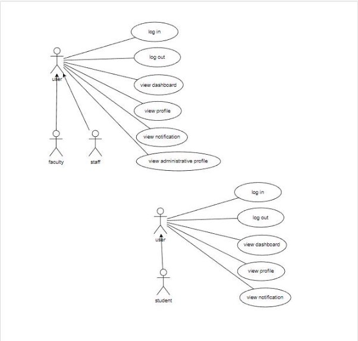

**Figma Profiles for Dashboard \[web and mobile\]**

## Student Mentor : Pranjal Jha	(21bcs161 ) Teammates:

Tushar Gupta(21bcs223) Nikhil Gupta(21bcs147) Sukul Sarve(21bcs213) Arpit Tak(21bcs034) Suraj Kanojiya(21bcs216)

1. **Module Description:**

The primary purpose of the FusionIIIT Dashboard Module is to provide an intuitive and efficient platform for different user roles to access and manage their profiles, navigate to specific modules, and receive notifications from various departments. It aims to streamline administrative processes, enhance academic management, and foster communication across different levels within the institute.

The Dashboard Module encompasses profile management for users such as Students, Head of Department, Dean Academics, Dr Acad, Chairperson, Director, and Faculty. It allows users to view and manage their profiles, access specific modules based on their roles, and receive notifications from different departments. Administrative profiles are accessible for all roles except students.

\-

2. # **Actors**

   1. ## Student:

Role: Accesses academic and personal information. Specific Functionalities:  
Views and updates personal profile. Navigates to academic modules.  
Receives notifications related to academics.

2. ## Staff

Role: Manages administrative functions for the department. Specific Functionalities:  
Views and manages administrative profiles. Navigates to department-specific modules. Receives department-related notifications.

3. ## Faculty:

Role: Manages academic-related tasks and receives notifications. Specific Functionalities:

Views and manages academic profiles. Navigates to academic modules.  
Receives academic-related notifications.  

**Figma Link:**

### **For Android: https://[www.figma.com/file/mmuXkFSpFshs59AfCUWYNi/Android-](http://www.figma.com/file/mmuXkFSpFshs59AfCUWYNi/Android-) Dashboard?type=design\&node-id=0-1\&mode=design\&t=zYQM42Yg1LpjEQwF-0**

**For Web: https://[www.figma.com/file/2h39lXg4FflmfNuPFijs7x/ass-](http://www.figma.com/file/2h39lXg4FflmfNuPFijs7x/ass-) 3?type=design\&node-id=0-1\&mode=design\&t=ALrW5rYBqGo14Cch-0**

**Figma Profile Design Guidelines and Additional Considerations**

1. **Cross-Platform Compatibility:**

- Verify that Figma designs and features are compatible across both web and app versions.

  2. ### **Dimension Standardization:**

- Ensure all Figma designs have the same dimensions: 1920 x 1080 for web and around 360px width for mobile.

  3. ### **Actor-oriented Use Case-Based Design:**

- Strictly base all Figma designs on use cases of actors and maintain consistency with previous and newly added designs.

\-- Each actor should have different page in figma

- If the Figma profiles are already existing make sure all the actors have their own figma profiles and also wireframe those across all use cases for that actor

- Figma link (only) for reference (Figma profiles created by the previous batch): https://[www.figma.com/file/pzhw34xBvEK0hm5Yx4bh0P/Fusion-](http://www.figma.com/file/pzhw34xBvEK0hm5Yx4bh0P/Fusion-) APP?type=design\&node-id=0%3A1\&mode=design\&t=J0f6T5YoUiKbp17u-1

