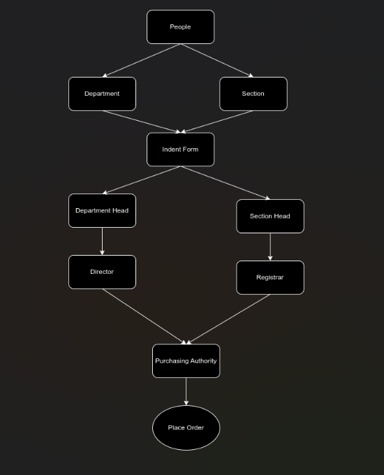

# **Software Requirements Specification for Purchase and Store-Procedures**

**Prepared by:**

Utkarsh Raj(21BCS229)(Mentor)  
Naveen Kumar(21BCS142)  
Shreyansh Gupta(21BCS196)  
Somil Ajmera(21BCS204)  
Sarvagya Jain(21BCS186)  
Vaibhav Agarwal(21BCS231)  

---

## **Table of Contents**

**1.**      **Introduction**  	                                                   **3**  
**1.1**      **Purpose**                                          **3**  
**1.2**      **Module Scope**                               **3**  
**1.3**      **References**                                   **3**  

**2.**      **Overall Description**  	                                         **4**  
**2.1**      **Module Perspective**       	                   **4**  
**2.2**      **Module Functions**       	                   **4**  

**3.**      **Flow Diagram**   	                                               **5**  

**4.**      **System Features (Functional Requirements)**         **6**  
**4.1**       **Indent Filing**                              **6**  
**4.2**       **Indent Approval**                        **8** 	                             

**5.**      **Non Functional Requirements**   	                     **12**  
**6.**   **Dependency**                                                               **13**  
**7.**   **Tech Stack**                                                                **13**

---

## **1. Introduction**

### **1.1 Purpose**

There exists a lot of time overhead and paper-work involved in the process from indent filing of stock to its final issuance to the indenter. The whole process is quite cumbersome and also inconvenient for different actors involved in this process. With the use of Purchase and Store, the whole notion of indent filing would undergo a major shift from the paper-work based approval of stocks to online.

The project aims at designing and implementing a user-friendly approval of filed indent, which addresses the above-mentioned shortcomings of the traditional system. It would also cater to the needs of different classes of users, i.e., Employee(s), Head(s), Director, Registrar, Purchase Officer, and Dealing assistant.

### **1.2 Module Scope**

The Scope of the Purchase and Store Procedures includes:

- Providing a means for filing an indent. 
- Providing a means for tracking the status of the filled indent.  
- Providing secured means to get the indent approved.
- Providing a means to keep track of stocks procured/present.

### **1.3 References**

1. [Indent Form](https://www.iiitdmj.ac.in/downloads/forms/Indent%20Form.pdf)

---

## **2. Overall Description**

### **2.1 Module Perspective**

Indenter (faculty/staff) has a web-based user-interface through which they can interact with the Purchase and Store Procedures and perform indent filing. There is a login page for the users (faculty/staff) from where they can log into their accounts. After successfully logging into the account, the user can file an indent for the required product by filling up the indent form and forwarding it to his head/boss. Indentors can also view the status of its approval by higher authorities. This form is part of the employee-side interface.

Higher authorities (Head/Director) also have a web-based user-interface through which they can interact with this module and can view the received application of indent filed by the indenter. He/She can also give a remark for its approval/rejection. These form the part of the head/director interface.

Purchasing officer also has a web-based user-interface through which he/she can view the approved application and can check the current availability of funds with the corresponding department to give it financial approval.

Dealing assistant has a web-based user interface through which he/she can maintain the entry of procured stocks in the database.

Finally, the bill payment will be processed by the account section.

### **2.2 Module Functions**

This module can be used to file an indent by a faculty/staff member, get the indent approved by authorities, manage stocks, and also ensure a transparent system to keep track of the application status and payments involved.

An indenter is allowed to fill indent form(s), which will be sent for approval to the concerned person (Director/Registrar), and after approval, the procurement procedure will be initiated. When the item(s) are delivered, an entry of procured items will be made in stock tables followed by payment for the items received.

---

## **3. Flow Diagram**

Following are the users of the module:

- **Indenter**: A person serving the PDPM-IIITDM Jabalpur in some capacity, like a faculty or a staff member, with a PF number and an official institute email ID, which will be used to access the system.
- **Approver**: A person who will approve the indent filed by the indenter. Depending on the indenter, the approver can be Director (in case of faculty) and Registrar (in case of staff). In some cases, the file needs to be approved by an intermediate authority (like HOD) before it is sent to the upper authority.
- **Purchasing Officer**: The person responsible for the procurement of the items approved by authorities.

---

## **4. System Features (Functional Requirements)**

Here we require a file tracking system for all the interfaces for file forwarding. We also need a notification list to check the latest application we received. We need to allow only authorized persons to log in (secured login) through the particular module. We also need an accept or reject option only for the head/director. The designated person should only do the procurement stock entry (dealing assistant), and others should not have access to the database.

### **4.1 Indent Filing**

#### **Use Case #1: Indent Filing**

| UC ID       | UC#1              |
|-------------|--------------------|
| **Use case Name** | indent_filing |
| **Description** | This use case specifies filing of an indent by the indenter. After the form is filled, it is forwarded to higher authorities for approval. |
| **Actor** | Indenter |
| **Precondition** | The indenter must be logged into the system. |
| **Main Flow** | S No. Description |
| 1 | A Purchase and Store Dashboard is displayed initially to indenter after successful login. |
| 2 | The system presents the option of filing a new indent or tracking the status of past indents filed. |
| 3 | An employee selects one of the listed options to perform file operations. |
| 4 | Operations: File an Indent (create by filling form), View Indent Status (previous indents). |
| 5 | A successful message is displayed when indent is filed. |
| **Postcondition** | After operations are successfully performed, they will be reflected in the database. |

---

### **4.2 Indent Approval**

#### **Use Case #1: Section Approval**

| UC ID       | UC#2              |
|-------------|--------------------|
| **Use case Name** | Department/Section Approval |
| **Description** | This use case specifies the procedure for acceptance/rejection of proposed indent by department/section. |
| **Actor** | Head/Director/Registrar |
| **Precondition** | The user must be logged into the system. |
| **Main Flow** | S No. Description |
| 1 | User finds all proposed indents in his Inbox. |
| 2 | The user has the option to accept/reject the indent. Remarks can be added. |
| 3 | The indenter is notified about the status (acceptance/rejection) along with remarks. |
| 4 | If accepted, the Purchasing Officer is notified to proceed with procurement; otherwise, the indenter can edit/re-file. |

---

## **5. Non Functional Requirements**

- User-friendly UI
- The app should provide real-time transaction updates with minimal latency, aiming for a response time of less than 2 seconds for transaction queries.
- The app should be compatible with the latest versions of popular mobile operating systems (iOS and Android).
- The system should handle a minimum of 1000 concurrent users querying transactions simultaneously without significant performance degradation.
- Comprehensive logging should be implemented to capture relevant information for debugging and auditing purposes.

---

## **6. Dependency**

- File tracking system module

---

## **7. Tech Stack**

- **Flutter (Dart)**: Flutter is an open-source UI software development toolkit by Google, using Dart programming language, for building natively compiled applications for mobile.
- **PostgreSQL**: PostgreSQL is a powerful open-source relational database management system known for its extensibility, scalability, and robust support for complex queries.
