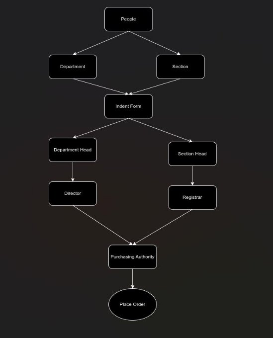

# **Software Requirements Specification**

**for**

**Purchase and Store Procedures**

---

**Prepared by:**

Yash Pratap Singh (21BCS248)  
Aniket Chaudhari (21BCS021)  
Mohit Saini (21BCS134)  
Rishabh Gupta (21BCS172)  
Vaibhav Singh (21BCS232)

**STUDENT MENTOR:** Siddharth Tandon (21BCS200)

**TEACHER MENTOR:** Dr. Durgesh Singh

---

### **Table of Contents**

1. [**Introduction**](#introduction) 
   1. [**Purpose**](#purpose) 
   2. [**Module Scope**](#module-scope) 
   3. [**References**](#references)
2. [**Overall Description**](#overall-description)
   1. [**Module Perspective**](#module-perspective)
   2. [**Module Functions**](#module-functions)
3. [**Flow Diagram**](#flow-diagram)
4. [**System Features (Functional Requirements)**](#system-features-functional-requirements)
   1. [**Indent Filing**](#indent-filing)
   2. [**Indent Approval**](#indent-approval)
5. [**Non-Functional Requirements**](#non-functional-requirements)
6. [**Dependency**](#dependency)
7. [**Tech Stack**](#tech-stack)

---

## **1. Introduction**

### 1.1 **Purpose**

There exists a significant time overhead and paperwork involved in the process of indent filing and final issuance to the indenter. The traditional process is cumbersome and inconvenient for different actors involved. By using the **Purchase and Store** module, the notion of indent filing undergoes a major shift from paper-based approval to online.

The project aims at designing and implementing a user-friendly system for indent approval that addresses the shortcomings of the traditional system. It caters to different classes of users, such as Employees, Heads, Directors, Registrars, Purchase Officers, and Dealing Assistants.

### 1.2 **Module Scope**

The scope of the Purchase and Store Procedures includes:

- Providing a means for filing an indent.
- Allowing tracking of the status of the filled indent.
- Providing a secured method for indent approval.
- Tracking of stocks procured/present.

### 1.3 **References**

1. [Indent Form](https://www.iiitdmj.ac.in/downloads/forms/Indent%20Form.pdf)

---

## **2. Overall Description**

### 2.1 **Module Perspective**

The indenter (faculty/staff) has a web-based user interface through which they can interact with the Purchase and Store Procedures to perform indent filing. Users can log in, file indents, and track approval status. The heads/directors can approve or reject indents, and the purchasing officer checks the fund availability for procurement. The dealing assistant maintains stock entries, and the accounts section processes bill payments.

### 2.2 **Module Functions**

This module can be used by faculty/staff to file indents, get approval, manage stocks, and track the application status and payments.

---

## **3. Flow Diagram**

---

## **4. System Features (Functional Requirements)**

A file-tracking system is required for all interfaces. The system should:

- Allow secure login.
- Enable only authorized users to approve/reject indents.
- Ensure only designated persons can perform procurement stock entry.

### 4.1 **Indent Filing**

#### **Use Case #1: Indent Filing**

| **UC ID**       | **UC#1**                                   |
|-----------------|--------------------------------------------|
| **Use Case Name**| Indent Filing                              |
| **Description**  | Filing an indent by the indenter and forwarding it for approval.|
| **Actor**        | Indenter                                   |
| **Precondition** | The indenter must be logged into the system.|
| **Main Flow**    | 1. Purchase and Store Dashboard displayed upon login.  2. Options: file a new indent or track past indents.  3. File operations:  - Fill a new indent.  - View indent status.|

| **Post Condition** | Successful operations reflected in the database. |
| **Alternate Flow** | 1. All fields are mandatory, or an error pops up.  2. Operation aborted if 'Cancel' is selected, and user is redirected to the home page.|

### 4.2 **Indent Approval**

#### **Use Case #1: Section Approval**

| **UC ID**         | **UC#2**                                   |
|-------------------|--------------------------------------------|
| **Use Case Name** | Department/Section Approval                |
| **Description**   | Approve/reject proposed indent by department/section.|
| **Actor**         | Head/Director/Registrar                    |
| **Precondition**  | User must be logged into the system.       |
| **Main Flow**     | 1. Proposed indents are shown in the Inbox.  2. User clicks on an indent to approve/reject.  3. Remarks can be added if changes are needed.  4. Indenter is notified of the decision and remarks.|
| **Post Condition**| Approved indents initiate procurement.     |

#### **Use Case #2: Financial Approval**

| **UC ID**         | **UC#3**                                   |
|-------------------|--------------------------------------------|
| **Use Case Name** | Financial Approval                         |
| **Description**   | Financial approval process for indents.    |
| **Actor**         | Purchasing Officer                         |
| **Precondition**  | The Purchasing Officer must be logged in.  |
| **Main Flow**     | 1. Approved indents are displayed in the Inbox.  2. Officer checks for fund availability.  3. Financial approval is granted or denied, and the indenter is notified.|

---

## **5. Non-Functional Requirements**

- **User-friendly UI**: Fast real-time transaction updates.
- **Browser Compatibility**: Should work with Google Chrome, Edge, Opera Mini.
- **Performance**: Should support 1000 concurrent users.
- **Logging**: Comprehensive logging for debugging and auditing.

---

## **6. Dependency**

- File tracking system module.

---

## **7. Tech Stack**

- **Django**: A Python-based web framework.
- **PostgreSQL**: A powerful open-source relational database management system.
