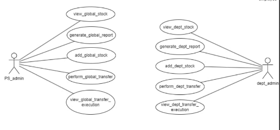
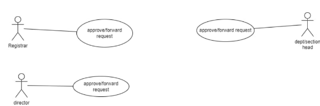
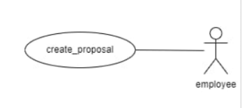
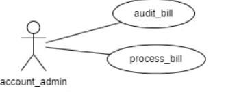

# Assignment - 3

## Purchase and Store

### GAD-06

---

**Prepared by:**

- Utkarsh Raj (21BCS229) (Mentor)
- Naveen Kumar (21BCS142)
- Shreyansh Gupta (21BCS196)
- Somil Ajmera (21BCS204)
- Sarvagya Jain (21BCS186)
- Vaibhav Agarwal (21BCS231)

---

## Figma Profiles for GAD-6 Purchase and Store

### 1. Module Description

This module can be used to file an indent by faculty/staff members, get the indent approved by authorities, manage stocks, and ensure a transparent system to keep track of the application status and payments involved.

An indenter is allowed to fill indent form(s), which will be sent for approval to the concerned person (Director/Registrar). After approval, the procurement procedure will be initiated, and when the items(s) are delivered, an entry of procured items will be made in stock tables followed by payment for the items received.

### 2. WORKING

Indenter (faculty/staff) has a web-based user interface through which they can interact with the Purchase and Store Procedures and perform indent filing. There is a login page for the users (faculty/staff) from where they can log into their accounts. After successfully logging into the account, the user can file an indent for the required product by filling up the indent form and forwarding it to their head/boss. Indentors can also view the status of its approval by higher authorities. This form is part of the employee-side interface.

Higher authorities (Head/Director) also have a web-based user interface through which they can interact with this module and can view the received application of indent filed by the indenter. He/She can also give a remark for its approval/rejection. These form the part of the head/director interface.

Purchasing officers also have a web-based user interface through which they can view the approved application and can check the current availability of funds with the corresponding department to give it financial approval.

Dealing assistants have a web-based user interface through which they can maintain the entry of procured stocks in the database.

Finally, the bill payment will be processed by the account section.

### Use Case Diagrams

#### Use Case Diagram

[Figma Link 1](https://www.figma.com/file/ECMLhDHZ6keplyCMZsCYKr/Fusion-PR?type=design&node-id=40-808&mode=design&t=JmewxAVYlEx4L3b1-0)

[Figma Link 2](https://www.figma.com/file/ECMLhDHZ6keplyCMZsCYKr/Fusion-PR?type=design&node-id=40-804&mode=design&t=JmewxAVYlEx4L3b1-0)

---

#### Use Case Diagram: UC#2

[Figma Link 1](https://www.figma.com/file/ECMLhDHZ6keplyCMZsCYKr/Fusion-PR?type=design&node-id=40-805&mode=design&t=JmewxAVYlEx4L3b1-0)

[Figma Link 2](https://www.figma.com/file/ECMLhDHZ6keplyCMZsCYKr/Fusion-PR?type=design&node-id=40-806&mode=design&t=JmewxAVYlEx4L3b1-0)

---

#### Use Case Diagram: UC#1

[Figma Link](https://www.figma.com/file/ECMLhDHZ6keplyCMZsCYKr/Fusion-PR?type=design&node-id=0-1&mode=design&t=JmewxAVYlEx4L3b1-0)

---

#### Use Case Diagram: UC#3

[Figma Link](https://www.figma.com/file/ECMLhDHZ6keplyCMZsCYKr/Fusion-PR?type=design&node-id=40-807&mode=design&t=JmewxAVYlEx4L3b1-0)

---

## Figma Profile Design Guidelines and Additional Considerations

### 5.1 Cross-Platform Compatibility

- Verify that Figma designs and features are compatible across both web and app versions.

### 5.2 Dimension Standardization

- Ensure all Figma designs have the same dimensions: 1920 x 1080 for web and around 360px width for mobile.
