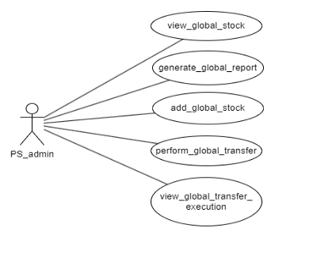
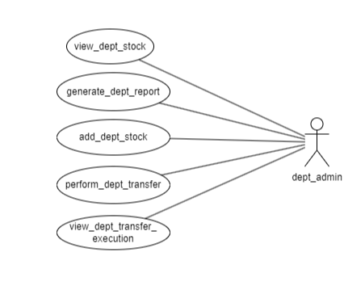
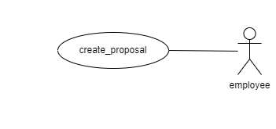
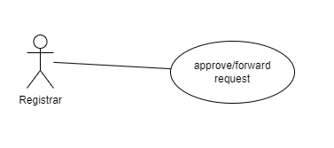
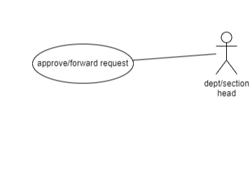
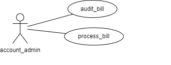

# Figma Profiles for [GAD-6 Purchase and Store]

## Module Description

This module can be used to file an indent by faculty/staff/employee members, and then the indent can be approved by authorities. The main objectives of the module include managing stocks, ensuring a transparent system, and keeping track of the application status and payments involved. An indenter is allowed to fill indent form(s), which will be sent for approval to the concerned person (Director/Registrar). After approval, the procurement procedure will be sent for approval to the department/section admin. Once approved, the procedure is initiated, and when the items are delivered, an entry of procured items will be made in the stock tables, followed by payment for the items received. All details of the items/stock of the respective department and section can be viewed by their respective admin. The global admin/PS admin can view all the global item/stock details and manage transfers.

[Use Case](https://drive.google.com/file/d/1hbWGh6hf8qkIzrVlXZDLc7BT9KapfEDQ/view?usp=drive_link)

## Actors

### PS_Admin (UC#4, UC#5, UC#6, UC#7, UC#8)

- The PS_admin can view the stocks available in the stock maintenance system.
- The PS_admin can add, modify, and/or delete stock information from the system.
- The PS_admin can view the report of all departments generated after all stock updates.
- The PS_admin can transfer any item to any other department.
- The PS_admin can view the data of the items/stocks that are transferred.

[PS_Admin Figma](https://www.figma.com/file/BWjywD4oGOFkhoWu6AfiS9/Fusion-figma-PS-1?type=design&node-id=0-1&mode=design&t=dV3cmlV8gcUmL6yn-0)

### Dept_Admin

- The Dept. admin can view the stocks available in the stock maintenance system of their department.
- The Dept. admin can add, modify, and/or delete stock information of their department from the system.
- The Dept. admin can view the report of their department generated after all stock updates.
- The Dept. admin can transfer any item to any other department or to the global administrator.
- The Dept. admin can view the data of the items/stocks that are transferred from their department.

[Dept. Admin Figma](https://www.figma.com/file/BWjywD4oGOFkhoWu6AfiS9/Fusion-figma-PS-1?type=design&node-id=0-1&mode=design&t=dV3cmlV8gcUmL6yn-0)

### Employee (UC#1)

The employee can create a proposal/file an indent when they wish to order something.

[Employee Figma](https://www.figma.com/file/BWjywD4oGOFkhoWu6AfiS9/Fusion-figma-PS-1?type=design&node-id=0-1&mode=design&t=dV3cmlV8gcUmL6yn-0)

### Registrar (UC#2)

The registrar can approve or reject the indent they received from the employee from their section.

[Registrar Figma](https://www.figma.com/file/BWjywD4oGOFkhoWu6AfiS9/Fusion-figma-PS-1?type=design&node-id=0-1&mode=design&t=dV3cmlV8gcUmL6yn-0)

### Director (UC#2)

The Director can approve or reject the indent they received from the employee from their section.

[Director Figma](https://www.figma.com/file/BWjywD4oGOFkhoWu6AfiS9/Fusion-figma-PS-1?type=design&node-id=0-1&mode=design&t=dV3cmlV8gcUmL6yn-0)

### Dept/Section Head (UC#2)

The Dept/section head can approve or reject the indent they received from the employee from their section.

[Dept/Section Head Figma](https://www.figma.com/file/BWjywD4oGOFkhoWu6AfiS9/Fusion-figma-PS-1?type=design&node-id=0-1&mode=design&t=dV3cmlV8gcUmL6yn-0)

### Account_Admin (UC#3)

The account_admin can audit and process the bills of all the orders/stock purchased and ordered from any section/department.

[Account_Admin Figma](https://www.figma.com/file/BWjywD4oGOFkhoWu6AfiS9/Fusion-figma-PS-1?type=design&node-id=0-1&mode=design&t=dV3cmlV8gcUmL6yn-0)
