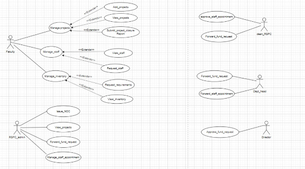
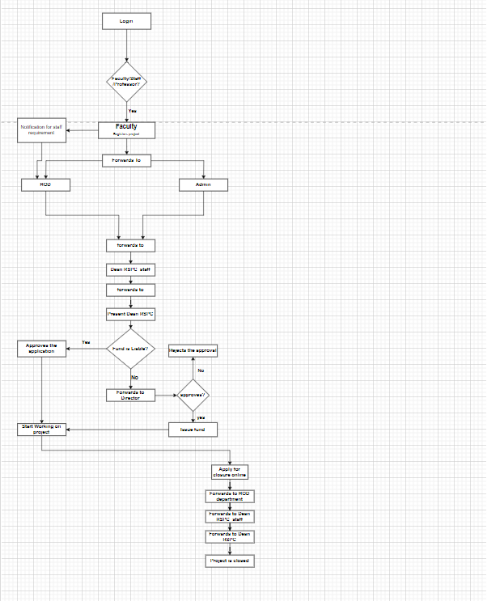

# Fusion ERP

## Software Requirements Specification

### for 

## GAD-7-RSPC (App)

### Team Members:

1. **Abhishek Kumar** (21BCS004)
2. **Agastya Sharma** (21BCS012)
3. **Aditya Kumar Vyas** (21BCS008)
4. **Abhay Singh** (21BCS002)
5. **Abhilash Chandanshive** (21BCS003)

---

## 1. Introduction

### 1.1 Introduction about the Fusion – A Brief Description

FusionIIIT stands as a testament to the seamless integration and automation of diverse functions within PDPM Indian Institute of Information Technology, Design and Manufacturing, Jabalpur. Crafted with precision using Python 3.8 and powered by the Django Web framework, this initiative is a student-driven endeavor designed to elevate the institute's operational landscape. 

Encompassing everything from efficient administration management to academic prowess and miscellaneous departmental tasks, FusionIIIT is a holistic solution that harmonizes the intricacies of campus life.

Imagine it as a digital wizard that takes care of everything, from organizing the administrative tasks to making academics smoother. It's not just limited to the usual tasks; FusionIIIT engages various departments, ensuring that every corner of campus life runs smoothly.

On the administrative side, it handles complicated paperwork and processes. For academics, it brings a digital touch, facilitating learning and course management. But it doesn't stop there; FusionIIIT is like a friendly companion for all the different parts of the campus, ensuring everything works well.

In simpler terms, FusionIIIT is not just a tool – it's a helpful friend, making life at PDPM IIITDM Jabalpur more organized and enjoyable for everyone.

### 1.2 Purpose of the Module

The RSPC Module is an integral part of the Fusion project, tasked with maintaining records of professors' projects, achievements, conferences, book publications, and more. It serves as a platform for professors and staff members to input project details, which are not visible to other users. Additionally, the module manages profiles of professors and staff, encompassing their projects and achievements.

This mobile application is tailored to streamline various activities associated with the Dean RSPC department of PDPM IIITDM Jabalpur. It aims to provide automated features for faculty, deans, and staff, covering activities such as project funds, EIS, and more.

The software will also incorporate a consultancy section where users can input details of consultancy projects, including consultant name, client name, project start and end dates, and financial outlay.

### 1.3 Scope of the Module 

The scope of the RSPC Module is to provide a platform for professors and staff members to manage their projects, achievements, conferences, book publications, etc. It also maintains their profiles and allows them to add projects and their details. The module ensures that the information added by professors and staff members is not visible to other users of the system. 

In addition to the specific design components of this software, this document will clarify the design team’s goals of creating value-added software that not only captures faculty data correctly but also efficiently stores, sorts, retrieves, and delivers this critical information where it is needed by the Dean and Staff. This software is deliberately focused on Faculty data and dean responsibilities. 

### Functionality regarding appointment management and billing

**Actors:** Faculty, Dean RSPC, Head of Department (HOD), Deputy Registrar, Dean RSPC Staff, Director, Admin.

---

## 2. Actors

### 2.1 Faculty

A person who applies for different types of permissions:

- Online Apply for Project Registration
- Reallocation of the fund Among Different Heads
- Request for closure of project
- Request for staff appointment 

### 2.2 Dean RSPC

A person who approves/rejects different types of applications or forwards them to the director, depending on the rights.

### 2.3 Head of Department

A person who checks and forwards the different types of applications to the Dean RSPC staff.

### 2.4 Deputy Registrar

A person who checks and forwards the different types of applications to the Dean RSPC staff.

### 2.5 Dean RSPC Staff

A person who checks and forwards the different types of applications to the Dean RSPC (Not in the use case diagram).

### 2.6 Director

Approves the fund request.

---

## 3. Functional Requirements

### 3.1 Use Case Diagram

---

### 3.2 	Use case Description

<table><tr><th colspan="1" valign="top"><b>UC ID</b></th><th colspan="3" valign="top">UC#1</th></tr>
<tr><td colspan="1" valign="top"><b>Use case name</b></td><td colspan="3" valign="top"><b>manage_projects</b></td></tr>
<tr><td colspan="1" valign="top"><b>Description</b></td><td colspan="3" valign="top">The "Manage Projects" use case allows the Faculty to add, view and submit closure reports of the project requests to the Fusion portal.</td></tr>
<tr><td colspan="1" valign="top"><b>Actor</b></td><td colspan="3" valign="top">Faculty</td></tr>
<tr><td colspan="1" valign="top"><b>Precondition</b></td><td colspan="3" valign="top">The Faculty is logged into the system.</td></tr>
<tr><td colspan="1" rowspan="5" valign="top"><b>Main Flow</b></td><td colspan="1" valign="top">1</td><td colspan="2" valign="top">`   `The Faculty navigates to the "Manage Projects" section.</td></tr>
<tr><td colspan="1" valign="top">2</td><td colspan="2" valign="top">The system displays the “Add Projects”, ”View Projects”, “Submit Project Closure Report” sections.</td></tr>
<tr><td colspan="1" valign="top">3</td><td colspan="2" valign="top">The Faculty can navigate to the “Add Projects” section and add a new project by providing the details.  [A1]</td></tr>
<tr><td colspan="1" valign="top">4</td><td colspan="2" valign="top">The Faculty can navigate to the “View Projects” section and view the completed project details. </td></tr>
<tr><td colspan="1" valign="top">5</td><td colspan="2" valign="top">The Faculty can navigate to the “Submit Project Closure Report” section and submit the closure report of a pending project. [A1]</td></tr>
<tr><td colspan="1" valign="top"><b>Post conditions</b> </td><td colspan="3" valign="top">The Faculty is navigated to “Add Projects” or ”View Projects” or “Submit Project Closure Report” sections .</td></tr>
<tr><td colspan="1" valign="top"><b>Alternate Flow</b></td><td colspan="1" valign="top">`  `A1</td><td colspan="1" valign="top">1</td><td colspan="1" valign="top">Faculty presses the cancel button while filling the form .</td></tr>
<tr><td colspan="1" valign="top"><b>Sub Flow</b></td><td colspan="3" valign="top">NIL</td><td colspan="1"> </td></tr>
<tr><td colspan="1" valign="top"><b>Global Alternate Flow</b></td><td colspan="1" valign="top">GA</td><td colspan="2" valign="top">If a technical error occurs during the execution of any action (e.g., database failure, server issues), the system displays an error message and logs the incident.</td><td colspan="1">
 

 

 

 

 
</td></tr>
<tr><td colspan="1"></td><td colspan="1"></td><td colspan="1"></td><td colspan="1"></td><td colspan="1"></td></tr>
</table>
** 
**

|**UC ID**|UC#2|||
| :- | :- | :- | :- |
|**Use case name**|**Add\_projects**|||
|**Description**|The "Add Projects" use case allows the Faculty to add projects to the Fusion portal.|||
|**Actor**|Faculty|||
|**Precondition**|The Faculty is navigated into the “Manage Projects” section.|||
|**Main Flow**|1|`   `Faculty selects the “Add Projects” section.||
|** |2|Faculty need to fill the form and can submit it.||
|**Post conditions** |The Faculty is navigated to “Add Projects” or ”View Projects” or “Submit Project Closure Report” sections .|||
|**Alternate Flow**|`  `A1|1|Faculty is navigated to Manage Projects Section.|
|**Sub Flow**|NIL|||
|**Global Alternate Flow**|GA|If a technical error occurs during the execution of any action (e.g., database failure, server issues), the system displays an error message and logs the incident.||

|**UC ID**|UC#3|||
| :- | :- | :- | :- |
|**Use case name**|**View\_projects**|||
|**Description**|The "View projects" use case allows the Faculty to view the projects for which the closure reports are submitted.|||
|**Actor**|Faculty|||
|**Precondition**|The Faculty is navigated into the “Manage projects” section.|||
|**Main Flow**|1|` `The faculty selects the “View projects” section.||
|** |2|The faculty views the projects. ||
|**Post conditions** |Faculty is navigated to the “Manage Projects” Section.|||
|**Alternate Flow**|`  `A1|1|Faculty clicks on the “back” button to navigate back to the dashboard|

|**UC ID**|UC#4|||
| :- | :- | :- | :- |
|**Use case name**|**Submit project closure report**|||
|**Description**|The “Submit project closure report” use case allows the Faculty to submit closure reports for completed projects.|||
|**Actor**|Faculty|||
|**Precondition**|The Faculty is navigated into the “Manage projects” section.|||
|**Main Flow**|1|` `The faculty selects the “Submit project closure report” section.||
|** |2|The faculty is given a list of projects for which the closure reports are not submitted||
|**Post conditions** |Faculty is navigated to the “Manage Projects” Section.|||
|**Alternate Flow**|`  `A1|1|Faculty clicks on the “back” button to navigate back to the dashboard|

**

<table><tr><th colspan="1" valign="top"><b>UC ID</b></th><th colspan="2" valign="top">UC#5</th></tr>
<tr><td colspan="1" valign="top"><b>Use case name</b></td><td colspan="2" valign="top"><b>manage_staff</b></td></tr>
<tr><td colspan="1" valign="top"><b>Description</b></td><td colspan="2" valign="top">The "Manage staff" use case allows the Faculty to request for staff and view the already assigned staff</td></tr>
<tr><td colspan="1" valign="top"><b>Actor</b></td><td colspan="2" valign="top">Faculty</td></tr>
<tr><td colspan="1" valign="top"><b>Precondition</b></td><td colspan="2" valign="top">The Faculty is logged into the system.</td></tr>
<tr><td colspan="1" rowspan="4" valign="top"><b>Main Flow</b></td><td colspan="1" valign="top">1</td><td colspan="1" valign="top">`   `The Faculty navigates to the "Manage staff" section.</td></tr>
<tr><td colspan="1" valign="top">2</td><td colspan="1" valign="top">The system displays the “View staff”, ”Request staff”, sections.</td></tr>
<tr><td colspan="1" valign="top">3</td><td colspan="1" valign="top">The Faculty can navigate to the “View staff” section to view staff of existing projects</td></tr>
<tr><td colspan="1" valign="top">4</td><td colspan="1" valign="top">The Faculty can navigate to the “Request staff” section and request for staff </td></tr>
<tr><td colspan="1" valign="top"><b>Post conditions</b> </td><td colspan="2" valign="top">The Faculty is navigated to “View staff” or ”Request staff”, sections .</td></tr>
</table>
**

|**UC ID**|UC#6|||
| :- | :- | :- | :- |
|**Use case name**|**View\_staff**|||
|**Description**|The "View staff" use case allows the Faculty to view the existing staff for the projects.|||
|**Actor**|Faculty|||
|**Precondition**|The Faculty is navigated into the “Manage staff” section.|||
|**Main Flow**|1|` `The faculty selects the “View staff” section.||
|** |2|The faculty views the staff assigned to the projects.||
|**Post conditions** |Faculty is navigated to the “Manage staff” Section.|||
|**Alternate Flow**|`  `A1|1|Faculty clicks on the “back” button to navigate back to the dashboard|

|**UC ID**|UC#7|||
| :- | :- | :- | :- |
|**Use case name**|**Request\_staff**|||
|**Description**|The "Request staff" use case allows the Faculty to request staff for the projects.|||
|**Actor**|Faculty|||
|**Precondition**|The Faculty is navigated into the “Manage staff” section.|||
|**Main Flow**|1|` `The faculty selects the “Request staff” section.||
|** |2|The faculty requests the staff.||
|**Post conditions** |Faculty is navigated to the “Manage staff” Section.|||
|**Alternate Flow**|`  `A1|1|Faculty clicks on the “back” button to navigate back to the dashboard|

<table><tr><th colspan="1" valign="top"><b>UC ID</b></th><th colspan="2" valign="top">UC#8</th></tr>
<tr><td colspan="1" valign="top"><b>Use case name</b></td><td colspan="2" valign="top"><b>manage_inventory</b></td></tr>
<tr><td colspan="1" valign="top"><b>Description</b></td><td colspan="2" valign="top">The "Manage inventory" use case allows the Faculty to request for funds and view the already allocated funds.</td></tr>
<tr><td colspan="1" valign="top"><b>Actor</b></td><td colspan="2" valign="top">Faculty</td></tr>
<tr><td colspan="1" valign="top"><b>Precondition</b></td><td colspan="2" valign="top">The Faculty is logged into the system.</td></tr>
<tr><td colspan="1" rowspan="4" valign="top"><b>Main Flow</b></td><td colspan="1" valign="top">1</td><td colspan="1" valign="top">`   `The Faculty navigates to the "Manage inventory" section.</td></tr>
<tr><td colspan="1" valign="top">2</td><td colspan="1" valign="top">The system displays the “View inventory”, ”Request requirements”, sections.</td></tr>
<tr><td colspan="1" valign="top">3</td><td colspan="1" valign="top">The Faculty can navigate to the “View inventory” section to view inventory of existing projects</td></tr>
<tr><td colspan="1" valign="top">4</td><td colspan="1" valign="top">The Faculty can navigate to the “Request requirements” section and request for requirements(funds).</td></tr>
<tr><td colspan="1" valign="top"><b>Post conditions</b> </td><td colspan="2" valign="top">The Faculty is navigated to “View inventory” or ”Request requirements”, section .</td></tr>
</table>
**

|**UC ID**|UC#9|||
| :- | :- | :- | :- |
|**Use case name**|**View\_inventory**|||
|**Description**|The "View inventory" use case allows the Faculty to view the existing inventory for the projects.|||
|**Actor**|Faculty|||
|**Precondition**|The Faculty is navigated into the “Manage inventory” section.|||
|**Main Flow**|1|` `The faculty selects the “View inventory” section.||
|** |2|The faculty views the inventory allocated to the projects.||
|**Post conditions** |Faculty is navigated to the “Manage inventory” Section.|||
|**Alternate Flow**|`  `A1|1|Faculty clicks on the “back” button to navigate back to the dashboard|

|**UC ID**|UC#10|||
| :- | :- | :- | :- |
|**Use case name**|**Request\_requirements**|||
|**Description**|The "Request requirements" use case allows the Faculty to request requirements for the projects.|||
|**Actor**|Faculty|||
|**Precondition**|The Faculty is navigated into the “Manage inventory” section.|||
|**Main Flow**|1|` `The faculty selects the “Request requirements” section.||
|** |2|The faculty requests the requirements or funds.||
|**Post conditions** |Faculty is navigated to the “Manage inventory” Section.|||
|**Alternate Flow**|`  `A1|1|Faculty clicks on the “back” button to navigate back to the dashboard|

<table><tr><th colspan="1" valign="top"><b>UC ID</b></th><th colspan="3" valign="top">UC#11</th></tr>
<tr><td colspan="1" valign="top"><b>Use case name</b></td><td colspan="3" valign="top"><b>view_projects</b></td></tr>
<tr><td colspan="1" valign="top"><b>Description</b></td><td colspan="3" valign="top">The "View Projects" use case allows the RSPC admin to  view  projects submitted by faculty.</td></tr>
<tr><td colspan="1" valign="top"><b>Actor</b></td><td colspan="3" valign="top">Rspc Admin</td></tr>
<tr><td colspan="1" valign="top"><b>Precondition</b></td><td colspan="3" valign="top">The Rspc Admin is logged in into the system.</td></tr>
<tr><td colspan="1" rowspan="2" valign="top"><b>Main Flow</b></td><td colspan="1" valign="top">1</td><td colspan="2" valign="top">The Rspc Admin navigates to the "View Projects" section.</td></tr>
<tr><td colspan="1" valign="top">2</td><td colspan="2" valign="top">The system displays the list of ongoing and closed projects.</td></tr>
<tr><td colspan="1" valign="top"><b>Post conditions</b> </td><td colspan="3" valign="top">The Rspc Admin is able to view projects list </td></tr>
<tr><td colspan="1" rowspan="2" valign="top"><b>Alternate Flow</b></td><td colspan="1" rowspan="2" valign="top">A1</td><td colspan="1" valign="top">1</td><td colspan="1" valign="top">Rspc Admin clicks on back which navigates to dashboard</td></tr>
<tr><td colspan="1" valign="top">2</td><td colspan="1" valign="top"> </td></tr>
</table>
**

<table><tr><th colspan="1" valign="top"><b>UC ID</b></th><th colspan="3" valign="top">UC#12</th></tr>
<tr><td colspan="1" valign="top"><b>Use case name</b></td><td colspan="3" valign="top"><b>Forward_fund_request</b></td></tr>
<tr><td colspan="1" valign="top"><b>Description</b></td><td colspan="3" valign="top">The "Forward_fund_request" use case allows the RSPC admin to  forward fund requests of projects submitted by faculty to dean RSPC.</td></tr>
<tr><td colspan="1" valign="top"><b>Actor</b></td><td colspan="3" valign="top">Rspc Admin</td></tr>
<tr><td colspan="1" valign="top"><b>Precondition</b></td><td colspan="3" valign="top">The Rspc Admin is logged in into the system.</td></tr>
<tr><td colspan="1" rowspan="2" valign="top"><b>Main Flow</b></td><td colspan="1" valign="top">1</td><td colspan="2" valign="top">The Rspc Admin navigates to the "Forward_fund_request" section.</td></tr>
<tr><td colspan="1" valign="top">2</td><td colspan="2" valign="top">The system displays the list of fund requests.</td></tr>
<tr><td colspan="1" valign="top"> </td><td colspan="1" valign="top">3</td><td colspan="2" valign="top">Forwards to Dean RSPCon clicking forward button</td></tr>
<tr><td colspan="1" valign="top"><b>Post conditions</b> </td><td colspan="3" valign="top">The Rspc Admin is able to view projects fund request list and able to forward to Dean RSPC</td></tr>
<tr><td colspan="1" valign="top"><b>Alternate Flow</b></td><td colspan="1" valign="top">A1</td><td colspan="1" valign="top">1</td><td colspan="1" valign="top">Rspc Admin clicks on back which navigates to dashboard</td></tr>
</table>

<table><tr><th colspan="1" valign="top"><b>UC ID</b></th><th colspan="3" valign="top">UC#13</th></tr>
<tr><td colspan="1" valign="top"><b>Use case name</b></td><td colspan="3" valign="top"><b>manage_staff_appointment</b></td></tr>
<tr><td colspan="1" valign="top"><b>Description</b></td><td colspan="3" valign="top">The "manage_staff-appointment" use case allows the RSPC admin to  staff requests of projects submitted by faculty to dean RSPC..</td></tr>
<tr><td colspan="1" valign="top"><b>Actor</b></td><td colspan="3" valign="top">Rspc Admin</td></tr>
<tr><td colspan="1" valign="top"><b>Precondition</b></td><td colspan="3" valign="top">The Rspc Admin is logged in into the system.</td></tr>
<tr><td colspan="1" rowspan="2" valign="top"><b>Main Flow</b></td><td colspan="1" valign="top">1</td><td colspan="2" valign="top">The Rspc Admin navigates to the "manage_staff-appointment" section.</td></tr>
<tr><td colspan="1" valign="top">2</td><td colspan="2" valign="top">The system displays the list of approved projects.</td></tr>
<tr><td colspan="1" valign="top"> </td><td colspan="1" valign="top">3</td><td colspan="2" valign="top">Forwards to Dean RSPC on clicking forward button</td></tr>
<tr><td colspan="1" valign="top"><b>Post conditions</b> </td><td colspan="3" valign="top">The Rspc Admin is able to view staff requests list</td></tr>
<tr><td colspan="1" rowspan="2" valign="top"><b>Alternate Flow</b></td><td colspan="1" rowspan="2" valign="top">A1</td><td colspan="1" valign="top">1</td><td colspan="1" valign="top">Rspc Admin clicks on back which navigates to dashboard</td></tr>
<tr><td colspan="1" valign="top">2</td><td colspan="1" valign="top"> </td></tr>
</table>
**

<table><tr><th colspan="1" valign="top"><b>UC ID</b></th><th colspan="3" valign="top">UC#14</th></tr>
<tr><td colspan="1" valign="top"><b>Use case name</b></td><td colspan="3" valign="top"><b>issue_NOC</b></td></tr>
<tr><td colspan="1" valign="top"><b>Description</b></td><td colspan="3" valign="top">The "issue_NOC" use case allows the RSPC admin to issue NOC to faculty.</td></tr>
<tr><td colspan="1" valign="top"><b>Actor</b></td><td colspan="3" valign="top">Rspc Admin</td></tr>
<tr><td colspan="1" valign="top"><b>Precondition</b></td><td colspan="3" valign="top">The Rspc Admin is logged in into the system.</td></tr>
<tr><td colspan="1" rowspan="2" valign="top"><b>Main Flow</b></td><td colspan="1" valign="top">1</td><td colspan="2" valign="top">The Rspc Admin navigates to the "issue_NOC" section.</td></tr>
<tr><td colspan="1" valign="top">2</td><td colspan="2" valign="top">The system displays the list of closure project reports.</td></tr>
<tr><td colspan="1" valign="top"> </td><td colspan="1" valign="top">3</td><td colspan="2" valign="top">Forwards NOC to faculty</td></tr>
<tr><td colspan="1" valign="top"><b>Post conditions</b> </td><td colspan="3" valign="top">The Rspc Admin is able to view closed project list </td></tr>
<tr><td colspan="1" rowspan="2" valign="top"><b>Alternate Flow</b></td><td colspan="1" rowspan="2" valign="top">A1</td><td colspan="1" valign="top">1</td><td colspan="1" valign="top">Rspc Admin clicks on back which navigates to dashboard</td></tr>
<tr><td colspan="1" valign="top">2</td><td colspan="1" valign="top"> </td></tr>
</table>
**

**

**

**

<table><tr><th colspan="1" valign="top"><b>UC ID</b></th><th colspan="3" valign="top">UC#15</th></tr>
<tr><td colspan="1" valign="top"><b>Use case name</b></td><td colspan="3" valign="top"><b>forward_staff_appointment</b></td></tr>
<tr><td colspan="1" valign="top"><b>Description</b></td><td colspan="3" valign="top">The "forward_staff_appointment" use case allows the Department head to forward staff appointment requests.</td></tr>
<tr><td colspan="1" valign="top"><b>Actor</b></td><td colspan="3" valign="top">Department head</td></tr>
<tr><td colspan="1" valign="top"><b>Precondition</b></td><td colspan="3" valign="top">The Department head is logged in into the system.</td></tr>
<tr><td colspan="1" rowspan="2" valign="top"><b>Main Flow</b></td><td colspan="1" valign="top">1</td><td colspan="2" valign="top">The system displays the “Forward staff appointment”, and “Forward fund requests” sections.</td></tr>
<tr><td colspan="1" valign="top">2</td><td colspan="2" valign="top">The Department head can navigate to the “Forward staff appointment” section and forward the staff appointment request for approval.</td></tr>
<tr><td colspan="1" valign="top"><b>Post conditions</b> </td><td colspan="3" valign="top">The Department head has forwarded the staff appointment requests</td></tr>
<tr><td colspan="1" rowspan="2" valign="top"><b>Alternate Flow</b></td><td colspan="1" valign="top">A1</td><td colspan="1" valign="top">1</td><td colspan="1" valign="top">Department head clicks on the “back” which navigates to the dashboard.</td></tr>
<tr><td colspan="1" valign="top">A4</td><td colspan="1" valign="top">2</td><td colspan="1" valign="top">Department navigates to the “forward fund requests” section.</td><td colspan="1"> </td></tr>
</table>
**

**

<table><tr><th colspan="1" valign="top"><b>UC ID</b></th><th colspan="3" valign="top">UC#16</th></tr>
<tr><td colspan="1" valign="top"><b>Use case name</b></td><td colspan="3" valign="top"><b>forward_fund_requests</b></td></tr>
<tr><td colspan="1" valign="top"><b>Description</b></td><td colspan="3" valign="top">The "forward_fund_requests" use case allows the Department head to forward fund requests.</td></tr>
<tr><td colspan="1" valign="top"><b>Actor</b></td><td colspan="3" valign="top">Department head</td></tr>
<tr><td colspan="1" valign="top"><b>Precondition</b></td><td colspan="3" valign="top">The Department head is logged in into the system.</td></tr>
<tr><td colspan="1" rowspan="2" valign="top"><b>Main Flow</b></td><td colspan="1" valign="top">1</td><td colspan="2" valign="top">The system displays the “Forward staff appointment”, and “Forward fund requests” sections.</td></tr>
<tr><td colspan="1" valign="top">2</td><td colspan="2" valign="top">The Department head can navigate to the “Forward fund requests” section and forward the fund requests for approval.</td></tr>
<tr><td colspan="1" valign="top"><b>Post conditions</b> </td><td colspan="3" valign="top">The Department head has forwarded the fund requests</td></tr>
<tr><td colspan="1" rowspan="2" valign="top"><b>Alternate Flow</b></td><td colspan="1" valign="top">A1</td><td colspan="1" valign="top">1</td><td colspan="1" valign="top">Department head clicks on the “back” which navigates to the dashboard.</td></tr>
<tr><td colspan="1" valign="top">A4</td><td colspan="1" valign="top">2</td><td colspan="1" valign="top">Department navigates to the “forward staff appointment ” section.</td><td colspan="1"> </td></tr>
</table>
**

<table><tr><th colspan="1" valign="top"><b>UC ID</b></th><th colspan="3" valign="top">UC#17</th></tr>
<tr><td colspan="1" valign="top"><b>Use case name</b></td><td colspan="3" valign="top"><b>Approve_staff_appointment</b></td></tr>
<tr><td colspan="1" valign="top"><b>Description</b></td><td colspan="3" valign="top">The "Approve_staff_appointment" use case allows the Dean RSPC to Approve staff appointment requests.</td></tr>
<tr><td colspan="1" valign="top"><b>Actor</b></td><td colspan="3" valign="top">Dean RSPC</td></tr>
<tr><td colspan="1" valign="top"><b>Precondition</b></td><td colspan="3" valign="top">The Dean RSPC is logged in into the system.</td></tr>
<tr><td colspan="1" rowspan="2" valign="top"><b>Main Flow</b></td><td colspan="1" valign="top">1</td><td colspan="2" valign="top">The system displays the “Approve staff appointment”, and “Forward fund requests” sections.</td></tr>
<tr><td colspan="1" valign="top">2</td><td colspan="2" valign="top">The Dean RSPC can navigate to the “Approve staff appointment” section and Approves the staff appointment request.</td></tr>
<tr><td colspan="1" valign="top"><b>Post conditions</b> </td><td colspan="3" valign="top">The Dean RSPC has Approved the staff appointment requests</td></tr>
<tr><td colspan="1" rowspan="2" valign="top"><b>Alternate Flow</b></td><td colspan="1" valign="top">A1</td><td colspan="1" valign="top">1</td><td colspan="1" valign="top">Dean RSPC clicks on the “back” which navigates to the dashboard.</td></tr>
<tr><td colspan="1" valign="top">A4</td><td colspan="1" valign="top">2</td><td colspan="1" valign="top">Dean RSPC navigates to the “forward fund requests” section.</td><td colspan="1"> </td></tr>
</table>
**

**

<table><tr><th colspan="1" valign="top"><b>UC ID</b></th><th colspan="3" valign="top">UC#18</th></tr>
<tr><td colspan="1" valign="top"><b>Use case name</b></td><td colspan="3" valign="top"><b>forward_fund_requests</b></td></tr>
<tr><td colspan="1" valign="top"><b>Description</b></td><td colspan="3" valign="top">The "forward_fund_requests" use case allows the Dean RSPC to forward fund requests.</td></tr>
<tr><td colspan="1" valign="top"><b>Actor</b></td><td colspan="3" valign="top">Dean RSPC</td></tr>
<tr><td colspan="1" valign="top"><b>Precondition</b></td><td colspan="3" valign="top">The Dean RSPC is logged in into the system.</td></tr>
<tr><td colspan="1" rowspan="2" valign="top"><b>Main Flow</b></td><td colspan="1" valign="top">1</td><td colspan="2" valign="top">The system displays the “Approve staff appointment”, and “Forward fund requests” sections.</td></tr>
<tr><td colspan="1" valign="top">2</td><td colspan="2" valign="top">The Dean RSPC can navigate to the “Forward fund requests” section and forward the fund requests for approval.</td></tr>
<tr><td colspan="1" valign="top"><b>Post conditions</b> </td><td colspan="3" valign="top">The Dean RSPC has forwarded the fund requests</td></tr>
<tr><td colspan="1" rowspan="2" valign="top"><b>Alternate Flow</b></td><td colspan="1" valign="top">A1</td><td colspan="1" valign="top">1</td><td colspan="1" valign="top">Dean RSPC clicks on the “back” which navigates to the dashboard.</td></tr>
<tr><td colspan="1" valign="top">A4</td><td colspan="1" valign="top">2</td><td colspan="1" valign="top">Dean RSPC navigates to the “Approve staff appointment ” section.</td><td colspan="1"> </td></tr>
</table>
**

<table><tr><th colspan="1" valign="top"><b>UC ID</b></th><th colspan="3" valign="top">UC#19</th></tr>
<tr><td colspan="1" valign="top"><b>Use case name</b></td><td colspan="3" valign="top"><b>Approve_fund_requests</b></td></tr>
<tr><td colspan="1" valign="top"><b>Description</b></td><td colspan="3" valign="top">The "Approve_fund_requests" use case allows the Director to Approve fund requests</td></tr>
<tr><td colspan="1" valign="top"><b>Actor</b></td><td colspan="3" valign="top">Director</td></tr>
<tr><td colspan="1" valign="top"><b>Precondition</b></td><td colspan="3" valign="top">The Director is logged in into the system.</td></tr>
<tr><td colspan="1" rowspan="2" valign="top"><b>Main Flow</b></td><td colspan="1" valign="top">1</td><td colspan="2" valign="top">The system displays the “Approve fund requests”.</td></tr>
<tr><td colspan="1" valign="top">2</td><td colspan="2" valign="top">The Director can navigate to the “Approve fund requests”.</td></tr>
<tr><td colspan="1" valign="top"><b>Post conditions</b> </td><td colspan="3" valign="top">The Director has approved the fund  requests</td></tr>
<tr><td colspan="1" valign="top"><b>Alternate Flow</b></td><td colspan="1" valign="top">A1</td><td colspan="1" valign="top">1</td><td colspan="1" valign="top">Director clicks on the “back” which navigates to the dashboard.</td></tr>
</table>

## 3.3 Other Functional Requirements

### 1. Login and Authentication

The module must have a login and authentication system to ensure that only professors and staff members can access their profiles and add information related to their projects, achievements, etc.

### 2. Profile Management

Professors and staff members must be able to create and manage their profiles.

- Profiles should include information related to their projects, achievements, conferences, book publications, etc.
- The module must ensure that the information added by professors and staff members is not visible to other users of the system.

### 3. Project Management

Professors and staff members must be able to add projects and their details.

- The module must provide a platform to add project details, such as the title, start and end date, description, collaborators, funding agency, etc.
- Professors and staff members must be able to view, edit, and delete their projects.

### 4. Achievement Management

Professors and staff members must be able to add their achievements, such as awards, grants, patents, publications, etc.

- The module must provide a platform to add achievement details, such as the title, date, description, collaborators, funding agency, etc.
- Professors and staff members must be able to view, edit, and delete their achievements.

### 5. Conference Management

Professors and staff members must be able to add details related to conferences they have attended or organized, such as the name of the conference, date, venue, etc.

- The module must provide a platform to add conference details.
- Professors and staff members must be able to view, edit, and delete their conference details.

### 6. Book Publication Management

Professors and staff members must be able to add details related to books they have authored or edited, such as the title, date, publisher, etc.

- The module must provide a platform to add book publication details.
- Professors and staff members must be able to view, edit, and delete their book publication details.

### 7. Search and Filter

The module must allow professors and staff members to search and filter their projects, achievements, conferences, book publications, etc.

---

## 3.4 Other Constraints

### 3.4.1 User Interfaces

The software provides a good graphical interface for the user. Any administrator can operate on the system, performing the required tasks. The user interface of this project is dependent on the UI Team. The theme used in the project will be provided by the UI Team.

### 3.4.2 Tech Stack Used

- **Web Application:** 
  - Uses Django framework for frontend and backend functionality.
  - PostgreSQL is used as the RDBMS.

- **Mobile Application:** 
  - Uses Flutter SDK for its frontend and Django API for its backend.
  - MySQL is used for the database.

### 3.4.3 Business Rules (if any)

---

## Non-Functional Requirements

The following are the non-functional requirements of the RSPC Module:

### 4.1 Security

- The module must ensure that the information added by professors and staff members is not visible to other users of the system.
- The login and authentication system must be secure.

### 4.2 Usability

- The module must be easy to use and navigate.
- The user interface must be intuitive and user-friendly.

### 4.3 Performance

- The module must be fast and responsive.
- The search and filter functionality must be optimized for performance.

### 4.4 Scalability

The system should handle a mass of concurrent users. System performance should be evaluated under increasing load conditions.

---

## Flow Diagram

---
