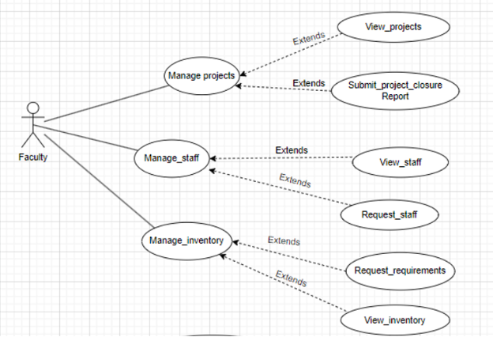
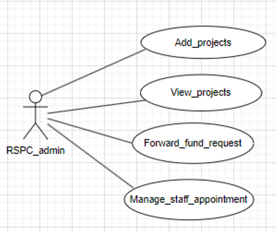
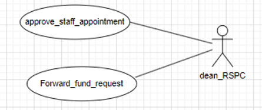
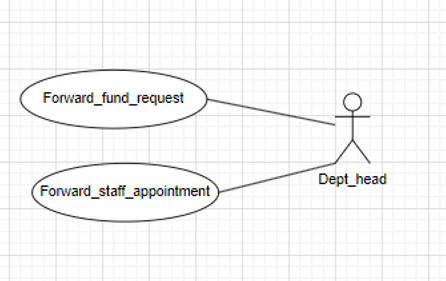
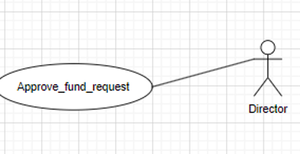

# Figma Profiles for RSPC

## 1. Module Description

The scope of the RSPC Module is to provide a platform for professors and staff members to manage their projects, achievements, conferences, book publications, etc. It also maintains their profiles and allows them to add projects and their details. The module ensures that the information added by professors and staff members is not visible to other users of the system. In addition to the specific design components of this software, this document will clarify the design team’s goals of creating value-added software that not only correctly captures faculty data but also efficiently stores, sorts, retrieves, and delivers this critical information where it is needed by the Dean and Staff.

---

## 2. Actors

### 2.1 Faculty

**Role:** Initiates the Application for Research Project

**Specific Functionalities:**

- Online apply for project registration
- Request for extension of project
- Reallocation of funds among different heads
- Request for closure of project

**Figma Link:** [View Figma Design](https://www.figma.com/file/fkiZw7fEiJjCFHYsJBIMs6/Untitled?type=design&node-id=38-2&mode=design&t=clg3niqjWfHP7i6D-0)

---

### 2.2 RSPC_ADMIN (STAFF)

**Role:** Forwards different types of applications to the DEAN RSPC.

**Specific Functionalities:**

- Forward applications to Dean RSPC based on requirements
- Manage staff appointment
- View projects
- Issue NOC

**Figma Link:** [View Figma Design](https://www.figma.com/file/fkiZw7fEiJjCFHYsJBIMs6/Untitled?type=design&node-id=38-168&mode=design&t=WcDIVx7dU51oFLlV-0)

---

### 2.3 DEAN (RSPC)

The Dean Research, Sponsored Projects, and Consultancy (RSPC) in the institute provides specialized administrative and managerial support and awareness for the operation of Sponsored Research Projects, Consultancy, Fieldwork, IPR-related issues, and facilitates all Research & Development activities in the Institute.

**Role:** Approves/rejects different types of applications or forwards them to the Director based on rights.

**Specific Functionalities:**

- Approves/rejects different types of applications
- Forwards applications to Director based on requirements

**Figma Link:** [View Figma Design](https://www.figma.com/file/4dyeYNUX7goxtOF0iqpFuN/Untitled?type=design&node-id=0-1&mode=design&t=Pom82qdfWShOKFUq-0)

---

### 2.4 HEAD OF DEPARTMENT

**Role:** Responsible for checking and forwarding different types of applications to the Dean RSPC staff.

**Specific Functionalities:**

- Forwards applications to DEAN RSPC ADMIN
- Forwards staff appointment requests

**Figma Link:** [View Figma Design](https://www.figma.com/file/4dyeYNUX7goxtOF0iqpFuN/Untitled?type=design&node-id=1-63&mode=design&t=tigI7HXlsOdBWK5J-0)

---

### 2.5 Director

**Role:** Approves project fund requests.

**Specific Functionalities:**

- Approves/rejects project fund requests

**Figma Link:** [View Figma Design](https://www.figma.com/file/nWLmLnvpPnQYceKPfSMpDa/Untitled?type=design&node-id=0%3A1&mode=design&t=bMXOrGBBtlCigcTI-1)

---

## 3. Functional Requirements

### 3.1 Use Case Diagram

*..*

### 3.2 Use Case Description

<table><tr><th valign="top"><b>UC ID</b></th><th colspan="3" valign="top">UC#1</th><th valign="top"> </th></tr>
<tr><td valign="top"><b>Use case name</b></td><td colspan="3" valign="top"><b>manage_projects</b></td><td valign="top"> </td></tr>
<tr><td valign="top"><b>Description</b></td><td colspan="3" valign="top">The "Manage Projects" use case allows the Faculty to add, view and submit closure reports of the project requests to the Fusion portal.</td><td valign="top"> </td></tr>
<tr><td valign="top"><b>Actor</b></td><td colspan="3" valign="top">Faculty</td><td valign="top"> </td></tr>
<tr><td valign="top"><b>Precondition</b></td><td colspan="3" valign="top">The Faculty is logged into the system.</td><td valign="top"> </td></tr>
<tr><td rowspan="5" valign="top"><b>Main Flow</b></td><td valign="top">1</td><td colspan="2" valign="top">`   `The Faculty navigates to the "Manage Projects" section.</td><td valign="top"> </td></tr>
<tr><td valign="top">2</td><td colspan="2" valign="top">The system displays the “Add Projects”, ”View Projects”, “Submit Project Closure Report” sections.</td><td valign="top"> </td></tr>
<tr><td valign="top">3</td><td colspan="2" valign="top">The Faculty can navigate to the “Add Projects” section and add a new project by providing the details.  [A1]</td><td valign="top"> </td></tr>
<tr><td valign="top">4</td><td colspan="2" valign="top">The Faculty can navigate to the “View Projects” section and view the completed project details.</td><td valign="top"> </td></tr>
<tr><td valign="top">5</td><td colspan="2" valign="top">The Faculty can navigate to the “Submit Project Closure Report” section and submit the closure report of a pending project. [A1]</td><td valign="top"> </td></tr>
<tr><td valign="top"><b>Post conditions</b></td><td colspan="3" valign="top">The Faculty is navigated to “Add Projects” or ”View Projects” or “Submit Project Closure Report” sections .</td><td valign="top"> </td></tr>
<tr><td valign="top"><b>Alternate Flow</b></td><td valign="top">`  `A1</td><td valign="top">1</td><td valign="top">Faculty presses the cancel button while filling the form .</td><td valign="top"> </td></tr>
<tr><td valign="top"><b>Sub Flow</b></td><td colspan="3" valign="top">NIL</td><td valign="top"> </td></tr>
<tr><td valign="top"><b>Global Alternate Flow</b></td><td valign="top">GA</td><td colspan="2" valign="top">If a technical error occurs during the execution of any action (e.g., database failure, server issues), the system displays an error message and logs the incident.</td><td valign="top">
 

 

 

 

 
</td></tr>
<tr><td valign="top"></td><td valign="top"></td><td valign="top"></td><td valign="top"></td><td valign="top"></td></tr>
</table>
** 
**

|**UC ID**|UC#3|||
| :- | :- | :- | :- |
|**Use case name**|**View\_projects**|||
|**Description**|The "View projects" use case allows the Faculty to view the projects for which the closure reports are submitted.|||
|**Actor**|Faculty|||
|**Precondition**|The Faculty is navigated into the “Manage projects” section.|||
|**Main Flow**|1|` `The faculty selects the “View projects” section.||
|** |2|The faculty views the projects.||
|**Post conditions**|Faculty is navigated to the “Manage Projects” Section.|||
|**Alternate Flow**|`  `A1|1|Faculty clicks on the “back” button to navigate back to the dashboard|

|**UC ID**|UC#4|||
| :- | :- | :- | :- |
|**Use case name**|**Submit project closure report**|||
|**Description**|The “Submit project closure report” use case allows the Faculty to submit closure reports for completed projects.|||
|**Actor**|Faculty|||
|**Precondition**|The Faculty is navigated into the “Manage projects” section.|||
|**Main Flow**|1|` `The faculty selects the “Submit project closure report” section.||
|** |2|The faculty is given a list of projects for which the closure reports are not submitted||
|**Post conditions**|Faculty is navigated to the “Manage Projects” Section.|||
|**Alternate Flow**|`  `A1|1|Faculty clicks on the “back” button to navigate back to the dashboard|

**

<table><tr><th valign="top"><b>UC ID</b></th><th colspan="2" valign="top">UC#5</th></tr>
<tr><td valign="top"><b>Use case name</b></td><td colspan="2" valign="top"><b>manage_staff</b></td></tr>
<tr><td valign="top"><b>Description</b></td><td colspan="2" valign="top">The "Manage staff" use case allows the Faculty to request for staff and view the already assigned staff</td></tr>
<tr><td valign="top"><b>Actor</b></td><td colspan="2" valign="top">Faculty</td></tr>
<tr><td valign="top"><b>Precondition</b></td><td colspan="2" valign="top">The Faculty is logged into the system.</td></tr>
<tr><td rowspan="4" valign="top"><b>Main Flow</b></td><td valign="top">1</td><td valign="top">`   `The Faculty navigates to the "Manage staff" section.</td></tr>
<tr><td valign="top">2</td><td valign="top">The system displays the “View staff”, ”Request staff”, sections.</td></tr>
<tr><td valign="top">3</td><td valign="top">The Faculty can navigate to the “View staff” section to view staff of existing projects</td></tr>
<tr><td valign="top">4</td><td valign="top">The Faculty can navigate to the “Request staff” section and request for staff</td></tr>
<tr><td valign="top"><b>Post conditions</b></td><td colspan="2" valign="top">The Faculty is navigated to “View staff” or ”Request staff”, sections .</td></tr>
</table>
**

|**UC ID**|UC#6|||
| :- | :- | :- | :- |
|**Use case name**|**View\_staff**|||
|**Description**|The "View staff" use case allows the Faculty to view the existing staff for the projects.|||
|**Actor**|Faculty|||
|**Precondition**|The Faculty is navigated into the “Manage staff” section.|||
|**Main Flow**|1|` `The faculty selects the “View staff” section.||
|** |2|The faculty views the staff assigned to the projects.||
|**Post conditions**|Faculty is navigated to the “Manage staff” Section.|||
|**Alternate Flow**|`  `A1|1|Faculty clicks on the “back” button to navigate back to the dashboard|

|**UC ID**|UC#7|||
| :- | :- | :- | :- |
|**Use case name**|**Request\_staff**|||
|**Description**|The "Request staff" use case allows the Faculty to request staff for the projects.|||
|**Actor**|Faculty|||
|**Precondition**|The Faculty is navigated into the “Manage staff” section.|||
|**Main Flow**|1|` `The faculty selects the “Request staff” section.||
|** |2|The faculty requests the staff.||
|**Post conditions**|Faculty is navigated to the “Manage staff” Section.|||
|**Alternate Flow**|`  `A1|1|Faculty clicks on the “back” button to navigate back to the dashboard|

<table><tr><th valign="top"><b>UC ID</b></th><th colspan="2" valign="top">UC#8</th></tr>
<tr><td valign="top"><b>Use case name</b></td><td colspan="2" valign="top"><b>manage_inventory</b></td></tr>
<tr><td valign="top"><b>Description</b></td><td colspan="2" valign="top">The "Manage inventory" use case allows the Faculty to request for funds and view the already allocated funds.</td></tr>
<tr><td valign="top"><b>Actor</b></td><td colspan="2" valign="top">Faculty</td></tr>
<tr><td valign="top"><b>Precondition</b></td><td colspan="2" valign="top">The Faculty is logged into the system.</td></tr>
<tr><td rowspan="4" valign="top"><b>Main Flow</b></td><td valign="top">1</td><td valign="top">`   `The Faculty navigates to the "Manage inventory" section.</td></tr>
<tr><td valign="top">2</td><td valign="top">The system displays the “View inventory”, ”Request requirements”, sections.</td></tr>
<tr><td valign="top">3</td><td valign="top">The Faculty can navigate to the “View inventory” section to view inventory of existing projects</td></tr>
<tr><td valign="top">4</td><td valign="top">The Faculty can navigate to the “Request requirements” section and request for requirements(funds).</td></tr>
<tr><td valign="top"><b>Post conditions</b></td><td colspan="2" valign="top">The Faculty is navigated to “View inventory” or ”Request requirements”, section .</td></tr>
</table>
**

|**UC ID**|UC#9|||
| :- | :- | :- | :- |
|**Use case name**|**View\_inventory**|||
|**Description**|The "View inventory" use case allows the Faculty to view the existing inventory for the projects.|||
|**Actor**|Faculty|||
|**Precondition**|The Faculty is navigated into the “Manage inventory” section.|||
|**Main Flow**|1|` `The faculty selects the “View inventory” section.||
|** |2|The faculty views the inventory allocated to the projects.||
|**Post conditions**|Faculty is navigated to the “Manage inventory” Section.|||
|**Alternate Flow**|`  `A1|1|Faculty clicks on the “back” button to navigate back to the dashboard|

|**UC ID**|UC#10|||
| :- | :- | :- | :- |
|**Use case name**|**Request\_requirements**|||
|**Description**|The "Request requirements" use case allows the Faculty to request requirements for the projects.|||
|**Actor**|Faculty|||
|**Precondition**|The Faculty is navigated into the “Manage inventory” section.|||
|**Main Flow**|1|` `The faculty selects the “Request requirements” section.||
|** |2|The faculty requests the requirements or funds.||
|**Post conditions**|Faculty is navigated to the “Manage inventory” Section.|||
|**Alternate Flow**|`  `A1|1|Faculty clicks on the “back” button to navigate back to the dashboard|

<table><tr><th valign="top"><b>UC ID</b></th><th colspan="3" valign="top">UC#11</th></tr>
<tr><td valign="top"><b>Use case name</b></td><td colspan="3" valign="top"><b>view_projects</b></td></tr>
<tr><td valign="top"><b>Description</b></td><td colspan="3" valign="top">The "View Projects" use case allows the RSPC admin to  view  projects submitted by faculty.</td></tr>
<tr><td valign="top"><b>Actor</b></td><td colspan="3" valign="top">Rspc Admin</td></tr>
<tr><td valign="top"><b>Precondition</b></td><td colspan="3" valign="top">The Rspc Admin is logged in into the system.</td></tr>
<tr><td rowspan="2" valign="top"><b>Main Flow</b></td><td valign="top">1</td><td colspan="2" valign="top">The Rspc Admin navigates to the "View Projects" section.</td></tr>
<tr><td valign="top">2</td><td colspan="2" valign="top">The system displays the list of ongoing and closed projects.</td></tr>
<tr><td valign="top"><b>Post conditions</b></td><td colspan="3" valign="top">The Rspc Admin is able to view projects list</td></tr>
<tr><td rowspan="2" valign="top"><b>Alternate Flow</b></td><td rowspan="2" valign="top">A1</td><td valign="top">1</td><td valign="top">Rspc Admin clicks on back which navigates to dashboard</td></tr>
<tr><td valign="top">2</td><td valign="top"> </td></tr>
</table>
**

<table><tr><th valign="top"><b>UC ID</b></th><th colspan="3" valign="top">UC#12</th></tr>
<tr><td valign="top"><b>Use case name</b></td><td colspan="3" valign="top"><b>Forward_fund_request</b></td></tr>
<tr><td valign="top"><b>Description</b></td><td colspan="3" valign="top">The "Forward_fund_request" use case allows the RSPC admin to  forward fund requests of projects submitted by faculty to dean RSPC.</td></tr>
<tr><td valign="top"><b>Actor</b></td><td colspan="3" valign="top">Rspc Admin</td></tr>
<tr><td valign="top"><b>Precondition</b></td><td colspan="3" valign="top">The Rspc Admin is logged in into the system.</td></tr>
<tr><td rowspan="2" valign="top"><b>Main Flow</b></td><td valign="top">1</td><td colspan="2" valign="top">The Rspc Admin navigates to the "Forward_fund_request" section.</td></tr>
<tr><td valign="top">2</td><td colspan="2" valign="top">The system displays the list of fund requests.</td></tr>
<tr><td valign="top"> </td><td valign="top">3</td><td colspan="2" valign="top">Forwards to Dean RSPCon clicking forward button</td></tr>
<tr><td valign="top"><b>Post conditions</b></td><td colspan="3" valign="top">The Rspc Admin is able to view projects fund request list and able to forward to Dean RSPC</td></tr>
<tr><td valign="top"><b>Alternate Flow</b></td><td valign="top">A1</td><td valign="top">1</td><td valign="top">Rspc Admin clicks on back which navigates to dashboard</td></tr>
</table>

<table><tr><th valign="top"><b>UC ID</b></th><th colspan="3" valign="top">UC#13</th></tr>
<tr><td valign="top"><b>Use case name</b></td><td colspan="3" valign="top"><b>manage_staff_appointment</b></td></tr>
<tr><td valign="top"><b>Description</b></td><td colspan="3" valign="top">The "manage_staff-appointment" use case allows the RSPC admin to  staff requests of projects submitted by faculty to dean RSPC..</td></tr>
<tr><td valign="top"><b>Actor</b></td><td colspan="3" valign="top">Rspc Admin</td></tr>
<tr><td valign="top"><b>Precondition</b></td><td colspan="3" valign="top">The Rspc Admin is logged in into the system.</td></tr>
<tr><td rowspan="2" valign="top"><b>Main Flow</b></td><td valign="top">1</td><td colspan="2" valign="top">The Rspc Admin navigates to the "manage_staff-appointment" section.</td></tr>
<tr><td valign="top">2</td><td colspan="2" valign="top">The system displays the list of approved projects.</td></tr>
<tr><td valign="top"> </td><td valign="top">3</td><td colspan="2" valign="top">Forwards to Dean RSPC on clicking forward button</td></tr>
<tr><td valign="top"><b>Post conditions</b></td><td colspan="3" valign="top">The Rspc Admin is able to view staff requests list</td></tr>
<tr><td rowspan="2" valign="top"><b>Alternate Flow</b></td><td rowspan="2" valign="top">A1</td><td valign="top">1</td><td valign="top">Rspc Admin clicks on back which navigates to dashboard</td></tr>
<tr><td valign="top">2</td><td valign="top"> </td></tr>
</table>
**

|**UC ID**|UC#2|||
| :- | :- | :- | :- |
|**Use case name**|**Add\_projects**|||
|**Description**|The "Add Projects" use case allows the Rspc Admin  to add projects to the Fusion portal.|||
|**Actor**|Rspc Admin|||
|**Precondition**|The Rspc Admin is logged in into the system.|||
|**Main Flow**|1|`   `Rspc Admin selects the “Add Projects” section.||
|** |2|` `Rspc Admin need to fill the form and can submit it.||
|**Post conditions**|Rspc Admin has added a project|||
|**Alternate Flow**|`  `A1|1|Rspc Admin clicks on back which navigates to dashboard|
|**Sub Flow**|NIL|||
|**Global Alternate Flow**|GA|If a technical error occurs during the execution of any action (e.g., database failure, server issues), the system displays an error message and logs the incident.||

**

**

**

<table><tr><th valign="top"><b>UC ID</b></th><th colspan="3" valign="top">UC#15</th><th valign="top"> </th></tr>
<tr><td valign="top"><b>Use case name</b></td><td colspan="3" valign="top"><b>forward_staff_appointment</b></td><td valign="top"> </td></tr>
<tr><td valign="top"><b>Description</b></td><td colspan="3" valign="top">The "forward_staff_appointment" use case allows the Department head to forward staff appointment requests.</td><td valign="top"> </td></tr>
<tr><td valign="top"><b>Actor</b></td><td colspan="3" valign="top">Department head</td><td valign="top"> </td></tr>
<tr><td valign="top"><b>Precondition</b></td><td colspan="3" valign="top">The Department head is logged in into the system.</td><td valign="top"> </td></tr>
<tr><td rowspan="2" valign="top"><b>Main Flow</b></td><td valign="top">1</td><td colspan="2" valign="top">The system displays the “Forward staff appointment”, and “Forward fund requests” sections.</td><td valign="top"> </td></tr>
<tr><td valign="top">2</td><td colspan="2" valign="top">The Department head can navigate to the “Forward staff appointment” section and forward the staff appointment request for approval.</td><td valign="top"> </td></tr>
<tr><td valign="top"><b>Post conditions</b></td><td colspan="3" valign="top">The Department head has forwarded the staff appointment requests</td><td valign="top"> </td></tr>
<tr><td rowspan="2" valign="top"><b>Alternate Flow</b></td><td valign="top">A1</td><td valign="top">1</td><td valign="top">Department head clicks on the “back” which navigates to the dashboard.</td><td valign="top"> </td></tr>
<tr><td valign="top">A4</td><td valign="top">2</td><td valign="top">Department navigates to the “forward fund requests” section.</td><td valign="top"> </td></tr>
</table>
**

**

<table><tr><th valign="top"><b>UC ID</b></th><th colspan="3" valign="top">UC#16</th><th valign="top"> </th></tr>
<tr><td valign="top"><b>Use case name</b></td><td colspan="3" valign="top"><b>forward_fund_requests</b></td><td valign="top"> </td></tr>
<tr><td valign="top"><b>Description</b></td><td colspan="3" valign="top">The "forward_fund_requests" use case allows the Department head to forward fund requests.</td><td valign="top"> </td></tr>
<tr><td valign="top"><b>Actor</b></td><td colspan="3" valign="top">Department head</td><td valign="top"> </td></tr>
<tr><td valign="top"><b>Precondition</b></td><td colspan="3" valign="top">The Department head is logged in into the system.</td><td valign="top"> </td></tr>
<tr><td rowspan="2" valign="top"><b>Main Flow</b></td><td valign="top">1</td><td colspan="2" valign="top">The system displays the “Forward staff appointment”, and “Forward fund requests” sections.</td><td valign="top"> </td></tr>
<tr><td valign="top">2</td><td colspan="2" valign="top">The Department head can navigate to the “Forward fund requests” section and forward the fund requests for approval.</td><td valign="top"> </td></tr>
<tr><td valign="top"><b>Post conditions</b></td><td colspan="3" valign="top">The Department head has forwarded the fund requests</td><td valign="top"> </td></tr>
<tr><td rowspan="2" valign="top"><b>Alternate Flow</b></td><td valign="top">A1</td><td valign="top">1</td><td valign="top">Department head clicks on the “back” which navigates to the dashboard.</td><td valign="top"> </td></tr>
<tr><td valign="top">A4</td><td valign="top">2</td><td valign="top">Department navigates to the “forward staff appointment ” section.</td><td valign="top"> </td></tr>
</table>
**

<table><tr><th valign="top"><b>UC ID</b></th><th colspan="3" valign="top">UC#17</th><th valign="top"> </th></tr>
<tr><td valign="top"><b>Use case name</b></td><td colspan="3" valign="top"><b>Approve_staff_appointment</b></td><td valign="top"> </td></tr>
<tr><td valign="top"><b>Description</b></td><td colspan="3" valign="top">The "Approve_staff_appointment" use case allows the Dean RSPC to Approve staff appointment requests.</td><td valign="top"> </td></tr>
<tr><td valign="top"><b>Actor</b></td><td colspan="3" valign="top">Dean RSPC</td><td valign="top"> </td></tr>
<tr><td valign="top"><b>Precondition</b></td><td colspan="3" valign="top">The Dean RSPC is logged in into the system.</td><td valign="top"> </td></tr>
<tr><td rowspan="2" valign="top"><b>Main Flow</b></td><td valign="top">1</td><td colspan="2" valign="top">The system displays the “Approve staff appointment”, and “Forward fund requests” sections.</td><td valign="top"> </td></tr>
<tr><td valign="top">2</td><td colspan="2" valign="top">The Dean RSPC can navigate to the “Approve staff appointment” section and Approves the staff appointment request.</td><td valign="top"> </td></tr>
<tr><td valign="top"><b>Post conditions</b></td><td colspan="3" valign="top">The Dean RSPC has Approved the staff appointment requests</td><td valign="top"> </td></tr>
<tr><td rowspan="2" valign="top"><b>Alternate Flow</b></td><td valign="top">A1</td><td valign="top">1</td><td valign="top">Dean RSPC clicks on the “back” which navigates to the dashboard.</td><td valign="top"> </td></tr>
<tr><td valign="top">A4</td><td valign="top">2</td><td valign="top">Dean RSPC navigates to the “forward fund requests” section.</td><td valign="top"> </td></tr>
</table>
**

**

<table><tr><th valign="top"><b>UC ID</b></th><th colspan="3" valign="top">UC#18</th><th valign="top"> </th></tr>
<tr><td valign="top"><b>Use case name</b></td><td colspan="3" valign="top"><b>forward_fund_requests</b></td><td valign="top"> </td></tr>
<tr><td valign="top"><b>Description</b></td><td colspan="3" valign="top">The "forward_fund_requests" use case allows the Dean RSPC to forward fund requests.</td><td valign="top"> </td></tr>
<tr><td valign="top"><b>Actor</b></td><td colspan="3" valign="top">Dean RSPC</td><td valign="top"> </td></tr>
<tr><td valign="top"><b>Precondition</b></td><td colspan="3" valign="top">The Dean RSPC is logged in into the system.</td><td valign="top"> </td></tr>
<tr><td rowspan="2" valign="top"><b>Main Flow</b></td><td valign="top">1</td><td colspan="2" valign="top">The system displays the “Approve staff appointment”, and “Forward fund requests” sections.</td><td valign="top"> </td></tr>
<tr><td valign="top">2</td><td colspan="2" valign="top">The Dean RSPC can navigate to the “Forward fund requests” section and forward the fund requests for approval.</td><td valign="top"> </td></tr>
<tr><td valign="top"><b>Post conditions</b></td><td colspan="3" valign="top">The Dean RSPC has forwarded the fund requests</td><td valign="top"> </td></tr>
<tr><td rowspan="2" valign="top"><b>Alternate Flow</b></td><td valign="top">A1</td><td valign="top">1</td><td valign="top">Dean RSPC clicks on the “back” which navigates to the dashboard.</td><td valign="top"> </td></tr>
<tr><td valign="top">A4</td><td valign="top">2</td><td valign="top">Dean RSPC navigates to the “Approve staff appointment ” section.</td><td valign="top"> </td></tr>
</table>
**

<table><tr><th valign="top"><b>UC ID</b></th><th colspan="3" valign="top">UC#19</th></tr>
<tr><td valign="top"><b>Use case name</b></td><td colspan="3" valign="top"><b>Approve_fund_requests</b></td></tr>
<tr><td valign="top"><b>Description</b></td><td colspan="3" valign="top">The "Approve_fund_requests" use case allows the Director to Approve fund requests</td></tr>
<tr><td valign="top"><b>Actor</b></td><td colspan="3" valign="top">Director</td></tr>
<tr><td valign="top"><b>Precondition</b></td><td colspan="3" valign="top">The Director is logged in into the system.</td></tr>
<tr><td rowspan="2" valign="top"><b>Main Flow</b></td><td valign="top">1</td><td colspan="2" valign="top">The system displays the “Approve fund requests”.</td></tr>
<tr><td valign="top">2</td><td colspan="2" valign="top">The Director can navigate to the “Approve fund requests”.</td></tr>
<tr><td valign="top"><b>Post conditions</b></td><td colspan="3" valign="top">The Director has approved the fund  requests</td></tr>
<tr><td valign="top"><b>Alternate Flow</b></td><td valign="top">A1</td><td valign="top">1</td><td valign="top">Director clicks on the “back” which navigates to the dashboard.</td></tr>
</table>

Final Figma Link :: <https://www.figma.com/file/fkiZw7fEiJjCFHYsJBIMs6/RSPC-APP?type=design&node-id=0%3A1&mode=design&t=4hKamRrgUypDD4Ub-1>

