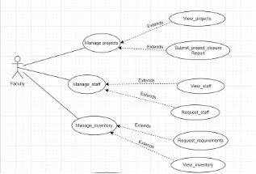
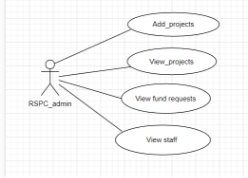
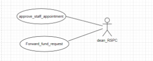
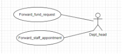
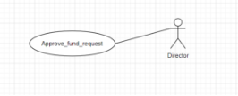

# Figma Profiles for RSPC WEB Module

## 1. Module Description

The RSPC Module is a part of the Fusion project that is responsible for maintaining the record of projects of professors, their achievements, conferences, book publications, etc. It provides a platform for professors and staff members to add projects and their details, which are not visible to other users of the system. In addition, the module also maintains the profiles of professors and staff members, which includes their projects, achievements, etc. This software is designed to manage different activities related to the Dean RSPC department of PDPM IIITDM Jabalpur. The software is designed to provide automated features to Faculty, Dean, and Staff, covering various activities under the Dean RSPC department, such as project funds, EIS, etc.

---

## 2. Actors

### 2.1 Faculty

**Role:** Initiates the Application for Research Project

**Specific Functionalities:**

- View projects
- Request for staff
- View staff
- View inventory
- Request for funds
- Request for closure of project

[View Figma Design](https://www.figma.com/proto/w2Mx7biMn2PJsYsPm7Qxdi/GAD-7?type=design&node-id=289-1560&t=CUOboRHhwtbrbAGA-0&scaling=scale-down-width&page-id=0%3A1&starting-point-node-id=289%3A1560&show-proto-sidebar=1)

---

### 2.2 RSPC_ADMIN (STAFF)

**Role:** Forwards different types of applications to the DEAN RSPC.

**Specific Functionalities:**

- Forward applications to Dean RSPC based on requirement.
- Manage staff appointment
- View projects
- Add projects

[View Figma Design](https://www.figma.com/proto/w2Mx7biMn2PJsYsPm7Qxdi/GAD-7?type=design&node-id=128-649&t=CUOboRHhwtbrbAGA-0&scaling=min-zoom&page-id=0%3A1&starting-point-node-id=128%3A649&show-proto-sidebar=1)

---

### 2.3 DEAN (RSPC)

Dean Research, Sponsored Projects and Consultancy (RSPC) in the institute provides specialized administrative and managerial support and awareness for the operation of Sponsored Research Projects, Consultancy, Fieldwork, IPR-related issues, and facilitates all Research & Development activities in the Institute.

**Role:** Approves/rejects different types of applications or forwards them to the director, depending upon the rights.

**Specific Functionalities:**

- Approves/rejects different types of applications.
- Forwards applications to the Director based on requirement.

[View Figma Design](https://www.figma.com/proto/w2Mx7biMn2PJsYsPm7Qxdi/GAD-7?type=design&node-id=11-288&t=CUOboRHhwtbrbAGA-0&scaling=min-zoom&page-id=0%3A1&starting-point-node-id=128%3A649&show-proto-sidebar=1)

---

### 2.4 HEAD OF DEPARTMENT

**Role:** Responsible for checking and forwarding different types of applications to the Dean RSPC staff.

**Specific Functionalities:**

- Forwards Applications to DEAN RSPC ADMIN
- Forwards Staff appointment requests

[View Figma Design](https://www.figma.com/proto/w2Mx7biMn2PJsYsPm7Qxdi/GAD-7?type=design&node-id=225-566&t=CUOboRHhwtbrbAGA-0&scaling=min-zoom&page-id=0%3A1&starting-point-node-id=128%3A649&show-proto-sidebar=1)

---

### 2.5 DIRECTOR

**Role:** Approves Project fund requests.

**Specific Functionalities:**

- Approves/Rejects project fund requests.

[View Figma Design](https://www.figma.com/proto/w2Mx7biMn2PJsYsPm7Qxdi/GAD-7?type=design&node-id=197-833&t=CUOboRHhwtbrbAGA-0&scaling=min-zoom&page-id=0%3A1&starting-point-node-id=128%3A649&show-proto-sidebar=1)

---

## Figma File (Designs) Link

[View Figma File](https://www.figma.com/file/w2Mx7biMn2PJsYsPm7Qxdi/GAD-7?type=design&node-id=197-833&mode=design&t=CUOboRHhwtbrbAGA-0)

---
