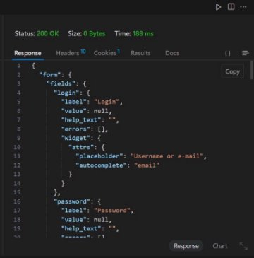
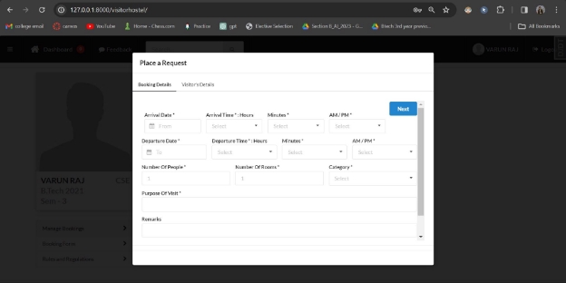
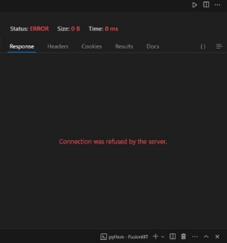
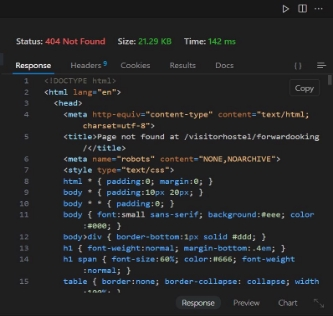
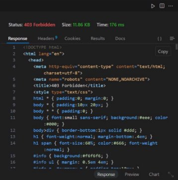
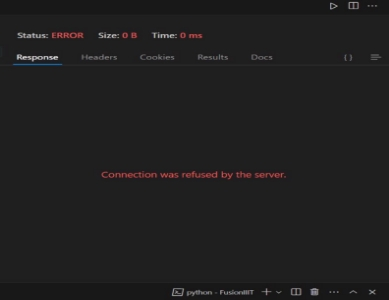
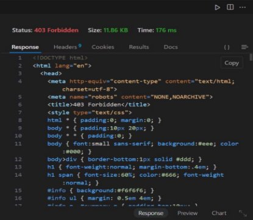

# Visitor Hostel Module

**Student Mentor:** Deepanshu Kumar (21BCS072)

---

## Team Members

- **Sparsh Ranjan (21BCS205)**
- **Varun Raj (21BCS236)**
- **Avneesh Dayal (21BCS046)**
- **Azemera Vishnu Nayak (21BCS051)**
- **Sahil Chauksey (21BCS181)**

---

## API Overview

### All the APIs used in the module:

1. Methods for booking
2. Check status
3. Getting booking form
4. Request booking
5. Update booking
6. Confirm booking by VH In-charge
7. Cancel booking by VH In-charge
8. Cancel confirmed booking by intender
9. Cancel booking request
10. Reject booking request
11. Guest check-in view
12. Guest check-out view
13. Record meal
14. Generate bill
15. Room availability details
16. Add to inventory details
17. Booking details

### Overview of the Module

According to the overview by our team, we found that the basic login credentials of the global API are missing, and we cannot check the drilling API.

The above explained 17 APIs have some potential errors, such as 404 errors, forbidden access, and dependency problems. We need to make many changes to the APIs, and some APIs are very poorly implemented, requiring us to rewrite them from scratch. Additionally, due to the dependencies with the database, the earlier team has created too many databases for single tasks, which need to be corrected.

---

## APIs

### Already Implemented API

#### Req_for_booking

The Intender will be able to book room(s) in the VH. The Intender has to fill the form in the required format and submit it for further processing.

- **Database:** `get_booking_requests`

**API Status:** Working

---

### Partially Implemented APIs

#### Check_status

After submitting a booking request, the room Intender can check if the booking is confirmed, pending, or canceled.

- **Database:** No table created
- **Status Code:** 500 (Internal Server Error)

---

#### Cancel_booking

Intenders will be able to cancel their booking of room(s) in the VH with remarks.

- **Database:** No table created
- **Status Code:** 404 (Not Found)

---

#### Check_availability

The VH caretaker will be able to check the current occupancy of VH.

- **Database:** No table created
- **Status Code:** 403 (Forbidden)

---

#### Allot_rooms

The caretaker will allot rooms according to availability.

- **Database:** No table created
- **Status Code:** 404 (Not Found)

---

#### Manage_guest_check_in

The VH caretaker will be able to mark the check-in status of a booked VH room.

- **Status Code:** 403 (Forbidden)

---

#### Manage_guest_check_out

The VH caretaker will be able to initiate the process of checkout on the system regarding bill clearance and room status update.

- **Database:** No table created
- **Status Code:** 404 (Not Found)

---

### APIs Yet to be Implemented from Scratch

- **manage_noTurnUp:** The system will notify the VH caretaker/VH in-charge about guests who didn’t turn up. The VH caretaker can take actions as deemed fit.
- **Manage_bill_settlement:** VH caretaker checks if the bill is paid by the intender/guest, collects the money according to the bill, and updates the system accordingly.
- **Manage_inventory:** VH caretaker will manage the inventory of the VH.
- **Get_low_on_stock_alerts:** VH caretaker will get alerts when any inventory item quantity falls below a pre-decided threshold.
- **Update_consumption:** The VH caretaker will periodically update the system with the quantity of items consumed.
- **View_bookings:** The VH in-charge will be able to check the booking history and current occupancy of VH.
- **Confirm_booking:** VH in-charge will grant confirmation of the booking after verifying the information provided in the application.
- **Reject_booking:** VH in-charge will be able to reject any booking of room(s) in VH with remarks.

---

## Current Problems Facing the Module or in Its Use Cases

### Existing API Issues:

- **Missing login credentials:** Cannot access or verify the global API.
- **Drilling API inaccessible:** Limits functionality and data analysis.
- **Error-prone APIs:** Frequent 400, 403, and 500 errors indicate instability and potential data inconsistencies.
- **Database redundancy:** Multiple databases for single tasks complicate maintenance and increase error risk.

### Incomplete APIs:

- **Partially implemented APIs:** Missing functionality in Check_status, Cancel_booking, Check_availability, Allot_rooms, Manage_guest_check_in, and Manage_guest_check_out APIs hinder workflow.

### Missing APIs:

- **Critical functionality gaps:** Lack of manage_noTurnUp, Manage_bill_settlement, Manage_inventory, Get_low_on_stock_alerts, Update_consumption, and View_bookings APIs limit caretaker and in-charge capabilities.

---

Overall, the module suffers from inadequate security, unstable functionality, and incomplete features, significantly impacting its usability and reliability.
