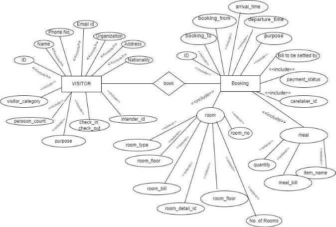

# Module Name: Visitor Hostel Module

**Faculty Mentor:** Prof. Sraban Kumar Mohanty  
**Student Mentor:** Deepanshu Kumar (21BCS072)

## Team Members
- Avneesh Dayal (21BCS046)
- Azemera Vishnu Nayak (21BCS051)
- Sahil Chauksey (21BCS181)
- Sparsh Ranjan (21BCS205)
- Varun Raj (21BCS236)

---

## Database Documentation of [OS1 - Visitor Hostel Module] 4.0

## Overview of the Module

### SRS
[Software Requirements Specification (SRS)](https://docs.google.com/document/d/14WZh8l8T8z2mtlWU4mQ7FvhPILYn098C/edit?usp=drive_link&ouid=118421111030779763003&rtpof=true&sd=true)

---

## A. ER Diagram

[View ER Diagram](https://drive.google.com/file/d/1n7_3c8hHPh4B1F-oyvBF3PrmJWkIxj7p/view)

---

## B. Database Schema

[View Database Schema](https://docs.google.com/spreadsheets/d/1Su3ap2mt32KQqCzuvUQheOCXWebTRaZd/edit#gid=1327478253)

---

|**Table Name**|**Attribute Name**|**Attribute Data Type**|**Purpose**|
**Table Current Status (Local / Global)**

**(Local if the table is used only in current**

**module and Global if used in more than one**

**modules)**
|
**Referenced\_Table (Referenced\_Attribute)**

**(If the attribute is Foreign key then write**

**Referenced\_tablename(Referenced\_attribute)**

**otherwise write N/A )**
|
**Is Redundant (Yes / No)**

**(An attribute is considered redundant**

**if it can be derived from any other**

**attribute or set of attributes)**
|**Comments**|
| :-: | :-: | :-: | :-: | :-: | :-: | :-: | :-: |

<table><tr><th rowspan="6"><b>visitor_hostel_bill</b></th><th valign="bottom"><b>id</b></th><th valign="bottom"><b>INT</b></th><th valign="bottom"><b>Primary key</b></th><th rowspan="6"><b>Local</b></th><th valign="bottom"><b>N/A</b></th><th valign="bottom"><b>No</b></th><th valign="bottom"></th></tr>
<tr><td valign="bottom"><b>meal_bill</b></td><td valign="bottom"><b>INT</b></td><td valign="bottom"><b>bill of meal</b></td><td valign="bottom"><b>N/A</b></td><td valign="bottom"><b>No</b></td><td valign="bottom"></td></tr>
<tr><td valign="bottom"><b>room_bill</b></td><td valign="bottom"><b>INT</b></td><td valign="bottom"><b>bill of room</b></td><td valign="bottom"><b>N/A</b></td><td valign="bottom"><b>No</b></td><td valign="bottom"></td></tr>
<tr><td valign="bottom"><b>payment_status</b></td><td valign="bottom"><b>BOOLEAN</b></td><td valign="bottom"><b>yes or no</b></td><td valign="bottom"><b>N/A</b></td><td valign="bottom"><b>No</b></td><td valign="bottom"></td></tr>
<tr><td valign="bottom"><b>booking_id</b></td><td valign="bottom"><b>INT</b></td><td valign="bottom"><b>id of booking</b></td><td valign="bottom"><b>visitor_hostel_bookingdetail (id)</b></td><td valign="bottom"><b>No</b></td><td valign="bottom"></td></tr>
<tr><td valign="bottom"><b>caretaker_id</b></td><td valign="bottom"><b>INT</b></td><td valign="bottom"><b>id of caretaker</b></td><td valign="bottom"><b>auth_user (id)</b></td><td valign="bottom"><b>No</b></td><td valign="bottom"></td></tr>
<tr><td valign="bottom"></td><td valign="bottom"></td><td valign="bottom"></td><td valign="bottom"></td><td></td><td valign="bottom"></td><td valign="bottom"></td><td valign="bottom"></td></tr>
<tr><td rowspan="3"><b>visitor_hostel_bill_room</b></td><td valign="bottom"><b>id</b></td><td valign="bottom"><b>INT</b></td><td valign="bottom"><b>Primary key</b></td><td rowspan="3"><b>Local</b></td><td valign="bottom"><b>N/A</b></td><td valign="bottom"><b>No</b></td><td valign="bottom"></td></tr>
<tr><td valign="bottom"><b>bill_id</b></td><td valign="bottom"><b>INT</b></td><td valign="bottom"><b>id of bill</b></td><td valign="bottom"><b>visitor_hostel_bill (id)</b></td><td valign="bottom"><b>No</b></td><td valign="bottom"></td></tr>
<tr><td valign="bottom"><b>roomdetail_id</b></td><td valign="bottom"><b>INT</b></td><td valign="bottom"><b>id of room booked</b></td><td valign="bottom"><b>visitor_hostel_roomdetail (id)</b></td><td valign="bottom"><b>No</b></td><td valign="bottom"></td></tr>
<tr><td valign="bottom"></td><td valign="bottom"></td><td valign="bottom"></td><td valign="bottom"></td><td></td><td valign="bottom"></td><td valign="bottom"></td><td valign="bottom"></td></tr>
<tr><td rowspan="24"><b>visitor_hostel_bookingdetail</b></td><td valign="bottom"><b>id</b></td><td valign="bottom"><b>INT</b></td><td valign="bottom"><b>Primary key</b></td><td rowspan="24"><b>Local</b></td><td valign="bottom"><b>N/A</b></td><td valign="bottom"><b>No</b></td><td valign="bottom"></td></tr>
<tr><td valign="bottom"><b>visitor_category</b></td><td valign="bottom"><b>VARCHAR (1)</b></td><td valign="bottom"><b>category of visitor</b></td><td valign="bottom"><b>N/A</b></td><td valign="bottom"><b>No</b></td><td valign="bottom"></td></tr>
<tr><td valign="bottom"><b>modified_visitor_category</b></td><td valign="bottom"><b>VARCHAR (1)</b></td><td valign="bottom"><b>modified category of visitor</b></td><td valign="bottom"><b>N/A</b></td><td valign="bottom"><b>No</b></td><td valign="bottom"></td></tr>
<tr><td valign="bottom"><b>person_count</b></td><td valign="bottom"><b>INT</b></td><td valign="bottom"><b>number of persons</b></td><td valign="bottom"><b>N/A</b></td><td valign="bottom"><b>No</b></td><td valign="bottom"></td></tr>
<tr><td valign="bottom"><b>purpose</b></td><td valign="bottom"><b>TEXT</b></td><td valign="bottom"><b>purpose of visit</b></td><td valign="bottom"><b>N/A</b></td><td valign="bottom"><b>No</b></td><td valign="bottom"></td></tr>
<tr><td valign="bottom"><b>booking_from</b></td><td valign="bottom"><b>DATE</b></td><td valign="bottom"><b>date of booking from</b></td><td valign="bottom"><b>N/A</b></td><td valign="bottom"><b>No</b></td><td valign="bottom"></td></tr>
<tr><td valign="bottom"><b>booking_to</b></td><td valign="bottom"><b>DATE</b></td><td valign="bottom"><b>date of booking to</b></td><td valign="bottom"><b>N/A</b></td><td valign="bottom"><b>No</b></td><td valign="bottom"></td></tr>
<tr><td valign="bottom"><b>arruval_time</b></td><td valign="bottom"><b>TEXT</b></td><td valign="bottom"><b>time of arrival of visit</b></td><td valign="bottom"><b>N/A</b></td><td valign="bottom"><b>No</b></td><td valign="bottom"></td></tr>
<tr><td valign="bottom"><b>departure_time</b></td><td valign="bottom"><b>TEXT</b></td><td valign="bottom"><b>time of departure of visit</b></td><td valign="bottom"><b>N/A</b></td><td valign="bottom"><b>No</b></td><td valign="bottom"></td></tr>
<tr><td valign="bottom"><b>forwarded_date</b></td><td valign="bottom"><b>DATE</b></td><td valign="bottom"><b>date of forwarded visit</b></td><td valign="bottom"><b>N/A</b></td><td valign="bottom"><b>No</b></td><td valign="bottom"></td></tr>
<tr><td valign="bottom"><b>confirmed_date</b></td><td valign="bottom"><b>DATE</b></td><td valign="bottom"><b>date of confirmed visit</b></td><td valign="bottom"><b>N/A</b></td><td valign="bottom"><b>No</b></td><td valign="bottom"></td></tr>
<tr><td valign="bottom"><b>check_in</b></td><td valign="bottom"><b>DATE</b></td><td valign="bottom"><b>check in date</b></td><td valign="bottom"><b>N/A</b></td><td valign="bottom"><b>No</b></td><td valign="bottom"></td></tr>
<tr><td valign="bottom"><b>check_out</b></td><td valign="bottom"><b>DATE</b></td><td valign="bottom"><b>check out date</b></td><td valign="bottom"><b>N/A</b></td><td valign="bottom"><b>No</b></td><td valign="bottom"></td></tr>
<tr><td valign="bottom"><b>check_in_time</b></td><td valign="bottom"><b>TIME</b></td><td valign="bottom"><b>check in time</b></td><td valign="bottom"><b>N/A</b></td><td valign="bottom"><b>No</b></td><td valign="bottom"></td></tr>
<tr><td valign="bottom"><b>check_out_time</b></td><td valign="bottom"><b>TIME</b></td><td valign="bottom"><b>check out time</b></td><td valign="bottom"><b>N/A</b></td><td valign="bottom"><b>No</b></td><td valign="bottom"></td></tr>
<tr><td valign="bottom"><b>status</b></td><td valign="bottom"><b>VARCHAR (15)</b></td><td valign="bottom"><b>status of room booked</b></td><td valign="bottom"><b>N/A</b></td><td valign="bottom"><b>No</b></td><td valign="bottom"></td></tr>
<tr><td valign="bottom"><b>remark</b></td><td valign="bottom"><b>VARCHAR (40)</b></td><td valign="bottom"><b>remark</b></td><td valign="bottom"><b>N/A</b></td><td valign="bottom"><b>No</b></td><td valign="bottom"></td></tr>
<tr><td valign="bottom"><b>image</b></td><td valign="bottom"><b>VARCHAR (100)</b></td><td valign="bottom"><b>image</b></td><td valign="bottom"><b>N/A</b></td><td valign="bottom"><b>No</b></td><td valign="bottom"></td></tr>
<tr><td valign="bottom"><b>number_of_rooms</b></td><td valign="bottom"><b>INT</b></td><td valign="bottom"><b>no. of rooms booked</b></td><td valign="bottom"><b>N/A</b></td><td valign="bottom"><b>No</b></td><td valign="bottom"></td></tr>
<tr><td valign="bottom"><b>number_of_rooms_alloted</b></td><td valign="bottom"><b>INT</b></td><td valign="bottom"><b>no. of rooms alloted</b></td><td valign="bottom"><b>N/A</b></td><td valign="bottom"><b>No</b></td><td valign="bottom"></td></tr>
<tr><td valign="bottom"><b>booking_date</b></td><td valign="bottom"><b>DATE</b></td><td valign="bottom"><b>date of booking</b></td><td valign="bottom"><b>N/A</b></td><td valign="bottom"><b>No</b></td><td valign="bottom"></td></tr>
<tr><td valign="bottom"><b>bill_to_be_settled_by</b></td><td valign="bottom"><b>VARCHAR (1)</b></td><td valign="bottom"><b>bill to be settled by</b></td><td valign="bottom"><b>N/A</b></td><td valign="bottom"><b>No</b></td><td valign="bottom"></td></tr>
<tr><td valign="bottom"><b>caretaker_id</b></td><td valign="bottom"><b>INT</b></td><td valign="bottom"><b>id of caretaker</b></td><td valign="bottom"><b>auth_user (id)</b></td><td valign="bottom"><b>No</b></td><td valign="bottom"></td></tr>
<tr><td valign="bottom"><b>intender_id</b></td><td valign="bottom"><b>INT</b></td><td valign="bottom"><b>id of intender</b></td><td valign="bottom"><b>auth_user (id)</b></td><td valign="bottom"><b>No</b></td><td valign="bottom"></td></tr>
<tr><td valign="bottom"></td><td valign="bottom"></td><td valign="bottom"></td><td valign="bottom"></td><td valign="bottom"></td><td valign="bottom"></td><td valign="bottom"></td><td valign="bottom"></td></tr>
<tr><td rowspan="3"><b>visitor_hostel_bookingdetail_rooms</b></td><td valign="bottom"><b>id</b></td><td valign="bottom"><b>INT</b></td><td valign="bottom"><b>Primary key</b></td><td rowspan="3"><b>Local</b></td><td valign="bottom"><b>N/A</b></td><td valign="bottom"><b>No</b></td><td valign="bottom"></td></tr>
<tr><td valign="bottom"><b>bookingdetail_id</b></td><td valign="bottom"><b>INT</b></td><td valign="bottom"><b>id of booking</b></td><td valign="bottom"><b>visitor_hostel_bookingdetail (id)</b></td><td valign="bottom"><b>No</b></td><td valign="bottom"></td></tr>
<tr><td valign="bottom"><b>roomdetail_id</b></td><td valign="bottom"><b>INT</b></td><td valign="bottom"><b>id of room booked</b></td><td valign="bottom"><b>visitor_hostel_roomdetail (id)</b></td><td valign="bottom"><b>No</b></td><td valign="bottom"></td></tr>
<tr><td valign="bottom"></td><td valign="bottom"></td><td valign="bottom"></td><td valign="bottom"></td><td valign="bottom"></td><td valign="bottom"></td><td valign="bottom"></td><td valign="bottom"></td></tr>
<tr><td rowspan="3"><b>visitor_hostel_bookingdetail_visitor</b></td><td valign="bottom"><b>id</b></td><td valign="bottom"><b>INT</b></td><td valign="bottom"><b>Primary key</b></td><td rowspan="3"><b>Local</b></td><td valign="bottom"><b>N/A</b></td><td valign="bottom"><b>No</b></td><td valign="bottom"></td></tr>
<tr><td valign="bottom"><b>bookingdetail_id</b></td><td valign="bottom"><b>INT</b></td><td valign="bottom"><b>id of booking</b></td><td valign="bottom"><b>visitor_hostel_bookingdetail (id)</b></td><td valign="bottom"><b>No</b></td><td valign="bottom"></td></tr>
<tr><td valign="bottom"><b>roomdetail_id</b></td><td valign="bottom"><b>INT</b></td><td valign="bottom"><b>id of room booked</b></td><td valign="bottom"><b>visitor_hostel_visitordetail (id)</b></td><td valign="bottom"><b>No</b></td><td valign="bottom"></td></tr>
<tr><td valign="bottom"></td><td valign="bottom"></td><td valign="bottom"></td><td valign="bottom"></td><td valign="bottom"></td><td valign="bottom"></td><td valign="bottom"></td><td valign="bottom"></td></tr>
<tr><td rowspan="12"><b>visitor_hostel_inventory</b></td><td valign="bottom"><b>id</b></td><td valign="bottom"><b>INT</b></td><td valign="bottom"><b>Primary key</b></td><td rowspan="12"><b>Local</b></td><td valign="bottom"><b>N/A</b></td><td valign="bottom"><b>No</b></td><td valign="bottom"></td></tr>
<tr><td valign="bottom"><b>item_name</b></td><td valign="bottom"><b>VARCHAR (20)</b></td><td valign="bottom"><b>name of item</b></td><td valign="bottom"><b>N/A</b></td><td valign="bottom"><b>No</b></td><td valign="bottom"></td></tr>
<tr><td valign="bottom"><b>quantity</b></td><td valign="bottom"><b>INT</b></td><td valign="bottom"><b>quantity of items</b></td><td valign="bottom"><b>N/A</b></td><td valign="bottom"><b>No</b></td><td valign="bottom"></td></tr>
<tr><td valign="bottom"><b>consumable</b></td><td valign="bottom"><b>BOOLEAN</b></td><td valign="bottom"><b>yes or no</b></td><td valign="bottom"><b>N/A</b></td><td valign="bottom"><b>No</b></td><td valign="bottom"></td></tr>
<tr><td valign="bottom"><b>opening_stock</b></td><td valign="bottom"><b>INT</b></td><td valign="bottom"><b>no. of opening stock</b></td><td valign="bottom"><b>N/A</b></td><td valign="bottom"><b>No</b></td><td valign="bottom"></td></tr>
<tr><td valign="bottom"><b>addition_stock</b></td><td valign="bottom"><b>INT</b></td><td valign="bottom"><b>no. of addition stock</b></td><td valign="bottom"><b>N/A</b></td><td valign="bottom"><b>No</b></td><td valign="bottom"></td></tr>
<tr><td valign="bottom"><b>total_stock</b></td><td valign="bottom"><b>INT</b></td><td valign="bottom"><b>total no. of stock</b></td><td valign="bottom"><b>N/A</b></td><td valign="bottom"><b>No</b></td><td valign="bottom"></td></tr>
<tr><td valign="bottom"><b>servicable</b></td><td valign="bottom"><b>INT</b></td><td valign="bottom"><b>no. of servicable items</b></td><td valign="bottom"><b>N/A</b></td><td valign="bottom"><b>No</b></td><td valign="bottom"></td></tr>
<tr><td valign="bottom"><b>non_servicable</b></td><td valign="bottom"><b>INT</b></td><td valign="bottom"><b>no. of non servicable items</b></td><td valign="bottom"><b>N/A</b></td><td valign="bottom"><b>No</b></td><td valign="bottom"></td></tr>
<tr><td valign="bottom"><b>inuse</b></td><td valign="bottom"><b>INT</b></td><td valign="bottom"><b>no. of inuse items</b></td><td valign="bottom"><b>N/A</b></td><td valign="bottom"><b>No</b></td><td valign="bottom"></td></tr>
<tr><td valign="bottom"><b>total_usable</b></td><td valign="bottom"><b>INT</b></td><td valign="bottom"><b>total no. of usable items</b></td><td valign="bottom"><b>N/A</b></td><td valign="bottom"><b>No</b></td><td valign="bottom"></td></tr>
<tr><td valign="bottom"><b>remark</b></td><td valign="bottom"><b>TEXT</b></td><td valign="bottom"><b>remark</b></td><td valign="bottom"><b>N/A</b></td><td valign="bottom"><b>No</b></td><td valign="bottom"></td></tr>
<tr><td valign="bottom"></td><td valign="bottom"></td><td valign="bottom"></td><td valign="bottom"></td><td valign="bottom"></td><td valign="bottom"></td><td valign="bottom"></td><td valign="bottom"></td></tr>
<tr><td rowspan="4"><b>visitor_hostel_inventorybill</b></td><td valign="bottom"><b>id</b></td><td valign="bottom"><b>INT</b></td><td valign="bottom"><b>Primary key</b></td><td rowspan="4"><b>Local</b></td><td valign="bottom"><b>N/A</b></td><td valign="bottom"><b>No</b></td><td valign="bottom"></td></tr>
<tr><td valign="bottom"><b>bill_number</b></td><td valign="bottom"><b>VARCHAR (40)</b></td><td valign="bottom"><b>bill number</b></td><td valign="bottom"><b>N/A</b></td><td valign="bottom"><b>No</b></td><td valign="bottom"></td></tr>
<tr><td valign="bottom"><b>cost</b></td><td valign="bottom"><b>INT</b></td><td valign="bottom"><b>cost of bill</b></td><td valign="bottom"><b>N/A</b></td><td valign="bottom"><b>No</b></td><td valign="bottom"></td></tr>
<tr><td valign="bottom"><b>item_name_id</b></td><td valign="bottom"><b>INT</b></td><td valign="bottom"><b>id of items</b></td><td valign="bottom"><b>visitor_hostel_inventory (id)</b></td><td valign="bottom"><b>No</b></td><td valign="bottom"></td></tr>
<tr><td valign="bottom"></td><td valign="bottom"></td><td valign="bottom"></td><td valign="bottom"></td><td valign="bottom"></td><td valign="bottom"></td><td valign="bottom"></td><td valign="bottom"></td></tr>
<tr><td rowspan="11"><b>visitor_hostel_mealrecord</b></td><td valign="bottom"><b>id</b></td><td valign="bottom"><b>INT</b></td><td valign="bottom"><b>Primary key</b></td><td rowspan="11"><b>Local</b></td><td valign="bottom"><b>N/A</b></td><td valign="bottom"><b>No</b></td><td valign="bottom"></td></tr>
<tr><td valign="bottom"><b>meal_date</b></td><td valign="bottom"><b>DATE</b></td><td valign="bottom"><b>date of meal booking</b></td><td valign="bottom"><b>N/A</b></td><td valign="bottom"><b>No</b></td><td valign="bottom"></td></tr>
<tr><td valign="bottom"><b>morning_tea</b></td><td valign="bottom"><b>BOOLEAN</b></td><td valign="bottom"><b>yes or no</b></td><td valign="bottom"><b>N/A</b></td><td valign="bottom"><b>No</b></td><td valign="bottom"></td></tr>
<tr><td valign="bottom"><b>eve_tea</b></td><td valign="bottom"><b>BOOLEAN</b></td><td valign="bottom"><b>yes or no</b></td><td valign="bottom"><b>N/A</b></td><td valign="bottom"><b>No</b></td><td valign="bottom"></td></tr>
<tr><td valign="bottom"><b>breakfast</b></td><td valign="bottom"><b>BOOLEAN</b></td><td valign="bottom"><b>yes or no</b></td><td valign="bottom"><b>N/A</b></td><td valign="bottom"><b>No</b></td><td valign="bottom"></td></tr>
<tr><td valign="bottom"><b>lunch</b></td><td valign="bottom"><b>BOOLEAN</b></td><td valign="bottom"><b>yes or no</b></td><td valign="bottom"><b>N/A</b></td><td valign="bottom"><b>No</b></td><td valign="bottom"></td></tr>
<tr><td valign="bottom"><b>dinner</b></td><td valign="bottom"><b>BOOLEAN</b></td><td valign="bottom"><b>yes or no</b></td><td valign="bottom"><b>N/A</b></td><td valign="bottom"><b>No</b></td><td valign="bottom"></td></tr>
<tr><td valign="bottom"><b>persons</b></td><td valign="bottom"><b>INT</b></td><td valign="bottom"><b>no. of persons</b></td><td valign="bottom"><b>N/A</b></td><td valign="bottom"><b>No</b></td><td valign="bottom"></td></tr>
<tr><td valign="bottom"><b>booking_id</b></td><td valign="bottom"><b>INT</b></td><td valign="bottom"><b>id of booking</b></td><td valign="bottom"><b>visitor_hostel_bookingdetail (id)</b></td><td valign="bottom"><b>No</b></td><td valign="bottom"></td></tr>
<tr><td valign="bottom"><b>room_id</b></td><td valign="bottom"><b>INT</b></td><td valign="bottom"><b>id of room booked</b></td><td valign="bottom"><b>visitor_hostel_roomdetail (id)</b></td><td valign="bottom"><b>No</b></td><td valign="bottom"></td></tr>
<tr><td valign="bottom"><b>visitor_id</b></td><td valign="bottom"><b>INT</b></td><td valign="bottom"><b>id of visitor</b></td><td valign="bottom"><b>visitor_hostel_visitordetail (id)</b></td><td valign="bottom"><b>No</b></td><td valign="bottom"></td></tr>
<tr><td valign="bottom"></td><td valign="bottom"></td><td valign="bottom"></td><td valign="bottom"></td><td valign="bottom"></td><td valign="bottom"></td><td valign="bottom"></td><td valign="bottom"></td></tr>
<tr><td rowspan="5"><b>visitor_hostel_roomdetail</b></td><td valign="bottom"><b>id</b></td><td valign="bottom"><b>INT</b></td><td valign="bottom"><b>Primary key</b></td><td rowspan="5"><b>Local</b></td><td valign="bottom"><b>N/A</b></td><td valign="bottom"><b>No</b></td><td valign="bottom"></td></tr>
<tr><td valign="bottom"><b>room_number</b></td><td valign="bottom"><b>VARCHAR (4)</b></td><td valign="bottom"><b>no. of rooms booked</b></td><td valign="bottom"><b>N/A</b></td><td valign="bottom"><b>No</b></td><td valign="bottom"></td></tr>
<tr><td valign="bottom"><b>room_type</b></td><td valign="bottom"><b>VARCHAR (12)</b></td><td valign="bottom"><b>type of room booked</b></td><td valign="bottom"><b>N/A</b></td><td valign="bottom"><b>No</b></td><td valign="bottom"></td></tr>
<tr><td valign="bottom"><b>room_floor</b></td><td valign="bottom"><b>VARCHAR (12)</b></td><td valign="bottom"><b>floor of room booked</b></td><td valign="bottom"><b>N/A</b></td><td valign="bottom"><b>No</b></td><td valign="bottom"></td></tr>
<tr><td valign="bottom"><b>room_status</b></td><td valign="bottom"><b>VARCHAR (20)</b></td><td valign="bottom"><b>status of room booked</b></td><td valign="bottom"><b>N/A</b></td><td valign="bottom"><b>No</b></td><td valign="bottom"></td></tr>
<tr><td valign="bottom"></td><td valign="bottom"></td><td valign="bottom"></td><td valign="bottom"></td><td valign="bottom"></td><td valign="bottom"></td><td valign="bottom"><b>No</b></td><td valign="bottom"></td></tr>
<tr><td rowspan="3"><b>visitor_hostel_roomdetail_visitor</b></td><td valign="bottom"><b>id</b></td><td valign="bottom"><b>INT</b></td><td valign="bottom"><b>Primary key</b></td><td rowspan="3"><b>Local</b></td><td valign="bottom"><b>N/A</b></td><td valign="bottom"><b>No</b></td><td valign="bottom"></td></tr>
<tr><td valign="bottom"><b>roomdetail_id</b></td><td valign="bottom"><b>INT</b></td><td valign="bottom"><b>id of room booked</b></td><td valign="bottom"><b>visitor_hostel_roomdetail (id)</b></td><td valign="bottom"><b>No</b></td><td valign="bottom"></td></tr>
<tr><td valign="bottom"><b>visitordetail_id</b></td><td valign="bottom"><b>INT</b></td><td valign="bottom"><b>id of visitor</b></td><td valign="bottom"><b>visitor_hostel_visitordetail (id)</b></td><td valign="bottom"><b>No</b></td><td valign="bottom"></td></tr>
<tr><td valign="bottom"></td><td valign="bottom"></td><td valign="bottom"></td><td valign="bottom"></td><td valign="bottom"></td><td valign="bottom"></td><td valign="bottom"></td><td valign="bottom"></td></tr>
<tr><td rowspan="7"><b>visitor_hostel_visitordetail</b></td><td valign="bottom"><b>id</b></td><td valign="bottom"><b>INT</b></td><td valign="bottom"><b>Primary key</b></td><td rowspan="7"><b>Local</b></td><td valign="bottom"><b>N/A</b></td><td valign="bottom"><b>No</b></td><td valign="bottom"></td></tr>
<tr><td valign="bottom"><b>visitor_phone</b></td><td valign="bottom"><b>VARCHAR (15)</b></td><td valign="bottom"><b>phone number of visitor</b></td><td valign="bottom"><b>N/A</b></td><td valign="bottom"><b>No</b></td><td valign="bottom"></td></tr>
<tr><td valign="bottom"><b>visitor_name</b></td><td valign="bottom"><b>VARCHAR (40)</b></td><td valign="bottom"><b>name of visitor</b></td><td valign="bottom"><b>N/A</b></td><td valign="bottom"><b>No</b></td><td valign="bottom"></td></tr>
<tr><td valign="bottom"><b>visitor_email</b></td><td valign="bottom"><b>VARCHAR (40)</b></td><td valign="bottom"><b>email of visitor</b></td><td valign="bottom"><b>N/A</b></td><td valign="bottom"><b>No</b></td><td valign="bottom"></td></tr>
<tr><td valign="bottom"><b>visitor_organizataion</b></td><td valign="bottom"><b>VARCHAR (100)</b></td><td valign="bottom"><b>organization of visitor</b></td><td valign="bottom"><b>N/A</b></td><td valign="bottom"><b>No</b></td><td valign="bottom"></td></tr>
<tr><td valign="bottom"><b>visitor_address</b></td><td valign="bottom"><b>TEXT</b></td><td valign="bottom"><b>address of visitor</b></td><td valign="bottom"><b>N/A</b></td><td valign="bottom"><b>No</b></td><td valign="bottom"></td></tr>
<tr><td valign="bottom"><b>nationality</b></td><td valign="bottom"><b>VARCHAR (20)</b></td><td valign="bottom"><b>nationality of visitor</b></td><td valign="bottom"><b>N/A</b></td><td valign="bottom"><b>No</b></td><td valign="top"></td></tr>
</table>

# C. Changes Required in the Currently Implemented Tables

## 1. visitor_hostel_bill
- **meal_content**
  - **Action:** Insert the meal_content attribute in the database.
  - **Reason:** Meal content will be required in the future to improve the quality of food and to make meal records tangible. This change is essential.

---

## 2. visitor_hostel_bill_room
- **name**
  - **Action:** Insert the name attribute in the database of visitor_hostel_bill_room.
  - **Reason:** To make the record more secure and complete, the insertion of the name attribute of the person is required.

- **phone_num**
  - **Action:** Insert the phone_num attribute in the database of visitor_hostel_bill_room.
  - **Reason:** To enhance record security and completeness, the insertion of the phone_num attribute of the person is required.

---

## 3. visitor_hostel_bookingdetail
- **modified_visitor_category**
  - **Action:** Remove the modified_visitor_category attribute from the database of visitor_hostel_bookingdetail.
  - **Reason:** This is an extra attribute consuming database space; we already have the visitor category for that purpose.

---

## 4. visitor_hostel_bookingdetail_rooms
- **No changes required.**

---

## 5. visitor_hostel_bookingdetail_visitor
- **phone_num**
  - **Action:** Insert the phone_num attribute in the database of visitor_hostel_bookingdetail_visitor.
  - **Reason:** To enhance record security and completeness, the insertion of the phone_num attribute of the person is required.

---

## 6. visitor_hostel_inventory
- **No changes required.**

---

## 7. visitor_hostel_inventorybill
- **No changes required.**

---

## 8. visitor_hostel_mealrecord
- **No changes required.**

---

## 9. visitor_hostel_roomdetail
- **No changes required.**

---

## 10. visitor_hostel_roomdetail_visitor
- **No changes required.**

---

## 11. visitor_hostel_visitordetail
- **No changes required.**

---

# D. Data Availability for API and Functional Testing

Currently, we have no database to perform testing as all the tables are empty.

## D.1 Tables That Are Already Populated

1. **visitor_hostel_inventory**
2. **visitor_hostel_inventorybill**
3. **visitor_hostel_roomdetail**
4. **visitor_hostel_visitordetail**
5. **visitor_hostel_roomdetail_visitor**

---

## D.2 Tables Required to Be Populated

1. **visitor_hostel_bill**
2. **visitor_hostel_bill_room**
3. **visitor_hostel_bookingdetail**
4. **visitor_hostel_bookingdetail_rooms**
5. **visitor_hostel_bookingdetail_visitor**
6. **visitor_hostel_mealrecord**

---

## D.3 Difficulties Faced by Your Team Regarding Populating Any Table

1. **Connection to the Backend:** The system you're using is connected to a backend, which restricts your ability to directly add data. This suggests that data addition might be controlled or require specific permissions.
  
2. **Missing Primary Database:** You don't have a primary database available for testing purposes. This makes it difficult to experiment or add data in a safe environment without potentially affecting the actual system.

---

### Additional Note

The following six tables don’t have any data at all:

1. **visitor_hostel_bill**
2. **visitor_hostel_bill_room**
3. **visitor_hostel_bookingdetail**
4. **visitor_hostel_bookingdetail_rooms**
5. **visitor_hostel_bookingdetail_visitor**
6. **visitor_hostel_mealrecord**
