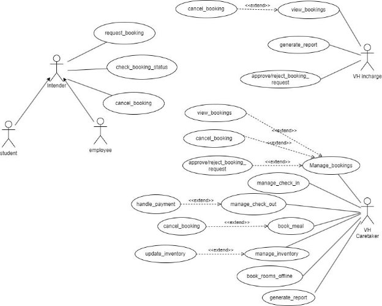

# Fusion ERP

## Software Requirements Specification

### For OS-1-VISITOR HOSTEL

**Prepared by:**

- Varun Raj (21bcs236)
- Azemera Vishnu Nayak (21bcs051)
- Avneesh Dayal (21bcs046)
- Sparsh Ranjan (21bcs205)
- Sahil Chauksey (21bcs181)

**Student Mentor:** Deepanshu Kumar (21bcs072)

---

## 1. Introduction

### 1.1 Introduction about Fusion – A Brief Description

FusionIIIT stands as a testament to the seamless integration and automation of diverse functions within PDPM Indian Institute of Information Technology, Design and Manufacturing, Jabalpur. Crafted with precision using Python 3.8 and powered by the Django Web framework, this initiative is a student-driven endeavor designed to elevate the institute's operational landscape. Encompassing everything from efficient administration management to academic prowess and miscellaneous departmental tasks, FusionIIIT is a holistic solution that harmonizes the intricacies of campus life.

Imagine it as a digital wizard that takes care of everything, from organizing administrative tasks to making academics smoother. It's not just limited to the usual operations; FusionIIIT integrates various departments and sections, ensuring that every corner of campus life runs smoothly.

In the admin side, it handles the complicated paperwork and processes. For academics, it brings a digital touch, making learning and managing courses easier. But it doesn't stop there; FusionIIIT is like a friendly companion for all the different parts of the campus, making sure everything works well.

In simpler terms, FusionIIIT is not just a tool – it's a helpful friend, making life at PDPM IIITDM Jabalpur more organized and enjoyable for everyone.

### 1.2 Purpose of the Module

The purpose of the Visitor Hostel Management module is to streamline and enhance the overall experience of visitors seeking accommodation in the IIIT Jabalpur visitor hostel. It aims to provide a user-friendly interface for Intenders while empowering VH In-Charge and VH Caretaker with efficient tools for managing bookings, rooms, meals, billing, and inventory. The module seeks to optimize resource utilization, ensure visitor satisfaction, and maintain the hostel's operational efficiency.

### 1.3 Scope of the Module

The Visitor Hostel Management module is designed to efficiently handle the booking and inventory management aspects of the visitor hostel at IIIT Jabalpur. This module caters to three primary actors: the Intender (students/employees for potential visitors seeking accommodation), VH In-Charge, and VH Caretaker. The primary focus is on facilitating seamless booking processes, room and meal management, and maintaining an up-to-date inventory.

---

## 2. User/Actor Characteristics

### 2.1 Intender (Employee/Student)

Represents individuals who intend to book accommodation and follow up on the booking process for potential visitors in applicable categories in the visitor hostel.

- **Role:** Initiates the booking process for accommodation in the visitor hostel.
- **Specific Functionalities:**
  - Submits booking requests through the Fusion portal.
  - Specifies stay duration, room requirements, and meal preferences.
  - Receives notifications about booking approval/rejection and other relevant updates.
  - Accesses booking history and status.

### 2.2 VH In-Charge

Supervises the overall operations of the visitor hostel, overseeing bookings and ensuring a smooth stay for visitors. This role is typically filled by a faculty or an officer-level employee of the institute.

- **Role:** Manages the overall operations of the visitor hostel, overseeing bookings and ensuring a smooth stay for visitors and maintaining reports.
- **Specific Functionalities:**
  - Reviews and approves/rejects booking requests.
  - Monitors overall hostel occupancy and availability.
  - Accesses summarized reports on booking statistics, room utilization, and inventory levels.
  - Has access to all functionalities available to the VH Caretaker.

### 2.3 VH Caretaker

Responsible for managing specific details of bookings, ensuring the readiness of rooms, managing the booking process (including room assignments/vacating), bill settlement, meal preferences and management, and overall inventory control.

- **Role:** Manages specific details of bookings, including room assignments, meal preferences, and overall inventory control.
- **Specific Functionalities:**
  - Assigns available rooms based on booking requests, considering room preferences and availability.
  - Manages meal preferences for each booking.
  - Updates and manages the hostel inventory, ensuring essential items are stocked.

---

## 3. Functional Requirements

### 3.1 Use Case Diagram

### 3.2 Use Case Description

This section describes each use case in the use case diagram in detail.

**Use Case #1**

|**UC ID**|UC#1|
| - | - |

<table><tr><th colspan="1"><b>Use case Name</b></th><th colspan="1" valign="top"><b>req_for_booking</b></th></tr>
<tr><td colspan="1" valign="top"><b>Description</b></td><td colspan="1">The Intender will be able to book room(s) in the VH. The Intender has to fill the form in the required format and submit for further processing.</td></tr>
<tr><td colspan="1" valign="top"><b>Actor</b></td><td colspan="1" valign="top">Intender</td></tr>
<tr><td colspan="1"><b>Precondition</b></td><td colspan="1">The Intender must be logged-in</td></tr>
<tr><td colspan="1" rowspan="4" valign="top"><b>Main Flow</b></td><td colspan="1">The Intender selects the option to request a booking.</td></tr>
<tr><td colspan="1" valign="top">The system generates a form to be filled with fields like start date, end date, type of room, number of guests, etc</td></tr>
<tr><td colspan="1" valign="top">The Intender fills the form in the given format.</td></tr>
<tr><td colspan="1">The Intender submits the form by clicking a button. [A2]</td></tr>
<tr><td colspan="1"><b>Post conditions</b></td><td colspan="1" valign="top">The form is forwarded to VH Incharge.</td></tr>
<tr><td colspan="1" valign="top"><b>Alternate Flow</b></td><td colspan="1" valign="top"><b>Post-condition –</b> The system returns to the Intender Dashboard.</td></tr>
<tr><td colspan="1" valign="top"><b>Sub Flow</b></td><td colspan="1" valign="top">The employee is notified with the VH In-charge’s action as the status update of the application</td></tr>
<tr><td colspan="1" rowspan="2" valign="top"><b>Global Alternate Flow</b></td><td colspan="1" valign="top">The Intender can ‘cancel’ the procedure at any time by exercising such an option</td></tr>
<tr><td colspan="1" valign="top"><b>Post-condition –</b> The system returns to the Intender Dashboard.</td></tr>
</table>

**Use Case #2**

<table><tr><th colspan="1" valign="top"><b>UC ID</b></th><th colspan="2" valign="top">UC#2</th></tr>
<tr><td colspan="1" valign="top"><b>Use case Name</b></td><td colspan="2" valign="top"><b>check_status</b></td></tr>
<tr><td colspan="1" valign="top"><b>Description</b></td><td colspan="2" valign="top">After submitting a booking request, the room Intender can check if the booking is confirmed/pending/canceled.</td></tr>
<tr><td colspan="1" valign="top"><b>Actor</b></td><td colspan="2" valign="top">Intender</td></tr>
<tr><td colspan="1" valign="top"><b>Precondition</b></td><td colspan="2">
Intender must be logged in.

Intender must have applied for booking a room.
</td></tr>
<tr><td colspan="1" rowspan="4" valign="top"><b>Main Flow</b></td><td colspan="1">1</td><td colspan="1">Intender clicks on my bookings button form his dashboard.</td></tr>
<tr><td colspan="1">2</td><td colspan="1">The system generates a list of Intender’s booking requests categorized by their status.</td></tr>
<tr><td colspan="1">3</td><td colspan="1">The Intender searches a booking request from the list.</td></tr>
<tr><td colspan="1" valign="top">4</td><td colspan="1" valign="top">The system shows the current status of the booking request.</td></tr>
<tr><td colspan="1" valign="top"><b>Post conditions</b></td><td colspan="2" valign="top">NIL</td></tr>
<tr><td colspan="1"><b>Alternate Flow</b></td><td colspan="2" valign="top">NIL</td></tr>
<tr><td colspan="1"><b>Sub Flow</b></td><td colspan="1"></td><td colspan="1">NIL</td></tr>
<tr><td colspan="1" rowspan="2" valign="top"><b>Global Alternate Flow</b></td><td colspan="1">GA1</td><td colspan="1">The Intender can cancel the procedure at any time by exercising such an option</td></tr>
<tr><td colspan="1"></td><td colspan="1" valign="top"><b>Post-condition –</b> The system returns to the Intender Dashboard.</td></tr>
</table>

**Use Case #3****

<table><tr><th colspan="1" valign="top"><b>UC ID</b></th><th colspan="2" valign="top">UC#3</th></tr>
<tr><td colspan="1" valign="top"><b>Use case Name</b></td><td colspan="2" valign="top"><b>cancel_booking</b></td></tr>
<tr><td colspan="1" valign="top"><b>Description</b></td><td colspan="2" valign="top">Intenders will be able to cancel their booking of room(s) in the VH with remarks.</td></tr>
<tr><td colspan="1" valign="top"><b>Actor</b></td><td colspan="2" valign="top">Intender</td></tr>
<tr><td colspan="1" valign="top"><b>Precondition</b></td><td colspan="2" valign="top">The Intender must be logged-in</td></tr>
<tr><td colspan="1" rowspan="4" valign="top"><b>Main Flow</b></td><td colspan="1">1</td><td colspan="1">The Intender clicks on my bookings button from his dashboard.</td></tr>
<tr><td colspan="1" valign="top">2</td><td colspan="1" valign="top">The system generates a list of Intender’s booking requests.</td></tr>
<tr><td colspan="1" valign="top">3</td><td colspan="1" valign="top">The Intender selects a booking request form the list and clicks on cancel button</td></tr>
<tr><td colspan="1" valign="top">4</td><td colspan="1" valign="top">The Intender confirms by clicking on a confirm button. [A1]</td></tr>
<tr><td colspan="1" valign="top"><b>Post conditions</b></td><td colspan="2" valign="top">Canceled booking will be reflected in the system and notification will be sent to the Intender.</td></tr>
<tr><td colspan="1" rowspan="2" valign="top"><b>Alternate Flow</b></td><td colspan="1" valign="top">A1</td><td colspan="1" valign="top">The Intender clicks on the cancel button and cancels the cancel booking process.</td></tr>
<tr><td colspan="1"></td><td colspan="1"><b>Post-condition –</b> The system does not cancel the booking and returns to Intender’s bookings list.</td></tr>
<tr><td colspan="1" valign="top"><b>Sub Flow</b></td><td colspan="2" valign="top">NIL</td></tr>
<tr><td colspan="1" rowspan="2" valign="top"><b>Global Alternate Flow</b></td><td colspan="1" valign="top">GA1</td><td colspan="1" valign="top">The Intender can cancel the procedure at any time by exercising such an option</td></tr>
<tr><td colspan="1"></td><td colspan="1" valign="top"><b>Post-condition –</b> The system returns to the Intender Dashboard.</td></tr>
</table>

**Use Case #4**

<table><tr><th colspan="1" valign="top"><b>UC ID</b></th><th colspan="2" valign="top">UC#4</th></tr>
<tr><td colspan="1" valign="top"><b>Use case Name</b></td><td colspan="2" valign="top"><b>check_availability</b></td></tr>
<tr><td colspan="1" valign="top"><b>Description</b></td><td colspan="2" valign="top">The Vh caretaker will be able to check the current occupancy of VH.</td></tr>
<tr><td colspan="1" valign="top"><b>Actor</b></td><td colspan="2" valign="top">Vh caretaker</td></tr>
<tr><td colspan="1" valign="top"><b>Precondition</b></td><td colspan="2" valign="top">Vhcaretakere should be logged in.</td></tr>
<tr><td colspan="1" rowspan="5" valign="top"><b>Main Flow</b></td><td colspan="1" valign="top">1</td><td colspan="1" valign="top">The Vh caretaker clicks on the room availability button from their dashboard.</td></tr>
<tr><td colspan="1">2</td><td colspan="1">The system generates a form showing the option start date and end date.</td></tr>
<tr><td colspan="1" valign="top">3</td><td colspan="1" valign="top">The Vh caretaker selects starting date and ending date for history occupancy viewing.</td></tr>
<tr><td colspan="1" valign="top">4</td><td colspan="1" valign="top">The Vh caretaker submits by clicking a button.</td></tr>
<tr><td colspan="1" valign="top">5</td><td colspan="1" valign="top">The required booking details are displayed.</td></tr>
<tr><td colspan="1" valign="top"><b>Post conditions</b></td><td colspan="2" valign="top">The system returns to its initial condition.</td></tr>
<tr><td colspan="1" valign="top"><b>Alternate Flow</b></td><td colspan="2" valign="top">NIL</td></tr>
<tr><td colspan="1"><b>Sub Flow</b></td><td colspan="2">NIL</td></tr>
<tr><td colspan="1" rowspan="2" valign="top"><b>Global Alternate Flow</b></td><td colspan="1" valign="top">GA 1</td><td colspan="1" valign="top">The Vh caretaker can ‘cancel’ the procedure at any time by exercising such an option</td></tr>
<tr><td colspan="1"></td><td colspan="1"><b>Post-condition –</b> The system returns to the Vh caretaker Dashboard.</td></tr>
</table>

**Use Case #5****
<table><tr><th colspan="1"><b>UC ID</b></th><th colspan="2">UC#5</th></tr>
<tr><td colspan="1"><b>Use case Name</b></td><td colspan="2"><b>allot_rooms</b></td></tr>
<tr><td colspan="1"><b>Description</b></td><td colspan="2">The caretaker will allot rooms according to the availability .</td></tr>
<tr><td colspan="1"><b>Actor</b></td><td colspan="2">Caretaker</td></tr>
<tr><td colspan="1" valign="top"><b>Precondition</b></td><td colspan="2" valign="top">
The caretaker

must be logged in.

The Intender should have applied for booking. Rooms should be available.
</td></tr>
<tr><td colspan="1" rowspan="5" valign="top"><b>Main Flow</b></td><td colspan="1" valign="top">1</td><td colspan="1" valign="top">The caretaker selects option booking to view booking requests.</td></tr>
<tr><td colspan="1" valign="top">2</td><td colspan="1" valign="top">The system generates a list displaying the pending booking requests.</td></tr>
<tr><td colspan="1" valign="top">3</td><td colspan="1" valign="top">The caretaker selects a booking request.</td></tr>
<tr><td colspan="1" valign="top">4</td><td colspan="1" valign="top">The caretaker allots rooms according to the request and availability from the list of available rooms. [A1]</td></tr>
<tr><td colspan="1" valign="top">5</td><td colspan="1" valign="top">The caretaker forwards the request to the incharge.</td></tr>
<tr><td colspan="1" valign="top"><b>Post conditions</b></td><td colspan="2" valign="top">Room is allocated to the Intender.</td></tr>
<tr><td colspan="1" rowspan="4" valign="top"><b>Alternate Flow</b></td><td colspan="1" valign="top">A1</td><td colspan="1" valign="top">The VH In-charge cancels the application mentioning the remark.</td></tr>
<tr><td colspan="1"></td><td colspan="1"><b>Post-Condition:</b> Intender will get notification about cancellation of application.</td></tr>
<tr><td colspan="1" valign="top">A2</td><td colspan="1" valign="top">The caretaker does not confirm by clicking on cancel button.</td></tr>
<tr><td colspan="1"></td><td colspan="1"><b>Post-condition:</b> The system does not allot rooms and returns to booking requests list.</td></tr>
<tr><td colspan="1"><b>Sub Flow</b></td><td colspan="2">NIL</td></tr>
<tr><td colspan="1" rowspan="2" valign="top"><b>Global Alternate Flow</b></td><td colspan="1">GA1</td><td colspan="1">The VH In-charger can cancel the procedure at any time by exercising such an option</td></tr>
<tr><td colspan="1"></td><td colspan="1" valign="top">The Intender can cancel the procedure at any time by exercising such an option</td></tr>
</table>

**Use Case #6**

<table><tr><th colspan="1" valign="top"><b>UC ID</b></th><th colspan="2" valign="top">UC#6</th></tr>
<tr><td colspan="1" valign="top"><b>Use case Name</b></td><td colspan="2" valign="top"><b>cancel_booking</b></td></tr>
<tr><td colspan="1" valign="top"><b>Description</b></td><td colspan="2" valign="top">VH Caretaker will be able to cancel any booking of room(s) in VH with remarks</td></tr>
<tr><td colspan="1" valign="top"><b>Actor</b></td><td colspan="2" valign="top">VH Caretaker</td></tr>
<tr><td colspan="1" valign="top"><b>Precondition</b></td><td colspan="2" valign="top">There should be a pre-booked room in VH.</td></tr>
<tr><td colspan="1" rowspan="2" valign="top"><b>Main Flow</b></td><td colspan="1">1</td><td colspan="1">The VH Caretaker selects a booking to be canceled from the list of booked rooms.</td></tr>
<tr><td colspan="1" valign="top">2</td><td colspan="1" valign="top">Caretaker cancels the selected booking by clicking on a button.</td></tr>
<tr><td colspan="1" valign="top"><b>Post conditions</b></td><td colspan="2" valign="top">Canceled booking will be reflected in the system and notification will be sent to the concerned Intender.</td></tr>
<tr><td colspan="1" valign="top"><b>Alternate Flow</b></td><td colspan="2" valign="top">NIL</td></tr>
<tr><td colspan="1" valign="top"><b>Sub Flow</b></td><td colspan="2" valign="top">NIL</td></tr>
<tr><td colspan="1" rowspan="2" valign="top"><b>Global Alternate Flow</b></td><td colspan="1">GA1</td><td colspan="1">The VH Caretaker can ‘cancel’ the procedure at any time by exercising such an option</td></tr>
<tr><td colspan="1"></td><td colspan="1" valign="top"><b>Post-condition –</b> The system returns to the VH In-charge’s Dashboard.</td></tr>
</table>

**Use Case #7**

<table><tr><th colspan="1"><b>UC ID</b></th><th colspan="2">UC#7</th></tr>
<tr><td colspan="1"><b>Use case Name</b></td><td colspan="2" valign="top"><b>manage_guest_check_in</b></td></tr>
<tr><td colspan="1"><b>Description</b></td><td colspan="2">VH Caretaker will be able to mark the check in status of a booked VH room.</td></tr>
<tr><td colspan="1" valign="top"><b>Actor</b></td><td colspan="2" valign="top">VH Caretaker</td></tr>
<tr><td colspan="1"><b>Precondition</b></td><td colspan="2">VH Caretaker must be logged in.</td></tr>
<tr><td colspan="1" rowspan="5" valign="top"><b>Main Flow</b></td><td colspan="1">1</td><td colspan="1">VH Caretaker clicks on the check in button from his dashboard.</td></tr>
<tr><td colspan="1">2</td><td colspan="1">The system will generate the list of guests having current booking and not checked in yet.</td></tr>
<tr><td colspan="1">3</td><td colspan="1">The VH Caretaker selects the name of the guest and fills the check in time and date.</td></tr>
<tr><td colspan="1">4</td><td colspan="1">The system asks for confirmation.</td></tr>
<tr><td colspan="1">5</td><td colspan="1">The VH Caretaker clicks on the confirm button. [A1]</td></tr>
<tr><td colspan="1"><b>Post conditions</b></td><td colspan="2">System reflects the modified details regarding room status.</td></tr>
<tr><td colspan="1" valign="top"><b>Alternate Flow</b></td><td colspan="1" valign="top">A1</td><td colspan="1" valign="top">The VH Caretaker clicks cancel.</td></tr>
<tr><td colspan="1"><b>Sub Flow</b></td><td colspan="1"></td><td colspan="1">The system updates the database and marks the room as occupied.</td></tr>
<tr><td colspan="1" rowspan="2"><b>Global Alternate Flow</b></td><td colspan="1">GA1</td><td colspan="1">The VH Caretaker can ‘cancel’ the procedure at any time by exercising such an option</td></tr>
<tr><td colspan="1"></td><td colspan="1" valign="top"><b>Post-condition –</b> The system returns to the VH Caretaker’s Dashboard.</td></tr>
</table>

**Use Case #8**

<table><tr><th colspan="1"><b>UC ID</b></th><th colspan="2">UC#8</th></tr>
<tr><td colspan="1"><b>Use case Name</b></td><td colspan="2"><b>manage_guest_check_out</b></td></tr>
<tr><td colspan="1" valign="top"><b>Description</b></td><td colspan="2">VH Caretaker will be able to initiate the process of checkout on the system regarding bill clearance and room status update.</td></tr>
<tr><td colspan="1"><b>Actor</b></td><td colspan="2">VH Caretaker</td></tr>
<tr><td colspan="1" valign="top"><b>Precondition</b></td><td colspan="2">Guests have checked-in at VH. VH Caretaker must be logged in.</td></tr>
<tr><td colspan="1" rowspan="4" valign="top"><b>Main Flow</b></td><td colspan="1" valign="top">1</td><td colspan="1" valign="top">VH Caretaker clicks on the checkout button from his dashboard.</td></tr>
<tr><td colspan="1" valign="top">2</td><td colspan="1" valign="top">The system generates the lists of guests currently present at VH.</td></tr>
<tr><td colspan="1">3</td><td colspan="1">The VH Caretaker selects the Guest name and click on the checkout button. [A1]</td></tr>
<tr><td colspan="1" valign="top">4</td><td colspan="1" valign="top">UC#10 will be exercised.</td></tr>
<tr><td colspan="1" valign="top"><b>Post conditions</b></td><td colspan="2" valign="top">System reflects the modified details regarding room status and account.</td></tr>
<tr><td colspan="1" rowspan="4" valign="top"><b>Alternate Flow</b></td><td colspan="1" valign="top">A1</td><td colspan="1" valign="top">VH Caretaker canceled the checkout request.</td></tr>
<tr><td colspan="1"></td><td colspan="1"><b>Post-condition</b> – The system returns to the employee ‘Dashboard’ – initial screen.</td></tr>
<tr><td colspan="1" valign="top">A2</td><td colspan="1" valign="top">The head chooses not to confirm.</td></tr>
<tr><td colspan="1"></td><td colspan="1"><b>Post-condition –</b> The system displays the form with the data filled in so far.</td></tr>
<tr><td colspan="1" valign="top"><b>Sub Flow</b></td><td colspan="1" valign="top">S1</td><td colspan="1" valign="top">System marks the corresponding room empty.</td></tr>
</table>

<table><tr><th colspan="1" rowspan="2"><b>Global Alternate Flow</b></th><th colspan="1" valign="top">GA1</th><th colspan="1" valign="top">The VH Caretaker can ‘cancel’ the procedure at any time by exercising such an option</th></tr>
<tr><td colspan="1"></td><td colspan="1" valign="top"><b>Post-condition –</b> The system returns to the VH Caretaker’s Dashboard.</td></tr>
</table>

**Use Case #9**

<table><tr><th colspan="1" valign="top"><b>UC ID</b></th><th colspan="2" valign="top">UC#9</th></tr>
<tr><td colspan="1" valign="top"><b>Use case Name</b></td><td colspan="2" valign="top"><b>manage_bill_settlement</b></td></tr>
<tr><td colspan="1" valign="top"><b>Description</b></td><td colspan="2" valign="top">VH Caretaker sees if the bill is paid by intender/guest. He collects the money according to the bill and updates the system accordingly.</td></tr>
<tr><td colspan="1" valign="top"><b>Actor</b></td><td colspan="2" valign="top">VH Caretaker</td></tr>
<tr><td colspan="1" valign="top"><b>Precondition</b></td><td colspan="2" valign="top">
Guests have checked-in at VH.

VH Caretaker must be logged in.

The VH Caretaker must be at the Check Out interface.
</td></tr>
<tr><td colspan="1" rowspan="4" valign="top"><b>Main Flow</b></td><td colspan="1">1</td><td colspan="1">VH Caretaker clicks on the Generate bill button.</td></tr>
<tr><td colspan="1">2</td><td colspan="1">System generates the bill containing meal charges, room charges.</td></tr>
<tr><td colspan="1">3</td><td colspan="1">VH Caretaker selects the mode of payment(intender/guest/institute) from the checkbox.</td></tr>
<tr><td colspan="1">4</td><td colspan="1">VH Caretaker updates the system about the payment. [S1]</td></tr>
<tr><td colspan="1" valign="top"><b>Post conditions</b></td><td colspan="2" valign="top">System reflects the payment details.</td></tr>
<tr><td colspan="1" valign="top"><b>Alternate Flow</b></td><td colspan="2" valign="top">NIL</td></tr>
<tr><td colspan="1"><b>Sub Flow</b></td><td colspan="1" valign="top">S1</td><td colspan="1" valign="top">System updates the VH Account.</td></tr>
<tr><td colspan="1" rowspan="2"><b>Global Alternate Flow</b></td><td colspan="1" valign="top">GA1</td><td colspan="1" valign="top">The VH Caretaker can ‘cancel’ the procedure at any time by exercising such an option</td></tr>
<tr><td colspan="1"></td><td colspan="1" valign="top"><b>Post-condition –</b> The system returns to the VH Caretaker’s Dashboard.</td></tr>
</table>

**Use Case #10**

<table><tr><th colspan="1" valign="top"><b>UC ID</b></th><th colspan="2" valign="top">UC#10</th></tr>
<tr><td colspan="1" valign="top"><b>Use case Name</b></td><td colspan="2" valign="top"><b>manage_inventory</b></td></tr>
<tr><td colspan="1" valign="top"><b>Description</b></td><td colspan="2" valign="top">VH Caretaker will be able to manage the inventory of the VH.</td></tr>
<tr><td colspan="1" valign="top"><b>Actor</b></td><td colspan="2" valign="top">VH Caretaker</td></tr>
<tr><td colspan="1" valign="top"><b>Precondition</b></td><td colspan="2" valign="top">The VH Caretaker should be logged in.</td></tr>
<tr><td colspan="1" rowspan="3" valign="top"><b>Main Flow</b></td><td colspan="1" valign="top">1</td><td colspan="1" valign="top">Screen will show the inventory items with different categories consumable and non consumable..</td></tr>
<tr><td colspan="1" valign="top">2</td><td colspan="1" valign="top">The VH Caretaker will set the threshold levels of stock items. [A1] [A2]</td></tr>
<tr><td colspan="1" valign="top">3</td><td colspan="1" valign="top">System alerts will be generated for items below threshold.</td></tr>
<tr><td colspan="1" valign="top"><b>Post conditions</b></td><td colspan="2" valign="top">The inventory will be in a consistent state.</td></tr>
<tr><td colspan="1" rowspan="4" valign="top"><b>Alternate Flow</b></td><td colspan="1" valign="top">A1</td><td colspan="1" valign="top">VH Caretaker will add items to inventory.</td></tr>
<tr><td colspan="1"></td><td colspan="1"><b>Post-condition</b> – The inventory will be now updated and in a consistent state.</td></tr>
<tr><td colspan="1" valign="top">A2</td><td colspan="1" valign="top">VH Caretaker selects for update_consumption(UC#16).</td></tr>
<tr><td colspan="1"></td><td colspan="1"><b>Post-condition –</b> The inventory will be now updated and in a consistent state.</td></tr>
</table>

<table><tr><th colspan="1"><b>Sub Flow</b></th><th colspan="1"></th><th colspan="1">The employee is notified with the head’s action as the status update of the application</th></tr>
<tr><td colspan="1" rowspan="2"><b>Global Alternate Flow</b></td><td colspan="1">GA1</td><td colspan="1">The VH Caretaker can ‘cancel’ the procedure at any time by exercising such an option</td></tr>
<tr><td colspan="1"></td><td colspan="1" valign="top"><b>Post-condition –</b> The system returns to the VH Caretaker’s Dashboard.</td></tr>
</table>

**Use Case #11**

|**UC ID**|UC#11||
| - | - | :- |
|**Use case Name**|**get\_low\_on\_stock\_alerts**||
|**Description**|VH Caretaker will get alerts when any inventory item quantity falls below a pre-decided threshold.||
|**Actor**|VH Caretaker||
|**Precondition**|VH Caretaker has logged in.||
|**Main Flow**|1|System generates an alert when there is a shortage of any inventory item.|
|**Post conditions**|The VH Caretaker is notified.||
|**Alternate Flow**|NIL||
|**Sub Flow**|NIL||
|**Global Alternate Flow**|NIL||

**Use Case #12**

<table><tr><th colspan="1" valign="top"><b>UC ID</b></th><th colspan="2" valign="top">UC#12</th></tr>
<tr><td colspan="1" valign="top"><b>Use case Name</b></td><td colspan="2" valign="top"><b>update_consumption</b></td></tr>
<tr><td colspan="1" valign="top"><b>Description</b></td><td colspan="2" valign="top">The VH Caretaker will periodically update the system with the quantity of items consumed.</td></tr>
<tr><td colspan="1" valign="top"><b>Actor</b></td><td colspan="2" valign="top">VH Caretaker</td></tr>
<tr><td colspan="1" valign="top"><b>Precondition</b></td><td colspan="2" valign="top">VH Caretaker must be logged in.</td></tr>
<tr><td colspan="1" rowspan="2" valign="top"><b>Main Flow</b></td><td colspan="1">1</td><td colspan="1">The VH caretaker will select an item from the inventory list.</td></tr>
<tr><td colspan="1" valign="top">2</td><td colspan="1" valign="top">The VH Caretaker will update the quantity consumed.</td></tr>
<tr><td colspan="1"><b>Post conditions</b></td><td colspan="2">The system is now updated and consistent.</td></tr>
<tr><td colspan="1" valign="top"><b>Alternate Flow</b></td><td colspan="2" valign="top">NIL</td></tr>
<tr><td colspan="1" valign="top"><b>Sub Flow</b></td><td colspan="2" valign="top">NIL</td></tr>
<tr><td colspan="1" rowspan="2" valign="top"><b>Global Alternate Flow</b></td><td colspan="1">GA1</td><td colspan="1">The VH Caretaker can ‘cancel’ the procedure at any time by exercising such an option</td></tr>
<tr><td colspan="1"></td><td colspan="1" valign="top"><b>Post-condition –</b> The system returns to the VH Caretaker’s Dashboard.</td></tr>
</table>

**Use Case #13****

<table><tr><th colspan="1" valign="top"><b>UC ID</b></th><th colspan="2" valign="top">UC#13</th></tr>
<tr><td colspan="1" valign="top"><b>Use case Name</b></td><td colspan="2" valign="top"><b>manage_noTurnUp</b></td></tr>
<tr><td colspan="1" valign="top"><b>Description</b></td><td colspan="2" valign="top">The system will notify VH Caretaker/VH In-charge about guests who didn’t turn up. The VH Caretaker can take actions as deemed fit.</td></tr>
<tr><td colspan="1" valign="top"><b>Actor</b></td><td colspan="2" valign="top">VH Caretaker</td></tr>
<tr><td colspan="1"><b>Precondition</b></td><td colspan="2">VH Caretaker should be logged in.</td></tr>
<tr><td colspan="1" rowspan="3" valign="top"><b>Main Flow</b></td><td colspan="1" valign="top">1</td><td colspan="1" valign="top">System will generate an alert for the VH Caretaker about no turn up of guests.</td></tr>
<tr><td colspan="1" valign="top">2</td><td colspan="1" valign="top">VH Caretaker will confirm such situations through the Intender.</td></tr>
<tr><td colspan="1" valign="top">3</td><td colspan="1" valign="top">VH Caretaker exercises UC#6. [A2]</td></tr>
<tr><td colspan="1" valign="top"><b>Post conditions</b></td><td colspan="2" valign="top">System is now updated and consistent.</td></tr>
<tr><td colspan="1" rowspan="4" valign="top"><b>Alternate Flow</b></td><td colspan="1">A1</td><td colspan="1">VH In-charge will ask VH Caretaker to update (cancel or retain) the system accordingly.</td></tr>
<tr><td colspan="1"></td><td colspan="1"><b>Post-Condition:</b> System is now updated and consistent.</td></tr>
<tr><td colspan="1" valign="top">A2</td><td colspan="1" valign="top">The VH Caretaker does nothing.</td></tr>
<tr><td colspan="1"></td><td colspan="1"><b>Post-condition –</b> The system does not cancel the booking.</td></tr>
<tr><td colspan="1" valign="top"><b>Sub Flow</b></td><td colspan="2" valign="top">NIL</td></tr>
<tr><td colspan="1" valign="top"><b>Global Alternate Flow</b></td><td colspan="2" valign="top">NIL</td></tr>
</table>

**Use Case #14**

<table><tr><th colspan="1" valign="top"><b>UC ID</b></th><th colspan="2" valign="top">UC#13</th></tr>
<tr><td colspan="1" valign="top"><b>Use case Name</b></td><td colspan="2" valign="top"><b>view_bookings</b></td></tr>
<tr><td colspan="1" valign="top"><b>Description</b></td><td colspan="2" valign="top">The VH In-charge will be able to check the booking history and current occupancy of VH.</td></tr>
<tr><td colspan="1" valign="top"><b>Actor</b></td><td colspan="2" valign="top">VH In-charge</td></tr>
<tr><td colspan="1" valign="top"><b>Precondition</b></td><td colspan="2" valign="top">VH In-charge should be logged in.</td></tr>
<tr><td colspan="1" rowspan="4" valign="top"><b>Main Flow</b></td><td colspan="1">1</td><td colspan="1">The VH in-charge click on view booking button from their dashboard.</td></tr>
<tr><td colspan="1" valign="top">2</td><td colspan="1" valign="top">The system generates a form showing the option start date and end date.</td></tr>
<tr><td colspan="1" valign="top">3</td><td colspan="1" valign="top">The VH In-charge selects starting date and ending date for history and occupancy viewing.</td></tr>
<tr><td colspan="1">5</td><td colspan="1">The required booking details are displayed.</td></tr>
<tr><td colspan="1"><b>Post conditions</b></td><td colspan="2" valign="top">NIL</td></tr>
<tr><td colspan="1" valign="top"><b>Alternate Flow</b></td><td colspan="2" valign="top">NIL</td></tr>
<tr><td colspan="1" valign="top"><b>Sub Flow</b></td><td colspan="2" valign="top">NIL</td></tr>
<tr><td colspan="1" rowspan="2" valign="top"><b>Global Alternate Flow</b></td><td colspan="1" valign="top">GA1</td><td colspan="1" valign="top">The VH In-charge can ‘cancel’ the procedure at any time by exercising such an option</td></tr>
<tr><td colspan="1"></td><td colspan="1" valign="top"><b>Post-condition –</b> The system returns to the VH In-charge’s Dashboard.</td></tr>
</table>

**Use Case #15****
<table><tr><th colspan="1" valign="top"><b>UC ID</b></th><th colspan="2" valign="top">UC#14</th></tr>
<tr><td colspan="1" valign="top"><b>Use case Name</b></td><td colspan="2" valign="top"><b>confirm_booking</b></td></tr>
<tr><td colspan="1" valign="top"><b>Description</b></td><td colspan="2" valign="top">VH In-Charge will grant the confirmation of the booking after verifying the information provided in the application.</td></tr>
<tr><td colspan="1" valign="top"><b>Actor</b></td><td colspan="2" valign="top">VH In-Charge</td></tr>
<tr><td colspan="1" valign="top"><b>Precondition</b></td><td colspan="2" valign="top">
VH In-Charge has logged in.

VH In-Charge has received application(s) to book rooms in VH.
</td></tr>
<tr><td colspan="1" rowspan="2" valign="top"><b>Main Flow</b></td><td colspan="1" valign="top">1</td><td colspan="1" valign="top">VH In-charge opens the application and verifies the details.</td></tr>
<tr><td colspan="1" valign="top">2</td><td colspan="1" valign="top">VH In-charge confirms the booking. [A1]</td></tr>
<tr><td colspan="1"><b>Post conditions</b></td><td colspan="2">VH In-Charge has responded to the booking request by the stakeholder.</td></tr>
<tr><td colspan="1" rowspan="2" valign="top"><b>Alternate Flow</b></td><td colspan="1">A1</td><td colspan="1">VH In-charge finds discrepancies in the application and rejects it with remarks.</td></tr>
<tr><td colspan="1"></td><td colspan="1" valign="top"><b>Post-Condition:</b> Intender is notified about the cancellation of application.</td></tr>
<tr><td colspan="1"><b>Sub Flow</b></td><td colspan="2">NIL</td></tr>
<tr><td colspan="1" rowspan="2" valign="top"><b>Global Alternate Flow</b></td><td colspan="1" valign="top">GA1</td><td colspan="1" valign="top">The VH In-charge can ‘cancel’ the procedure at any time by exercising such an option</td></tr>
<tr><td colspan="1"></td><td colspan="1" valign="top"><b>Post-condition –</b> The system returns to the VH In-charges’s Dashboard.</td></tr>
</table>

**Use Case #16**

<table><tr><th colspan="1" valign="top"><b>UC ID</b></th><th colspan="2" valign="top">UC#16</th></tr>
<tr><td colspan="1" valign="top"><b>Use case Name</b></td><td colspan="2" valign="top"><b>reject_booking</b></td></tr>
<tr><td colspan="1" valign="top"><b>Description</b></td><td colspan="2" valign="top">VH In-charge will be able to reject any booking of room(s) in VH with remarks</td></tr>
<tr><td colspan="1" valign="top"><b>Actor</b></td><td colspan="2" valign="top">VH In-charge</td></tr>
<tr><td colspan="1" valign="top"><b>Precondition</b></td><td colspan="2" valign="top">There should be a pre-booked room in VH.</td></tr>
<tr><td colspan="1" rowspan="2" valign="top"><b>Main Flow</b></td><td colspan="1">1</td><td colspan="1">The VH In-charge selects a booking to be canceled from the list of alloted rooms.</td></tr>
<tr><td colspan="1">2</td><td colspan="1">VH In-charge cancels the selected booking by clicking on a button.</td></tr>
<tr><td colspan="1" valign="top"><b>Post conditions</b></td><td colspan="2" valign="top">Canceled booking will be reflected in the system and notification will be sent to the concerned Intender.</td></tr>
<tr><td colspan="1" valign="top"><b>Alternate Flow</b></td><td colspan="2" valign="top">NIL</td></tr>
<tr><td colspan="1" valign="top"><b>Sub Flow</b></td><td colspan="2" valign="top">NIL</td></tr>
<tr><td colspan="1" rowspan="2" valign="top"><b>Global Alternate Flow</b></td><td colspan="1" valign="top">GA1</td><td colspan="1" valign="top">The VH In-charge can ‘cancel’ the procedure at any time by exercising such an option</td></tr>
<tr><td colspan="1"></td><td colspan="1" valign="top"><b>Post-condition –</b> The system returns to the VH In-charge’s Dashboard.</td></tr>
</table>

**Use Case #17****
<table><tr><th colspan="1" valign="bottom"><b>UC ID</b></th><th colspan="3" valign="bottom">UC#17</th></tr>
<tr><td colspan="1" valign="bottom"><b>Use case Name</b></td><td colspan="3" valign="bottom"><b>mange_booking</b></td></tr>
<tr><td colspan="1" valign="top"><b>Description</b></td><td colspan="3" valign="top">The "Manage Booking" use case allows the caretaker of the college hostel to review, approve, reject, edit, cancel, and view booking requests for the visitor hostel through the Fusion portal.</td></tr>
<tr><td colspan="1" valign="bottom"><b>Actor</b></td><td colspan="3" valign="bottom">VH Caretaker</td></tr>
<tr><td colspan="1" valign="bottom"><b>Precondition</b></td><td colspan="3" valign="bottom">The caretaker is logged in into the system.</td></tr>
<tr><td colspan="1" rowspan="4" valign="top"><b>Main Flow</b></td><td colspan="1" valign="bottom">1</td><td colspan="2" valign="bottom">The Caretaker navigates to the "Manage Booking" section.</td></tr>
<tr><td colspan="1" valign="top">2</td><td colspan="2" valign="top">The system displays the list of bookings with its respective status.</td></tr>
<tr><td colspan="1" valign="bottom">3</td><td colspan="2" valign="bottom">The Caretaker selects a booking request to review. [A1][A2]</td></tr>
<tr><td colspan="1" valign="top">4</td><td colspan="2" valign="top">The caretaker views the booking information of approved requests. [A3][A4]</td></tr>
<tr><td colspan="1" valign="top"><b>Post conditions</b></td><td colspan="3" valign="top">The updated booking information is reflected in the database.</td></tr>
<tr><td colspan="1" rowspan="4" valign="top"><b>Alternate Flow</b></td><td colspan="1" rowspan="2" valign="top">A1</td><td colspan="1" valign="top">1</td><td colspan="1" valign="top">The request is pending. The Caretaker selects the "Approve" action.</td></tr>
<tr><td colspan="1" valign="top">2</td><td colspan="1" valign="top">The system updates the booking status to "Approved" and the same is reflected to the Intender.</td></tr>
<tr><td colspan="1" rowspan="2" valign="top">A2</td><td colspan="1" valign="top">1</td><td colspan="1" valign="top">The Caretaker selects the "Reject" action citing the reason for rejection.</td></tr>
<tr><td colspan="1" valign="top">2</td><td colspan="1" valign="top">The system updates the booking status to rejected and the same is reflected to the Intender.</td></tr>
</table>

<table><tr><th colspan="1" valign="bottom"><b>UC ID</b></th><th colspan="3" valign="bottom">UC#17</th></tr>
<tr><td colspan="1" valign="bottom"><b>Use case Name</b></td><td colspan="3" valign="bottom"><b>mange_booking</b></td></tr>
<tr><td colspan="1" rowspan="5"></td><td colspan="1" rowspan="2" valign="top">A3</td><td colspan="1" valign="top">1</td><td colspan="1" valign="top">The caretaker edits the booking details, like booking date, Intender details etc.</td></tr>
<tr><td colspan="1" rowspan="2" valign="top">2</td><td colspan="1" rowspan="2" valign="top">The edited information is updated in the database and the same is reflected to the Intender as well.</td></tr>
<tr><td colspan="1" rowspan="3" valign="top">A4</td></tr>
<tr><td colspan="1" valign="top">1</td><td colspan="1" valign="bottom">The caretaker selects the cancel booking options specifying the reason for cancellation.</td></tr>
<tr><td colspan="1" valign="top">2</td><td colspan="1" valign="top">The system updates the booking status of that booking to “cancelled” and the same is reflected to the Intender as well.</td></tr>
<tr><td colspan="1" valign="bottom"><b>Sub Flow</b></td><td colspan="3" valign="bottom">NIL</td></tr>
<tr><td colspan="1" rowspan="2" valign="top"><b>Global Alternate Flow</b></td><td colspan="1" valign="top">GA1</td><td colspan="2" valign="top">The VH Caretaker can ‘cancel’ the procedure at any time by exercising such an option and will be directed to the dashboard.</td></tr>
<tr><td colspan="1" valign="top">GA2</td><td colspan="2" valign="bottom">If a technical error occurs during the execution of any action (e.g., database failure, server issues), the system displays an error message and logs the incident.</td></tr>
</table>

# 3.3. Other Functional Requirements

1. This module will make use of the **communication module** for sending notifications and alerts to various actors involved in the module, suitably for booking confirmations, rejections, or modifications, etc.

2. Automated email or SMS notifications for booking confirmations, rejections, or modifications.

3. Alerts for critical inventory levels and other important updates.

4. The **Super Admin** of Fusion should be able to assign roles for VH In-Charge and VH Caretaker.

5. The system should be able to handle offline bookings.

6. The category conversion of the visitors may be possible, subject to the approval of the competent authority.

7. Changes in the tariff may occur from time to time, as decided by the institute authorities.

---

# 3.4 Other Constraints

## 1. User Interfaces

- The user interface should comply with the color scheme and dashboard design of FUSION IIIT. Users should be able to navigate seamlessly from one functionality to another. 
- Inter-module navigation should be smooth, ensuring all functionalities are easy to use without requiring specific training.

## 2. Tech Stack Used

The project's tech stack comprises various libraries, including:
- **AMQP 5.0.2** for messaging
- **Beautiful Soup 4.9.3** for web scraping
- **Django 3.1.5** as the core framework
- **Cryptography 36.0.2** for security
- **django-allauth 0.44.0** and **django-cors-headers 3.7.0** for additional Django functionalities
- **django-debug-toolbar 3.2.4** and **djangorestframework 3.12.2** for debugging and API development
- External libraries such as **numpy 1.22.3**, **psycopg2-binary 2.8.6**, and **requests 2.25.1** contribute to data manipulation, database connectivity, and web request handling, respectively.

These components collectively form a comprehensive and efficient tech stack for the project.

## 3. Business Rules (if any)

1. The room booking and billing shall be done based on the category of the visitor (see the existing rule set for the same).

---

# 4. Non-Functional Requirements

## 1. Performance

- The system should respond to user interactions quickly. Response time for booking actions, inventory updates, and notifications should be minimal.

## 2. Scalability

- The system should handle a large number of concurrent users. Performance should be evaluated under increasing load conditions.

## 3. Availability

- The system should be available 99.9% of the time.

## 4. Security

- Ensure data confidentiality and integrity. Role-based authorization must ensure that users can only perform actions relevant to their designated roles.

---

# 5. Module Dependencies with Other Fusion Modules

## 5.1. UI Level

- **Color scheme and dashboard design:** The UI should adhere to the established FUSION IIIT style guide for a consistent user experience. Navigation through different functionalities should be intuitive and effortless.
- The interface of the dashboard should be similar to the home page, and the connectivity between both should be well-defined.
- **Accessibility:** The UI should be accessible to users with disabilities, following WCAG guidelines.
- **Responsive design:** The UI should adapt to different screen sizes and devices for optimal viewing and interaction.

## 5.2. DB Level Dependencies

- **Data schema:** The database schema should be designed to efficiently store and retrieve visitor hostel booking data, including room availability, inventory levels, user roles, and booking history.
- The database is based on the registration and availability of the stocks.
- **Data integrity:** Data validation and error handling mechanisms should be implemented to ensure data accuracy and consistency.
- **Database performance:** The database should be optimized for fast retrieval and update operations, particularly during peak booking periods.

## 5.3. Module Level Dependencies

- Module level dependencies define the intra-level dependencies in the module.
- **Communication module:** Integration with the existing communication module is required for sending email and SMS notifications about booking confirmations, rejections, or modifications.
- **Workflow engine:** A workflow engine might be utilized to automate task execution and manage approval processes for complex booking scenarios.
