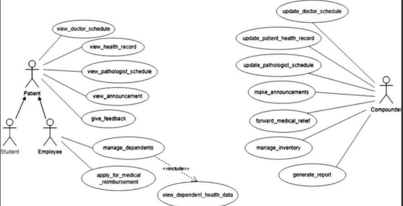

# Fusion ERP

## HEALTH CENTER (Web)

### Software Requirements Specification (OS2 Module)

**Faculty Mentor:** Dr. Sraban Kumar Mohanty  
**Team Members:**  
- Manjith Kumar (21bcs070)  
- Lohith (21bcs156)  
- Teja (21bcs136)  
- Joshi (21bcs153)  

**Team Mentor:** Prabhat Suman (21bcs157)  
**Prem Charan (21bcs152)**  

---

## Table of Contents

1. [Introduction](#introduction)
   - [Introduction about Fusion - A brief description](#introduction-about-fusion)
   - [Purpose of the module](#purpose-of-the-module)
   - [Scope of the module - Actors, Functionalities](#scope-of-the-module)
2. [User/Actor Description (characteristics)](#useractor-description)
3. [Functional Requirements](#functional-requirements)
   - [Use Case Diagram](#use-case-diagram)
   - [Use Case Description](#use-case-description)
4. [Non-Functional Requirements](#non-functional-requirements)
5. [Module Dependencies with Other Modules](#module-dependencies)

---

## 1. Introduction

### Introduction about Fusion - A Brief Description

**FusionIIIT** stands as a testament to the seamless integration and automation of diverse functions within PDPM Indian Institute of Information Technology, Design and Manufacturing, Jabalpur. Crafted with precision using Python 3.8 and powered by the Django Web framework, this initiative is a student-driven endeavor designed to elevate the institute's operational landscape. Encompassing everything from efficient administration management to academic prowess and miscellaneous departmental tasks, FusionIIIT is a holistic solution that harmonizes the intricacies of campus life.

In simpler terms, FusionIIIT is not just a tool – it's a helpful friend, making life at PDPM IIITDM Jabalpur more organized and enjoyable for everyone.

### Purpose of the Module

The purpose of the project entitled **PRIMARY HEALTH CENTRE MANAGEMENT SYSTEM** is to computerize the Office Management and to manage different activities related to the Primary Health Centre of PDPM IIITDM Jabalpur. We aim to develop software that is user-friendly, simple, fast, and cost-effective. The system includes:

- Registration of patients
- Storing patient details into the system
- Maintaining records of medical stock inventory
- Viewing all previous appointments and prescriptions of the patient
- Searching for the availability of doctors and their timings

Traditionally, these tasks were done manually.

### Scope of the Module - Actors, Functionalities

The users of this module will be the registered students at the Institute (PDPM IIITDM Jabalpur), faculty members, and their dependents (family members). This software system will be a mobile application-based Health Care Management System for the mentioned users. The interface will enable actors to view schedules for consulting doctors and keep track of their health records. The compounder will be able to:

- Update the doctor’s schedule and patient log
- Manage the inventory
- Make announcements of updates

---

## 2. User/Actor Characteristics

There are mainly two types of users that interact in this system:

### Patient (Students & Employees)

Patients should have access to the following features:

- **View Doctor Schedule:** See the schedule of doctors and their availability.
- **View Announcements:** Access important announcements from the health center.
- **Apply for Medical Relief:** Apply for medical relief if needed.
- **View Health Record:** Access their own health records.
- **Request Ambulance:** Request an ambulance in case of emergencies.
- **Provide Feedback:** Provide feedback on their experiences.
- **Make Appointment Request:** Request an appointment with a doctor.

Patients who are staff (employees) should have additional access to:

- **Dependency Health Record:** Manage the health records of their dependents.
- **Apply for Medical Relief:** Specifically apply for medical relief if needed.

### Compounder

The compounder should have the following features:

- **Update Doctor Schedule:** Update the schedule of doctors.
- **Update Patient Log:** Update patient logs and records.
- **Make Announcements:** Create and publish announcements.
- **Generate Reports:** Generate reports based on various parameters.
- **Forward Medical Relief:** Process and forward medical relief requests.
- **Manage Inventory:** Manage the inventory of medicines and medical supplies.
- **Process Appointment Requests:** Handle appointment requests from patients.
- **Process Ambulance Requests:** Handle ambulance requests from patients.
- **View Feedback from Patients:** Access feedback provided by patients.

---

## 3. Functional Requirements

- **User Authentication:** The system should have a secure user authentication mechanism to ensure that only registered students, faculty members, dependents, and compounders can access the application.
  
- **User Roles and Permissions:** Different user roles (students, faculty, dependents, compounders) with specific permissions should be defined to regulate access to various features and data within the application.
  
- **Doctor's Schedule:** The system should display the schedule of consulting doctors, including their availability, timings, and consultation slots. Users should be able to request, book, or cancel appointments through the application.
  
- **Health Records Management:** Users should have the ability to view and update their health records, including medical history, prescriptions, and appointments. The system should allow users to upload relevant health documents or reports.
  
- **Compounder's Features:** Compounders should be able to update doctor schedules, including adding or modifying consultation slots. Inventory management functionalities for tracking medical supplies, updating stock levels, and generating alerts for low inventory.

### Use Case Diagram

### Use Case Description

<table><tr><th colspan="1" valign="top">UC ID </th><th colspan="4" valign="top">UC#1 </th></tr>
<tr><td colspan="1">Use case Name </td><td colspan="4" valign="top">view_health_record </td></tr>
<tr><td colspan="1" valign="top">Description </td><td colspan="4">Our system empowers patients to effortlessly track real-time health updates and access historical records for themselves and dependents. User-friendly and secure, it transforms health management into a personalized, proactive experience. </td></tr>
<tr><td colspan="1" valign="top">Actor </td><td colspan="4" valign="top">Patient </td></tr>
<tr><td colspan="1" valign="top">Precondition </td><td colspan="4" valign="top">The Patient is logged in into the system. </td></tr>
<tr><td colspan="1" rowspan="2" valign="top">Main Flow </td><td colspan="1" valign="top">1 </td><td colspan="3" valign="top">The patient opens the "View Health Record" section. </td></tr>
<tr><td colspan="1">2 </td><td colspan="3">The system displays a list of health records along with their latest statues[A1] </td></tr>
<tr><td colspan="1">Post conditions </td><td colspan="4" valign="top">The health records are reflected in the database. </td></tr>
<tr><td colspan="1" valign="top">Alternate Flow </td><td colspan="2" valign="top">A1 </td><td colspan="1" valign="top">1 </td><td colspan="1">If a newly registered patient has no existing health records to view. </td></tr>
<tr><td colspan="1" rowspan="2" valign="top">Sub Flow </td><td colspan="2" valign="top">1 </td><td colspan="2">The patient goes to manage dependencies. </td></tr>
<tr><td colspan="2" valign="top">2 </td><td colspan="2" valign="top">The patient also view health records of their dependencies[SA1] </td></tr>
<tr><td colspan="1"></td><td colspan="2">3 </td><td colspan="2">The patient can add/delete a dependency. </td></tr>
<tr><td colspan="1" valign="top">Alternate Sub Flow </td><td colspan="2" valign="top">SA1 </td><td colspan="2">If no dependencies exist, the system notifies the patient that no dependent health records are currently available. </td></tr>
<tr><td colspan="1" rowspan="2" valign="top">Global Alternate Flow </td><td colspan="2" valign="top">GA1 </td><td colspan="2">Due to high traffic, logging in may be temporarily affected. We apologize for the inconvenience </td></tr>
<tr><td colspan="2" valign="top">GA2 </td><td colspan="2">If a technical error occurs during the execution of any action (e.g., database failure, server issues), the system displays an error message and logs the incident. </td></tr>
</table>

<table><tr><th colspan="1" valign="top">UC ID </th><th colspan="2" valign="top">UC#2 </th></tr>
<tr><td colspan="1" valign="top">Use case Name </td><td colspan="2" valign="top">apply_for_medical_reimbursement</td></tr>
<tr><td colspan="1" valign="top">Description </td><td colspan="2">The "apply_for_medical_reimbursement" use case allows employees to apply for medical relief by requesting a medical certificate. This certificate is official documentation to support their need for medical assistance or leave due to health reasons. </td></tr>
<tr><td colspan="1" valign="top">Actor </td><td colspan="2" valign="top">Patient(employee) </td></tr>
<tr><td colspan="1" valign="top">Precondition </td><td colspan="2" valign="top">The employee logged in to the system. </td></tr>
<tr><td colspan="1" rowspan="3" valign="top">Main Flow </td><td colspan="1">1 </td><td colspan="1">The employee navigates to the "medical relief" section. </td></tr>
<tr><td colspan="1">2 </td><td colspan="1">The system displays a form. </td></tr>
<tr><td colspan="1" valign="top">3 </td><td colspan="1" valign="top">The employee fills out the form.[A1] </td></tr>
<tr><td colspan="1"></td><td colspan="1">4 </td><td colspan="1">The system asks for a confirmation </td></tr>
<tr><td colspan="1"></td><td colspan="1">5 </td><td colspan="1">The employee confirms the submission[A2] </td></tr>
<tr><td colspan="1"></td><td colspan="1">6 </td><td colspan="1">The system returns to the employee ‘Dashboard’ </td></tr>
<tr><td colspan="1" valign="top">Postconditions </td><td colspan="2" valign="top">The form was successfully submitted and stored in the database. </td></tr>
</table>

<table><tr><th colspan="1" valign="top">Alternate Flow </th><th colspan="1" valign="top">A1 </th><th colspan="1" valign="top">1 </th><th colspan="1">The employee chooses not to confirm but rather chooses to cancel. </th></tr>
<tr><td colspan="1" valign="top">Sub Flow </td><td colspan="3" valign="top">NIL </td></tr>
<tr><td colspan="1" rowspan="2" valign="top">Global Alternate Flow </td><td colspan="1" valign="top">GA1 </td><td colspan="2">The employee can ‘cancel’ the procedure at any time by exercising such an option and will be directed to the dashboard. </td></tr>
<tr><td colspan="1" valign="top">GA2 </td><td colspan="2">If a technical error occurs during the execution of any action (e.g., database failure, server issues), the system displays an error message and logs the incident. </td></tr>
</table>

<table><tr><th colspan="1" valign="top">UC ID </th><th colspan="2" valign="top">UC#3 </th></tr>
<tr><td colspan="1" valign="top">Use case Name </td><td colspan="2" valign="top">view_doctor_schedule </td></tr>
<tr><td colspan="1" valign="top">Description </td><td colspan="2">The "View Doctor Schedule" use case allows patients to view doctor schedules in PHC through the Fusion portal. </td></tr>
<tr><td colspan="1">Actor </td><td colspan="2">Patient </td></tr>
<tr><td colspan="1">Precondition </td><td colspan="2">The patient is logged in into the system. </td></tr>
<tr><td colspan="1" rowspan="3" valign="top">Main Flow </td><td colspan="1">1 </td><td colspan="1">The patient navigates to the "View Doctor Schedule" section. </td></tr>
<tr><td colspan="1">2 </td><td colspan="1">The system displays doctor schedules. </td></tr>
<tr><td colspan="1">3 </td><td colspan="1" valign="top">The patient view doctor schedule and book appointmentaccordingly</td></tr>
<tr><td colspan="1" valign="top">Post conditions </td><td colspan="2" valign="top">The patient viewed the doctor schedule </td></tr>
<tr><td colspan="1" valign="top">Global Alternate Flow </td><td colspan="1" valign="top">GA1 </td><td colspan="1" valign="top">If a technical error occurs during the execution of any action (e.g., database failure, server issues), the system displays an error message and logs the incident. </td></tr>
</table>

<table><tr><th colspan="1">UC ID </th><th colspan="2">UC#4 </th></tr>
<tr><td colspan="1" valign="top">Use case Name </td><td colspan="2" valign="top">view_pathologist_schedule </td></tr>
<tr><td colspan="1" valign="top">Description </td><td colspan="2" valign="top">The "View Pathologist Schedule" use case allows patients to view pathologist schedules in PHC through the Fusion portal. </td></tr>
<tr><td colspan="1" valign="top">Actor </td><td colspan="2" valign="top">Patient </td></tr>
<tr><td colspan="1" valign="top">Precondition </td><td colspan="2" valign="top">The patient is logged in into the system. </td></tr>
<tr><td colspan="1" rowspan="2" valign="top">Main Flow </td><td colspan="1">1 </td><td colspan="1">The patient navigates to the "View Pathologist Schedule" section. </td></tr>
<tr><td colspan="1">2 </td><td colspan="1">The system displays a pathologist schedule. </td></tr>
</table>

||3 |The patient views the schedule. |
| :- | - | - |
|Post conditions ||The updated pathologist schedule information is reflected in the database. |
|Global Alternate Flow |GA1 |If a technical error occurs during the execution of any action (e.g., database failure, server issues), the system displays an error message and logs the incident. |

<table><tr><th colspan="1" valign="top">UC ID </th><th colspan="2" valign="top">UC#5 </th></tr>
<tr><td colspan="1" valign="top">Use case Name </td><td colspan="2" valign="top">view_announcements </td></tr>
<tr><td colspan="1" valign="top">Description </td><td colspan="2">The "view_announcement" use case allows patient to see the latest announcement made on the Fusion portal by the compounder. </td></tr>
<tr><td colspan="1" valign="top">Actor </td><td colspan="2" valign="top">Patient </td></tr>
<tr><td colspan="1" valign="top">Precondition </td><td colspan="2" valign="top">The patient is logged in into the system. </td></tr>
<tr><td colspan="1" rowspan="2" valign="top">Main Flow </td><td colspan="1" valign="top">1 </td><td colspan="1" valign="top">The patient navigates to the "Announcement" section. </td></tr>
<tr><td colspan="1" valign="top">2 </td><td colspan="1" valign="top">The patient sees the latest announcements. </td></tr>
<tr><td colspan="1" valign="top">Global Alternate Flow </td><td colspan="1" valign="top">GA1 </td><td colspan="1">If a technical error occurs during the execution of any action (e.g., database failure, server issues), the system displays an error message and logs the incident. </td></tr>
</table>

<table><tr><th colspan="1" valign="top">UC ID </th><th colspan="2" valign="top">UC#6 </th></tr>
<tr><td colspan="1" valign="top">Use case Name </td><td colspan="2" valign="top">give_feedback </td></tr>
<tr><td colspan="1" valign="top">Description </td><td colspan="2">The "give_feedback" use case allows a patient to provide his/herfeedback on the Fusion portal by the compounder. </td></tr>
<tr><td colspan="1" valign="top">Actor </td><td colspan="2" valign="top">Patient </td></tr>
<tr><td colspan="1" valign="top">Precondition </td><td colspan="2" valign="top">The patient is logged in into the system. </td></tr>
<tr><td colspan="1" rowspan="2" valign="top">Main Flow </td><td colspan="1" valign="top">1 </td><td colspan="1" valign="top">The patient navigates to the "Feedback" section. </td></tr>
<tr><td colspan="1" valign="top">2 </td><td colspan="1" valign="top">The patient fills the feedback form. </td></tr>
<tr><td colspan="1"></td><td colspan="1" valign="top">3 </td><td colspan="1" valign="top">The patient submits the form. </td></tr>
<tr><td colspan="1" valign="top">Global Alternate Flow </td><td colspan="1" valign="top">GA1 </td><td colspan="1">If a technical error occurs during the execution of any action (e.g., database failure, server issues), the system displays an error message and logs the incident. </td></tr>
</table>

|UC ID |UC#7 |
| - | - |
|Use case Name |update\_patient\_health\_record |
|Description |Compounder have the capability to diligently update patient logs, ensuring they accurately reflect the latest treatments and any changes in the health record, promoting comprehensive and up-to-date patient information |
|Actor |Compounder |
|Precondition |The Compounder is logged in into the system. |

<table><tr><th colspan="1" rowspan="2" valign="top">Main Flow </th><th colspan="1">1 </th><th colspan="3">The compounder opens the "update Health Record" section of a specific patient. </th></tr>
<tr><td colspan="1" valign="top">2 </td><td colspan="3" valign="top">The system displays previous list of health records.[A1] </td></tr>
<tr><td colspan="1"></td><td colspan="1">3 </td><td colspan="3">Compounder enter new records of latest appointment happened.[A2] </td></tr>
<tr><td colspan="1">Post conditions </td><td colspan="4" valign="top">The health records changes/updates are reflected in the database. </td></tr>
<tr><td colspan="1" valign="top">Alternate Flow </td><td colspan="1" valign="top">A1 </td><td colspan="2" valign="top">1 </td><td colspan="1">If a newly registered patient has no existing health records to view. </td></tr>
<tr><td colspan="1"></td><td colspan="1" valign="top">A2 </td><td colspan="2" valign="top">1 </td><td colspan="1">If the appointment was canceled, nothing new happened in the health record. </td></tr>
<tr><td colspan="1" valign="top">Sub Flow </td><td colspan="4" valign="top">The compounder also update health records of their dependencies[SA1] </td></tr>
<tr><td colspan="1" valign="top">Alternate Sub Flow </td><td colspan="2" valign="top">SA1 </td><td colspan="2">If no dependencies exist, the system notifies the compounder that no dependent health records are currently available. </td></tr>
<tr><td colspan="1" rowspan="2" valign="top">Global Alternate Flow </td><td colspan="2" valign="top">GA1 </td><td colspan="2">Due to high traffic, logging in may be temporarily affected. We apologize for the inconvenience </td></tr>
<tr><td colspan="2" valign="top">GA2 </td><td colspan="2">If a technical error occurs during the execution of any action (e.g., database failure, server issues), the system displays an error message and logs the incident. </td></tr>
</table>

<table><tr><th colspan="1" valign="top">UC ID </th><th colspan="2" valign="top">UC#8 </th></tr>
<tr><td colspan="1" valign="top">Use case Name </td><td colspan="2" valign="top">manage_inventory </td></tr>
<tr><td colspan="1" valign="top">Description </td><td colspan="2">The "manage_inventory" use case allows the compounder to check the available stocks of medicines, blood and beds available and update accordingly through the Fusion portal. </td></tr>
<tr><td colspan="1" valign="top">Actor </td><td colspan="2" valign="top">Compounder </td></tr>
<tr><td colspan="1" valign="top">Precondition </td><td colspan="2" valign="top">The compounder is logged in into the system. </td></tr>
<tr><td colspan="1" rowspan="3" valign="top">Main Flow </td><td colspan="1" valign="top">1 </td><td colspan="1" valign="top">The compounder navigates to the "Inventory" section. </td></tr>
<tr><td colspan="1" valign="top">2 </td><td colspan="1" valign="top">The compounder goes to the medicines section. </td></tr>
<tr><td colspan="1" valign="top">3 </td><td colspan="1" valign="top">The compounder selects a medicine to update if required. </td></tr>
<tr><td colspan="1"></td><td colspan="1">4 </td><td colspan="1">The compounder goes to the blood bank section and updates if required. </td></tr>
<tr><td colspan="1"></td><td colspan="1">5 </td><td colspan="1">The compounder goes to the bed section and updates if required. </td></tr>
<tr><td colspan="1">Post conditions </td><td colspan="2" valign="top">The updated information is reflected in the database. </td></tr>
<tr><td colspan="1" valign="top">Global Alternate Flow </td><td colspan="1" valign="top">GA1 </td><td colspan="1">If a technical error occurs during the execution of any action (e.g., database failure, server issues), the system displays an error message and logs the incident. </td></tr>
</table>

|UC ID |UC#9 |
| - | - |
|Use case Name |forward\_medical\_reimbursement |

<table><tr><th colspan="1" valign="top">Description </th><th colspan="3">The "forward_medical_reimbursement " use case enables the compounder to either approve or deny a patient's request for medical relief. </th></tr>
<tr><td colspan="1">Actor </td><td colspan="3">Compounder </td></tr>
<tr><td colspan="1" valign="top">Precondition </td><td colspan="3" valign="top">The compounder logged in to the system. </td></tr>
<tr><td colspan="1" rowspan="8" valign="top">Main Flow </td><td colspan="1">1 </td><td colspan="2">The compounder chose the option to see the pending requests for medical relief. </td></tr>
<tr><td colspan="1">2 </td><td colspan="2">The system presents a list of the pending requests for leave. </td></tr>
<tr><td colspan="1">3 </td><td colspan="2">The compounder selects one of the ’ pending requests for medical relief’ to view details. </td></tr>
<tr><td colspan="1" valign="top">4 </td><td colspan="2">A form containing the details of the medical relief request gets displayed along with options for actions to be taken </td></tr>
<tr><td colspan="1">5 </td><td colspan="2">The compounder chooses an action [A1] </td></tr>
<tr><td colspan="1" valign="top">6 </td><td colspan="2" valign="top">The System asks for a confirmation </td></tr>
<tr><td colspan="1">7 </td><td colspan="2">The compounder confirms for the action [A2] </td></tr>
<tr><td colspan="1">8 </td><td colspan="2">The system presents an acknowledgment including all the furnished details of the leave request and action taken </td></tr>
<tr><td colspan="1"></td><td colspan="1">9 </td><td colspan="2">The system returns to the compounder ‘Dashboard’ </td></tr>
<tr><td colspan="1" valign="top">Postconditions </td><td colspan="3">The updated information about medical relief is reflected in the database. </td></tr>
<tr><td colspan="1" rowspan="4" valign="top">Alternate Flow </td><td colspan="1" rowspan="2" valign="top">A1 </td><td colspan="1" valign="top">1 </td><td colspan="1">In the case of the ‘reject’ option, the system seeks the reason/comments from the compounder. The compounder provides the comments and confirm </td></tr>
<tr><td colspan="1" valign="top">2 </td><td colspan="1">Post-condition – The system returns to the compounder ‘Dashboard’ – initial screen. </td></tr>
<tr><td colspan="1" rowspan="2" valign="top">A2 </td><td colspan="1" valign="top">1 </td><td colspan="1" valign="top">The compounder chooses not to confirm. </td></tr>
<tr><td colspan="1" valign="top">2 </td><td colspan="1">Post-condition – The system displays the form with the data filled in so far. </td></tr>
<tr><td colspan="1" valign="top">Sub Flow </td><td colspan="3">The employee is notified of the compounder action as the status update of the application </td></tr>
<tr><td colspan="1" valign="top">Global Alternate Flow </td><td colspan="1" valign="top">GA1 </td><td colspan="2">If a technical error occurs during the execution of any action (e.g., database failure, server issues), the system displays an error message and logs the incident. </td></tr>
</table>

|UC ID |UC#10 |
| - | - |
|Use case Name |update\_doctor\_schedule |
|Description |The "Update Doctor Schedule" use case allows the compounder to update doctor schedules in PHC through the Fusion portal. |

<table><tr><th colspan="1">Actor </th><th colspan="3">Compounder </th></tr>
<tr><td colspan="1">Precondition </td><td colspan="3">The Compounder is logged in into the system. </td></tr>
<tr><td colspan="1" rowspan="3" valign="top">Main Flow </td><td colspan="1">1 </td><td colspan="2" valign="top">The Compounder navigates to the "Update Doctor Schedule"section.</td></tr>
<tr><td colspan="1">2 </td><td colspan="2">The system displays a list of doctor schedules </td></tr>
<tr><td colspan="1">3 </td><td colspan="2">The compounder update doctor schedules accordingly </td></tr>
<tr><td colspan="1" valign="top">Post conditions </td><td colspan="3" valign="top">The updated doctor schedule information is reflected in the database. </td></tr>
<tr><td colspan="1" valign="top">Alternate Flow </td><td colspan="1" valign="top">A1 </td><td colspan="1" valign="top">1 </td><td colspan="1" valign="top">No doctor is available so compounder not update any schedule, Only reviewed it. </td></tr>
<tr><td colspan="1" valign="top">Sub Flow </td><td colspan="3" valign="top">NIL </td></tr>
<tr><td colspan="1" valign="top">Global Alternate Flow </td><td colspan="1" valign="top">GA1 </td><td colspan="2" valign="top">If a technical error occurs during the execution of any action (e.g., database failure, server issues), the system displays an error message and logs the incident. </td></tr>
</table>

<table><tr><th colspan="1">UC ID </th><th colspan="3">UC#11 </th></tr>
<tr><td colspan="1" valign="top">Use case Name </td><td colspan="3" valign="top">update_pathologist_schedule </td></tr>
<tr><td colspan="1" valign="top">Description </td><td colspan="3" valign="top">The "Update Pathologist Schedule" use case allows the compounder to update pathologist schedules in PHC through the Fusion portal. </td></tr>
<tr><td colspan="1" valign="top">Actor </td><td colspan="3" valign="top">Compounder </td></tr>
<tr><td colspan="1" valign="top">Precondition </td><td colspan="3" valign="top">The Compounder is logged in into the system. </td></tr>
<tr><td colspan="1" rowspan="3" valign="top">Main Flow </td><td colspan="1" valign="top">1 </td><td colspan="2" valign="top">The Compounder navigates to the "Update Pathologist Schedule" section. </td></tr>
<tr><td colspan="1" valign="top">2 </td><td colspan="2" valign="top">The system displays a list of pathologist schedules. </td></tr>
<tr><td colspan="1" valign="top">3 </td><td colspan="2" valign="top">The compounder updates pathologist schedules accordingly. </td></tr>
<tr><td colspan="1" valign="top">Post conditions </td><td colspan="3" valign="top">The updated pathologist schedule information is reflected in thedatabase.</td></tr>
<tr><td colspan="1" valign="top">Alternate Flow </td><td colspan="1" valign="top">A1 </td><td colspan="1" valign="top">1 </td><td colspan="1">
No pathologist is available so compounder not update any schedule, 

Only reviewed it. 
</td></tr>
<tr><td colspan="1">Sub Flow </td><td colspan="3">NIL </td></tr>
<tr><td colspan="1" valign="top">Global Alternate Flow </td><td colspan="1" valign="top">GA1 </td><td colspan="2">If a technical error occurs during the execution of any action (e.g., database failure, server issues), the system displays an error message and logs the incident. </td></tr>
</table>

<table><tr><th colspan="1" valign="top">UC ID </th><th colspan="2" valign="top">UC#12 </th></tr>
<tr><td colspan="1" valign="top">Use case Name </td><td colspan="2" valign="top">make_announcements</td></tr>
<tr><td colspan="1" valign="top">Description </td><td colspan="2">The "make_announcement" use case allows patient to see the latest announcement made on the Fusion portal by the compounder. </td></tr>
<tr><td colspan="1" valign="top">Actor </td><td colspan="2" valign="top">Compounder </td></tr>
<tr><td colspan="1" valign="top">Precondition </td><td colspan="2" valign="top">The compounder is logged in into the system. </td></tr>
<tr><td colspan="1" rowspan="2" valign="top">Main Flow </td><td colspan="1" valign="top">1 </td><td colspan="1" valign="top">The compounder navigates to the "Announcement" section. </td></tr>
<tr><td colspan="1" valign="top">2 </td><td colspan="1" valign="top">The patient makes the latest announcements. </td></tr>
<tr><td colspan="1" valign="top">Global Alternate Flow </td><td colspan="1" valign="top">GA1 </td><td colspan="1">If a technical error occurs during the execution of any action (e.g., database failure, server issues), the system displays an error message and logs the incident. </td></tr>
</table>

<table><tr><th colspan="1" valign="top">UC ID </th><th colspan="2" valign="top">UC#13 </th></tr>
<tr><td colspan="1" valign="top">Use case Name </td><td colspan="2" valign="top">generate_report </td></tr>
<tr><td colspan="1" valign="top">Description </td><td colspan="2">The "generate_report" use case allows the compounder to generate a medical report of a patient on the Fusion portal by the compounder. </td></tr>
<tr><td colspan="1" valign="top">Actor </td><td colspan="2" valign="top">Compounder </td></tr>
<tr><td colspan="1" valign="top">Precondition </td><td colspan="2" valign="top">The compounder is logged in into the system. </td></tr>
<tr><td colspan="1" rowspan="4" valign="top">Main Flow </td><td colspan="1" valign="top">1 </td><td colspan="1" valign="top">The compounder navigates to the health records of a patient. </td></tr>
<tr><td colspan="1" valign="top">2 </td><td colspan="1" valign="top">The compounder navigates to generate report. </td></tr>
<tr><td colspan="1" valign="top">3 </td><td colspan="1" valign="top">The compounder fills the required details. </td></tr>
<tr><td colspan="1" valign="top">4 </td><td colspan="1" valign="top">Submit the form. </td></tr>
<tr><td colspan="1" valign="top">Global Alternate Flow </td><td colspan="1" valign="top">GA1 </td><td colspan="1">If a technical error occurs during the execution of any action (e.g., database failure, server issues), the system displays an error message and logs the incident. </td></tr>
</table>

# User Interfaces

The user interface of the PHC_OS2 Module should comply with the color scheme and dashboard design of **FUSIONIIIT**. Users should be able to navigate seamlessly between functionalities, ensuring smooth inter-module navigation. All functionalities must be user-friendly, eliminating the need for specific training for effective usage.

---

## Tech Stack Used

- **Python**
- **Django**
- **PostgreSQL**

---

## Non-Functional Requirements

### Performance

The performance of the college portal is a crucial non-functional requirement that guarantees the system reacts quickly to user input. This involves:

- **Low Downtime:** Ensuring minimal service interruptions.
- **Speedy Page Loads:** Reducing the time taken for pages to load.
- **Effective Data Processing:** Facilitating fast and efficient handling of user requests.

A smooth and responsive user experience is vital for staff, instructors, and students who rely on the portal for various administrative and academic activities.

### Security

Security is critical for a college portal that handles sensitive student and institutional data. Strong security measures must be implemented to protect against:

- **Data Breaches**
- **Unauthorized Access**
- **Cyber Threats**

These measures include encryption, authentication, and access controls. The reliability and privacy of the data stored in the portal depend on a robust security framework.

### Usability

Usability focuses on how easy it is to use the college portal. An intuitive interface ensures that users of all technical skill levels can effectively engage with the portal. Prioritizing usability leads to:

- Increased user satisfaction
- Reduced learning curve
- Higher frequency of use among academics, administrative staff, and students

### Maintainability

Maintainability refers to how easily the college portal can be updated, modified, and maintained over time. A well-maintained system allows for:

- Quick updates and bug fixes
- Efficient addition of new features

This ensures the portal's longevity and reduces overall maintenance costs by adapting to changing institutional needs and technological advancements.

### Scalability

A college portal must be scalable to handle varying levels of usage. Key aspects include:

- **Handling Increased Traffic:** The portal should maintain performance during user base growth or peak activity periods.
- **Future-Proofing:** Ensuring the system can keep pace with evolving user demands and technological advancements.

---

## Module Dependencies with Other Fusion Modules

### UI Level Dependencies

- **Notification Module:**  
  Essential for communication, this module handles appointment requests, feedback reviews, ambulance requests, and announcements.

- **Dashboard Module:**  
  Provides a centralized interface for users, displaying real-time notifications, facilitating message management, and offering an overview of recent announcements and appointment requests. It streamlines user interactions within the organization.

### DB Level Dependencies

The following database schemas are shared among the modules:

- **Patient Schema**
- **Compounder Schema**

---
