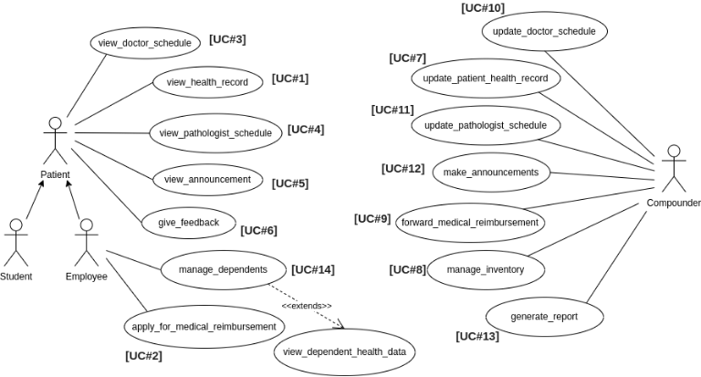

# Figma Profiles for OS-2 Primary Health Center Mobile App

---

## 1. Module Description

This module focuses on computerizing the Office Management and managing different activities related to the Primary Health Centre of PDPM IIITDM Jabalpur.

- **Patient Registration and Record Management**
- **Appointment and Prescription Record-Keeping**
- **Doctor Availability and Scheduling**
- **Implementing measures to ensure the security and privacy of patient data**

The users of this module will be the registered students of the Institute (PDPM IIITDM Jabalpur), faculty members, and their dependents (family members).

This software system will be a mobile application-based Health Care Management System for the mentioned users. The interface will enable the actors to view schedules for consulting doctors and keep track of their health records. The compounder will be able to update the doctor's schedule and patient log, manage the inventory, and announce updates.

**Link to SRS:** [OS-2 PHC Mobile SRS](https://docs.google.com/document/d/1Q0jaZeIraLcIEix6UtpEcZ8AZbii58TJ3xTmPF83IZc/edit?usp=sharing)

---

## 2. Actors 

### 2.1 Patient (Students & Employees)

Patients should have access to the following features:

- **View Doctor Schedule [UC#3]:** Patients should be able to see the schedule of doctors and their availability.
- **View Announcements [UC#5]:** Patients should be able to view important announcements from the health center.
- **View Health Record [UC#1]:** Patients should have access to their health records.
- **Provide Feedback [UC#6]:** Patients should be able to provide feedback on their experiences.
- **View Pathologist Schedule [UC#4]:** Patients would have access to the schedule of pathologists visiting the health center.

Patients who are employees should have additional access to:

- **Dependency Health Record [UC#14]:** Staff members should be able to manage the health records of their dependents.
- **Apply for Medical Reimbursement [UC#2]:** Patients (specifically employees) should be able to apply for medical relief if needed.

**Link to the Figma Profile for Patient:**  
<https://www.figma.com/file/5UCgwFi5R6xK0t7kZWhzjS/OS2-PHC-Patient?type=design&node-id=0%3A1&mode=design&t=PTsWCkUUSjlGTrcN-1>

### 2.2 Compounder

The compounder (admin) should have access to the following features:

- **Update Doctor Schedule [UC#10]:** Compounder should be able to update the schedule of doctors.
- **Update Patient Log [UC#7]:** Compounder should be able to update patient logs and records.
- **Make Announcements [UC#12]:** Compounders should be able to create and publish announcements.
- **Generate Reports [UC#13]:** Compounder should be able to generate reports based on various parameters.
- **Forward Medical Reimbursement [UC#9]:** Compounder should be able to process and forward medical relief requests.
- **Manage Inventory [UC#8]:** Compounder should be able to manage the inventory of medicines and medical supplies.
- **Update Pathologist Schedule [UC#11]:** Compounder will be able to update the schedule of the pathologist.

**Link to the Figma Profile for Compounder:**  
<https://www.figma.com/file/qGSgtyrIiDC338K6lNNaLd/OS2-PHC-Compounder?type=design&node-id=0%3A1&mode=design&t=KBzrLq6Zy2zyrSUD-1>

---

## 3. Figma Profile Design Guidelines and Additional Considerations

### 3.1 Cross-Platform Compatibility

- All the Figma designs and features are compatible across both web and app versions.

### 3.2 Dimension Standardization

- All Figma designs have the same dimensions: 430 px width for mobile.

### 3.3 Actor-Oriented Use Case-Based Design

- All Figma designs are based on the use cases of actors and maintain consistency with previous and newly added designs.
- Each actor has a different page in Figma.

---
