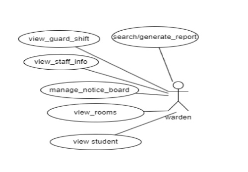
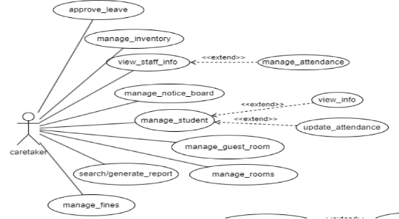
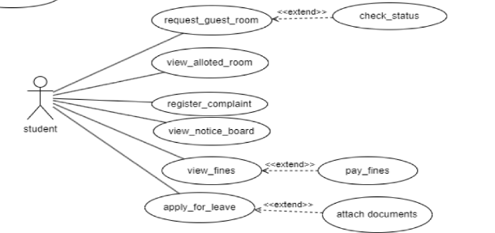

# Fusion ERP

## Figma Profiles  
**For**  
### SA-1 - Hostel Management

---

## 1. Module Description

The **Hostel Management module** is an integral part of our project, catering to students, caretakers, and wardens.  

For **students**, it offers streamlined functionalities like:
- Requesting guest rooms
- Managing allotted rooms
- Registering complaints
- Accessing notices

**Caretakers** can efficiently handle tasks such as:
- Approving leave
- Managing inventory
- Overseeing student-related information

**Wardens** have central oversight, managing:
- Guard shifts
- Notice boards
- Room assignments
- Generating relevant reports

The module aims to enhance hostel administration by providing role-specific features, fostering efficient communication, and simplifying various management tasks. The implementation includes secure API endpoints to ensure a user-friendly and organized hostel management system.

**Main Actors:**  
- Student  
- Warden  
- Caretaker  
- Super Admin  

---

## 2. Actors

### 2.1 Actor #1: Super Admin

The **Super Admin** is the most privileged actor who oversees key actions like:
- Allotting wardens and caretakers for each hostel
- Adding or deleting hostels when new ones are constructed or old ones are deprecated.

**Use Cases:**

**Figma Profile Link:**  
[Super Admin Figma Profile](https://www.figma.com/file/FhduHck6YGvPD5QMWWtRcf/Super-Admin-App?type=design&node-id=0%3A1&mode=design&t=cH1M8sh2wjlgrZWR-1)

---

### 2.2 Actor #2: Warden

The **Warden** plays a central role in ensuring a well-organized and secure living environment for students. Wardens can:
- View guard and staff info
- Access student and room information
- Send notices to everyone
- View messages from caretakers

**Use Cases:**

**Figma Profile Link:**  
[Warden Figma Profile](https://www.figma.com/file/dfM0T8XPDIFjSSSvn1IIQK/Warden-App?type=design&node-id=1%3A42&mode=design&t=2pwjF2v0JDy5befS-1)

---

### 2.3 Actor #3: Caretaker

**Caretakers** are present at the hostel 24/7 and have functions to perform in the Hostel Management System, such as:
- Viewing guard shifts and allotted rooms to students
- Verifying guest room bookings
- Managing student attendance
- Approving leave requests
- Viewing hostel inventory
- Imposing fines on students
- Sending notices and viewing notices from the warden

**Use Cases:**

**Figma Profile Link:**  
[Caretaker Figma Profile](https://www.figma.com/file/LbUctAiDyJQkLPR1HIxl0v/Caretaker-App?type=design&node-id=1%3A42&mode=design&t=ozqBmr2agLIOoFFd-1)

---

### 2.4 Actor #4: Student

**Students** are the main stakeholders in this management system. The system offers:
- Access to notice boards and room info
- Booking guest rooms
- Registering complaints
- Applying for leave
- Viewing fines imposed

**Use Cases:**

**Figma Profile Link:**  
[Student Figma Profile](https://www.figma.com/file/4Iah9qJxjh6IAt15YEzqlp/Student-App?type=design&node-id=0%3A1&mode=design&t=yhWf8N8k0FfF14PJ-1)

---

## Team Members

- **21BCS144 -** Deven Nehete (Lead)  
- **21BCS123 -** Mahadevu Sai Ravi Kishor Naidu  
- **21BCS138 -** Saurabh Nagpure  
- **21BCS165 -** Priya Murmu  
- **21BCS198 -** Shuvam Patra  
- **21BCS221 -** Jyotsna Telgote
