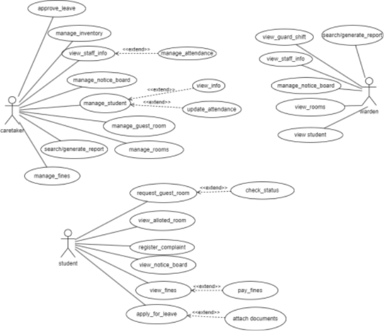
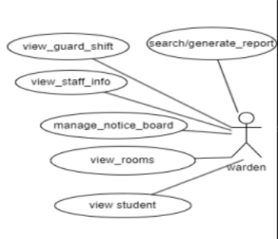
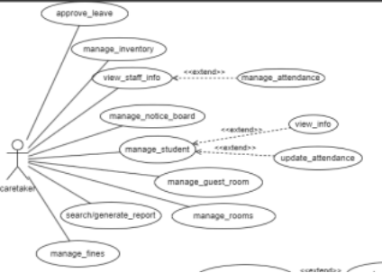
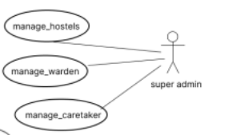

# Figma Profiles for Hostel Management (SA1) (Web)

---

## 1. Module Description

The **SA-1 Hostel Management Module** is software designed to manage various activities related to the hostels at PDPM IIITDM Jabalpur. It automates tasks for the **Warden** and **Caretaker**, providing a platform for interaction between students and hostel staff. The module covers activities such as:
- Viewing staff information
- Checking and booking guest rooms
- Managing guard shifts, notices, and attendance
- Overseeing hostel-related activities

---

## 2. Actors

### 2.1 Student

The **Student** can perform various tasks and formalities related to their hostel.

**Figma Profile:**  
[Student Figma Profile](#)

---

### 2.2 Warden

The **Warden** supervises the tasks of the caretaker and has access to information regarding staff and hostel residents.

**Figma Profile:**  
[Warden Figma Profile](#)

---

### 2.3 Caretaker

The **Caretaker** is responsible for the overall management of the hostel, including staff and residents. The caretaker can modify and view information related to both staff and residents.

**Figma Profile:**  
[Caretaker Figma Profile](#)

---

### 2.4 Super Admin

The **Super Admin** assigns hostels to specific batches, and is responsible for assigning wardens to specific hostels and caretakers to specific batches.

**Figma Profile:**  
[Super Admin Figma Profile](#)
