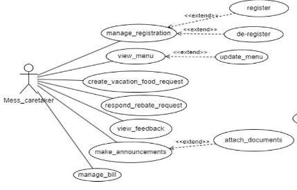
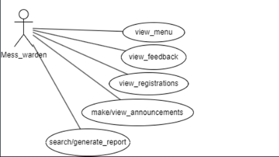
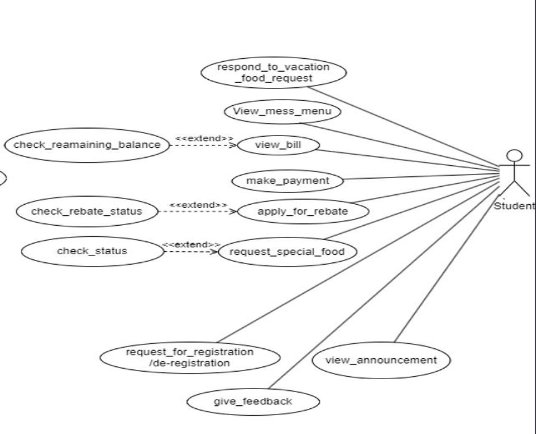
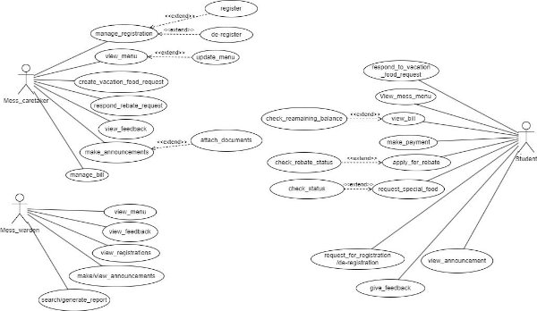

# Fusion ERP

## Software Requirements Specification

### for

## SA-2 Mess Management

**Faculty Mentor:** Dr. Vijaypal Singh Rathor  
**Team Mentor:** Gaurang Bhutani - [21BCS085](mailto:21bcs085@iiitdmj.ac.in)  
**Team Members:**  
- Chandrashekhar Gouda - [21BCS064](mailto:21bcs064@iiitdmj.ac.in)  
- Manish Kumar - [21BCS128](mailto:21bcs128@iiitdmj.ac.in)  
- Manoj Kumar - [21BCS129](mailto:21bcs129@iiitdmj.ac.in)  
- Mohammad Adil - [21BCS133](mailto:21bcs133@iiitdmj.ac.in)  
- Navneet - [21BCS143](mailto:21bcs143@iiitdmj.ac.in)  

---

### 1. Introduction

#### 1.1 Introduction about Fusion
FusionIIIT stands as a testament to the seamless integration and automation of diverse functions within PDPM Indian Institute of Information Technology, Design and Manufacturing, Jabalpur. Crafted with precision using Flutter and a client-optimized programming language named ‘Dart’, this initiative is a student-driven endeavor designed to elevate the institute's operational landscape. Encompassing everything from efficient administration management to academic prowess and miscellaneous departmental tasks, FusionIIIT is a holistic solution that harmonizes the intricacies of campus life.

Imagine it as a digital wizard that takes care of everything, from organizing administrative tasks to streamlining academics and simplifying mess management. It’s not just limited to the usual tasks; FusionIIIT engages with various departments, ensuring every corner of campus life runs smoothly.

In the administration side, it handles complex paperwork and processes. For academics, it brings a digital touch, making learning and managing courses easier. But it doesn't stop there; FusionIIIT serves as a friendly companion for all aspects of campus life, ensuring everything works well.

In simpler terms, FusionIIIT is not just a tool – it's a helpful friend, making life at PDPM IIITDM Jabalpur more organized and enjoyable for everyone.

---

### 2. Purpose of the Module
This document outlines the requirements for the "Central Mess Management System" integrated into the Institute's ERP. The primary goal of our software is to streamline and automate the operations of the Central Mess, offering a sophisticated platform for seamless interaction between users and administrators. It elaborates on the system's purpose, features, interfaces, functionalities, operational constraints, and the nature of interactions within the system.

---

### 3. Scope of the Module
The module is developed for the convenience of registered students, the Mess Caretaker, the Mess Warden, and students at PDPM IIITDM Jabalpur. It’s an Android application dedicated to the efficient management of the institute’s mess.

Students can leverage the app to sign in, browse the menu, apply for leave, order special request meals, submit feedback, and view announcements.

The app’s administrative capabilities include tracking student bills, refreshing the menu, monitoring stock and budget details, overseeing guest entries, and addressing student requests.

This module is designed to simplify mess operations, enable remote access to its services, and foster better communication among stakeholders. A relational database will handle data management, storing details such as menu items, bills, student IDs, consumption data, and feedback.

---

### 4. User/Actor Description

#### 4.1 Mess Caretaker
The Mess Caretaker is responsible for the overall management of the mess.

**Functionalities:**
- Manages registration and deregistration of students.
- Views and updates the menu.
- Creates vacation food requests and responds to rebate requests.
- Views feedback and makes announcements.
- Manages bills.

#### 4.2 Mess Warden
The Mess Warden oversees the operations of the mess and has access to various reports and feedback.

**Functionalities:**
- Views the menu, feedback, registrations, and announcements.
- Makes announcements.
- Searches or generates reports.

#### 4.3 Student
The Student is the user of the mess services and has various options for interaction with the system.

**Functionalities:**
- Registers, deregisters, checks remaining balance, views bill, makes payment, applies for rebate, checks rebate status, requests special food, and checks its status.
- Responds to vacation food requests.
- Views mess menu and announcements.
- Requests registration/deregistration and gives feedback.

---

3. **Functional Requirements**
1. **Use case Diagram**

2. **Use case description:**
- **Use case description for Student is listed below:**

`   `**Use case #1**

<table><tr><th colspan="1"><b>UC ID</b></th><th colspan="2">UC#1</th></tr>
<tr><td colspan="1"><b>Use case Name</b></td><td colspan="2" valign="top"><b>view_menu</b></td></tr>
<tr><td colspan="1" valign="top"><b>Description</b></td><td colspan="2">The "<b>view_menu</b>" use case allows the Student to view the mess menu for both Mess-1 and Mess-2 through the Fusion portal.</td></tr>
<tr><td colspan="1"><b>Actor</b></td><td colspan="2"><b>Student</b></td></tr>
<tr><td colspan="1"><b>Precondition</b></td><td colspan="2">The actor should be logged in into the system.</td></tr>
<tr><td colspan="1" rowspan="4" valign="top"><b>Main Flow</b></td><td colspan="1">1</td><td colspan="1">The actor navigates to the "Mess Menu" section.</td></tr>
<tr><td colspan="1">2</td><td colspan="1">The system displays the option to select the Mess for which the menu is to be displayed. </td></tr>
<tr><td colspan="1">3</td><td colspan="1">The actor selects a mess to view the menu.</td></tr>
<tr><td colspan="1">4</td><td colspan="1">The actor can view or download  the menu of the selected mess.</td></tr>
<tr><td colspan="1"><b>Post conditions</b> </td><td colspan="2" valign="top">NIL</td></tr>
<tr><td colspan="1"><b>Alternate Flow</b></td><td colspan="2" valign="top">NIL</td></tr>
<tr><td colspan="1"><b>Sub Flow</b></td><td colspan="2">NIL</td></tr>
<tr><td colspan="1"><b>Global Alternate Flow</b></td><td colspan="1" valign="top">GA1</td><td colspan="1" valign="top">The actor returns to the main screen.</td></tr>
</table>

**Use case #2**

<table><tr><th colspan="1"><b>UC ID</b></th><th colspan="2">UC#2</th></tr>
<tr><td colspan="1"><b>Use case Name</b></td><td colspan="2" valign="top"><b>view_announcement</b></td></tr>
<tr><td colspan="1" valign="top"><b>Description</b></td><td colspan="2">The "<b>view_announcement</b>" use case allows the Student to view the announcements through the Fusion portal.</td></tr>
<tr><td colspan="1"><b>Actor</b></td><td colspan="2"><b>Student</b></td></tr>
<tr><td colspan="1"><b>Precondition</b></td><td colspan="2">The actor should be logged in into the system.</td></tr>
<tr><td colspan="1" rowspan="2" valign="top"><b>Main Flow</b></td><td colspan="1">1</td><td colspan="1">The actor navigates to the "Announcements" section.</td></tr>
<tr><td colspan="1">2</td><td colspan="1">The actor views the announcements sorted date wise.</td></tr>
<tr><td colspan="1"><b>Post conditions</b> </td><td colspan="2" valign="top">NIL</td></tr>
<tr><td colspan="1"><b>Alternate Flow</b></td><td colspan="2" valign="top">NIL</td></tr>
<tr><td colspan="1"><b>Sub Flow</b></td><td colspan="2">NIL</td></tr>
<tr><td colspan="1"><b>Global Alternate Flow</b></td><td colspan="1" valign="top">GA1</td><td colspan="1" valign="top">The actor returns to the main screen.</td></tr>
</table>

`  `**Use case #3**

<table><tr><th colspan="1"><b>UC ID</b></th><th colspan="3">UC#3</th></tr>
<tr><td colspan="1"><b>Use case Name</b></td><td colspan="3" valign="top"><b>request_special_food</b></td></tr>
<tr><td colspan="1" valign="top"><b>Description</b></td><td colspan="3">The "<b>request_special_food</b>" use case allows the Student to request special foods on different occasions through the Fusion portal.</td></tr>
<tr><td colspan="1"><b>Actor</b></td><td colspan="3"><b>Student</b></td></tr>
<tr><td colspan="1"><b>Precondition</b></td><td colspan="3">The actor should be logged in into the system.</td></tr>
<tr><td colspan="1" rowspan="4" valign="top"><b>Main Flow</b></td><td colspan="1">1</td><td colspan="2">The actor navigates to the "Request Special Food" section.</td></tr>
<tr><td colspan="1">2</td><td colspan="2">The actor selects the “Request Special Food” option to request.</td></tr>
<tr><td colspan="1">3</td><td colspan="2">The actor fills the form and submits.</td></tr>
<tr><td colspan="1">4</td><td colspan="2">The actor can check the status of previous requests. [<b>A1</b>].</td></tr>
<tr><td colspan="1"><b>Post conditions</b> </td><td colspan="3" valign="top">NIL</td></tr>
<tr><td colspan="1" rowspan="2" valign="top"><b>Alternate Flow</b></td><td colspan="1" rowspan="2" valign="top">A1</td><td colspan="1" valign="top">1</td><td colspan="1" valign="top">The actor navigates to the “Request History” option.</td></tr>
<tr><td colspan="1" valign="top">2</td><td colspan="1" valign="top">The system displays the list of previous requests and their statuses.</td></tr>
</table>

|**Sub Flow**|NIL||
| - | - | :- |
|**Global Alternate Flow**|GA1|The actor returns to the main screen.|

**Use case #4**

<table><tr><th colspan="1"><b>UC ID</b></th><th colspan="2">UC#4</th></tr>
<tr><td colspan="1"><b>Use case Name</b></td><td colspan="2" valign="top"><b>give_feedback</b></td></tr>
<tr><td colspan="1" valign="top"><b>Description</b></td><td colspan="2">The student can give feedback for the services provided by the mess and also view previous feedback.</td></tr>
<tr><td colspan="1"><b>Actor</b></td><td colspan="2"><b>Student</b></td></tr>
<tr><td colspan="1"><b>Precondition</b></td><td colspan="2">The student must be logged in.</td></tr>
<tr><td colspan="1" rowspan="3" valign="top"><b>Main Flow</b></td><td colspan="1">1</td><td colspan="1">The student clicks on the ‘Feedback’ button.</td></tr>
<tr><td colspan="1">2</td><td colspan="1">The student fills in the feedback form and submits it.</td></tr>
<tr><td colspan="1">3</td><td colspan="1">The student can view the previous feedback.</td></tr>
<tr><td colspan="1"><b>Post conditions</b></td><td colspan="2">The feedback details are added in the database and are notified to the mess warden and mess caretaker.</td></tr>
<tr><td colspan="1"><b>Alternate Flow</b></td><td colspan="2" valign="top">NIL</td></tr>
<tr><td colspan="1"><b>Sub Flow</b></td><td colspan="2">NIL</td></tr>
<tr><td colspan="1"><b>Global Alternate Flow</b></td><td colspan="1" valign="top">GA1</td><td colspan="1" valign="top">The actor returns to the main screen abandoning any intermediate operation.</td></tr>
</table>

`  `**Use case #5**

<table><tr><th colspan="1"><b>UC ID</b></th><th colspan="2">UC#5</th></tr>
<tr><td colspan="1"><b>Use case Name</b></td><td colspan="2" valign="top"><b>request_registration/deregistration</b></td></tr>
<tr><td colspan="1" valign="top"><b>Description</b></td><td colspan="2">The <b>"request_registration/deregistration</b>" use case allows the Student to request register/deregister to mess through the Fusion portal.</td></tr>
<tr><td colspan="1"><b>Actor</b></td><td colspan="2"><b>Student</b></td></tr>
<tr><td colspan="1"><b>Precondition</b></td><td colspan="2">The actor should be logged in into the system.</td></tr>
<tr><td colspan="1" rowspan="4" valign="top"><b>Main Flow</b></td><td colspan="1">1</td><td colspan="1">The actor navigates to the "Register/Deregister" section.</td></tr>
<tr><td colspan="1">2</td><td colspan="1">The system displays to select register and make payment [<b>UC#8</b>] if they are deregistered and deregister if they are registered.</td></tr>
<tr><td colspan="1">3</td><td colspan="1">The actor selects register to register in mess and deregister to deregister in central mess.</td></tr>
<tr><td colspan="1">4</td><td colspan="1">The actor views their status.</td></tr>
<tr><td colspan="1"><b>Post</b> </td><td colspan="2">The register/deregister request will be sent to the mess caretaker.</td></tr>
</table>

|**conditions** |||
| - | :- | :- |
|**Alternate Flow**|NIL||
|**Sub Flow**|NIL||
|**Global Alternate Flow**|GA1|The actor returns to the main screen.|

` `**Use case #6**

<table><tr><th colspan="1"><b>UC ID</b></th><th colspan="2">UC#6</th></tr>
<tr><td colspan="1"><b>Use case Name</b></td><td colspan="2" valign="top"><b>view_bill</b></td></tr>
<tr><td colspan="1" valign="top"><b>Description</b></td><td colspan="2">The student gets to view the bill for the month and also the positive remaining balance.</td></tr>
<tr><td colspan="1"><b>Actor</b></td><td colspan="2"><b>Student</b> </td></tr>
<tr><td colspan="1"><b>Precondition</b></td><td colspan="2">The actor must be logged in.</td></tr>
<tr><td colspan="1" rowspan="4" valign="top"><b>Main Flow</b></td><td colspan="1">1</td><td colspan="1">The actor clicks on the “Mess Bill”.</td></tr>
<tr><td colspan="1">2</td><td colspan="1">A list is displayed on the screen.</td></tr>
<tr><td colspan="1">3</td><td colspan="1">The actor can view their monthly bill.</td></tr>
<tr><td colspan="1">4</td><td colspan="1">The bill details for the month and positive balance (if any) are displayed.</td></tr>
<tr><td colspan="1"><b>Post conditions</b></td><td colspan="2" valign="top">NIL</td></tr>
<tr><td colspan="1"><b>Alternate Flow</b></td><td colspan="2" valign="top">NIL</td></tr>
<tr><td colspan="1"><b>Sub Flow</b></td><td colspan="2">NIL</td></tr>
<tr><td colspan="1"><b>Global Alternate Flow</b></td><td colspan="1" valign="top">GA1</td><td colspan="1" valign="top">The actor returns to the main screen.</td></tr>
</table>

**Use case #7**

<table><tr><th colspan="1"><b>UC ID</b></th><th colspan="2">UC#7</th></tr>
<tr><td colspan="1"><b>Use case Name</b></td><td colspan="2" valign="top"><b>apply_for_rebate</b></td></tr>
<tr><td colspan="1" valign="top"><b>Description</b></td><td colspan="2">The student can fill a leave application form stating the duration and purpose of leave which will be approved/rejected by the mess caretaker.</td></tr>
<tr><td colspan="1"><b>Actor</b></td><td colspan="2"><b>Student</b> </td></tr>
<tr><td colspan="1"><b>Precondition</b></td><td colspan="2">The actor must be logged in.</td></tr>
<tr><td colspan="1" rowspan="2" valign="top"><b>Main Flow</b></td><td colspan="1">1</td><td colspan="1">The student clicks on the ‘Apply for Rebate’ button</td></tr>
<tr><td colspan="1">2</td><td colspan="1">A leave application form is displayed.</td></tr>
</table>

<table><tr><th colspan="1" rowspan="2"></th><th colspan="1">3</th><th colspan="2">The actor fills in the necessary details and submits it.</th></tr>
<tr><td colspan="1">4</td><td colspan="2">The actor can view the status of previous rebates. [A1]</td></tr>
<tr><td colspan="1"><b>Post conditions</b></td><td colspan="3">The leave request details are added in the database and are notified to the mess caretaker.</td></tr>
<tr><td colspan="1" rowspan="2"><b>Alternate Flow</b></td><td colspan="1" rowspan="2">A 1</td><td colspan="1">1</td><td colspan="1">The actor navigates to the “Rebate History” section.</td></tr>
<tr><td colspan="1">2</td><td colspan="1">The system displays the previous rebate requests along with the status.</td></tr>
<tr><td colspan="1"><b>Sub Flow</b></td><td colspan="3">NIL</td></tr>
<tr><td colspan="1"><b>Global Alternate Flow</b></td><td colspan="1">G A 1</td><td colspan="2" valign="top">The actor returns to the main screen.</td></tr>
</table>

**Use case #8**

<table><tr><th colspan="1"><b>UC ID</b></th><th colspan="2">UC#8</th></tr>
<tr><td colspan="1"><b>Use case Name</b></td><td colspan="2" valign="top"><b>make_payment</b></td></tr>
<tr><td colspan="1"><b>Description</b></td><td colspan="2">The student can make payment  on the dashboard.</td></tr>
<tr><td colspan="1"><b>Actor</b></td><td colspan="2"><b>Student</b> </td></tr>
<tr><td colspan="1"><b>Precondition</b></td><td colspan="2">The actor must be logged in.</td></tr>
<tr><td colspan="1" rowspan="2" valign="top"><b>Main Flow</b></td><td colspan="1">1</td><td colspan="1">The actor clicks on “Make Payment”.</td></tr>
<tr><td colspan="1">2</td><td colspan="1">The system gets redirected to the Payment Gateway Portal.</td></tr>
<tr><td colspan="1"><b>Post conditions</b></td><td colspan="2" valign="top">The changes made should get reflected on the system.</td></tr>
<tr><td colspan="1"><b>Alternate Flow</b></td><td colspan="2">NIL</td></tr>
<tr><td colspan="1"><b>Sub Flow</b></td><td colspan="2">NIL</td></tr>
<tr><td colspan="1"><b>Global Alternate Flow</b></td><td colspan="1">GA 1</td><td colspan="1" valign="top">The actor returns to the main screen.</td></tr>
</table>

**Use case #9**

<table><tr><th colspan="1"><b>UC ID</b></th><th colspan="2">UC#9</th></tr>
<tr><td colspan="1"><b>Use case Name</b></td><td colspan="2" valign="top"><b>respond_to_vacation_food_request</b></td></tr>
<tr><td colspan="1" valign="top"><b>Description</b></td><td colspan="2">The "<b>respond_to_vacation_food_request</b>" use case to respond  to the vacation food request through the Fusion portal in vacation.</td></tr>
<tr><td colspan="1"><b>Actor</b></td><td colspan="2"><b>Student</b></td></tr>
<tr><td colspan="1"><b>Precondition</b></td><td colspan="2">The actor should be logged in into the system.</td></tr>
<tr><td colspan="1" rowspan="2" valign="top"><b>Main Flow</b></td><td colspan="1">1</td><td colspan="1">The actor responds based on their availability.</td></tr>
<tr><td colspan="1">2</td><td colspan="1">The actor will be registered in the mess during vacation after a positive response.</td></tr>
<tr><td colspan="1"><b>Post</b> </td><td colspan="2">NIL</td></tr>
</table>

|**conditions** |||
| - | :- | :- |
|**Alternate Flow**|NIL||
|**Sub Flow**|NIL||
|**Global Alternate Flow**|GA1|The actor returns to the main screen.|

- **Use case description for Mess Caretaker is listed below:**

**Use case #10**

<table><tr><th colspan="1"><b>UC ID</b></th><th colspan="2">UC#10</th></tr>
<tr><td colspan="1"><b>Use case Name</b></td><td colspan="2"><b>respond_rebate_request</b></td></tr>
<tr><td colspan="1"><b>Description</b></td><td colspan="2">Mess Caretaker handles the rebate requests.</td></tr>
<tr><td colspan="1"><b>Actor</b></td><td colspan="2"><b>Mess Caretaker</b></td></tr>
<tr><td colspan="1"><b>Precondition</b></td><td colspan="2">The actor must be logged in.</td></tr>
<tr><td colspan="1" rowspan="2" valign="top"><b>Main Flow</b></td><td colspan="1">1</td><td colspan="1">The caretaker clicks on the “Rebate Requests”.</td></tr>
<tr><td colspan="1" valign="top">2</td><td colspan="1">A list of students is displayed who had applied for rebate, along with approve or deny options.</td></tr>
<tr><td colspan="1" valign="top"><b>Post conditions</b></td><td colspan="2">The rebate requests of the students will be approved or denied by the caretaker. </td></tr>
<tr><td colspan="1" valign="top"><b>Alternate Flow</b></td><td colspan="2" valign="top">NIL</td></tr>
<tr><td colspan="1"><b>Sub Flow</b></td><td colspan="2">NIL</td></tr>
<tr><td colspan="1"><b>Global Alternate Flow</b></td><td colspan="1">GA 1</td><td colspan="1" valign="top">The actor returns to the main screen.</td></tr>
</table>

**Use case #11**

<table><tr><th colspan="1"><b>UC ID</b></th><th colspan="2">UC#11</th></tr>
<tr><td colspan="1"><b>Use case Name</b></td><td colspan="2" valign="top"><b>make_announcements</b></td></tr>
<tr><td colspan="1"><b>Description</b></td><td colspan="2">Mess Caretaker makes an announcement.</td></tr>
<tr><td colspan="1"><b>Actor</b></td><td colspan="2"><b>Mess Caretaker</b></td></tr>
<tr><td colspan="1"><b>Precondition</b></td><td colspan="2">The actor must be logged in.</td></tr>
<tr><td colspan="1" rowspan="2" valign="top"><b>Main Flow</b></td><td colspan="1">1</td><td colspan="1">The caretaker clicks on the “Make Announcements”.</td></tr>
<tr><td colspan="1">2</td><td colspan="1">Fill the form displayed and click ‘make announcement’..</td></tr>
</table>

|**Post conditions**|The new announcements are added to the database and are notified to the students and the Mess Warden.||
| :- | :- | :- |
|**Alternate Flow**|NIL||
|**Sub Flow**|NIL||
|**Global Alternate Flow**|GA1|The actor returns to the main screen.|

<table><tr><th colspan="1"><b>UC ID</b></th><th colspan="2">UC#12</th></tr>
<tr><td colspan="1"><b>Use case Name</b></td><td colspan="2"><b>manage_bill</b></td></tr>
<tr><td colspan="1"><b>Description</b></td><td colspan="2">Mess Caretaker manages the bill.</td></tr>
<tr><td colspan="1"><b>Actor</b></td><td colspan="2"><b>Mess Caretaker</b></td></tr>
<tr><td colspan="1"><b>Precondition</b></td><td colspan="2">The actor must be logged in.</td></tr>
<tr><td colspan="1" rowspan="3" valign="top"><b>Main Flow</b></td><td colspan="1">1</td><td colspan="1">The actor clicks on the ‘Manage Bill’ button.</td></tr>
<tr><td colspan="1" valign="top">2</td><td colspan="1">The system displays the list of registered students along with their corresponding mess bill.</td></tr>
<tr><td colspan="1">3\.</td><td colspan="1">The actor can send the corresponding mess bill to respective students.</td></tr>
<tr><td colspan="1"><b>Post conditions</b></td><td colspan="2">The changes made are reflected on the system.</td></tr>
<tr><td colspan="1" valign="top"><b>Alternate Flow</b></td><td colspan="2" valign="top">NIL</td></tr>
<tr><td colspan="1" valign="top"><b>Sub Flow</b></td><td colspan="2" valign="top">NIL</td></tr>
<tr><td colspan="1"><b>Global Alternate Flow</b></td><td colspan="1" valign="top">GA1</td><td colspan="1" valign="top">The actor returns to the main screen.</td></tr>
</table>

**Use Case#12 Use case #13**

<table><tr><th colspan="1"><b>UC ID</b></th><th colspan="2">UC#13</th></tr>
<tr><td colspan="1"><b>Use case Name</b></td><td colspan="2"><b>manage_registration</b></td></tr>
<tr><td colspan="1" valign="top"><b>Description</b></td><td colspan="2">The user gets to login and avail the facilities of the web based mess management system.  </td></tr>
<tr><td colspan="1"><b>Actor</b></td><td colspan="2"><b>Mess Caretaker</b></td></tr>
<tr><td colspan="1"><b>Precondition</b></td><td colspan="2">The actor must be logged in </td></tr>
<tr><td colspan="1" rowspan="3" valign="top"><b>Main Flow</b></td><td colspan="1">1</td><td colspan="1">The actor clicks the  Registrations  button.</td></tr>
<tr><td colspan="1" valign="top">2</td><td colspan="1">The system displays the list of requests by students to get registered/ deregistered students.</td></tr>
<tr><td colspan="1">3</td><td colspan="1">The actor can accept/reject the requests.[A1]</td></tr>
<tr><td colspan="1"><b>Post conditions</b></td><td colspan="2">Session starts for the logged in user.</td></tr>
<tr><td colspan="1" rowspan="2" valign="top"><b>Alternate Flow</b></td><td colspan="1" valign="top">A1</td><td colspan="1">
The student is prompted to

Enter the login details again. (mismatch credentials)
</td></tr>
<tr><td colspan="1">A2</td><td colspan="1">The user returns to initial screen (cancel)</td></tr>
<tr><td colspan="1"><b>Sub Flow</b></td><td colspan="1"></td><td colspan="1">NIL</td></tr>
</table>

|**Global Alternate Flow**|GA1|The actor returns to the main screen.|
| :- | - | - |

**Use case #14**

|**UC ID**|**UC#14**||
| - | - | :- |
|**Use case Name**|**create\_vacation\_food\_request**||
|**Description**|Mess Caretaker create for food request in vacation||
|**Actor**|**Mess Caretaker**||
|**Precondition**|The actor must be logged in.||
|**Main Flow**|1|The actor clicks on the ‘Create Food Request’ button.|
|**Post conditions**|The students respond to vacation food requests  by the actor according to their availability. ||
|**Alternate Flow**||NIL|
|**Sub Flow**||NIL|
|**Global Alternate Flow**|GA 1|The actor returns to the main screen.|

**Use case #15**

<table><tr><th colspan="1"><b>UC ID</b></th><th colspan="2">UC#15</th></tr>
<tr><td colspan="1"><b>Use case Name</b></td><td colspan="2"><b>view_feedback</b></td></tr>
<tr><td colspan="1" valign="top"><b>Description</b></td><td colspan="2">The "View Feedback" use case allows the Mess Caretaker to view the feedback by the students for both Mess-1 and Mess-2 through the Fusion portal.</td></tr>
<tr><td colspan="1"><b>Actor</b></td><td colspan="2"><b>Mess Caretaker</b></td></tr>
<tr><td colspan="1"><b>Precondition</b></td><td colspan="2">The actor should be logged in into the system.</td></tr>
<tr><td colspan="1" rowspan="3" valign="top"><b>Main Flow</b></td><td colspan="1">1</td><td colspan="1">The actor navigates to the "View Feedback" section.</td></tr>
<tr><td colspan="1">2</td><td colspan="1">The system displays the list of all the feedback. </td></tr>
<tr><td colspan="1">3</td><td colspan="1">The actor can select any feedback and review it.</td></tr>
<tr><td colspan="1"><b>Post conditions</b> </td><td colspan="2">NIL</td></tr>
<tr><td colspan="1"><b>Alternate Flow</b></td><td colspan="2">NIL</td></tr>
<tr><td colspan="1"><b>Sub Flow</b></td><td colspan="2">NIL</td></tr>
<tr><td colspan="1"><b>Global Alternate Flow</b></td><td colspan="1" valign="top">GA1</td><td colspan="1" valign="top">The actor returns to the main screen.</td></tr>
</table>

**Use case #16**

|**UC ID**|UC#16|
| - | - |

<table><tr><th colspan="1"><b>Use case Name</b></th><th colspan="3" valign="top"><b>view_menu</b></th></tr>
<tr><td colspan="1" valign="top"><b>Description</b></td><td colspan="3">The "View Menu" use case allows the Mess Caretaker to view the mess menu for both Mess-1 and Mess-2 through the Fusion portal.</td></tr>
<tr><td colspan="1"><b>Actor</b></td><td colspan="3"><b>Mess Caretaker</b></td></tr>
<tr><td colspan="1"><b>Precondition</b></td><td colspan="3">The actor should be logged in into the system.</td></tr>
<tr><td colspan="1" rowspan="5" valign="top"><b>Main Flow</b></td><td colspan="1">1</td><td colspan="2">The actor navigates to the "Mess Menu" section.</td></tr>
<tr><td colspan="1">2</td><td colspan="2">The system displays the option to select either the Mess for which the menu is to be displayed.</td></tr>
<tr><td colspan="1">3</td><td colspan="2">The actor selects a mess to view the menu.</td></tr>
<tr><td colspan="1">4</td><td colspan="2">The actor views or downloads the menu of the selected mess.</td></tr>
<tr><td colspan="1">5</td><td colspan="2">The actor can also update the menu. [A1] </td></tr>
<tr><td colspan="1"><b>Post conditions</b> </td><td colspan="3" valign="top">NIL</td></tr>
<tr><td colspan="1" rowspan="3" valign="top"><b>Alternate Flow</b></td><td colspan="1" rowspan="3" valign="top">A 1</td><td colspan="1" valign="top">1</td><td colspan="1" valign="top">The actor navigates  to the “Update Menu” option.</td></tr>
<tr><td colspan="1" valign="top">2</td><td colspan="1" valign="top">The system displays a form for updating the menu.</td></tr>
<tr><td colspan="1" valign="top">3</td><td colspan="1" valign="top">The actor fills the form and submits it to update the menu.</td></tr>
<tr><td colspan="1"><b>Sub Flow</b></td><td colspan="3">NIL</td></tr>
<tr><td colspan="1" valign="top"><b>Global Alternate Flow</b></td><td colspan="1" valign="top">G A 1</td><td colspan="2" valign="top">The actor returns to the main screen.</td></tr>
</table>

- **Use case description for Mess Warden is listed below:**

**Use case #17**

<table><tr><th colspan="1"><b>UC ID</b></th><th colspan="2">UC#17</th></tr>
<tr><td colspan="1"><b>Use case Name</b></td><td colspan="2" valign="top"><b>view_menu</b></td></tr>
<tr><td colspan="1" valign="top"><b>Description</b></td><td colspan="2">The "<b>view_menu</b>" use case allows the Mess Warden to view the mess menu for both Mess-1 and Mess-2 through the Fusion portal.</td></tr>
<tr><td colspan="1"><b>Actor</b></td><td colspan="2"><b>Mess Warden</b></td></tr>
<tr><td colspan="1"><b>Precondition</b></td><td colspan="2">The actor should be logged in into the system.</td></tr>
<tr><td colspan="1" rowspan="4" valign="top"><b>Main Flow</b></td><td colspan="1">1</td><td colspan="1">The actor navigates to the "Menu Menu" section.</td></tr>
<tr><td colspan="1">2</td><td colspan="1">The system displays the option to select either the Mess for which the menu is to be displayed. </td></tr>
<tr><td colspan="1">3</td><td colspan="1">The actor selects a mess to view the menu.</td></tr>
<tr><td colspan="1">4</td><td colspan="1">The actor views or downloads the menu of the selected mess.</td></tr>
<tr><td colspan="1"><b>Post conditions</b> </td><td colspan="2" valign="top">NIL</td></tr>
<tr><td colspan="1"><b>Alternate</b> </td><td colspan="2">NIL</td></tr>
</table>

|**Flow**|||
| - | :- | :- |
|**Sub Flow**|NIL||
|**Global Alternate Flow**|GA 1|The actor returns to the main screen.|

**Use case #18**

<table><tr><th colspan="1"><b>UC ID</b></th><th colspan="2">UC#18</th></tr>
<tr><td colspan="1"><b>Use case Name</b></td><td colspan="2"><b>view_feedback</b></td></tr>
<tr><td colspan="1" valign="top"><b>Description</b></td><td colspan="2">The "<b>view_feedback</b>" use case allows the Mess Warden to view the feedback by the students for both Mess-1 and Mess-2 through the Fusion portal.</td></tr>
<tr><td colspan="1"><b>Actor</b></td><td colspan="2"><b>Mess Warden</b></td></tr>
<tr><td colspan="1"><b>Precondition</b></td><td colspan="2">The actor should be logged in into the system.</td></tr>
<tr><td colspan="1" rowspan="3" valign="top"><b>Main Flow</b></td><td colspan="1">1</td><td colspan="1">The actor navigates to the "Feedbacks" section.</td></tr>
<tr><td colspan="1">2</td><td colspan="1">The system displays the list of all the feedbacks. </td></tr>
<tr><td colspan="1">3</td><td colspan="1">The actor can select any feedback and review it.</td></tr>
<tr><td colspan="1"><b>Post conditions</b> </td><td colspan="2" valign="top">NIL</td></tr>
<tr><td colspan="1"><b>Alternate Flow</b></td><td colspan="2">NIL</td></tr>
<tr><td colspan="1"><b>Sub Flow</b></td><td colspan="2">NIL</td></tr>
<tr><td colspan="1" valign="top"><b>Global Alternate Flow</b></td><td colspan="1" valign="top">GA1</td><td colspan="1" valign="top">The actor returns to the main screen.</td></tr>
</table>

**Use case #19**

<table><tr><th colspan="1"><b>UC ID</b></th><th colspan="2">UC#19</th></tr>
<tr><td colspan="1"><b>Use case Name</b></td><td colspan="2" valign="top"><b>view_registrations</b></td></tr>
<tr><td colspan="1" valign="top"><b>Description</b></td><td colspan="2">The "<b>view_registrations</b>" use case allows the Mess Warden to view the registrations done by the students of all the programs for both Mess-1 and Mess- 2 through the Fusion portal.</td></tr>
<tr><td colspan="1"><b>Actor</b></td><td colspan="2"><b>Mess Warden</b></td></tr>
<tr><td colspan="1"><b>Precondition</b></td><td colspan="2">The actor should be logged in into the system.</td></tr>
<tr><td colspan="1" rowspan="4" valign="top"><b>Main Flow</b></td><td colspan="1">1</td><td colspan="1">The actor navigates to the "Registrations" section.</td></tr>
<tr><td colspan="1">2</td><td colspan="1">The system displays the option to select mess and program to view registrations. </td></tr>
<tr><td colspan="1">3</td><td colspan="1">The actor can select any mess and program to view the registration.</td></tr>
<tr><td colspan="1">4</td><td colspan="1">The system displays the total registrations in a filtered manner.</td></tr>
</table>

|**Post conditions** |NIL||
| :- | - | :- |
|**Alternate Flow**|NIL||
|**Sub Flow**|NIL||
|**Global Alternate Flow**|GA 1|The actor returns to the main screen.|

**Use case #20**

<table><tr><th colspan="1"><b>UC ID</b></th><th colspan="2">UC#20</th></tr>
<tr><td colspan="1"><b>Use case Name</b></td><td colspan="2" valign="top"><b>make/view_announcements</b></td></tr>
<tr><td colspan="1" valign="top"><b>Description</b></td><td colspan="2">The "<b>make/view_announcements</b>" use case allows the Mess Warden to view or create announcements through the Fusion portal.</td></tr>
<tr><td colspan="1"><b>Actor</b></td><td colspan="2"><b>Mess Warden</b></td></tr>
<tr><td colspan="1"><b>Precondition</b></td><td colspan="2">The actor should be logged in into the system.</td></tr>
<tr><td colspan="1" rowspan="4" valign="top"><b>Main Flow</b></td><td colspan="1">1</td><td colspan="1">The actor navigates to the "Announcements" section.</td></tr>
<tr><td colspan="1">2</td><td colspan="1">The system displays the option to view and make announcements. </td></tr>
<tr><td colspan="1">3</td><td colspan="1">The actor can view all the announcements created till that point of time.</td></tr>
<tr><td colspan="1">4</td><td colspan="1">The actor can also create a new announcement.</td></tr>
<tr><td colspan="1"><b>Post conditions</b> </td><td colspan="2">A new announcement will get added to the list of announcements if the warden chooses to create a new announcement</td></tr>
<tr><td colspan="1"><b>Alternate Flow</b></td><td colspan="2" valign="top">NIL</td></tr>
<tr><td colspan="1"><b>Sub Flow</b></td><td colspan="2">NIL</td></tr>
<tr><td colspan="1" valign="top"><b>Global Alternate Flow</b></td><td colspan="1" valign="top">GA1</td><td colspan="1" valign="top">The actor returns to the main screen.</td></tr>
</table>

**Use case #21**

|**UC ID**|UC#21|
| - | - |
|**Use case Name**|**search/generate\_report**|
|**Description**|The "**search/generate\_report**" use case allows the Mess Warden to view the  final report of the month of mess inventory and other expenses.|

<table><tr><th colspan="1"><b>Actor</b></th><th colspan="2"><b>Mess Warden</b></th></tr>
<tr><td colspan="1"><b>Precondition</b></td><td colspan="2">The actor should be logged in into the system.</td></tr>
<tr><td colspan="1" rowspan="4" valign="top"><b>Main Flow</b></td><td colspan="1">1</td><td colspan="1">The actor navigates to the "Generate Report" section.</td></tr>
<tr><td colspan="1">2</td><td colspan="1">The system displays the option to select a mess and a program to view registration, expenses. </td></tr>
<tr><td colspan="1">3</td><td colspan="1">The actor can select any mess and program to view the report of expenses , student’s registration etc .</td></tr>
<tr><td colspan="1">4</td><td colspan="1">The system displays the report in a filtered manner.</td></tr>
<tr><td colspan="1"><b>Post conditions</b> </td><td colspan="2" valign="top">NIL</td></tr>
<tr><td colspan="1"><b>Alternate Flow</b></td><td colspan="2" valign="top">NIL</td></tr>
<tr><td colspan="1"><b>Sub Flow</b></td><td colspan="2">NIL</td></tr>
<tr><td colspan="1" valign="top"><b>Global Alternate Flow</b></td><td colspan="1" valign="top">GA1</td><td colspan="1" valign="top">The actor returns to the main screen.</td></tr>
</table>
---

### 3. Other Functional Requirements

1. This module will make use of the communication module for sending notifications and alerts to various actors involved in the module suitably for registration, deregistration, any change in the mess menu, or any other important notice, etc.

2. The system will implement role-based dashboards for each actor, displaying relevant information based on the user's role, ensuring customizability and responsiveness for various devices.

3. The Super Admin of Fusion should be able to assign roles for the mess caretaker, mess warden, and mess committee (students).

4. Changes in the mess food price may be possible from time to time, as decided by the institute authorities.

---

### 4. Other Constraints

#### 4.1 User Interfaces
- The user interface must align with the color scheme and dashboard design of FUSION IIIT.
- Inter-module navigation should be smooth and intuitive.
- All functionalities should be user-friendly, requiring no specific training for module usage.

#### 4.2 Tech Stack Used
- **Flutter:** A UI software development toolkit developed by Google for creating natively compiled applications across various platforms.
- **Dart:** A client-optimized programming language used to write Flutter applications.
- **Git and GitHub:** Git is a version control system used to manage and track changes in the project codebase, while GitHub is a web-based hosting service that provides a platform for collaborative development using Git.
- **Visual Studio Code:** A lightweight and versatile code editor commonly used for developing Flutter applications, which offers extensive Flutter and Dart extensions for enhanced development capabilities.
- **(Optional) Android Studio:** An integrated development environment (IDE) provided by Google for developing Android applications. It also supports Flutter development with built-in Flutter and Dart plugins.
- **Flutter Packages:** Various open-source libraries and packages available from the Flutter community, which provide additional functionality and features to enhance the development process.

#### 4.3 Business Rules
- If the remaining positive balance is less than the monthly bill, the system will automatically deregister the student for the next month.
- If a student's balance becomes negative, the system will automatically deregister the student.

---

### 5. Non-Functional Requirements

#### 5.1 Performance
- The system should respond quickly to user interactions related to mess booking, menu viewing, attendance tracking, and feedback submission. 
- Response times for inventory updates, notifications, and student bill processing should be optimized.

#### 5.2 Scalability
- The system should be capable of handling a large number of concurrent users during peak times, such as meal hours, mess advanced fee payment time, and vacation times.
- Performance should be tested and evaluated under increasing loads to ensure smooth operation during high-traffic periods.

#### 5.3 Availability
- The central mess system should be available for use by students, Mess Caretaker, Mess Warden, and members of the Mess Committee 99.9% of the time.
- Any scheduled maintenance or downtime should be communicated in advance to users.

#### 5.4 Security
- Data related to student bills, student personal information, attendance records, menu updates, and feedback should be kept confidential and secure.
- Role-based access control should be implemented to ensure that only authorized users can perform actions such as updating the menu, processing bills, or accessing sensitive data.

---

### 6. Module Dependencies with Other Fusion Modules

#### 6.1 UI Level
- Integration into the Fusion portal, with a dedicated section for Mess Management.
- User-specific dashboards and interfaces tailored to each actor's role.

#### 6.2 DB Level Dependencies
- Shared data related to students, mess menus, feedback, and financial transactions.
- Careful consideration of data ownership and access rights.

#### 6.3 Module Level Dependencies
- Dependencies on the Notifications module for sending timely notifications.
- Interactions with the already existing Payment API for all mess-related transactions.
