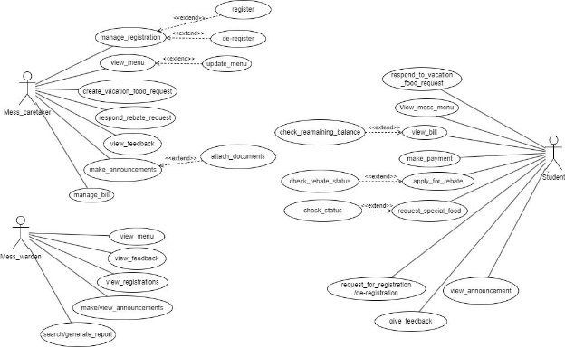
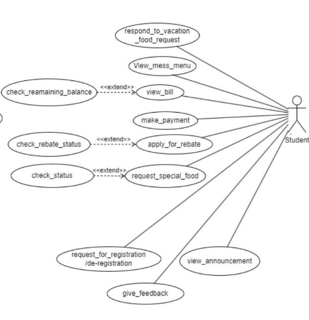
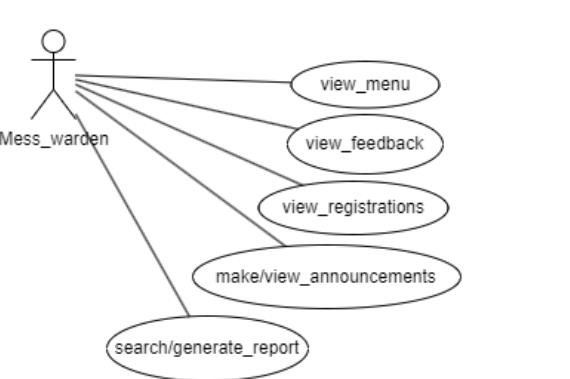
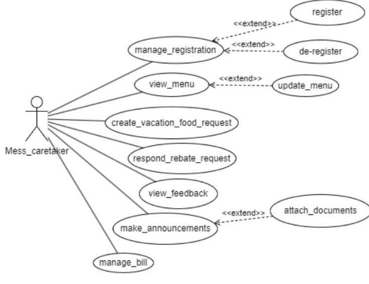

# FUSION ERP

## SOFTWARE REQUIREMENTS SPECIFICATION 

### SA-2 MESS MANAGEMENT SYSTEM (WEB)

**STUDENT MENTOR:** [HIMANSHU RANJAN](mailto:21bcs101@iiitdmj.ac.in) 21BCS101  
**FACULTY MENTOR:** DR. VIJAYPAL SINGH RATHOR  

**TEAM MEMBERS:** 
- **HARSHIT TIWARI**  21BCS096  
- **HARSHUL CHOUDHARY**  21BCS098  
- **HARSHUL NAWANI**  21BCS099  
- **HEMANT SINGH**  21BCS100  
- **HRITIK YADAV**  21BCS103  

---

### 1. Introduction

#### 1.1 Introduction about the Fusion – A Brief Description
Fusion is the ERP portal for IIITDM Jabalpur. It is a platform to integrate and elevate the day-to-day operations of the institute. This system integrates essential modules such as Academics, Mess Management, Hostel Management, and Complaint System to create a centralized digital ecosystem. Fusion optimizes administrative processes, improving accessibility and efficiency of operations, streamlining mess operations, and enhancing hostel management.  

The ERP portal serves as a platform for collaboration between students, faculty, and staff members of the institute, providing a user-friendly interface for a digitally enhanced IIITDM Jabalpur experience. It not only simplifies day-to-day tasks but also acts as a stage for an overall connected experience. Fusion’s role is pivotal in the institute’s future as a dynamic and evolving platform that adapts to the changing needs of IIITDM Jabalpur.

#### 1.2 Module Purpose
The Central Mess Management System discusses and aims to automate the day-to-day functioning of the mess and streamline all actors and activities involved with minimal errors. It aims to modernize and streamline mess operations within Fusion, the institute’s ERP portal. The software’s goals are to streamline administrative tasks, enhance user experience, and foster transparency by:  

- **Automating essential mess functionalities:** Replacing manual processes with digital solutions for tasks like menu planning, meal ordering, billing, and feedback management.  
- **Facilitating seamless user interaction:** Providing users with intuitive and interactive interfaces for mess registration, tracking expenses, booking meals, creating vacation rebate requests, etc.  
- **Offering Centralized Administration:** Unifying and automating administrative tasks to achieve efficiency and avoid redundancy and mistakes. Empowering staff with features like bill management, student mess allotment, complaint management, and feedback response management.  

#### 1.3 Scope of the Module
The users of this module will be the registered students of the Institute (PDPM IIITDM Jabalpur), the Mess Warden, and the Mess Caretaker of the Mess Committee. This software system will be a Web and App-based mess management system for the aforementioned users.  

The interface will enable students to register for the mess, log in, view the mess menu, respond to vacation food requests, apply for rebates, request special food, make payments, give feedback, view announcements, and request deregistration.  

The Mess Caretaker will manage registrations, make announcements, create vacation food requests, respond to vacation food requests, view feedback, manage student bills, and update the mess menu.  

The Mess Warden can make and view announcements, and also search or generate reports. This interface will help the Mess Caretaker and the Mess Warden coordinate, control, and allow users to view past records and access all mess functionalities without needing to visit the mess physically.

---

### 2. User/Actor Description (Characteristics)

**Module Users Include:**

1. **Student:**  
   - Individuals enrolled at the Institute (PDPM-IIITDM Jabalpur) and registered with the mess, having a roll number for distinctive identification.  
   - Access to the system is granted using an official institute email ID and the respective password.  
   - Must be registered with the mess to access inner mess functionalities.  

   **Functionalities:**  
   - Register and deregister for the mess.  
   - View the menu, mess bill, and other details.  
   - Make bill payments, ask for rebates, request special food, and provide feedback on various aspects of the mess.  

2. **Mess Caretaker:**  
   - The designated authority overseeing all mess activities, including registrations and announcements.  
   - Authentication through a unique email and phone number.  
   - The person can change, but the caretaker functionalities remain the same.  

   **Functionalities:**  
   - Respond to the registration/deregistration requests of students.  
   - Update the mess menu, create requests for vacation food, and respond to students’ rebate requests.  
   - View feedback, make announcements, and manage the monthly bill of the mess.  

3. **Mess Warden:**  
   - Faculty member overseeing Mess Meetings and handling budget requests.  
   - Oversees overall mess functionalities, and his decisions are final. Most of his decisions are directed by caretaker functionalities.  
   - Authentication via a unique email ID and phone number.  

   **Functionalities:**  
   - Check the menu, feedback, and registrations of students.  
   - Make announcements for registered students.  
   - Generate different reports with the available mess data.  

---

### 3. System Features

We specify the functional requirements for the module using use cases. The figures represent the use case diagrams for the module features.

**Complete System Use Case Diagram**  

**Subsystem Use Case Diagrams:**  

- **Student Use Case Diagram**  
  

- **Mess Warden Use Case Diagram**  
  

- **Mess Caretaker Use Case Diagram**  
  

**3.1 Functional Requirements** 

1. **Use Case #1** 

<table><tr><th colspan="1"><b>UC ID</b> </th><th colspan="2">UC#1 </th></tr>
<tr><td colspan="1"><b>Use case Name</b> </td><td colspan="2" valign="top"><b>request_for_registration/de-registration</b> </td></tr>
<tr><td colspan="1" valign="top"><b>Description</b> </td><td colspan="2">The student will post a request for the registration which will be viewed and approved/rejected by the Mess-Caretaker and can be viewed by Mess-Warden. </td></tr>
<tr><td colspan="1"><b>Actor</b> </td><td colspan="2">Student  </td></tr>
<tr><td colspan="1"><b>Preconditio n</b> </td><td colspan="2" valign="top">The student must be logged in. </td></tr>
<tr><td colspan="1" rowspan="2" valign="top"><b>Main Flow</b> </td><td colspan="1">1 </td><td colspan="1">The actor clicks the ‘Request Registration’ button. </td></tr>
<tr><td colspan="1">2 </td><td colspan="1">The actor gets a screen of the ‘Request is Posted’. </td></tr>
<tr><td colspan="1"><b>Post conditions</b> </td><td colspan="2" valign="top">Student gets notification of his registration and deregistration. </td></tr>
<tr><td colspan="1"><b>Alternate Flow</b> </td><td colspan="1"></td><td colspan="1" valign="top">NIL </td></tr>
<tr><td colspan="1"><b>Sub Flow</b> </td><td colspan="1"></td><td colspan="1">NIL </td></tr>
<tr><td colspan="1"><b>Global Alternate Flow</b> </td><td colspan="1" valign="top">GA 1 </td><td colspan="1" valign="top">The student returns to the main screen, on pressing the cancel button. </td></tr>
</table>

2. **Use Case #2** 

<table><tr><th colspan="1"><b>UC ID</b> </th><th colspan="2">UC#2 </th></tr>
<tr><td colspan="1"><b>Use case Name</b> </td><td colspan="2" valign="top"><b>view-menu</b> </td></tr>
<tr><td colspan="1" valign="top"><b>Description</b> </td><td colspan="2">The actor gets to view the menu for the week. The query from the actor is sent to the database where the data is read and is displayed on the screen. </td></tr>
<tr><td colspan="1"><b>Actor</b> </td><td colspan="2">Student , Mess Warden,  Mess Caretaker  </td></tr>
<tr><td colspan="1"><b>Preconditio n</b> </td><td colspan="2" valign="top">The actor must be logged in.. </td></tr>
<tr><td colspan="1" rowspan="2" valign="top"><b>Main Flow</b> </td><td colspan="1">1 </td><td colspan="1">The actor clicks the ‘view menu’ button. </td></tr>
<tr><td colspan="1">2 </td><td colspan="1">The actor gets a screen of the current menu. </td></tr>
<tr><td colspan="1"><b>Post conditions</b> </td><td colspan="2" valign="top">NIL </td></tr>
<tr><td colspan="1"><b>Alternate Flow</b> </td><td colspan="1"></td><td colspan="1" valign="top">NIL </td></tr>
<tr><td colspan="1"><b>Sub Flow</b> </td><td colspan="1"></td><td colspan="1">NIL </td></tr>
<tr><td colspan="1"><b>Global Alternate Flow</b> </td><td colspan="1" valign="top">GA 1 </td><td colspan="1" valign="top">The student returns to the main screen. </td></tr>
</table>

3. **Use Case #3** 

<table><tr><th colspan="1"><b>UC ID</b> </th><th colspan="1">UC#3 </th></tr>
<tr><td colspan="1"><b>Use case Name</b> </td><td colspan="2" valign="top"><b>view-bill</b> </td></tr>
<tr><td colspan="1"><b>Description</b> </td><td colspan="2">The student gets to view the bill and can check the remaining balance. </td></tr>
<tr><td colspan="1"><b>Actor</b> </td><td colspan="2">Student  </td></tr>
<tr><td colspan="1"><b>Preconditio n</b> </td><td colspan="2" valign="top">The actor must be logged in. </td></tr>
<tr><td colspan="1" rowspan="3" valign="top"><b>Main Flow</b> </td><td colspan="1">1 </td><td colspan="1">The actor clicks on the ‘view bill’ button. </td></tr>
<tr><td colspan="1">2 </td><td colspan="1">A list of monthly bills of mess is displayed on the screen. </td></tr>
<tr><td colspan="1">3 </td><td colspan="1">The actor can view any monthly bill. </td></tr>
<tr><td colspan="1"><b>Post conditions</b> </td><td colspan="2" valign="top">NIL </td></tr>
<tr><td colspan="1"><b>Alternate Flow</b> </td><td colspan="1" valign="top">[A1] </td><td colspan="1" valign="top">Students can check the remaining balance. </td></tr>
<tr><td colspan="1"><b>Sub Flow</b> </td><td colspan="1"></td><td colspan="1">NIL </td></tr>
<tr><td colspan="1"><b>Global Alternate Flow</b> </td><td colspan="1" valign="top">GA1 </td><td colspan="1" valign="top">The actor returns to the main screen. </td></tr>
</table>

4. **Use Case #4** 

<table><tr><th colspan="1"><b>UC ID</b> </th><th colspan="2">UC#4 </th></tr>
<tr><td colspan="1"><b>Use case Name</b> </td><td colspan="2" valign="top"><b>give_feedback</b> </td></tr>
<tr><td colspan="1"><b>Description</b> </td><td colspan="2">The student can give feedback for the services and can also view recent feedbacks. </td></tr>
<tr><td colspan="1"><b>Actor</b> </td><td colspan="2">Student </td></tr>
<tr><td colspan="1"><b>Preconditio n</b> </td><td colspan="2" valign="top">The student must be logged in and must be registered with the mess. </td></tr>
<tr><td colspan="1" rowspan="3" valign="top"><b>Main Flow</b> </td><td colspan="1">1 </td><td colspan="1">The student clicks on the ‘feedback’ button. </td></tr>
<tr><td colspan="1">2 </td><td colspan="1">The feedback form is opened. </td></tr>
<tr><td colspan="1">3 </td><td colspan="1">The student fills in the feedback form  and submits it.[A1] </td></tr>
<tr><td colspan="1"><b>Post conditions</b> </td><td colspan="2" valign="top">The feedback details are added in the database and are notified to the mess caretaker. </td></tr>
<tr><td colspan="1"><b>Alternate Flow</b> </td><td colspan="1" valign="top">A1 </td><td colspan="1">User will again be prompted to the same form with the message“some error occurred”. </td></tr>
<tr><td colspan="1"></td><td colspan="1"></td><td colspan="1"></td></tr>
<tr><td colspan="1"><b>Sub Flow</b> </td><td colspan="1"></td><td colspan="1">NIL </td></tr>
<tr><td colspan="1"><b>Global Alternate Flow</b> </td><td colspan="1" valign="top">GA 1 </td><td colspan="1" valign="top">The actor returns to the main screen abandoning any intermediate operation. </td></tr>
</table>

5. **Use Case #5** 

<table><tr><th colspan="1"><b>UC ID</b> </th><th colspan="1">UC#5 </th></tr>
<tr><td colspan="1"><b>Use case Name</b> </td><td colspan="2" valign="top"><b>respond_to_vacation_food_request</b> </td></tr>
<tr><td colspan="1" valign="top"><b>Description</b> </td><td colspan="2">The student can respond to the request generated by the Mess-Caretaker regarding registration for food during vacation. </td></tr>
<tr><td colspan="1"><b>Actor</b> </td><td colspan="2">Student </td></tr>
<tr><td colspan="1"><b>Preconditio n</b> </td><td colspan="2" valign="top">The student must be logged in and must be registered with the mess. </td></tr>
<tr><td colspan="1" rowspan="3" valign="top"><b>Main Flow</b> </td><td colspan="1" valign="top">1 </td><td colspan="1">` `The student responds to the request generated by the Mess-Caretaker button(“Yes” or “No”).[A1][A2] </td></tr>
<tr><td colspan="1">2 </td><td colspan="1">The vacation food application is displayed </td></tr>
<tr><td colspan="1">3 </td><td colspan="1">The student fills in the required details and submits it. </td></tr>
<tr><td colspan="1"><b>Post conditions</b> </td><td colspan="2" valign="top">The vacation food details are updated in the database. </td></tr>
<tr><td colspan="1" rowspan="2" valign="top"><b>Alternate Flow</b> </td><td colspan="1">A1 </td><td colspan="1" valign="top">If a student  selects the “Yes” option then he/she will need to fill the form. </td></tr>
<tr><td colspan="1">A2 </td><td colspan="1" valign="top">If a student  selects “No” then the student will not be registered for vacation food. </td></tr>
<tr><td colspan="1" valign="top"><b>Sub Flow</b> </td><td colspan="1"></td><td colspan="1" valign="top">NIL </td></tr>
<tr><td colspan="1"><b>Global Alternate Flow</b> </td><td colspan="1" valign="top">GA 1 </td><td colspan="1" valign="top">The user returns to the initial screen. </td></tr>
</table>

6. **Use Case #6** 

<table><tr><th colspan="1"><b>UC ID</b> </th><th colspan="2">UC#6 </th></tr>
<tr><td colspan="1"><b>Use case Name</b> </td><td colspan="2" valign="top"><b>apply_for_rebate</b> </td></tr>
<tr><td colspan="1" valign="top"><b>Description</b> </td><td colspan="2">The student can fill a rebate application form stating the duration and purpose of leave which will be approved/rejected by the mess caretaker. </td></tr>
<tr><td colspan="1"><b>Actor</b> </td><td colspan="2">Student  </td></tr>
<tr><td colspan="1"><b>Preconditio n</b> </td><td colspan="2" valign="top">The student must be logged in. </td></tr>
<tr><td colspan="1" rowspan="4" valign="top"><b>Main Flow</b> </td><td colspan="1">1 </td><td colspan="1">The student clicks on the ‘apply for rebate’ button </td></tr>
<tr><td colspan="1">2 </td><td colspan="1">A rebate application form is displayed. </td></tr>
<tr><td colspan="1">3 </td><td colspan="1">The actor fills in the necessary details </td></tr>
<tr><td colspan="1">4 </td><td colspan="1">Student then clicks on the submit button. </td></tr>
<tr><td colspan="1" valign="top"><b>Post conditions</b> </td><td colspan="2">
The leave request details are added in the database and are notified to the mess caretaker. 

The student can view the rebate status through the ”check rebate status” button. 
</td></tr>
<tr><td colspan="1"><b>Alternate Flow</b> </td><td colspan="1"></td><td colspan="1" valign="top">NIL </td></tr>
<tr><td colspan="1"><b>Sub Flow</b> </td><td colspan="1"></td><td colspan="1">NIL </td></tr>
<tr><td colspan="1"><b>Global Alternate Flow</b> </td><td colspan="1" valign="top">GA 1 </td><td colspan="1" valign="top">The actor returns to the main screen abandoning any intermediate operation. </td></tr>
</table>

7. **Use Case #7** 

<table><tr><th colspan="1"><b>UC ID</b> </th><th colspan="1">UC#7 </th></tr>
<tr><td colspan="1"><b>Use case Name</b> </td><td colspan="1" valign="top"><b>check_rebate_status</b> </td></tr>
<tr><td colspan="1" valign="top"><b>Description</b> </td><td colspan="2">The student gets to view the status of his rebate i.e whether the rebate has been approved, rejected or is still in process. </td></tr>
<tr><td colspan="1"><b>Actor</b> </td><td colspan="2">Student  </td></tr>
<tr><td colspan="1"><b>Preconditio n</b> </td><td colspan="2" valign="top">The student must be logged in and registered in the mess. </td></tr>
<tr><td colspan="1" rowspan="2" valign="top"><b>Main Flow</b> </td><td colspan="1">1 </td><td colspan="1">The student clicks the ‘check rebate status’ button. </td></tr>
<tr><td colspan="1" valign="top">2 </td><td colspan="1">The list of all the applied leaves are displayed along with status i.e. approved,rejected or processing. </td></tr>
<tr><td colspan="1"><b>Post conditions</b> </td><td colspan="2" valign="top">NIL </td></tr>
<tr><td colspan="1"><b>Alternate Flow</b> </td><td colspan="1"></td><td colspan="1" valign="top">NIL </td></tr>
<tr><td colspan="1"><b>Sub Flow</b> </td><td colspan="1"></td><td colspan="1">NIL </td></tr>
<tr><td colspan="1"><b>Global Alternate Flow</b> </td><td colspan="1" valign="top">GA 1 </td><td colspan="1" valign="top">The actor returns to the main screen abandoning any intermediate operation. </td></tr>
</table>

8. **Use Case #8** 

<table><tr><th colspan="1"><b>UC ID</b> </th><th colspan="2">UC#8 </th></tr>
<tr><td colspan="1"><b>Use case Name</b> </td><td colspan="2" valign="top"><b>request_special_food</b> </td></tr>
<tr><td colspan="1" valign="top"><b>Description</b> </td><td colspan="2">This request is made when either people are sick or there is some festival. The student can fill an application stating the requested food, with the date and duration for which it is to be made available. </td></tr>
<tr><td colspan="1"><b>Actor</b> </td><td colspan="2">Student </td></tr>
<tr><td colspan="1"><b>Preconditio n</b> </td><td colspan="2" valign="top">The student must be logged in. </td></tr>
<tr><td colspan="1" rowspan="3" valign="top"><b>Main Flow</b> </td><td colspan="1">1 </td><td colspan="1">The student clicks on the ‘special food’ button. </td></tr>
<tr><td colspan="1">2 </td><td colspan="1">A special food request form is displayed. </td></tr>
<tr><td colspan="1">3 </td><td colspan="1">The student fills in the required details and submits it.[A1] </td></tr>
<tr><td colspan="1"><b>Post conditions</b> </td><td colspan="2" valign="top">The request is notified to the mess caretaker. </td></tr>
<tr><td colspan="1"><b>Alternate Flow</b> </td><td colspan="1" valign="top">A1 </td><td colspan="1" valign="top">The process can be terminated at any time by clicking on the cancel button. </td></tr>
<tr><td colspan="1"><b>Sub Flow</b> </td><td colspan="1"></td><td colspan="1">NIL </td></tr>
<tr><td colspan="1"><b>Global Alternate Flow</b> </td><td colspan="1" valign="top">GA 1 </td><td colspan="1" valign="top">The user returns to the initial screen. </td></tr>
</table>

9. **Use Case #9** 

|**UC ID** |UC#9 |
| - | - |
|**Use case Name** |**view\_feedback** |

<table><tr><th colspan="1" valign="top"><b>Description</b> </th><th colspan="2">The Mess warden, caretaker  can view the feedbacks of both the mess given by the students. </th></tr>
<tr><td colspan="1"><b>Actor</b> </td><td colspan="2">Mess warden, Mess Caretaker </td></tr>
<tr><td colspan="1"><b>Preconditio n</b> </td><td colspan="2" valign="top">The user must be logged in as a mess warden or mess caretaker. </td></tr>
<tr><td colspan="1" rowspan="2" valign="top"><b>Main Flow</b> </td><td colspan="1">1 </td><td colspan="1">List of feedbacks would be displayed on the screen. </td></tr>
<tr><td colspan="1">2 </td><td colspan="1">Warden can select any feedback and review it. </td></tr>
<tr><td colspan="1"><b>Post conditions</b> </td><td colspan="2" valign="top">NIL </td></tr>
<tr><td colspan="1"><b>Alternate Flow</b> </td><td colspan="1"></td><td colspan="1" valign="top">NIL </td></tr>
<tr><td colspan="1"><b>Sub Flow</b> </td><td colspan="1"></td><td colspan="1">NIL </td></tr>
<tr><td colspan="1"><b>Global Alternate Flow</b> </td><td colspan="1" valign="top">GA 1 </td><td colspan="1" valign="top">The user returns to the Dashboard, procedure aborted(initial screen). </td></tr>
</table>

10. **Use Case #10** 

<table><tr><th colspan="1"><b>UC ID</b> </th><th colspan="2">UC#10 </th></tr>
<tr><td colspan="1"><b>Use case Name</b> </td><td colspan="2" valign="top"><b>update_menu</b> </td></tr>
<tr><td colspan="1"><b>Description</b> </td><td colspan="2">The menu as per requirement is updated by mess caretaker.. </td></tr>
<tr><td colspan="1"><b>Actor</b> </td><td colspan="2">Mess Caretaker </td></tr>
<tr><td colspan="1"><b>Preconditio n</b> </td><td colspan="2" valign="top">The caretaker must be logged in. </td></tr>
<tr><td colspan="1" rowspan="3" valign="top"><b>Main Flow</b> </td><td colspan="1">1 </td><td colspan="1">The caretaker clicks on the update menu button. </td></tr>
<tr><td colspan="1">2 </td><td colspan="1">The caretaker sees the current menu, every cell of the table is editable. </td></tr>
<tr><td colspan="1" valign="top">2 </td><td colspan="1">Caretaker can add/delete/replace a food item in the menu. He then presses submit. </td></tr>
<tr><td colspan="1"><b>Post conditions</b> </td><td colspan="2" valign="top">The changes made in the menu are updated in the database.  </td></tr>
<tr><td colspan="1"><b>Alternate Flow</b> </td><td colspan="1"></td><td colspan="1" valign="top">NIL</td></tr>
<tr><td colspan="1" valign="top"><b>Sub Flow</b> </td><td colspan="1"></td><td colspan="1" valign="top">NIL </td></tr>
<tr><td colspan="1"><b>Global Alternate Flow</b> </td><td colspan="1" valign="top">GA 1 </td><td colspan="1" valign="top">The mess caretaker returns to the main screen abandoning any intermediate process. No changes are applied and original menu is rolled back. </td></tr>
</table>

11. **Use Case #11** 

|**UC ID** |UC#11 ||
| - | - | :- |
|**Use case Name** |**respond\_rebate\_request** ||
|**Description** |The mess caretaker can respond to the rebate requests made by the students. ||
|**Actor** |Mess caretaker  ||
|**Preconditio n** |The mess caretaker must be logged in. There must be a pending rebate request. ||
|**Main Flow** |1 |The mess caretaker clicks on the field of view rebates. |

<table><tr><th colspan="1" rowspan="2"></th><th colspan="1">2 </th><th colspan="1">It sees all the rebate requests made by the students. </th></tr>
<tr><td colspan="1" valign="top">3 </td><td colspan="1">Caretaker can either approve or reject the request on the basis of the purpose and duration.[S1] </td></tr>
<tr><td colspan="1"><b>Post conditions</b> </td><td colspan="2" valign="top">The rebate details are updated in the database. </td></tr>
<tr><td colspan="1"><b>Alternate Flow</b> </td><td colspan="1"></td><td colspan="1" valign="top">NIL</td></tr>
<tr><td colspan="1" valign="top"><b>Sub Flow</b> </td><td colspan="1">S1 </td><td colspan="1" valign="top">The student gets notified about the status of its application. </td></tr>
<tr><td colspan="1"><b>Global Alternate Flow</b> </td><td colspan="1" valign="top">GA 1 </td><td colspan="1" valign="top">The mess caretaker returns to the main screen abandoning any intermediate process. </td></tr>
</table>

12. **Use case#12** 

<table><tr><th colspan="1"><b>UC ID</b> </th><th colspan="2">UC#12 </th></tr>
<tr><td colspan="1"><b>Use case Name</b> </td><td colspan="2" valign="top"><b>create_vacation_food_request</b> </td></tr>
<tr><td colspan="1" valign="top"><b>Description</b> </td><td colspan="2">The mess caretaker will create a “vacation food request” for students. Those students who want to apply for vacation food can respond to it by “Yes” and others no need to respond. </td></tr>
<tr><td colspan="1"><b>Actor</b> </td><td colspan="2">Mess Caretaker  </td></tr>
<tr><td colspan="1"><b>Preconditio n</b> </td><td colspan="2" valign="top">The mess caretaker must be logged in. </td></tr>
<tr><td colspan="1" rowspan="3" valign="top"><b>Main Flow</b> </td><td colspan="1">1 </td><td colspan="1">` `The mess caretaker clicks on  create vacation food request button . </td></tr>
<tr><td colspan="1">2 </td><td colspan="1">Notification will be sent to the students. They will respond to it. </td></tr>
<tr><td colspan="1">3 </td><td colspan="1">Caretaker will get the list of students who have responded “Yes”. </td></tr>
<tr><td colspan="1"></td><td colspan="1" valign="top">4 </td><td colspan="1">Caretaker will check their balance and request for payment if sufficient amount is not available.[S1] </td></tr>
<tr><td colspan="1"><b>Post conditions</b> </td><td colspan="2" valign="top">The  details are updated in the database. </td></tr>
<tr><td colspan="1"><b>Alternate Flow</b> </td><td colspan="1"></td><td colspan="1" valign="top">NIL</td></tr>
<tr><td colspan="1" valign="top"><b>Sub Flow</b> </td><td colspan="1" valign="top">S1 </td><td colspan="1">Student gets notification about the amount for the payment to be made in vacation. </td></tr>
<tr><td colspan="1"><b>Global Alternate Flow</b> </td><td colspan="1" valign="top">GA 1 </td><td colspan="1" valign="top">The mess caretaker returns to the main screen abandoning any intermediate process. </td></tr>
</table>

13. **Use case#13** 

|**UC ID** |UC#13 |
| - | - |
|**Use case Name** |**make\_announcements** |
|**Description** |Mess Caretaker or Mess Warden can make important announcements and every actor involved in the mess module can view it. |
|**Actor** |Mess Caretaker, Mess Warden |
|**Preconditio n** |The mess caretaker  must be logged in. |

<table><tr><th colspan="1" rowspan="2" valign="top"><b>Main Flow</b> </th><th colspan="1">1 </th><th colspan="1">The actor clicks on the Make Announcement button. </th></tr>
<tr><td colspan="1">2 </td><td colspan="1">Actor then types the message and clicks on the submit button. </td></tr>
<tr><td colspan="1"><b>Post conditions</b> </td><td colspan="2" valign="top">Announcements are made and registered Students are notified. </td></tr>
<tr><td colspan="1"><b>Alternate Flow</b> </td><td colspan="1"></td><td colspan="1" valign="top">NIL</td></tr>
<tr><td colspan="1" valign="top"><b>Sub Flow</b> </td><td colspan="1"></td><td colspan="1" valign="top">NIL </td></tr>
<tr><td colspan="1"><b>Global Alternate Flow</b> </td><td colspan="1" valign="top">GA 1 </td><td colspan="1" valign="top">The mess caretaker returns to the main screen abandoning any intermediate process. </td></tr>
</table>

14. **Use case#14**

<table><tr><th colspan="1"><b>UC ID</b> </th><th colspan="2">UC#14 </th></tr>
<tr><td colspan="1"><b>Use case Name</b> </td><td colspan="2" valign="top"><b>view_announcements</b> </td></tr>
<tr><td colspan="1"><b>Description</b> </td><td colspan="2">Students , Warden and caretaker can view announcements made by different entities.. </td></tr>
<tr><td colspan="1"><b>Actor</b> </td><td colspan="2">Students, Mess Warden, Mess Caretaker  </td></tr>
<tr><td colspan="1"><b>Preconditio n</b> </td><td colspan="2" valign="top">Students, Mess warden, Mess caretaker  must be logged in. </td></tr>
<tr><td colspan="1" rowspan="2" valign="top"><b>Main Flow</b> </td><td colspan="1">1 </td><td colspan="1">The actor clicks on the View Announcement button. </td></tr>
<tr><td colspan="1">2 </td><td colspan="1">Actor can view the announcements made by the caretaker/warden. </td></tr>
<tr><td colspan="1"><b>Post conditions</b> </td><td colspan="2" valign="top">NIL </td></tr>
<tr><td colspan="1"><b>Alternate Flow</b> </td><td colspan="1"></td><td colspan="1" valign="top">NIL</td></tr>
<tr><td colspan="1" valign="top"><b>Sub Flow</b> </td><td colspan="1"></td><td colspan="1" valign="top">NIL </td></tr>
<tr><td colspan="1"><b>Global Alternate Flow</b> </td><td colspan="1" valign="top">GA 1 </td><td colspan="1" valign="top">Students, Mess warden returns to the main screen abandoning any intermediate process. </td></tr>
</table>

15. **Use case#15** 

<table><tr><th colspan="1"><b>UC ID</b> </th><th colspan="2">UC#15 </th></tr>
<tr><td colspan="1"><b>Use case Name</b> </td><td colspan="2" valign="top"><b>manage_bill</b> </td></tr>
<tr><td colspan="1"><b>Description</b> </td><td colspan="2">The mess caretaker manages the monthly bill of every student. </td></tr>
<tr><td colspan="1"><b>Actor</b> </td><td colspan="2">Mess Caretaker </td></tr>
<tr><td colspan="1"><b>Preconditio n</b> </td><td colspan="2" valign="top">The user must be logged in as a mess caretaker. </td></tr>
<tr><td colspan="1" rowspan="2" valign="top"><b>Main Flow</b> </td><td colspan="1">1 </td><td colspan="1">Mess Caretaker clicks on generate bill button. </td></tr>
<tr><td colspan="1">2 </td><td colspan="1">Mess Caretaker then generates a bill on the basis of rebate history. </td></tr>
</table>

|**Post conditions** |Data is then stored in Database and Students are notified. ||
| :- | - | :- |
|**Alternate Flow** |A1|NIL|
|||**Post condition** : Mess Caretaker returns to initial screen. |
|**Sub Flow** ||NIL |
|**Global Alternate Flow** |GA 1 |The system stops the procedure and returns to the initial screen. |

16. **Use case#16** 

<table><tr><th colspan="1"><b>UC ID</b> </th><th colspan="2">UC#16 </th></tr>
<tr><td colspan="1"><b>Use case Name</b> </td><td colspan="2" valign="top"><b>view_registrations</b> </td></tr>
<tr><td colspan="1"><b>Description</b> </td><td colspan="2">Mess Warden can view a list of students registered for Mess. </td></tr>
<tr><td colspan="1"><b>Actor</b> </td><td colspan="2">Mess Warden  </td></tr>
<tr><td colspan="1"><b>Preconditio n</b> </td><td colspan="2" valign="top">Mess warden  must be logged in. </td></tr>
<tr><td colspan="1" rowspan="2" valign="top"><b>Main Flow</b> </td><td colspan="1">1 </td><td colspan="1">The actor clicks on the View Registrations button. </td></tr>
<tr><td colspan="1">2 </td><td colspan="1">Actor can see the list of registered students. </td></tr>
<tr><td colspan="1"><b>Post conditions</b> </td><td colspan="2" valign="top">NIL </td></tr>
<tr><td colspan="1"><b>Alternate Flow</b> </td><td colspan="1"></td><td colspan="1" valign="top">NIL</td></tr>
<tr><td colspan="1" valign="top"><b>Sub Flow</b> </td><td colspan="1"></td><td colspan="1" valign="top">NIL </td></tr>
<tr><td colspan="1"><b>Global Alternate Flow</b> </td><td colspan="1" valign="top">GA 1 </td><td colspan="1" valign="top">Mess warden returns to the main screen abandoning any intermediate process. </td></tr>
</table>

17. **Use case#17** 

|**UC ID** |UC#17 |
| - | - |
|**Use case Name** |**manage\_registrations** |

|**Description** |Mess Caretaker can view a list of students applied  for registration and can register and de register any particular student . ||
| - | :- | :- |
|**Actor** |Mess Caretaker  ||
|**Preconditio n** |Mess Caretaker  must be logged in. ||
|**Main Flow** |1 |The actor clicks on the View Registrations button. |
||2 |List of Students with register and deregister options become available.[A1][A2] |
|**Post conditions** |The selected student is registered or deregistered from the mess. ||
|**Alternate Flow** |A1 |Mess Caretaker clicks on register button available from the list of students available|
||A2 |Mess Caretaker clicks on deregister button to de register a student. |
|**Sub Flow** ||NIL |
|**Global Alternate Flow** |GA 1 |Mess Caretaker returns to the main screen abandoning any intermediate process. |

18. **Use case#18** 

<table><tr><th colspan="1"><b>UC ID</b> </th><th colspan="2">UC#18 </th></tr>
<tr><td colspan="1"><b>Use case Name</b> </td><td colspan="2" valign="top"><b>search/generate report</b> </td></tr>
<tr><td colspan="1"><b>Description</b> </td><td colspan="2">Mess Warden can search for any student record and generate reports. </td></tr>
<tr><td colspan="1"><b>Actor</b> </td><td colspan="2">Mess Warden  </td></tr>
<tr><td colspan="1"><b>Preconditio n</b> </td><td colspan="2" valign="top">Mess warden  must be logged in. </td></tr>
<tr><td colspan="1" rowspan="2" valign="top"><b>Main Flow</b> </td><td colspan="1">1 </td><td colspan="1">The actor can search in the search box. </td></tr>
<tr><td colspan="1">2 </td><td colspan="1">The Actor can click on the generate report button for requested data. </td></tr>
<tr><td colspan="1"><b>Post conditions</b> </td><td colspan="2" valign="top">NIL </td></tr>
<tr><td colspan="1"><b>Alternate Flow</b> </td><td colspan="1"></td><td colspan="1" valign="top">NIL</td></tr>
<tr><td colspan="1" valign="top"><b>Sub Flow</b> </td><td colspan="1"></td><td colspan="1" valign="top">NIL </td></tr>
<tr><td colspan="1"><b>Global Alternate Flow</b> </td><td colspan="1" valign="top">GA 1 </td><td colspan="1" valign="top">Mess warden returns to the main screen abandoning any intermediate process. </td></tr>
</table>
### 3. Other Functional Requirements

- The module will utilize the notification system for sending notifications and alerts to various actors involved in the module for requests, confirmations, rejections, modifications, etc.
- The module will integrate with a payment gateway to enable students to pay their mess fees.
- The Super Admin of Fusion should have the ability to assign roles to the Mess Caretaker and Mess Warden.

---

### 4. Other Constraints

#### 4.1 User Interfaces
- The user interface must comply with the color scheme and dashboard design of the FUSION portal.
- Users should be able to navigate easily from one menu to another, ensuring smooth inter-module navigation.
- All functionalities should be user-friendly, requiring no specific training for usage.

#### 4.2 Tech Stack Used
- **Backend Framework:** Django (Python 3.8) with server-side rendering.
- **Database:** PostgreSQL.

#### 4.3 Business Rules
- Only registered students can use the functionalities of the module; unregistered students can view the mess menu and request registration.
- The bill for the current month will be generated on the first day of the next month, calculated based on rebate details and the base amount set for the current month.

---

### 5. Non-Functional Requirements

#### 5.1 Performance
- The system should respond quickly to user actions (loading pages, submitting forms, etc.).
- Response times should meet industry standards for web applications.
- The system should be available 24/7 with minimal downtime for scheduled maintenance.

#### 5.2 Scalability
- The system should accommodate the growing needs of the institute, including an increasing user base and data volume.

#### 5.3 Security
- Secure login and access control mechanisms must be implemented to ensure only authorized users can access specific features.
- User data (personal information, meal bookings, financial transactions) must be encrypted and protected from unauthorized access.
- All user activities and system events should be logged for audit trails and accountability.
- Regular log reviews and incident response procedures should be established.

#### 5.4 Usability
- The interface should be user-friendly, intuitive, and visually appealing for all user groups (students, staff, faculty).
- Navigation should be simple and consistent across modules.
- The design must be responsive for an optimal experience on different devices.
- Consistent design must be applied throughout the website.
- Contextual help documentation should be readily available within the module.
- Contact information for technical support should be easily accessible.

#### 5.5 Maintainability
- The system should be designed modularly to facilitate updates, bug fixes, and future enhancements.
- Code must be well-documented and organized for easy maintenance.
- A version control system should be used to track changes and manage software releases.
- Automated testing routines should be implemented to ensure the functionality and stability of the system.

---

### 6. Module Dependencies with Other Fusion Modules

#### 6.1 Database Dependencies
- This module utilizes the student database to retrieve student information and store related data. Additional fields will be added to the student database, creating a separate mess database in PostgreSQL.
- The major relational table used in this module is the Students Table.

#### 6.2 Dependencies with Other Modules
1. **Notification Module**
   - The notification module will work closely with this module, handling notifications sent and generated by the Caretaker and Warden, ensuring that these notifications are properly displayed on the dashboard within the required timeframe. Other necessary notifications related to the mess will also be shown to the Mess Caretaker and Mess Warden.

2. **Dashboard Module**
   - This module will manage transaction processes for password change requests and other admin requests made by the Mess Module. It will also oversee the routing when the Mess Warden and Mess Caretaker roles change.

3. **Super Admin Functions**
   - The Super Admin will check and assign roles to the respective individuals. It will also add new students to the student database and manage the removal of students.

4. **Payment Gateway Provider**
   - This module will handle mess payments made by students. When a student presses the payment button, they will be directed to the payment gateway to complete the payment. After successful payment, the gateway will provide an acknowledgment, which will be processed by the mess module to update the student’s amount details in the database.
