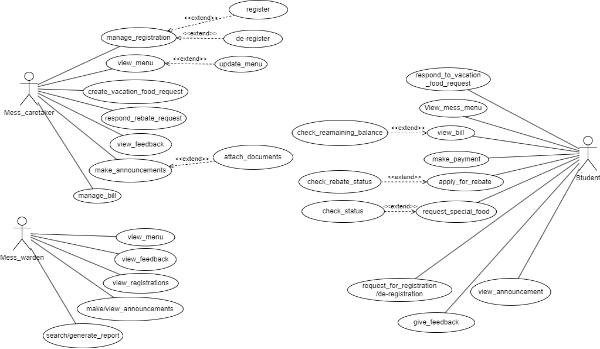
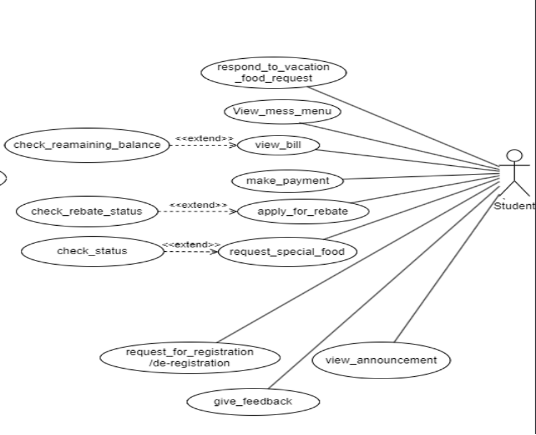
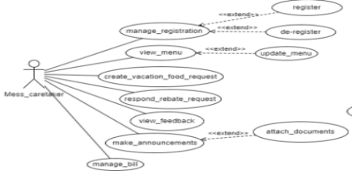
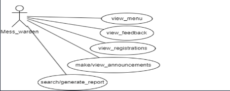

# Figma Profiles for SA-2 Mess Management

## 1. Module Description

The module is developed for the convenience of registered students, the Mess Caretaker, the Mess Warden, and Students at **PDPM IIITDM Jabalpur**. It’s an Android application dedicated to the efficient management of the institute’s mess.

Students can leverage the app to:
- Sign in
- Browse the menu
- Apply for leave
- Order special request meals
- Submit feedback
- View announcements

The app’s administrative capabilities include:
- Tracking student bills
- Refreshing the menu
- Monitoring stock and budget details
- Overseeing guest entries
- Addressing student requests

This module is designed to simplify mess operations, enable remote access to its services, and foster better communication among stakeholders. A relational database will handle data management, storing details such as menu items, bills, student IDs, consumption data, and feedback.

### Use Case Diagram

## 2. Actors 

### 2.1 Student

**Functionalities of the Student:**
- Registers, de-registers, checks remaining balance, views bill, makes payment
- Applies for rebate, checks rebate status, requests special food, and checks its status
- Responds to vacation food requests
- Views mess menu and announcements
- Requests registration/deregistration and provides feedback

#### Use Case Diagram

**Figma Profile Link:**  
[Figma Profile (Student)](https://www.figma.com/file/umlsAp8prP466qPLmDvlgc/PR_Project?type=design&node-id=0-1&mode=design&t=XLT2K5SxoXxufsaU-0)

---

### 2.2 Mess Caretaker

**Functionalities of the Mess Caretaker:**
- Manages registration and de-registration of students
- Views and updates the menu
- Creates vacation food requests and responds to rebate requests
- Views feedback and makes announcements
- Manages bills

#### Use Case Diagram

**Figma Profile Link:**  
[Figma Profile (Mess Caretaker)](https://www.figma.com/file/umlsAp8prP466qPLmDvlgc/PR_Project?type=design&node-id=7-67&mode=design&t=XLT2K5SxoXxufsaU-0)

---

### 2.3 Mess Warden

**Functionalities of the Mess Warden:**
- Views the menu, feedback, registrations, and announcements
- Makes announcements
- Searches or generates reports

#### Use Case Diagram

**Figma Profile Link:**  
[Figma Profile (Mess Warden)](https://www.figma.com/file/umlsAp8prP466qPLmDvlgc/PR_Project?type=design&node-id=7-66&mode=design&t=XLT2K5SxoXxufsaU-0)

---

## 3. Figma Profile Design Guidelines and Additional Considerations

### 3.1 Cross-Platform Compatibility
- Verify that Figma designs and features are compatible across both web and app versions.

### 3.2 Dimension Standardization
- Ensure all Figma designs have the same dimensions: **1920 x 1080** for web and around **360px width** for mobile.

## 4. Actor-oriented Use Case-Based Design

- Strictly base all Figma designs on use cases of actors and maintain consistency with previous and newly added designs.
- Each actor should have a different page in Figma.
- If the Figma profiles already exist, ensure all actors have their own Figma profiles and wireframe those across all use cases for that actor.

### Reference Link
Figma link (only) for reference (Figma profiles created by the previous batch):  
[Fusion APP](https://www.figma.com/file/pzhw34xBvEK0hm5Yx4bh0P/Fusion-APP?type=design&node-id=0%3A1&mode=design&t=J0f6T5YoUiKbp17u-1)
