# SA-3 Gymkhana Module (Web) API Report Assignment – 02

### Mentor:  
**Vijaypal Singh Rathor**

### Team:  
- **Anurag Goswami** - 21BCS028 [MENTOR]  
- **Shobhit Kushwaha** - 21BCS194  
- **Rishabh Sharma** - 21BCS174  
- **Rohit Raj** - 21BCS178  
- **Rohan Parmar** - 21BCS176  
- **Pullivarthi Mahesh** - 21BCS168  

---

## Use Cases Left to Be Implemented According to Use Case Model

|   |   |
|---|---|
|   |   |
|   |   |
|   |   |
|   |   |
|   |   |
|   |   |
|   |   |

---

## Overview

**Fusion ERP** is an online web service portal that provides a centralized platform for accessing, collecting, and managing various services related to an institute's operations, especially concerning the student body. The services include: 
- Course Registration and Management 
- Mess Committee 
- Gymkhana 
- Examination 
- Hostel Management 
- Placement Cell 
- Primary Health Centre (PHC) 
- Other departments supporting student activities.

---

## Purpose of Gymkhana Web Module

The Gymkhana web module is part of the online web service portal responsible for the following:

1. Viewing details of all club activities, including their calendar, current coordinators, and members.
2. Submitting applications for new clubs and applying for membership in existing clubs through detailed forms.
3. Users (students and faculty) can view ongoing or upcoming club sessions and events.
4. Accessing public details related to current and previous club members.
5. Participating in elections and requesting nominations for club head figures.

---

## Scope of the Module Functionalities

- Hold Elections
- Ask for Nominations
- View Club Details
- View Member Records
- Form New Clubs
- Apply for Membership in Clubs
- Appoint Club Coordinators
- Allocate Budgets to Clubs
- Create and View Club Sessions and Events

### Actors:
- Dean
- Counsellor
- Convener
- Club Coordinator
- Student

---

## Use Case Diagram
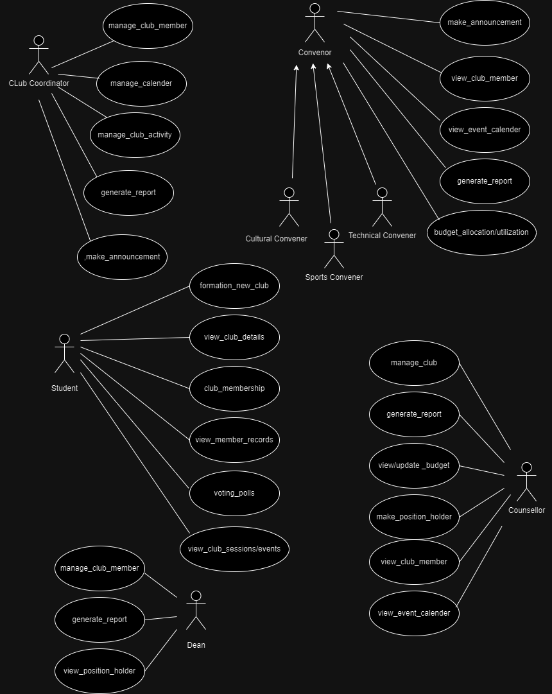

---

## API Status Report

### 1. **API:** [http://127.0.0.1:8000/gymkhana/api/voting_polls](http://127.0.0.1:8000/gymkhana/api/voting_polls)

- **Status:** Not working
- **Reasons:**
  - CSRF Token Failure.
  - CSRF Token not sent in request headers from the frontend.
  - Resource may be accessible only by superusers (club admins) or token expiry time may be too short.
- **Status Code:** 401 Unauthorized Access
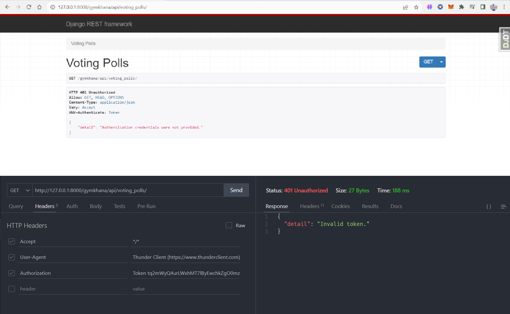

---

### 2. **API:** [http://127.0.0.1:8000/gymkhana/api/new_club](http://127.0.0.1:8000/gymkhana/api/new_club)

- **Status:** Not working
- **Reasons:**
  - CSRF Token Failure.
  - CSRF Token not sent in request headers from the frontend.
  - Resource may be accessible only by superusers (club admins) or token expiry time may be too short.
- **Status Code:** 401 Unauthorized Access
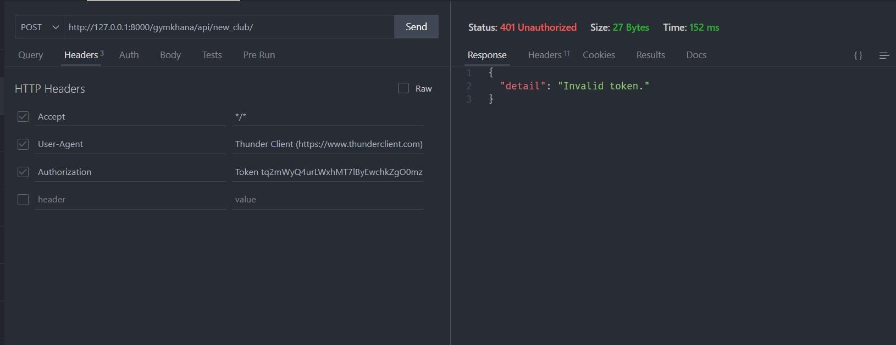
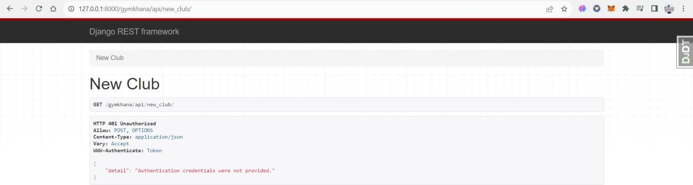

---

### 3. **API:** [http://127.0.0.1:8000/gymkhana/clubname](http://127.0.0.1:8000/gymkhana/clubname)

- **Status:** Not working
- **Reasons:**
  - CSRF Token Failure.
  - CSRF Token not sent in request headers from the frontend.
  - Resource may be accessible only by superusers (club admins) or token expiry time may be too short.
- **Status Code:** 401 Unauthorized Access
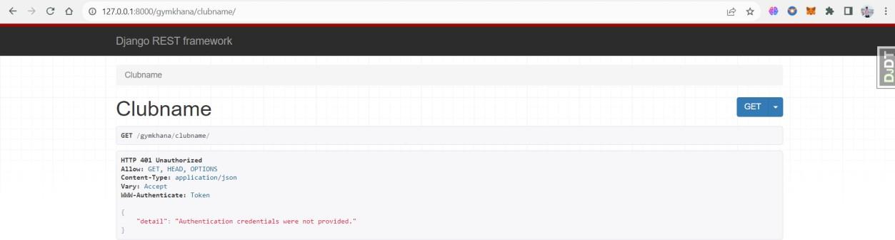

---

### 4. **API:** [http://127.0.0.1:8000/gymkhana](http://127.0.0.1:8000/gymkhana)

- **Status:** Working
- **Status Code:** 200 Success
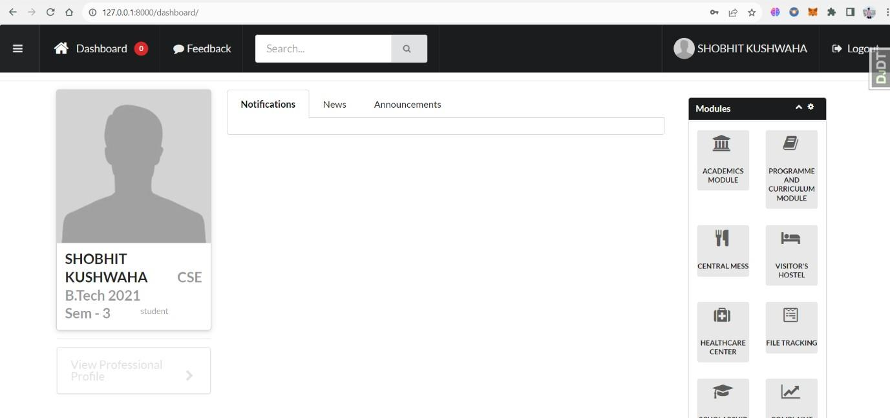
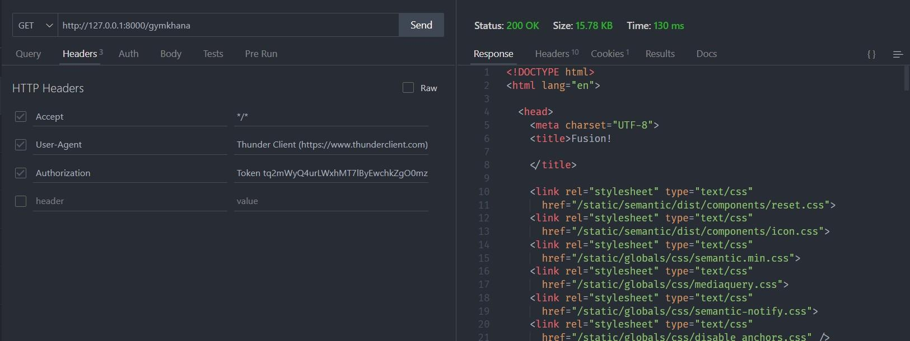

---

### 5. **API:** [http://127.0.0.1:8000/gymkhana/delete_requests](http://127.0.0.1:8000/gymkhana/delete_requests)

- **Status:** Not working
- **Reasons:**
  - API Functions not implemented.
  - Code block handling the request is not implemented.
- **Status Code:** 404 Not Found
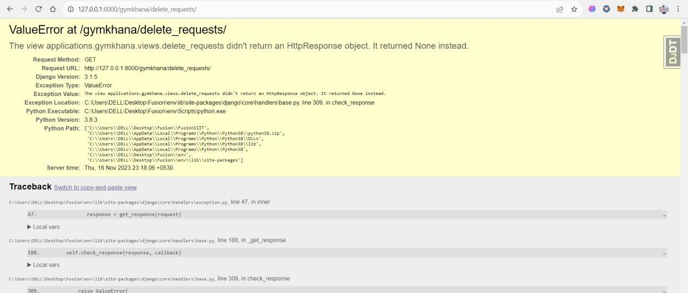

---

### 6. **API:** [http://127.0.0.1:8000/gymkhana/form_avail](http://127.0.0.1:8000/gymkhana/form_avail)

- **Status:** Not working
- **Reasons:**
  - API Functions not implemented.
  - Code block handling the request is not implemented.
- **Status Code:** 404 Not Found
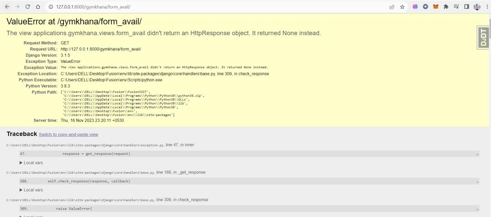
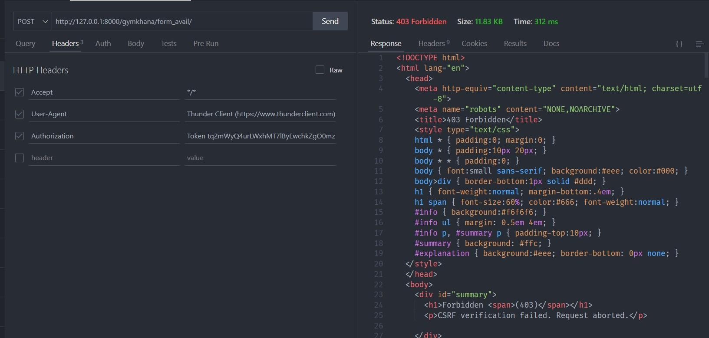

---

### 7. **API:** [http://127.0.0.1:8000/gymkhana/registration_form](http://127.0.0.1:8000/gymkhana/registration_form)

- **Status:** Not working
- **Status Code:** 500 Internal Server Error
- **Reasons:**
  - Database is empty; form requires fields like Coordinator & Coordinator Roll Numbers to be fetched from the database.
  - Cannot manually enter club details due to strict Primary Key Constraints.
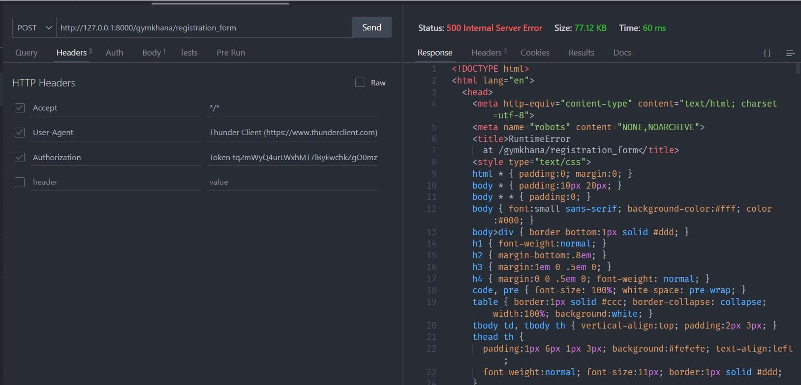

---

### 8. **API:** [http://127.0.0.1:8000/gymkhana/new_club](http://127.0.0.1:8000/gymkhana/new_club)

- **Status:** Not working
- **Status Code:** 500 Internal Server Error
- **Reasons:**
  - Database is empty; form requires fields like Coordinator & Coordinator Roll Numbers to be fetched from the database.
  - Cannot manually enter club details due to strict Primary Key Constraints.
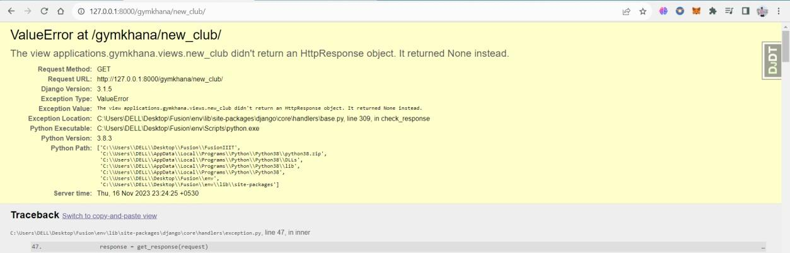
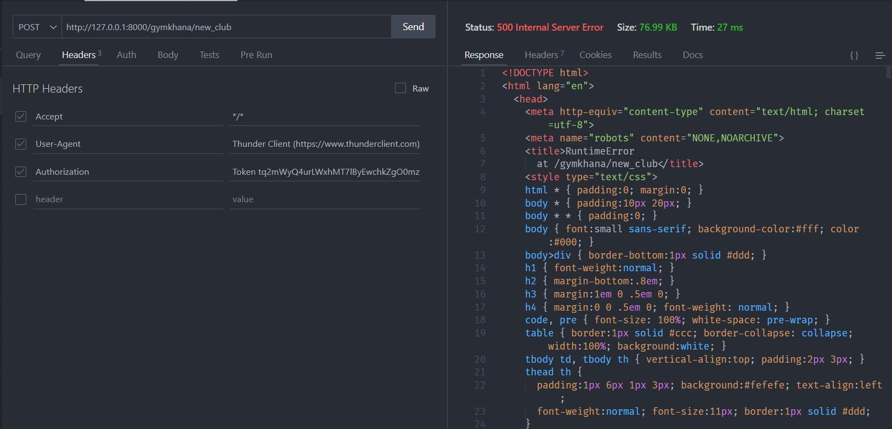

9\. API - <u>http://127.0.0.1:8000/gymkhana/approve</u>

> Status – Cannot determine as of now
>
> Status Code – 500 Internal Server Error
>
> Reasons –
>
> 1\. Cannot check because we cannot apply for club registration as the
> form for club registration is not working.

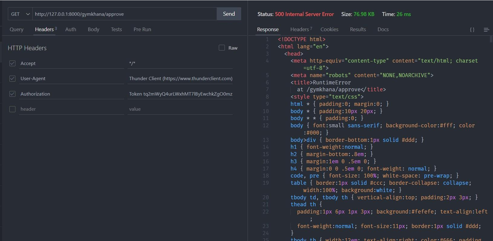

10\. API - <u>http://127.0.0.1:8000/gymkhana/reject</u>

> Status – Cannot determine as of now
>
> Status Code – 500 Internal Server Error
>
> Reasons –

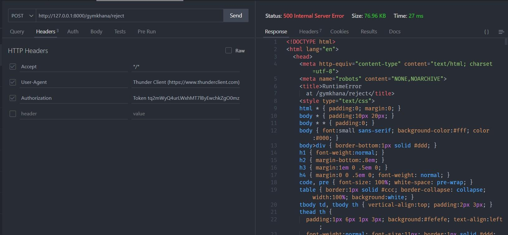

> 1\. Cannot check because we cannot apply for club registration as the
> form for club registration is not working.

11\. API -http://127.0.0.1:8000/gymkhana/new_session/

> Status – Not working

Reasons –

> 1\. API Functions not implemented
>
> 2\. Code block handling the particular request is not implemented.
>
> Status Code – 403 forbidden

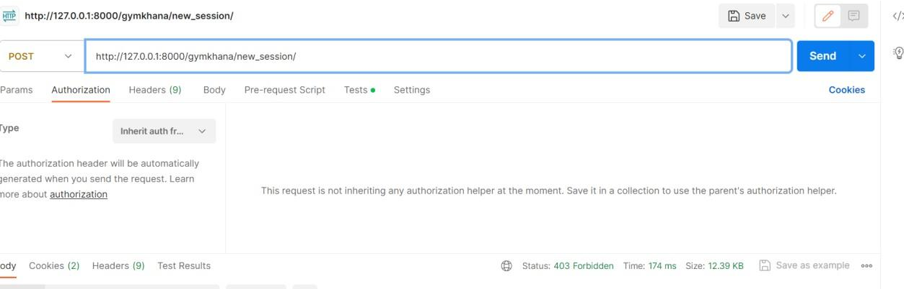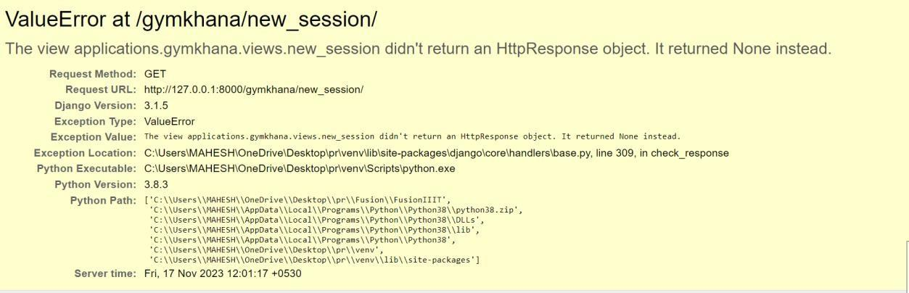

12\. API -http://127.0.0.1:8000/gymkhana/new_session/

> Status – Not working

Reasons –

> 1\. API Functions not implemented
>
> 2\. Code block handling the particular request is not implemented.
>
> Status Code – 403 forbidden

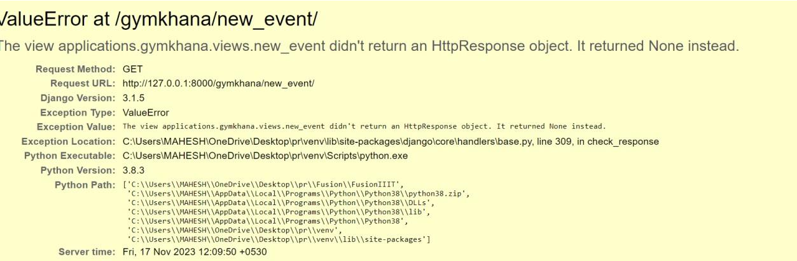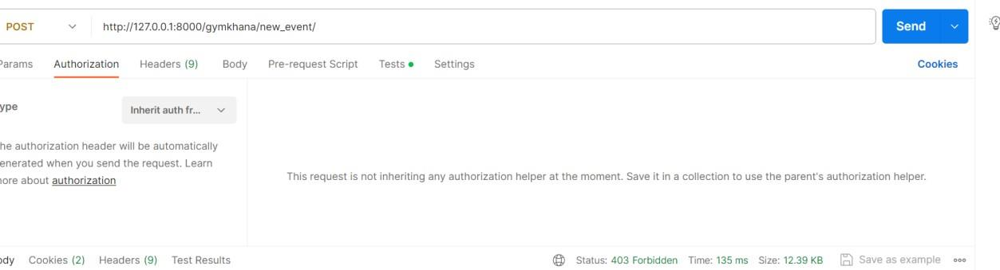

13\. API -http://127.0.0.1:8000/gymkhana/event_report/

> Status – Not working

Reasons –

> Status – Cannot determine as of now
>
> Status Code – 500 Internal Server Error

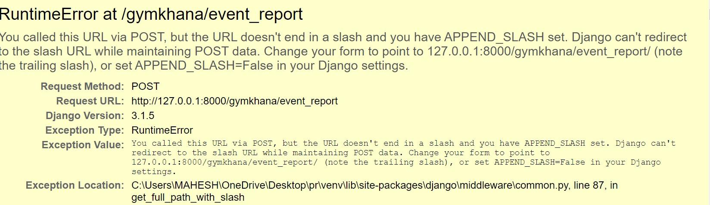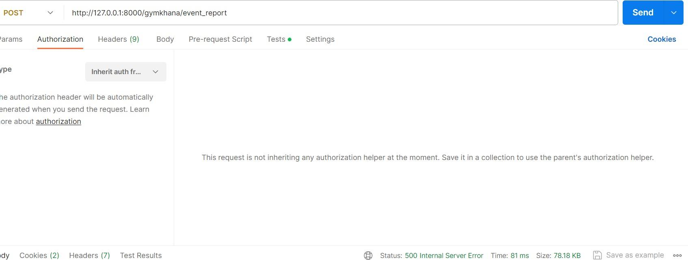

It is redirecting to gymkahana link …..

14\. API -http://127.0.0.1:8000/gymkhana/club_event_report/

> Status – Not working

Reasons –

> Status – Cannot determine as of now

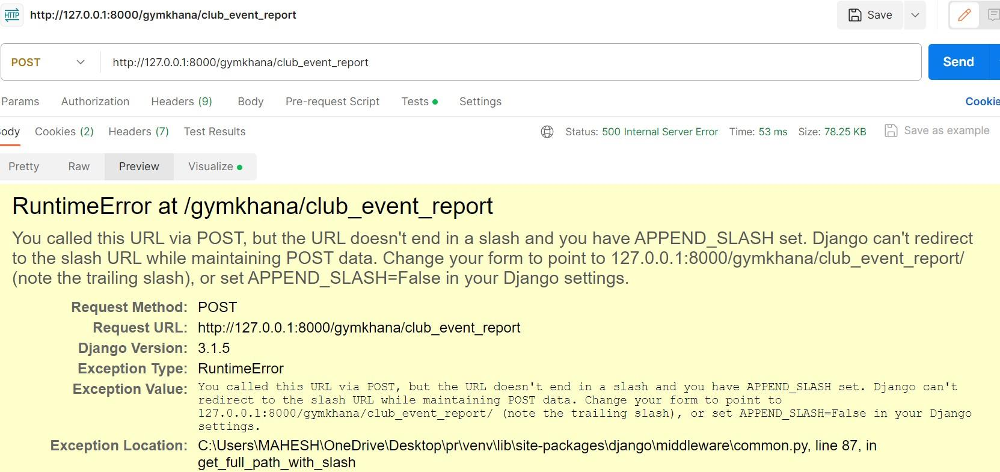

> Status Code – 500 Internal Server Error

It is redirecting to gymkahana link …..

15\. API -http://127.0.0.1:8000/gymkhana/change_head/

> Status – Not working

Reasons –

> 1\. API Functions not implemented
>
> 2.Code block handling the particular request is not implemented

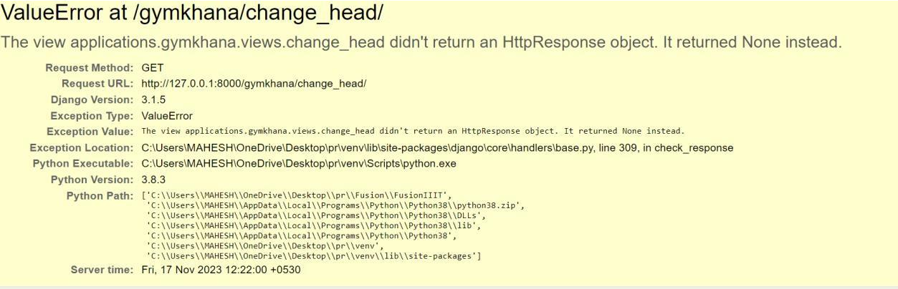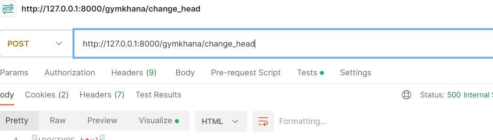

16\.

API -http://127.0.0.1:8000/gymkhana/club_budget/

> Status – Not working

Reasons –

> Status – Cannot determine as of now
>
> Status Code – 500 Internal Server Error

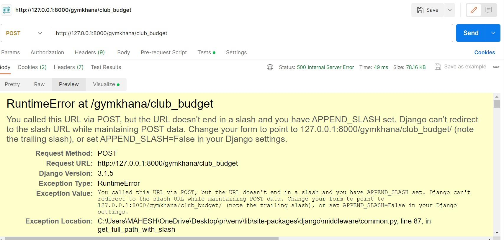

Function is created such that if request is not post then

It is redirecting to gymkahana link …..

17\. API -http://127.0.0.1:8000/gymkhana/club_event_report/

> Status – Not working

Reasons –

> Status – Cannot determine as of now
>
> Status Code – 500 Internal Server Error

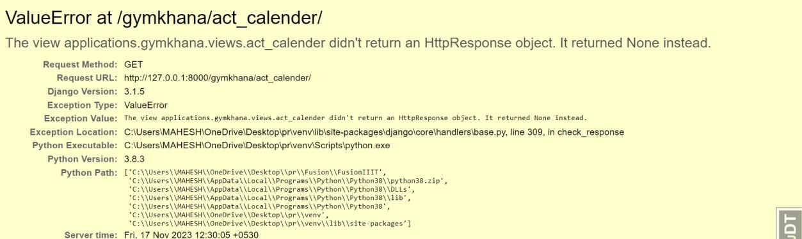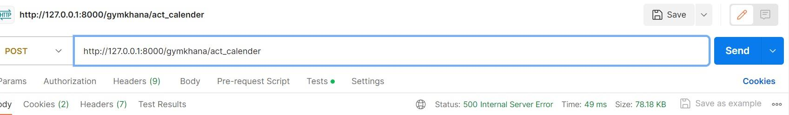

Function is created such that if request is not post then

It is redirecting to gymkahana link …..

18\. API -http://127.0.0.1:8000/gymkhana/club_event_report/

> Status – Not working

Reasons –

> Status – Cannot determine as of now
>
> Status Code – 500 Internal Server Error

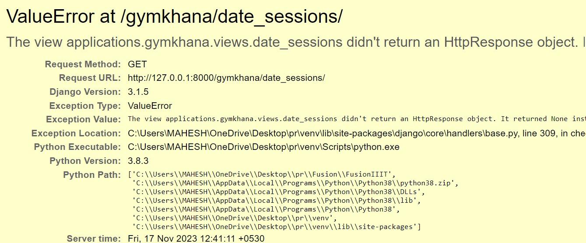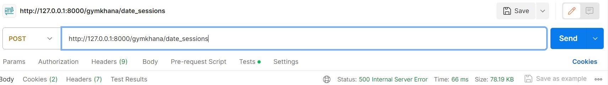

Function is created such that if request is not post then

It is redirecting to gymkahana link …..

19\. . API -http://127.0.0.1:8000/gymkhana/date_sessions/

> Status – working

Reasons –

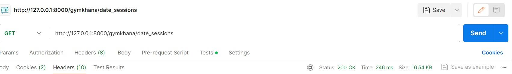

> Status – Cannot determine as of now
>
> Status Code – 200 OK

20\. API -http://127.0.0.1:8000/gymkhana/delete_evenets/

> Status – Not working

Reasons –

> Status – Cannot determine as of now
>
> Status Code – 500 Internal Server Error

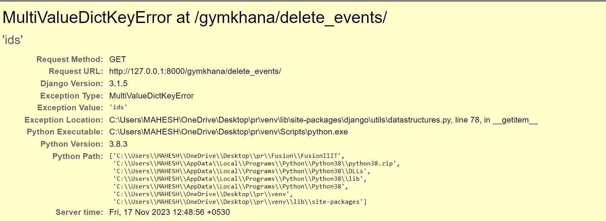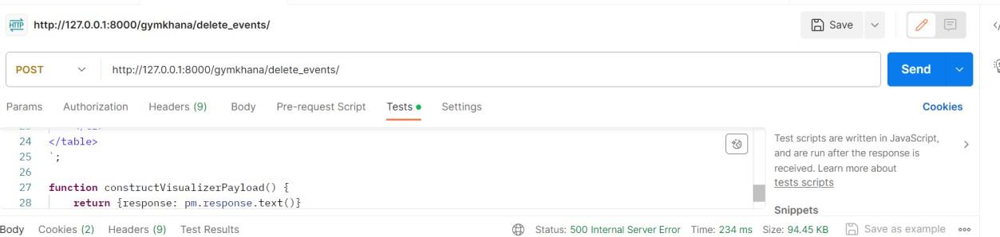

21.21.

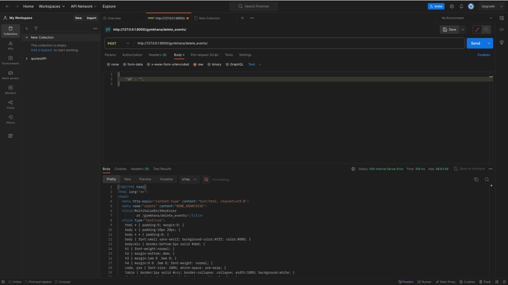

API :- http://127.0.0.1:8000/gymkhana/delete_events/

Status – Not working

Reasons –

> Status – Cannot determine as of now
>
> Status Code – 500 Internal Server Error

22:

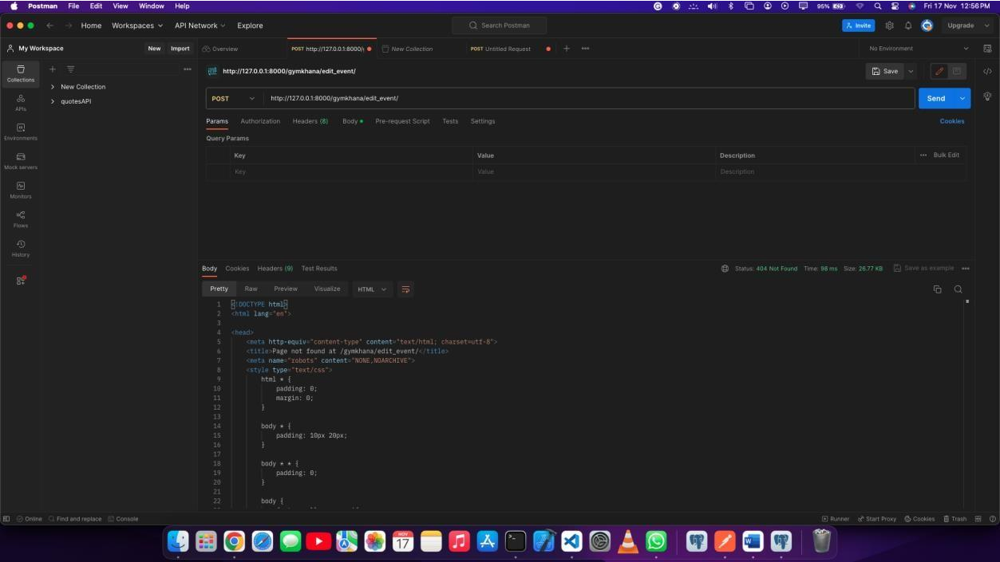

API :- <u>http://127.0.0.1:8000/gymkhana/edit_event/</u>

> Status – Not working

Reasons –

> Status – Cannot determine as of now
>
> Status Code – 404 Not Found

23\.

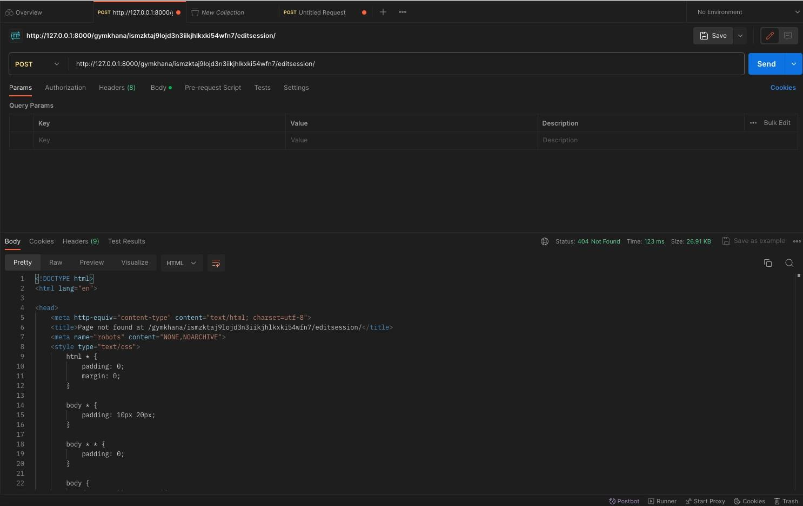

API -
<u>http://127.0.0.1:8000/gymkhana/ismzktaj9lojd3n3iikjhlkxki54wfn7/editsession/</u>

> Status – Not working

Reasons –

> Status – Cannot determine as of now
>
> Status Code – 404 Not Found

24:-

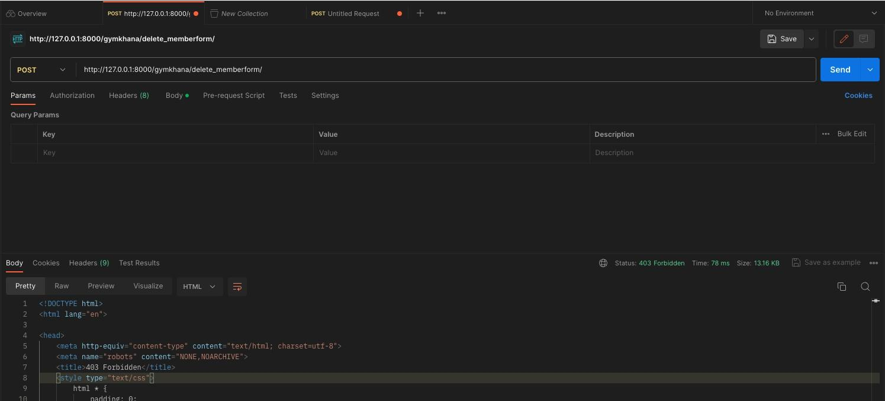

API - http://127.0.0.1:8000/gymkhana/delete_membeífoím/

> Status – Not working

Reasons –

CSRF Token expires as soon as we login and does not provide
authorization

> Status Code – 403 forbidden

25\.

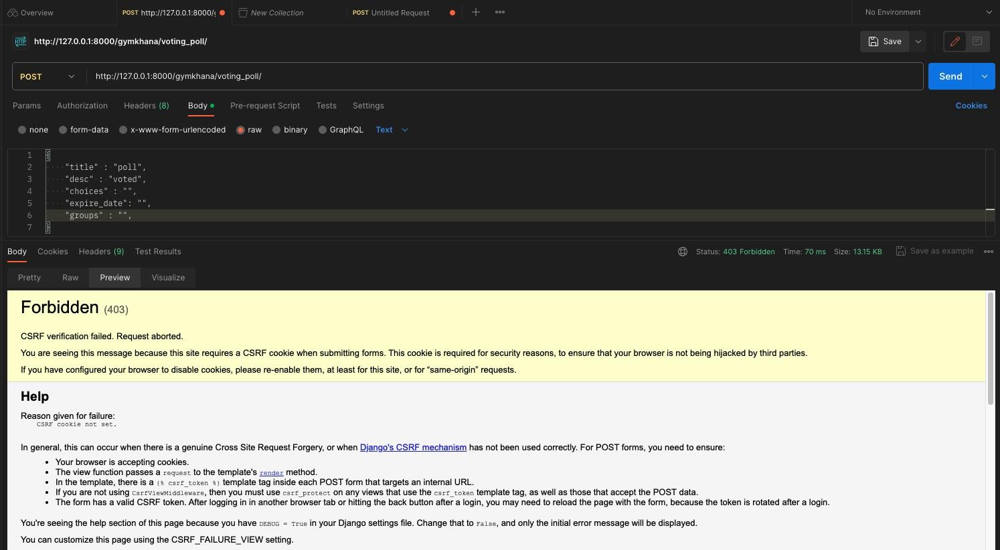

API:- http://127.0.0.1:8000/gymkhana/voting_poll/

Status – Not working Reasons –

CSRF verification failed. Request aborted

CSRF Token expires as soon as we login and does not provide
authorization

Status Code – 403 forbidden

26\.

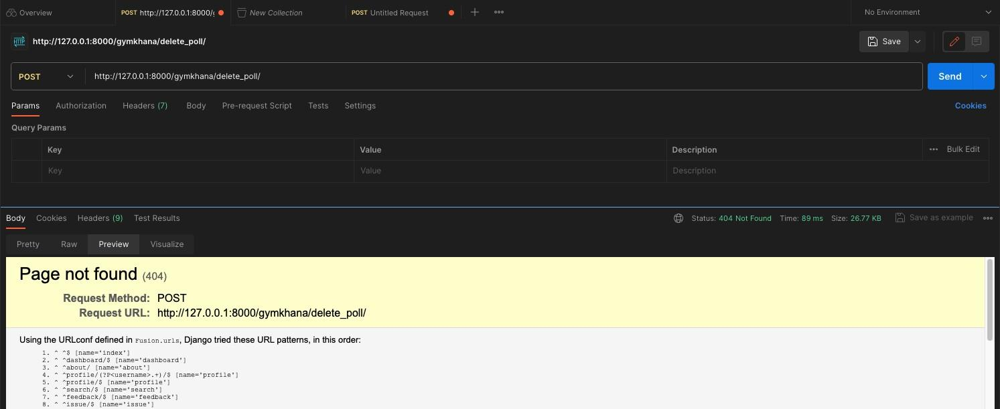

API :- http://127.0.0.1:8000/gymkhana/delete_poll/ Status – Not working

Reasons –

API Functions not implemented

Status Code – 404 Page Not Found

27\.

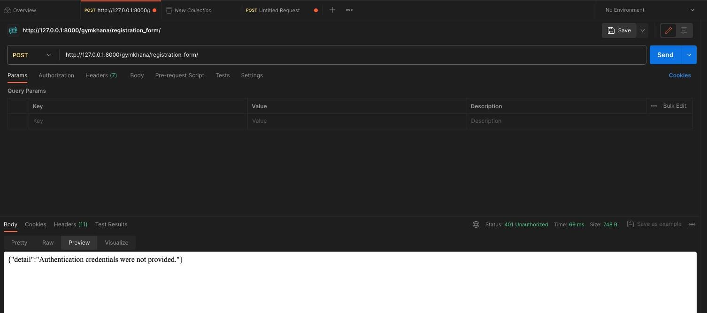

API - http://127.0.0.1:8000/gymkhana/íegistíation_foím/ Status – Not
working

> Reasons –
>
> Authentication credentials were not provided. Status Code – 401
> Unauthorized access

28\.

API:- http://127.0.0.1:8000/gymkhana/delete_íequests/

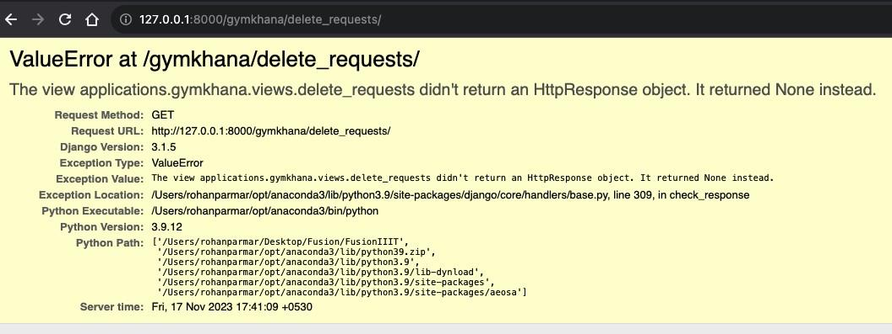

Status – Not working Reasons –

CSRF verification failed. Request aborted Status Code – 403 forbidden

29\.

API :- http://127.0.0.1:8000/gymkhana/club_membeíship/

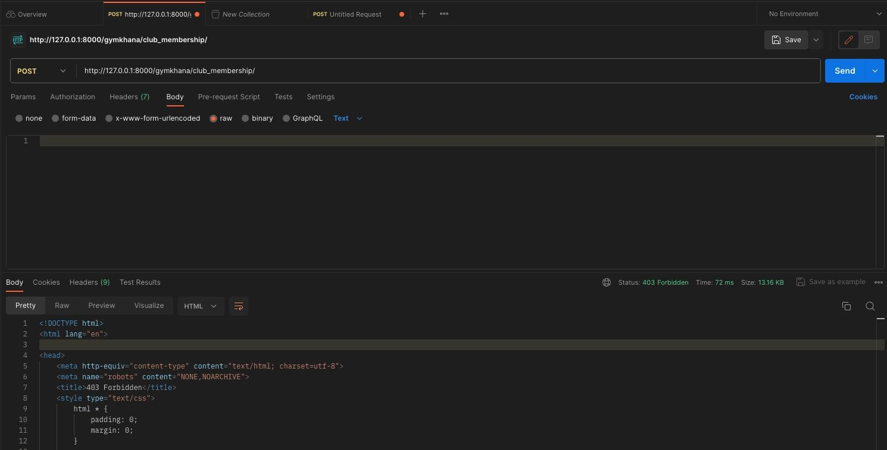

Status – Not working Reasons –

CSRF verification failed. Request aborted

CSRF Token expires as soon as we login and does not provide
authorization

Status Code – 403 forbidden

30\.

API :- http://127.0.0.1:8000/gymkhana/session_details

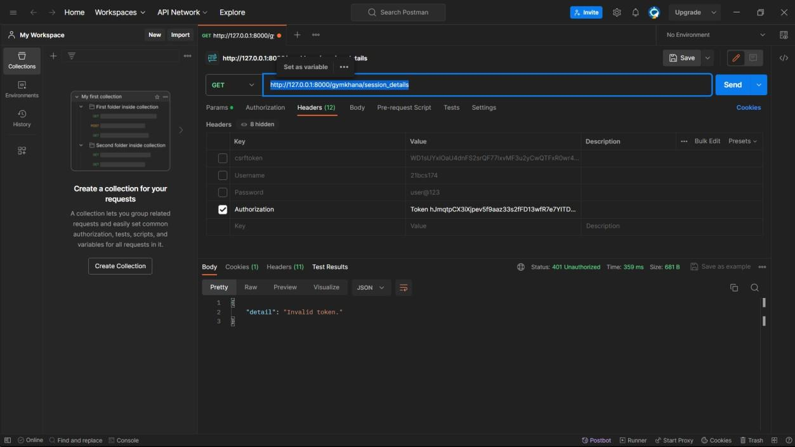

Status – Not working Reasons –

CSRF verification failed. Request aborted

CSRF Token expires as soon as we login and does not provide
authorization

Status Code – 401 Unauthorized

31\.

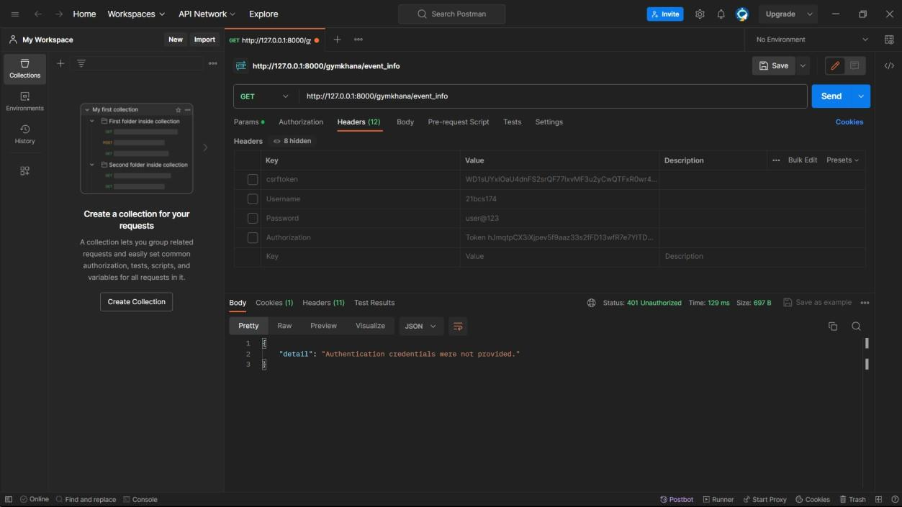

API :- http://127.0.0.1:8000/gymkhana/event_info

Status – Not working Reasons –

CSRF verification failed. Request aborted

Request not hitting the controllers and aborting from views

Status Code – 401 Unauthorized

32\.

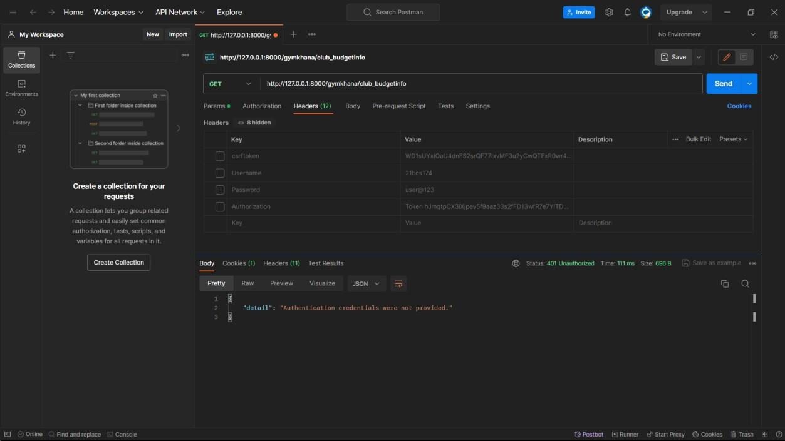

API :- http://127.0.0.1:8000/gymkhana/club_budgetinfo

Status – Not working Reasons –

CSRF verification failed. Request aborted

Request not hitting the controllers and aborting from views

Status Code – 401 Unauthorized

33\.

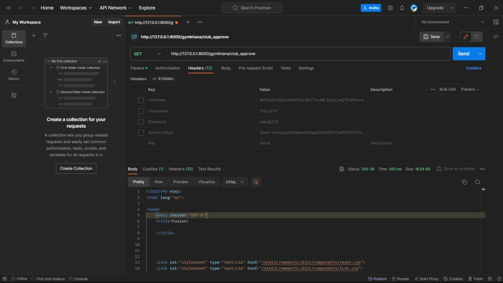

API :- http://127.0.0.1:8000/gymkhana/club_appíove

Status – Working Status Code – 200

34\.

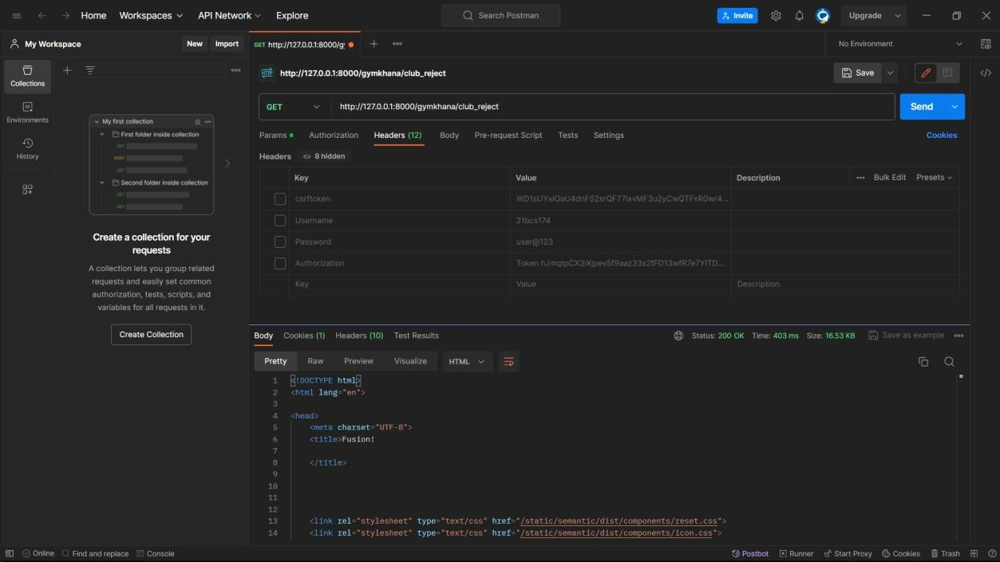

API :- http://127.0.0.1:8000/gymkhana/club_íeject

Status – Working Status Code – 200

35\.

API :- http://127.0.0.1:8000/gymkhana/api/login

Status – Not working Reasons –

CSRF verification failed. Request aborted TTL is only 600ms

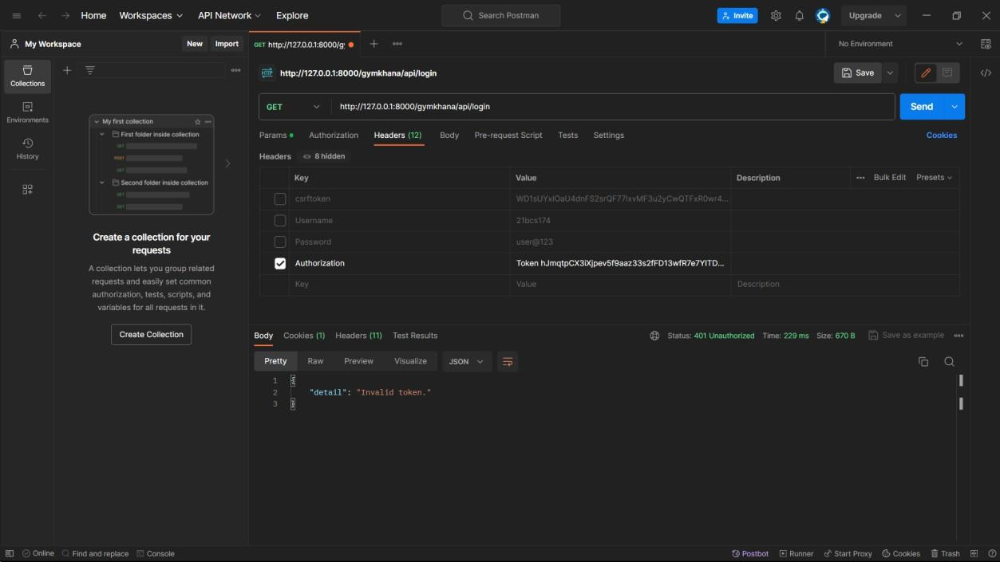Status Code – 401
Unauthorized

36\.

API :- http://127.0.0.1:8000/gymkhana/api/clubdetails

Status – Not working Reasons –

CSRF verification failed. Request aborted TTL is only 600ms

Status Code – 401
Unauthorized

37\. API :- http://127.0.0.1:8000/gymkhana/api/Fest_budget

> Status – Not working Reasons –
>
> CSRF verification failed. Request aborted TTL is only 600ms
>
> Status Code – 401 Unauthorized

38\. API :-http://127.0.0.1:8000/gymkhana/api/club_íepoít

Status – Not working Reasons –

CSRF verification failed. Request aborted TTL is only 600ms

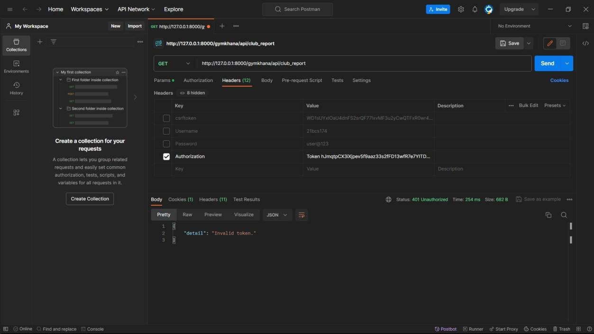Status Code – 401
Unauthorized

39\. API :-http://127.0.0.1:8000/gymkhana/api/íegisteíation_foím

Status – Not working Reasons –

Api not hitting the controllers .As shown in vs code terminal “test” is
not being printed.

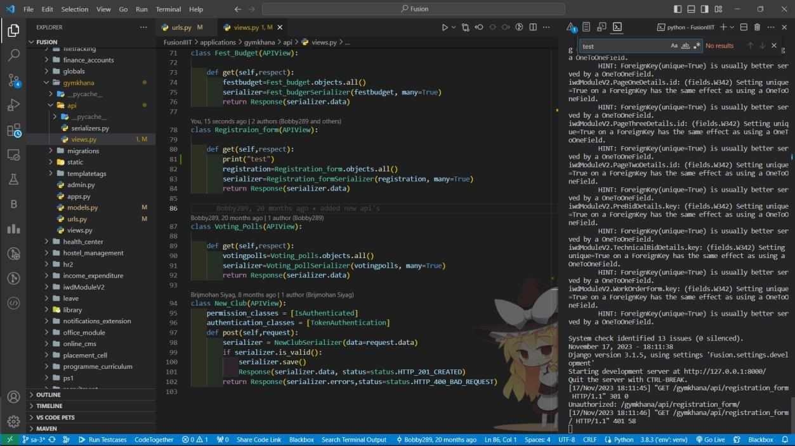Status Code – 401
Unauthorized

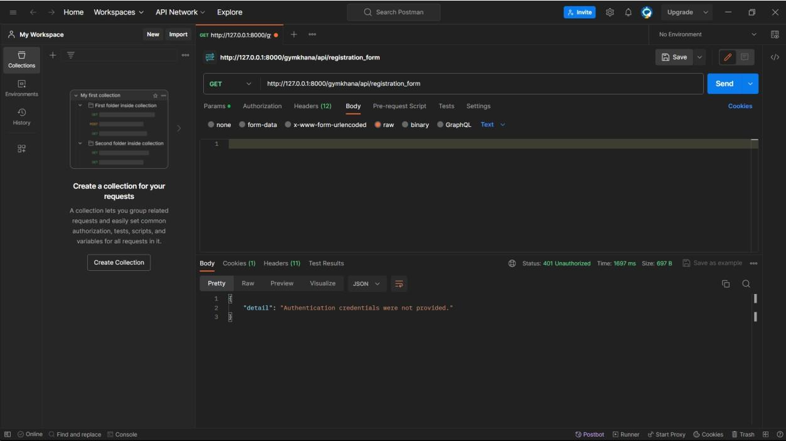

40\. API - http://localhost:8000/gymkhana/club_membership/

> Status – Not working
>
> Reasons –
>
> 1\. API Functions not implemented
>
> 2\. Code block handling the particular request is not implemented.
>
>  style="width:6.26555in;height:3.41458in" /> style="width:6.26667in;height:3.52486in" />Status Code – 403 Forbidden

41\. API - http://localhost:8000/gymkhana/faculty_data/

> Status – Not working
>
> Reasons -
>
> 1\. Missing key request. 2. Incorrect key name.
>
>  style="width:5.81806in;height:3.16944in" /> style="width:6.2625in;height:3.52958in" />Status Code – 500 Internal
> Server Error

42\. API - http://localhost:8000/gymkhana/faculty_data/

> Status – Not working
>
> Reasons –
>
> 1\. API Functions not implemented
>
> 2\. Code block handling the particular request is not implemented. 3.
> Missing key request.
>
>  style="width:6.25972in;height:3.39986in" /> style="width:6.26667in;height:3.52486in" />Status Code – 403 Forbidden

43\. API - http://localhost:8000/gymkhana/get_venue/

> Status – Not working
>
> Reasons –
>
> 1\. There is a typo in the attribute or method name, or if the code
> assumes the existence of an attribute that hasn't been initialized or
> provided.
>
> 2\. If the structure of an object is expected to remain constant, but
> it dynamically changes during runtime

Status Code – 403 Forbidden

44\. API - http:localhost:8000/gymkhana/core_team/

> Status – Not working
>
> Reasons –
>
> 1\. CSRFTokenFailure.
>
> 2\. The CSRF Token is not sent in the request headers from the
> frontend while making the request.
>
> 3\. Either the resource is only accessible by superusers (club admins)
> or the expiry time of token is very less.

Status Code – 403 Forbidden

45\. API - http:localhost:8000/gymkhana/festbudget/

> Status – Not working
>
> Reasons –
>
> 1\. CSRFTokenFailure.
>
> 2\. The CSRF Token is not sent in the request headers from the
> frontend while making the request.
>
> 3\. Either the resource is only accessible by superusers (club admins)
> or the expiry time of token is very less.
>
> 4\. Database is empty.

Status Code – 403 Forbidden

46\. API - <u>http://localhost:8000/gymkhana/?P\<poll_id</u>\> Status –
Not working

> Reasons –
>
> 1\. Insufficient data to check this api. 2. Database is empty

Status Code – Can’t determine
