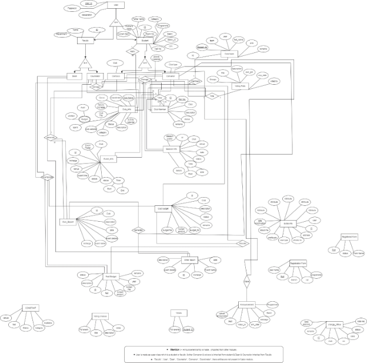

# Module Name: Gymkhana Web (SA3)

### Faculty Mentor:  
**Dr. VijayPal Singh Rathore**

### Student Mentor:  
**Anurag Goswami**

---

## Database Documentation of SA-3 Gymkhana Web 4.0

### Overview of the Module

The Gymkhana web module is part of the online web service portal responsible for the following:

1. Viewing details of all clubs, including their activity calendar, current coordinator, and co-coordinator.
2. Submitting applications for new clubs and applying for membership in existing clubs. The module features detailed forms to facilitate these services.
3. Users (students and faculty) can view ongoing or upcoming club sessions and events.
4. Users can access public details related to current and previous club members.
5. Users can participate in elections and ask for nominations for head figures in a club.

### SRS

- [SRS-Gymkhana WEB](https://docs.google.com/document/d/1Y3pNVTc2Ul5xY09O2r36fBgRumkuSOsjWmr9teJ57dc/edit)

### A. ER Diagram

-   
- **Diagram Preview:**
  

### B. Database Schema Info

- [Gymkhana Database Schema Info](https://docs.google.com/spreadsheets/d/1YwTLBuiaOA-9f29gFGUz7vwsn0S7vR4Tg8dk7N-HW_g/edit#gid=0)

### C. Required Changes in Currently Implemented Tables (Version 4.0)

1. **Registration_form**
   - **Roll**  
     - **Change:** Resolve primary key issue from the module it is coming from.
     - **Justification:** Cannot be added due to key constraints.

2. **Form_available**
   - **Roll**  
     - **Change:** Resolve primary key issue from the module it is coming from.
     - **Justification:** Cannot be added due to key constraints.

### D. Data Availability for API and Functional Testing

#### D.1 Populated Tables

The following tables are already populated:
- `Club_member`
- `Core_team`
- `Session_info`
- `Event_info`
- `Club_report`
- `Other_report`
- `Voting_polls`
- `Voting_choices`
- `Voting_voters`

#### D.2 Tables Required to Be Populated

The following tables need to be populated:
- `Club_info`
- `Form_available`
- `Registration_form`
- `Club_budget`
- `Fest_budget`
- `Change_office`

#### D.3 Difficulties Faced in Populating Tables

1. **Club_info:** The `Club_name` attribute is not reaching the controllers in views.
2. **Club_budget:** The `Club_name` attribute is not reaching the controllers in views.
3. **Registration_form:** There is a primary key issue with the student ID coming from a random module.

### Documentation Link

- [FUSION_ERP_ASSIGNMENT_4_GYMKHANA_WEB](https://docs.google.com/document/d/1fONvKEL5ObFVQiziP_Vp7jkfgtFEoGJj20afkhe2XgQ/edit)
