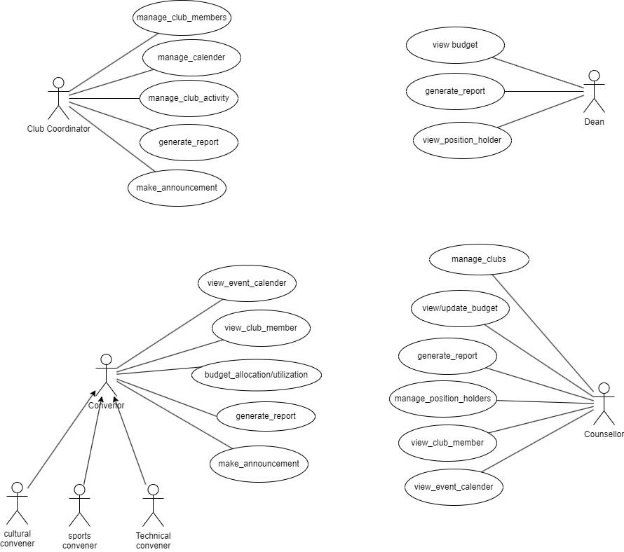

# Fusion ERP

## Software Requirements Specification for SA-3 - GYMKHANA

### Prepared by:
**Student Mentor:** Hardik Sharma (21bcs092)  
**Team Members:**
1. Anushri Thakre (21bcs029)
2. Bhawna Chilwal (21bcs057)
3. Suyash Suman (21bcs217)
4. Suman Kumar (21bcs214)
5. Govind Kumar (21bcs088)

---

### 1. Introduction

#### Introduction about Fusion – A Brief Description

FusionIIIT, a testament to seamless integration and automation at PDPM Indian Institute of Information Technology, Design and Manufacturing, Jabalpur, embodies precision through Python 3.8 and the Django Web framework. Initiated and driven by students, this endeavor aims to elevate the institute's operational landscape comprehensively. From streamlining administration management to enhancing academic excellence and addressing miscellaneous departmental tasks, FusionIIIT is a holistic solution that seamlessly harmonizes the intricacies of campus life.

Imagine it as a digital wizard overseeing everything, from organizing administrative tasks to facilitating smoother academic processes. Its scope extends beyond the conventional, diving into various departments and sections to ensure every facet of campus life runs seamlessly. On the administrative side, FusionIIIT efficiently manages complex paperwork and processes. In academics, it introduces a digital touch, simplifying learning and course management. But it goes beyond these realms; FusionIIIT serves as a friendly companion to all corners of the campus, ensuring optimal functionality.

In essence, FusionIIIT is more than just a tool; it's a helpful companion, making life at PDPM IIITDM Jabalpur organized and enjoyable for everyone.

### 2. Purpose of the Module

The purpose of this document is to gather and analyze in-depth insights into the complete Student Gymkhana System of IIITDM Jabalpur. It will define the users and functionalities of the software.

Additionally, it aims to predict and sort out how this product will be used to gain a better understanding of the software, outline concepts for future development, and document ideas being considered but may be discarded as the product evolves. This document describes the project's target audience and its user interface, hardware, and software requirements. It defines how our client, team, and audience perceive the product and its functionality, assisting designers and developers in the Software Development Lifecycle (SDLC) processes.

### 3. Scope of the Module

The Gymkhana Software System is available as an online web service portal and a mobile application, facilitating various events and activities of Gymkhana with various tools. Accessing information and performing activities will be streamlined through the software, which will support various Gymkhana activities and administration.

### 4. User/Actor Characteristics

#### 4.1 Dean

The Dean plays a vital role in representing and advocating for student interests, fostering a vibrant campus culture. They serve as a key liaison between students and the administration, contributing to the dynamic and inclusive nature of the campus community.

**Role:**  
The Student Dean is responsible for reviewing budgets, generating reports, and overseeing position holders. Their multifaceted role involves financial oversight, administrative reporting, and ensuring the effective functioning of key leadership positions within the organization.

**Specific Functionality:**
1. View Budget
2. Generate Report
3. View Position Holder

---

#### 4.2 Counsellor

As a Gymkhana counselor, the role involves providing emotional support while actively managing clubs, updating budgets, generating reports, and overseeing administrative functions, contributing to the holistic well-being and organizational efficiency within the campus community.

**Role:**  
The Gymkhana counselor's multifaceted role includes tasks such as viewing and updating budgets, managing clubs, generating reports, overseeing position holders, viewing club members, and maintaining the event calendar. This dynamic function contributes to both the emotional well-being of students and the efficient operation of various activities within the organization.

**Specific Functionalities:**
1. Manage Clubs
2. View/Update Budget
3. Generate Report
4. Manage Position Holder
5. View Club Members
6. View Event Calendar

---

#### 4.3 Convenor

As a Gymkhana club convenor in cultural, sports, or technical domains, the role involves orchestrating and managing respective club activities, fostering participation, and ensuring the successful execution of events to enhance the diverse and dynamic extracurricular landscape of the institution.

**Role:**  
As a convenor, the responsibilities encompass managing event calendars, overseeing club memberships, allocating budgets, generating reports, and making announcements. This multifaceted responsibility involves ensuring the smooth operation and success of various club activities, maintaining financial transparency, and fostering effective communication within the club and the broader organization.

**Specific Functionalities:**
1. View Event Calendar
2. View Club Members
3. Budget Allocation
4. Generate Report
5. Make Announcements

---

#### 4.4 Club Coordinator (Student)

The Club Coordinator is accountable for managing various activities, including club members, calendars, and generating reports.

**Role:**  
The Club Coordinator oversees and coordinates the activities of the club, ensuring smooth operation, effective communication, and alignment with organizational goals.

**Specific Functionalities:**
1. Manage Club Members
2. Manage Club Calendars
3. Manage Club Activities
4. Generate Report
5. Make Announcements

**3. Functional Requirements**

1. **Use Case Diagram**

2. **Use case Description**

|UC ID|UC#1|
| - | - |
|Use case Name|View\_budget|

<table><tr><th colspan="1" valign="top">Description</th><th colspan="3" valign="bottom">The "View Budget" use case allows the Dean of the college hostel to review, approve, reject, edit, cancel, and view_budget for the visitor hostel through the Fusion portal.</th></tr>
<tr><td colspan="1" valign="top">Actor</td><td colspan="3" valign="top">Dean</td></tr>
<tr><td colspan="1" valign="top">Precondition</td><td colspan="3" valign="top">The dean is logged in into the system.</td></tr>
<tr><td colspan="1" rowspan="4" valign="top">Main Flow</td><td colspan="1" valign="top">1</td><td colspan="2" valign="top">The Dean navigates to the "View_budget" section.</td></tr>
<tr><td colspan="1" valign="top">2</td><td colspan="2" valign="top">The system displays the list of Budget with its respective information.</td></tr>
<tr><td colspan="1" valign="top">3</td><td colspan="2" valign="top">The Dean selects a Budget to review. [A1][A2]</td></tr>
<tr><td colspan="1" valign="top">4</td><td colspan="2" valign="top">The Dean views the respective Budget. [A3][A4]</td></tr>
<tr><td colspan="1" valign="top">Post conditions</td><td colspan="3" valign="top">The Budget information is viewed by the Dean.</td></tr>
<tr><td colspan="1" rowspan="2" valign="top">Alternate Flow</td><td colspan="1" rowspan="2" valign="top">A1</td><td colspan="1" valign="top">1</td><td colspan="1" valign="top">The request is pending. The dean selects the View_Budget action.</td></tr>
<tr><td colspan="1" valign="top">2</td><td colspan="1" valign="top">The system updates the Budget status to "Approved" and the same is reflected to the Intender.</td></tr>
<tr><td colspan="1" valign="top">Sub Flow</td><td colspan="3" valign="top">NIL</td></tr>
</table>

|Global Alternat e Flow|G A 1|If a technical error occurs during the execution of any action (e.g., database failure, server issues), the system displays an error message and logs the incident.|
| :-: | - | :-: |

<table><tr><th colspan="1" valign="top">UC ID</th><th colspan="2" valign="top">UC#2</th></tr>
<tr><td colspan="1" valign="top">Use case Name</td><td colspan="2" valign="top">View_position_holder</td></tr>
<tr><td colspan="1" valign="top">Description</td><td colspan="2" valign="bottom">The "View Position Holder'' allows the Dean to access and review information related to position holders associated with the College Management System. Position holders may include individuals or entities responsible for specific roles or responsibilities within the hostel's operations.</td></tr>
<tr><td colspan="1" valign="top">Actor</td><td colspan="2" valign="top">Dean</td></tr>
<tr><td colspan="1" valign="top">Precondition</td><td colspan="2" valign="top">The Dean must be logged into the System with valid credentials.</td></tr>
<tr><td colspan="1" rowspan="3" valign="top">Main Flow</td><td colspan="1" valign="top">1</td><td colspan="1" valign="top">The Caretaker navigates to the "view_position_holder" section.</td></tr>
<tr><td colspan="1" valign="top">2</td><td colspan="1" valign="top">The system displays the list of position_holders with its respective status.</td></tr>
<tr><td colspan="1" valign="top">3</td><td colspan="1" valign="top">The Dean selects a Position_holder to review. [A1][A2]</td></tr>
</table>

<table><tr><th colspan="1"></th><th colspan="1" valign="top">4</th><th colspan="2"></th></tr>
<tr><td colspan="1" valign="top">Post conditions</td><td colspan="3" valign="top">The Position_holder section is reviewed by Dean.</td></tr>
<tr><td colspan="1" valign="top">Alternate Flow</td><td colspan="1" valign="top">A1</td><td colspan="1" valign="top">1</td><td colspan="1" valign="bottom">If there are errors or issues during the retrieval of position holder information, the system displays appropriate error messages, and the Dean may take corrective actions or seek technical support.</td></tr>
<tr><td colspan="1" valign="top">Sub Flow</td><td colspan="3" valign="top">NIL</td></tr>
<tr><td colspan="1" rowspan="2" valign="top">Global Alternate Flow</td><td colspan="1" valign="top">GA1</td><td colspan="2" valign="top">The system displays a notification to users, including the Dean, informing them about the temporary unavailability of position holder information</td></tr>
<tr><td colspan="1" valign="top">GA2</td><td colspan="2" valign="top">If a technical error occurs during the execution of any action (e.g., database failure, server issues), the system displays an error message and logs the incident.</td></tr>
</table>

|UC ID|UC#3|
| - | - |
|Use case Name|Generate\_report|

![ref1]

<table><tr><th colspan="1" valign="top">Description</th><th colspan="3" valign="bottom">The "Generate Report" enables the actors to create comprehensive reports related to his work. This functionality empowers the actors to obtain details insights of the associated Management. The generated reports serve as valuable tools for strategic decision-making, financial planning, and performance analysis.</th></tr>
<tr><td colspan="1" valign="top">Actor</td><td colspan="3" valign="top">Dean ,Club-Corodinator , Convenor, Counsellor</td></tr>
<tr><td colspan="1" valign="top">Precondition</td><td colspan="3" valign="top">The actor is logged in into the system.</td></tr>
<tr><td colspan="1" rowspan="4" valign="top">Main Flow</td><td colspan="1" valign="top">1</td><td colspan="2" valign="top">The Actor navigates to the "Report" section.</td></tr>
<tr><td colspan="1" valign="top">2</td><td colspan="2" valign="top">The system displays the query to generate reports.</td></tr>
<tr><td colspan="1" valign="top">3</td><td colspan="2" valign="top">The actors press the generate button for report generation. [A1][A2]</td></tr>
<tr><td colspan="1" valign="top">4</td><td colspan="2" valign="top">The actor views the generated report. [A3][A4]</td></tr>
<tr><td colspan="1" valign="top">Post conditions</td><td colspan="3" valign="top">The generated report is viewed by actors.</td></tr>
<tr><td colspan="1" rowspan="2" valign="top">Alternate Flow</td><td colspan="1" rowspan="2" valign="top">A1</td><td colspan="1" valign="top">1</td><td colspan="1" valign="top">The request is pending. The Actor selects the "generate" action.</td></tr>
<tr><td colspan="1" valign="top">2</td><td colspan="1" valign="top">The system generate the reports .</td></tr>
<tr><td colspan="1" valign="top">Sub Flow</td><td colspan="3" valign="top">NIL</td></tr>
</table>

<table><tr><th colspan="1" rowspan="2" valign="top">Global Alternate Flow</th><th colspan="1" valign="top">GA1</th><th colspan="1" valign="top">The system displays a notification to users, including the Dean, informing them about the temporary unavailability of report generation services.</th></tr>
<tr><td colspan="1" valign="top">GA2</td><td colspan="1" valign="bottom">If a technical error occurs during the execution of any action (e.g., database failure, server issues), the system displays an error message and logs the incident.</td></tr>
</table>

<table><tr><th colspan="1" valign="top">UC ID</th><th colspan="2" valign="top">UC#4</th></tr>
<tr><td colspan="1" valign="top">Use case Name</td><td colspan="2" valign="top">View_position_holder</td></tr>
<tr><td colspan="1" valign="top">Description</td><td colspan="2" valign="bottom">The "View Position Holder'' allows the Dean to access and review information related to position holders associated with the College Management System. Position holders may include individuals or entities responsible for specific roles or responsibilities within the hostel's operations.</td></tr>
<tr><td colspan="1" valign="top">Actor</td><td colspan="2" valign="top">Dean</td></tr>
<tr><td colspan="1" valign="top">Precondition</td><td colspan="2" valign="top">The Dean must be logged into the System with valid credentials.</td></tr>
<tr><td colspan="1" rowspan="2" valign="top">Main Flow</td><td colspan="1" valign="top">1</td><td colspan="1" valign="top">The Caretaker navigates to the "view_position_holder" section.</td></tr>
<tr><td colspan="1" valign="top">2</td><td colspan="1" valign="top">The system displays the list of position_holders with its respective status.</td></tr>
</table>

<table><tr><th colspan="1" rowspan="2"></th><th colspan="1" valign="top">3</th><th colspan="2" valign="top">The Dean selects a Position_holder to review. [A1][A2]</th></tr>
<tr><td colspan="1" valign="top">4</td><td colspan="2"></td></tr>
<tr><td colspan="1" valign="top">Post conditions</td><td colspan="3" valign="top">The Position_holder section is reviewed by Dean.</td></tr>
<tr><td colspan="1" valign="top">Alternate Flow</td><td colspan="1" valign="top">A1</td><td colspan="1" valign="top">1</td><td colspan="1" valign="bottom">If there are errors or issues during the retrieval of position holder information, the system displays appropriate error messages, and the Dean may take corrective actions or seek technical support.</td></tr>
<tr><td colspan="1" valign="top">Sub Flow</td><td colspan="3" valign="top">NIL</td></tr>
<tr><td colspan="1" rowspan="2" valign="top">Global Alternate Flow</td><td colspan="1" valign="top">GA1</td><td colspan="2" valign="top">The system displays a notification to users, including the Dean, informing them about the temporary unavailability of position holder information</td></tr>
<tr><td colspan="1" valign="top">GA2</td><td colspan="2" valign="top">If a technical error occurs during the execution of any action (e.g., database failure, server issues), the system displays an error message and logs the incident.</td></tr>
</table>

|UC ID|UC#05|
| - | - |
|Use case Name|Manage\_Clubs|
|Description|This use case is used to navigate to different clubs so counsellor can manage positions, view and update budget and generate reports.|

<table><tr><th colspan="1" valign="top">Actor</th><th colspan="3" valign="top">Counsellor</th></tr>
<tr><td colspan="1" valign="top">Precondition</td><td colspan="3" valign="top">Counsellor must be logged into the system with valid credentials.</td></tr>
<tr><td colspan="1" rowspan="2" valign="top">Main Flow</td><td colspan="1" valign="top">1</td><td colspan="2" valign="top">Navigate to different clubs and manage club members.</td></tr>
<tr><td colspan="1" valign="top">2</td><td colspan="2" valign="top">Generate report.</td></tr>
<tr><td colspan="1" valign="top">Post conditions</td><td colspan="3" valign="top">The updated booking information is reflected in the database.</td></tr>
<tr><td colspan="1" rowspan="2" valign="top">Alternate Flow</td><td colspan="1" valign="top">A1</td><td colspan="1" valign="top">1</td><td colspan="1" valign="top">Counsellor cancels the operation of club activity in some special conditions.</td></tr>
<tr><td colspan="1" valign="top">A2</td><td colspan="1" valign="top">1</td><td colspan="1" valign="top">If the participation in the activities are not good then counsellor can take appropriate decisions.</td></tr>
</table>

|UC ID|UC#06|
| - | - |
|Use case Name|View\_Update\_Budget|

<table><tr><th colspan="1" valign="top">Description</th><th colspan="3" valign="bottom">In this use case, the actor, who plays the role of a counselor, interacts with a system to view and update budget information. The counselor is responsible for managing and maintaining budgetary details, ensuring that financial resources are allocated appropriately.</th></tr>
<tr><td colspan="1" valign="top">Actor</td><td colspan="3" valign="top">Counsellor</td></tr>
<tr><td colspan="1" valign="top">Precondition</td><td colspan="3" valign="top">Counsellor must be logged into the system with valid credentials.</td></tr>
<tr><td colspan="1" rowspan="3" valign="top">Main Flow</td><td colspan="1" valign="top">1</td><td colspan="2" valign="top">After successful login, the counselor navigates to the budget module.</td></tr>
<tr><td colspan="1" valign="top">2</td><td colspan="2" valign="top">The system retrieves and displays the current budget details including income, expenses, and available funds.</td></tr>
<tr><td colspan="1" valign="top">3</td><td colspan="2" valign="top">The system presents a form or interface allowing the counselor to make changes.</td></tr>
<tr><td colspan="1"></td><td colspan="1" valign="top">4</td><td colspan="2" valign="top">After updating the budget, the counselor confirms the changes and saves the updated budget information.</td></tr>
<tr><td colspan="1" valign="top">Post conditions</td><td colspan="3" valign="top">The counselor's changes are reflected in the budget details and database for future reference.</td></tr>
<tr><td colspan="1" rowspan="2" valign="top">Alternate Flow</td><td colspan="1" valign="top">A1</td><td colspan="1" valign="top">1</td><td colspan="1" valign="top">At any point during the update process, the counselor may choose to cancel the changes.</td></tr>
<tr><td colspan="1" valign="top">A2</td><td colspan="1" valign="top">1</td><td colspan="1" valign="top">if the system identifies errors or inconsistencies in the entered data, it notifies the counselor and prompts them to correct the issues before saving.</td></tr>
</table>

<table><tr><th colspan="1" valign="top">UC ID</th><th colspan="2" valign="top">UC#7</th></tr>
<tr><td colspan="1" valign="top">Use case Name</td><td colspan="2" valign="top">Manage_positions</td></tr>
<tr><td colspan="1" valign="top">Description</td><td colspan="2" valign="bottom">Counselor manage positions related to various roles or responsibilities within the organization's gymkhana activities. Positions may include roles such as club presidents, event coordinators, or other leadership roles associated with extracurricular and sports activities.</td></tr>
<tr><td colspan="1" valign="top">Actor</td><td colspan="2" valign="top">Counselor</td></tr>
<tr><td colspan="1" valign="top">Precondition</td><td colspan="2" valign="top">Counselor must be logged into the system with valid credentials.</td></tr>
<tr><td colspan="1" rowspan="3" valign="top">Main Flow</td><td colspan="1" valign="top">1</td><td colspan="1" valign="top">After successful login, the counselor navigates to the gymkhana module within the system.</td></tr>
<tr><td colspan="1" valign="top">2</td><td colspan="1" valign="top">The system presents a list of existing positions or allows the counselor to create a new position and edit / modify positions.</td></tr>
<tr><td colspan="1" valign="top">3</td><td colspan="1" valign="top">The counselor has the option to create a new position by providing details such as title, description,</td></tr>
<tr><td colspan="1"></td><td colspan="1" valign="top">4</td><td colspan="1" valign="top">The counselor confirms and saves the changes.</td></tr>
<tr><td colspan="1" valign="top">Post conditions</td><td colspan="2" valign="top">The positions within the gymkhana module are updated based on the counselor's actions.</td></tr>
</table>

<table><tr><th colspan="1" rowspan="2" valign="top">Alternate Flow</th><th colspan="1" valign="top">A1</th><th colspan="1" valign="top">1</th><th colspan="1" valign="bottom">If the counselor provides invalid or incomplete details while creating or editing a position, the system should notify them and prompt for correction.</th></tr>
<tr><td colspan="1" valign="top">A2</td><td colspan="1" valign="top">1</td><td colspan="1" valign="top">At any point during the position management process, the counselor may choose to cancel the changes. The system should revert to the previous state, discarding any modifications made during the current session. So the system stores previous records.</td></tr>
</table>

<table><tr><th colspan="1" valign="bottom">UC ID</th><th colspan="2" valign="bottom">UC#8</th></tr>
<tr><td colspan="1" valign="bottom">Use case Name</td><td colspan="2" valign="top">View_club_members</td></tr>
<tr><td colspan="1" valign="top">Description</td><td colspan="2" valign="bottom">The actor, interacts with the gymkhana module to view information about club members associated with various extracurricular clubs within the organization.</td></tr>
<tr><td colspan="1" valign="bottom">Actor</td><td colspan="2" valign="bottom">Counsellor</td></tr>
<tr><td colspan="1" valign="bottom">Preconditio n</td><td colspan="2" valign="top">Counsellor must be logged into the system with valid credentials.</td></tr>
<tr><td colspan="1" rowspan="3" valign="top">Main Flow</td><td colspan="1" valign="bottom">1</td><td colspan="1" valign="bottom">The counsellor selects the option to view club members.</td></tr>
<tr><td colspan="1" valign="top">2</td><td colspan="1" valign="bottom">The system presents a list of clubs or allows the counsellor to search for a specific club.</td></tr>
<tr><td colspan="1" valign="top">3</td><td colspan="1" valign="bottom">The counselor has the option to apply filters or sorting parameters to refine the list based on specific criteria.</td></tr>
<tr><td colspan="1"></td><td colspan="1" valign="bottom">4</td><td colspan="1" valign="bottom">The counselor confirms and saves the changes.</td></tr>
<tr><td colspan="1" valign="bottom">Post conditions</td><td colspan="2" valign="bottom">The positions within the gymkhana module are updated based on the counselor's actions.</td></tr>
</table>

|Alternate Flow|A1|1|If there is error parsing the server or database, it should show error.|
| :- | - | - | :- |

<table><tr><th colspan="1" valign="top">UC ID</th><th colspan="2" valign="top">UC#9</th><th colspan="1"></th></tr>
<tr><td colspan="1" valign="top">Use case Name</td><td colspan="2" valign="top">View_Event_Calender</td><td colspan="1"></td></tr>
<tr><td colspan="1" valign="top">Description</td><td colspan="2" valign="bottom">The "View Event Calendar" use case allows the Convenor to access and review the calendar of events .This functionality allows Convenor to stay informed about scheduled activities, meetings, facilitating effective coordination and planning.</td><td colspan="1"></td></tr>
<tr><td colspan="1" valign="top">Actor</td><td colspan="2" valign="top">Convenor</td><td colspan="1"></td></tr>
<tr><td colspan="1" valign="top">Precondition</td><td colspan="2" valign="top">The Dean is logged in into the system.</td><td colspan="1"></td></tr>
<tr><td colspan="1" rowspan="2" valign="top">Main Flow</td><td colspan="1" valign="top">1</td><td colspan="1" valign="top">Navigates to the Event Calendar Section.</td><td colspan="1"></td></tr>
<tr><td colspan="1" valign="top">2</td><td colspan="1" valign="top">Views Existing Calendar Events.</td><td colspan="1"></td></tr>
</table>

<table><tr><th colspan="1" rowspan="2"></th><th colspan="1" valign="top">3</th><th colspan="2" valign="top">Communicates with Committee Members.</th><th colspan="1"></th></tr>
<tr><td colspan="1" valign="top">4</td><td colspan="2" valign="top">Plans and Prepares for Meetings:.</td><td colspan="1"></td></tr>
<tr><td colspan="1" valign="top">Post conditions</td><td colspan="3" valign="top">The Convenor has a clear understanding of the scheduled events within the committee or organizational group.</td><td colspan="1"></td></tr>
<tr><td colspan="1" rowspan="4" valign="top">Alternate Flow</td><td colspan="1" rowspan="4"></td><td colspan="1" valign="top">1</td><td colspan="1" valign="bottom">If there are errors or issues during the event calendar viewing process the system displays appropriate error messages.</td><td colspan="1"></td></tr>
<tr><td colspan="1" valign="top">2</td><td colspan="1" valign="top">The Convenor may take corrective actions or seek technical support.</td><td colspan="1"></td></tr>
<tr><td colspan="1" valign="top">1</td><td colspan="1" valign="top">The Convenor selects the "Cancel Event" option.</td></tr>
<tr><td colspan="1" valign="top">2</td><td colspan="1" valign="bottom">The system prompts the Convenor to confirm the cancellation and provide a reason for cancellation..</td></tr>
<tr><td colspan="1" valign="top">Sub Flow</td><td colspan="3" valign="top">NIL</td></tr>
<tr><td colspan="1" rowspan="2" valign="top">Global Alternate Flow</td><td colspan="1" valign="top">GA1</td><td colspan="2" valign="bottom">The system displays a notification to users, including the Convenor, informing them about the temporary unavailability of the event calendar..</td></tr>
<tr><td colspan="1" valign="top">GA2</td><td colspan="2" valign="bottom">Users are advised to retry accessing the event calendar after a specified time or are directed to a dedicated system status page for updates.</td></tr>
</table>

|UC ID|UC#12||
| - | - | :- |

<table><tr><th colspan="1" valign="top">Use case Name</th><th colspan="3" valign="top">View_Club_Member</th><th colspan="1"></th></tr>
<tr><td colspan="1" valign="top">Description</td><td colspan="3" valign="bottom">The "View Club Members" use case enables the Convenor to access and review the list of members associated with a specific club or committee. Convenor can use this feature to stay informed about the club's membership, roles.</td><td colspan="1"></td></tr>
<tr><td colspan="1" valign="top">Actor</td><td colspan="3" valign="top">Convenor</td><td colspan="1"></td></tr>
<tr><td colspan="1" valign="top">Precondition</td><td colspan="3" valign="top">The Convenor is logged in into the system.</td><td colspan="1"></td></tr>
<tr><td colspan="1" rowspan="4" valign="top">Main Flow</td><td colspan="1" valign="top">1</td><td colspan="2" valign="top">Navigates to the Club Management Section</td><td colspan="1"></td></tr>
<tr><td colspan="1" valign="top">2</td><td colspan="2" valign="top">Views Existing Club Members.</td><td colspan="1"></td></tr>
<tr><td colspan="1" valign="top">3</td><td colspan="2" valign="top">Reviews Member Details.</td><td colspan="1"></td></tr>
<tr><td colspan="1" valign="top">4</td><td colspan="2" valign="top">Coordinates Club Activities.</td><td colspan="1"></td></tr>
<tr><td colspan="1" valign="top">Post conditions</td><td colspan="3" valign="bottom">The Convenor has gained insights into the composition and roles of club members, facilitating effective coordination and planning for club activities.</td><td colspan="1"></td></tr>
<tr><td colspan="1" rowspan="2" valign="top">Alternate Flow</td><td colspan="1" rowspan="2"></td><td colspan="1" valign="top">1</td><td colspan="1" valign="bottom">If there are errors or issues during the event calendar viewing process the system displays appropriate error messages.</td><td colspan="1"></td></tr>
<tr><td colspan="1" valign="top">2</td><td colspan="1" valign="top">The Convenor may take corrective actions or seek technical support.</td><td colspan="1"></td></tr>
</table>
1  The Convenor selects the "Cancel Event" option.![ref2]
1  The system prompts the Convenor to confirm the cancellation and provide a reason for cancellation..

Sub Flow NIL

Global GA1 The system displays a notification to users, including the Alternate Flow Convenor, informing them about the temporary

unavailability of the view club member.

GA2 Users are advised to retry accessing the view club

member after a specified time or are directed to a dedicated system status page for updates.

|UC ID|UC#13||
| - | - | :- |
|Use case Name|Budget Allocation/Utilization||
|Description|The "Budget Allocation" use case enables the Convenor to allocate funds and resources to various aspects of a specific club. This functionality is for effective financial management and strategic planning, allowing the Convenor to distribute resources based on the club's priorities, goals, and planned activities.||
|Actor|Convenor||
|Precondition|The Convenor is logged in into the system.||

<table><tr><th colspan="1" rowspan="4" valign="top">Main Flow</th><th colspan="1" valign="top">1</th><th colspan="2" valign="top">Navigates to the Budget Management Section</th><th colspan="1"></th></tr>
<tr><td colspan="1" valign="top">2</td><td colspan="2" valign="top">Views Existing Budget Details.</td><td colspan="1"></td></tr>
<tr><td colspan="1" valign="top">3</td><td colspan="2" valign="top">Allocates Funds to Budget Categories.</td><td colspan="1"></td></tr>
<tr><td colspan="1" valign="top">4</td><td colspan="2" valign="top">Verifies Allocation.</td><td colspan="1"></td></tr>
<tr><td colspan="1" valign="top">Post conditions</td><td colspan="3" valign="top">The budget is successfully allocated, and the system reflects the updated budget details.</td><td colspan="1"></td></tr>
<tr><td colspan="1" rowspan="4" valign="top">Alternate Flow</td><td colspan="1" rowspan="4"></td><td colspan="1" valign="top">1</td><td colspan="1" valign="bottom">If there are errors or issues during the budget allocation process ,the system displays appropriate error messages.</td><td colspan="1"></td></tr>
<tr><td colspan="1" valign="top">2</td><td colspan="1" valign="top">The Convenor may take corrective actions or seek technical support.</td><td colspan="1"></td></tr>
<tr><td colspan="1" valign="top">1</td><td colspan="1" valign="bottom">The Convenor selects the "Cancel Budget Allocation" option.</td></tr>
<tr><td colspan="1" valign="top">2</td><td colspan="1" valign="bottom">The system prompts the Convenor to confirm the cancellation and provide a reason for cancellation..</td></tr>
<tr><td colspan="1" valign="top">Sub Flow</td><td colspan="3" valign="top">NIL</td></tr>
<tr><td colspan="1" rowspan="2" valign="top">Global Alternate Flow</td><td colspan="1" valign="top">GA1</td><td colspan="2" valign="bottom">The system displays a notification to users, including the Convenor, informing them about the temporary unavailability of the budget allocation option.</td></tr>
<tr><td colspan="1" valign="top">GA2</td><td colspan="2" valign="bottom">Users are advised to retry accessing the budget allocation option after a specified time or are directed to a dedicated system status page for updates.</td></tr>
</table>

<table><tr><th colspan="1" valign="bottom">UC ID</th><th colspan="3" valign="bottom">UC#15</th></tr>
<tr><td colspan="1" valign="bottom">Use case Name</td><td colspan="3" valign="top">Make Announcement</td></tr>
<tr><td colspan="1" valign="top">Description</td><td colspan="3" valign="bottom">It involves accessing the "Make Announcement" feature, providing a form to compose and publish announcements to club members, and allowing the Convenor to either cancel the announcement creation or attach files related to the announcement.</td></tr>
<tr><td colspan="1" valign="bottom">Actor</td><td colspan="3" valign="bottom">Convenor</td></tr>
<tr><td colspan="1" valign="top">Precondition</td><td colspan="3" valign="bottom">Convenor must be logged into the system with valid credentials.</td></tr>
<tr><td colspan="1" rowspan="2" valign="top">Main Flow</td><td colspan="1" valign="bottom">1</td><td colspan="2" valign="bottom">Convenor accesses the "Make Announcement" feature.</td></tr>
<tr><td colspan="1" valign="top">2</td><td colspan="2" valign="bottom">System provides a form to compose and publish announcements to other club members and actors.</td></tr>
<tr><td colspan="1">Post conditions</td><td colspan="3">The updated booking information is reflected in the database.</td></tr>
<tr><td colspan="1" rowspan="2" valign="top">Global Alternate Flow</td><td colspan="1" rowspan="2" valign="top">A1</td><td colspan="1" valign="bottom">1</td><td colspan="1" valign="bottom">Convenor cancels the announcement creation.</td></tr>
<tr><td colspan="1" valign="top">2</td><td colspan="1" valign="bottom">Convenor attaches files or media to the announcement.</td></tr>
</table>

d;ajkfadk;

|UC ID|UC#16||
| - | - | :- |
|Use case Name|View\_Event\_Calender||

<table><tr><th colspan="1" valign="top">Description</th><th colspan="3" valign="bottom">The "View Event Calendar" use case allows the Counsellor to access and review the calendar of events .This functionality allows Counsellor to stay informed about scheduled activities, meetings, facilitating effective coordination and planning.</th><th colspan="1"></th></tr>
<tr><td colspan="1" valign="top">Actor</td><td colspan="3" valign="top">Counsellor</td><td colspan="1"></td></tr>
<tr><td colspan="1" valign="top">Precondition</td><td colspan="3" valign="top">The Dean is logged in into the system.</td><td colspan="1"></td></tr>
<tr><td colspan="1" rowspan="4" valign="top">Main Flow</td><td colspan="1" valign="top">1</td><td colspan="2" valign="top">Navigates to the Event Calendar Section.</td><td colspan="1"></td></tr>
<tr><td colspan="1" valign="top">2</td><td colspan="2" valign="top">Views Existing Calendar Events.</td><td colspan="1"></td></tr>
<tr><td colspan="1" valign="top">3</td><td colspan="2" valign="top">Communicates with Committee Members.</td><td colspan="1"></td></tr>
<tr><td colspan="1" valign="top">4</td><td colspan="2" valign="top">Plans and Prepares for Meetings:.</td><td colspan="1"></td></tr>
<tr><td colspan="1" valign="top">Post conditions</td><td colspan="3" valign="top">The Counsellor has a clear understanding of the scheduled events within the committee or organizational group.</td><td colspan="1"></td></tr>
<tr><td colspan="1" rowspan="4" valign="top">Alternate Flow</td><td colspan="1" rowspan="4"></td><td colspan="1" valign="top">1</td><td colspan="1" valign="bottom">If there are errors or issues during the event calendar viewing process the system displays appropriate error messages.</td><td colspan="1"></td></tr>
<tr><td colspan="1" valign="top">2</td><td colspan="1" valign="top">The Counsellor may take corrective actions or seek technical support.</td><td colspan="1"></td></tr>
<tr><td colspan="1" valign="top">1</td><td colspan="1" valign="top">The Counsellor selects the "Cancel Event" option.</td></tr>
<tr><td colspan="1" valign="top">2</td><td colspan="1" valign="bottom">The system prompts the Counsellor to confirm the cancellation and provide a reason for cancellation..</td></tr>
</table>

<table><tr><th colspan="1" valign="top">Sub Flow</th><th colspan="2" valign="top">NIL</th></tr>
<tr><td colspan="1" rowspan="2" valign="top">Global Alternate Flow</td><td colspan="1" valign="top">GA1</td><td colspan="1" valign="bottom">The system displays a notification to users, including the Counsellor, informing them about the temporary unavailability of the event calendar..</td></tr>
<tr><td colspan="1" valign="top">GA2</td><td colspan="1" valign="bottom">Users are advised to retry accessing the event calendar after a specified time or are directed to a dedicated system status page for updates.</td></tr>
</table>

<table><tr><th colspan="1" valign="top">UC ID</th><th colspan="2" valign="top">UC#5</th></tr>
<tr><td colspan="1" valign="top">Use case Name</td><td colspan="2" valign="top">View_budget</td></tr>
<tr><td colspan="1" valign="top">Description</td><td colspan="2" valign="bottom">The "View Budget" use case allows the Dean of the college hostel to review, approve, reject, edit, cancel, and view_budget for the visitor hostel through the Fusion portal.</td></tr>
<tr><td colspan="1" valign="top">Actor</td><td colspan="2" valign="top">Dean</td></tr>
<tr><td colspan="1" valign="top">Precondition</td><td colspan="2" valign="top">The dean is logged in into the system.</td></tr>
<tr><td colspan="1" rowspan="3" valign="top">Main Flow</td><td colspan="1" valign="top">1</td><td colspan="1" valign="top">The Dean navigates to the "View_budget" section.</td></tr>
<tr><td colspan="1" valign="top">2</td><td colspan="1" valign="top">The system displays the list of Budget with its respective information.</td></tr>
<tr><td colspan="1" valign="top">3</td><td colspan="1" valign="top">The Dean selects a Budget to review. [A1][A2]</td></tr>
</table>

<table><tr><th colspan="1"></th><th colspan="1" valign="top">4</th><th colspan="2" valign="top">The Dean views the respective Budget. [A3][A4]</th></tr>
<tr><td colspan="1" valign="top">Post conditions</td><td colspan="3" valign="top">The Budget information is viewed by the Dean.</td></tr>
<tr><td colspan="1" rowspan="2" valign="top">Alternate Flow</td><td colspan="1" rowspan="2" valign="top">A1</td><td colspan="1" valign="top">1</td><td colspan="1" valign="top">The request is pending. The dean selects the View_Budget action.</td></tr>
<tr><td colspan="1" valign="top">2</td><td colspan="1" valign="top">The system updates the Budget status to "Approved" and the same is reflected to the Intender.</td></tr>
<tr><td colspan="1" valign="top">Sub Flow</td><td colspan="3" valign="top">NIL</td></tr>
</table>

|Global Alternat e Flow|G A 1|If a technical error occurs during the execution of any action (e.g., database failure, server issues), the system displays an error message and logs the incident.|
| :-: | - | :-: |

|UC ID|UC#6|
| - | - |
|Use case Name|Generate\_report|

![ref1]

<table><tr><th colspan="1" valign="top">Description</th><th colspan="3" valign="bottom">The "Generate Report" enables the actors to create comprehensive reports related to his work. This functionality empowers the actors to obtain details insights of the associated Management. The generated reports serve as valuable tools for strategic decision-making, financial planning, and performance analysis.</th></tr>
<tr><td colspan="1" valign="top">Actor</td><td colspan="3" valign="top">Dean ,Club-Corodinator , Convenor, Counsellor</td></tr>
<tr><td colspan="1" valign="top">Precondition</td><td colspan="3" valign="top">The actor is logged in into the system.</td></tr>
<tr><td colspan="1" rowspan="4" valign="top">Main Flow</td><td colspan="1" valign="top">1</td><td colspan="2" valign="top">The Actor navigates to the "Report" section.</td></tr>
<tr><td colspan="1" valign="top">2</td><td colspan="2" valign="top">The system displays the query to generate reports.</td></tr>
<tr><td colspan="1" valign="top">3</td><td colspan="2" valign="top">The actors press the generate button for report generation. [A1][A2]</td></tr>
<tr><td colspan="1" valign="top">4</td><td colspan="2" valign="top">The actor views the generated report. [A3][A4]</td></tr>
<tr><td colspan="1" valign="top">Post conditions</td><td colspan="3" valign="top">The generated report is viewed by actors.</td></tr>
<tr><td colspan="1" rowspan="2" valign="top">Alternate Flow</td><td colspan="1" rowspan="2" valign="top">A1</td><td colspan="1" valign="top">1</td><td colspan="1" valign="top">The request is pending. The Actor selects the "generate" action.</td></tr>
<tr><td colspan="1" valign="top">2</td><td colspan="1" valign="top">The system generate the reports .</td></tr>
<tr><td colspan="1" valign="top">Sub Flow</td><td colspan="3" valign="top">NIL</td></tr>
</table>

<table><tr><th colspan="1" rowspan="2" valign="top">Global Alternate Flow</th><th colspan="1" valign="top">GA1</th><th colspan="1" valign="top">The system displays a notification to users, including the Dean, informing them about the temporary unavailability of report generation services.</th></tr>
<tr><td colspan="1" valign="top">GA2</td><td colspan="1" valign="bottom">If a technical error occurs during the execution of any action (e.g., database failure, server issues), the system displays an error message and logs the incident.</td></tr>
</table>

<table><tr><th colspan="1" valign="top">UC ID</th><th colspan="2" valign="top">UC#08</th></tr>
<tr><td colspan="1" valign="top">Use case Name</td><td colspan="2" valign="top">Manage_Clubs</td></tr>
<tr><td colspan="1" valign="top">Description</td><td colspan="2" valign="bottom">This use case is used to navigate to different clubs so counsellor can manage positions, view and update budget and generate reports.</td></tr>
<tr><td colspan="1" valign="top">Actor</td><td colspan="2" valign="top">Counsellor</td></tr>
<tr><td colspan="1" valign="top">Precondition</td><td colspan="2" valign="top">Counsellor must be logged into the system with valid credentials.</td></tr>
<tr><td colspan="1" rowspan="2" valign="top">Main Flow</td><td colspan="1" valign="top">1</td><td colspan="1" valign="top">Navigate to different clubs and manage club members.</td></tr>
<tr><td colspan="1" valign="top">2</td><td colspan="1" valign="top">Generate report.</td></tr>
<tr><td colspan="1" valign="top">Post conditions</td><td colspan="2" valign="top">The updated booking information is reflected in the database.</td></tr>
</table>

<table><tr><th colspan="1" rowspan="2" valign="top">Alternate Flow</th><th colspan="1" valign="top">A1</th><th colspan="1" valign="top">1</th><th colspan="1" valign="top">Counsellor cancels the operation of club activity in some special conditions.</th></tr>
<tr><td colspan="1" valign="top">A2</td><td colspan="1" valign="top">1</td><td colspan="1" valign="top">If the participation in the activities are not good then counsellor can take appropriate decisions.</td></tr>
</table>

|UC ID|UC#09||
| - | - | :- |
|Use case Name|View\_Update\_Budget||
|Description|In this use case, the actor, who plays the role of a counselor, interacts with a system to view and update budget information. The counselor is responsible for managing and maintaining budgetary details, ensuring that financial resources are allocated appropriately.||
|Actor|Counsellor||
|Precondition|Counsellor must be logged into the system with valid credentials.||
|Main Flow|1|After successful login, the counselor navigates to the budget module.|

<table><tr><th colspan="1" rowspan="2"></th><th colspan="1" valign="top">2</th><th colspan="2" valign="top">The system retrieves and displays the current budget details including income, expenses, and available funds.</th></tr>
<tr><td colspan="1" valign="top">3</td><td colspan="2" valign="top">The system presents a form or interface allowing the counselor to make changes.</td></tr>
<tr><td colspan="1"></td><td colspan="1" valign="top">4</td><td colspan="2" valign="top">After updating the budget, the counselor confirms the changes and saves the updated budget information.</td></tr>
<tr><td colspan="1" valign="top">Post conditions</td><td colspan="3" valign="top">The counselor's changes are reflected in the budget details and database for future reference.</td></tr>
<tr><td colspan="1" rowspan="2" valign="top">Alternate Flow</td><td colspan="1" valign="top">A1</td><td colspan="1" valign="top">1</td><td colspan="1" valign="top">At any point during the update process, the counselor may choose to cancel the changes.</td></tr>
<tr><td colspan="1" valign="top">A2</td><td colspan="1" valign="top">1</td><td colspan="1" valign="top">if the system identifies errors or inconsistencies in the entered data, it notifies the counselor and prompts them to correct the issues before saving.</td></tr>
</table>

|UC ID|UC#10|
| - | - |
|Use case Name|Manage\_positions|
|Description|Counselor manage positions related to various roles or responsibilities within the organization's gymkhana activities. Positions may include roles such as club presidents, event|

<table><tr><th colspan="1"></th><th colspan="3" valign="top">coordinators, or other leadership roles associated with extracurricular and sports activities.</th></tr>
<tr><td colspan="1" valign="top">Actor</td><td colspan="3" valign="top">Counselor</td></tr>
<tr><td colspan="1" valign="top">Precondition</td><td colspan="3" valign="top">Counselor must be logged into the system with valid credentials.</td></tr>
<tr><td colspan="1" rowspan="3" valign="top">Main Flow</td><td colspan="1" valign="top">1</td><td colspan="2" valign="top">After successful login, the counselor navigates to the gymkhana module within the system.</td></tr>
<tr><td colspan="1" valign="top">2</td><td colspan="2" valign="top">The system presents a list of existing positions or allows the counselor to create a new position and edit / modify positions.</td></tr>
<tr><td colspan="1" valign="top">3</td><td colspan="2" valign="top">The counselor has the option to create a new position by providing details such as title, description,</td></tr>
<tr><td colspan="1"></td><td colspan="1" valign="top">4</td><td colspan="2" valign="top">The counselor confirms and saves the changes.</td></tr>
<tr><td colspan="1" valign="top">Post conditions</td><td colspan="3" valign="top">The positions within the gymkhana module are updated based on the counselor's actions.</td></tr>
<tr><td colspan="1" rowspan="2" valign="top">Alternate Flow</td><td colspan="1" valign="top">A1</td><td colspan="1" valign="top">1</td><td colspan="1" valign="bottom">If the counselor provides invalid or incomplete details while creating or editing a position, the system should notify them and prompt for correction.</td></tr>
<tr><td colspan="1" valign="top">A2</td><td colspan="1" valign="top">1</td><td colspan="1" valign="top">At any point during the position management process, the counselor may choose to cancel the changes. The system should revert to the previous state, discarding any modifications made during the current session. So the system stores previous records.</td></tr>
</table>

|UC ID|UC#11|
| - | - |

<table><tr><th colspan="1" valign="bottom">Use case Name</th><th colspan="3" valign="top">View_club_members</th></tr>
<tr><td colspan="1" valign="top">Description</td><td colspan="3" valign="bottom">The actor, interacts with the gymkhana module to view information about club members associated with various extracurricular clubs within the organization.</td></tr>
<tr><td colspan="1" valign="bottom">Actor</td><td colspan="3" valign="bottom">Counsellor</td></tr>
<tr><td colspan="1" valign="bottom">Preconditio n</td><td colspan="3" valign="top">Counsellor must be logged into the system with valid credentials.</td></tr>
<tr><td colspan="1" rowspan="3" valign="top">Main Flow</td><td colspan="1" valign="bottom">1</td><td colspan="2" valign="bottom">The counsellor selects the option to view club members.</td></tr>
<tr><td colspan="1" valign="top">2</td><td colspan="2" valign="bottom">The system presents a list of clubs or allows the counsellor to search for a specific club.</td></tr>
<tr><td colspan="1" valign="top">3</td><td colspan="2" valign="bottom">The counselor has the option to apply filters or sorting parameters to refine the list based on specific criteria.</td></tr>
<tr><td colspan="1"></td><td colspan="1" valign="bottom">4</td><td colspan="2" valign="bottom">The counselor confirms and saves the changes.</td></tr>
<tr><td colspan="1" valign="bottom">Post conditions</td><td colspan="3" valign="bottom">The positions within the gymkhana module are updated based on the counselor's actions.</td></tr>
<tr><td colspan="1" valign="bottom">Alternate Flow</td><td colspan="1" valign="top">A1</td><td colspan="1" valign="top">1</td><td colspan="1" valign="bottom">If there is error parsing the server or database, it should show error.</td></tr>
</table>

|UC ID|UC#12||
| - | - | :- |
|Use case Name|View\_Event\_Calender||

<table><tr><th colspan="1" valign="top">Description</th><th colspan="3" valign="bottom">The "View Event Calendar" use case allows the Counsellor to access and review the calendar of events .This functionality allows Counsellor to stay informed about scheduled activities, meetings, facilitating effective coordination and planning.</th><th colspan="1"></th></tr>
<tr><td colspan="1" valign="top">Actor</td><td colspan="3" valign="top">Counsellor</td><td colspan="1"></td></tr>
<tr><td colspan="1" valign="top">Precondition</td><td colspan="3" valign="top">The Dean is logged in into the system.</td><td colspan="1"></td></tr>
<tr><td colspan="1" rowspan="4" valign="top">Main Flow</td><td colspan="1" valign="top">1</td><td colspan="2" valign="top">Navigates to the Event Calendar Section.</td><td colspan="1"></td></tr>
<tr><td colspan="1" valign="top">2</td><td colspan="2" valign="top">Views Existing Calendar Events.</td><td colspan="1"></td></tr>
<tr><td colspan="1" valign="top">3</td><td colspan="2" valign="top">Communicates with Committee Members.</td><td colspan="1"></td></tr>
<tr><td colspan="1" valign="top">4</td><td colspan="2" valign="top">Plans and Prepares for Meetings:.</td><td colspan="1"></td></tr>
<tr><td colspan="1" valign="top">Post conditions</td><td colspan="3" valign="top">The Counsellor has a clear understanding of the scheduled events within the committee or organizational group.</td><td colspan="1"></td></tr>
<tr><td colspan="1" rowspan="4" valign="top">Alternate Flow</td><td colspan="1" rowspan="4"></td><td colspan="1" valign="top">1</td><td colspan="1" valign="bottom">If there are errors or issues during the event calendar viewing process the system displays appropriate error messages.</td><td colspan="1"></td></tr>
<tr><td colspan="1" valign="top">2</td><td colspan="1" valign="top">The Counsellor may take corrective actions or seek technical support.</td><td colspan="1"></td></tr>
<tr><td colspan="1" valign="top">1</td><td colspan="1" valign="top">The Counsellor selects the "Cancel Event" option.</td></tr>
<tr><td colspan="1" valign="top">2</td><td colspan="1" valign="bottom">The system prompts the Counsellor to confirm the cancellation and provide a reason for cancellation..</td></tr>
</table>

<table><tr><th colspan="1" valign="top">Sub Flow</th><th colspan="2" valign="top">NIL</th></tr>
<tr><td colspan="1" rowspan="2" valign="top">Global Alternate Flow</td><td colspan="1" valign="top">GA1</td><td colspan="1" valign="bottom">The system displays a notification to users, including the Counsellor, informing them about the temporary unavailability of the event calendar..</td></tr>
<tr><td colspan="1" valign="top">GA2</td><td colspan="1" valign="bottom">Users are advised to retry accessing the event calendar after a specified time or are directed to a dedicated system status page for updates.</td></tr>
</table>

<table><tr><th colspan="1" valign="top">UC ID</th><th colspan="2" valign="top">UC#13</th><th colspan="1"></th></tr>
<tr><td colspan="1" valign="top">Use case Name</td><td colspan="2" valign="top">View_Event_Calender</td><td colspan="1"></td></tr>
<tr><td colspan="1" valign="top">Description</td><td colspan="2" valign="bottom">The "View Event Calendar" use case allows the Convenor to access and review the calendar of events .This functionality allows Convenor to stay informed about scheduled activities, meetings, facilitating effective coordination and planning.</td><td colspan="1"></td></tr>
<tr><td colspan="1" valign="top">Actor</td><td colspan="2" valign="top">Convenor</td><td colspan="1"></td></tr>
<tr><td colspan="1" valign="top">Precondition</td><td colspan="2" valign="top">The Dean is logged in into the system.</td><td colspan="1"></td></tr>
<tr><td colspan="1" rowspan="2" valign="top">Main Flow</td><td colspan="1" valign="top">1</td><td colspan="1" valign="top">Navigates to the Event Calendar Section.</td><td colspan="1"></td></tr>
<tr><td colspan="1" valign="top">2</td><td colspan="1" valign="top">Views Existing Calendar Events.</td><td colspan="1"></td></tr>
</table>

<table><tr><th colspan="1" rowspan="2"></th><th colspan="1" valign="top">3</th><th colspan="2" valign="top">Communicates with Committee Members.</th><th colspan="1"></th></tr>
<tr><td colspan="1" valign="top">4</td><td colspan="2" valign="top">Plans and Prepares for Meetings:.</td><td colspan="1"></td></tr>
<tr><td colspan="1" valign="top">Post conditions</td><td colspan="3" valign="top">The Convenor has a clear understanding of the scheduled events within the committee or organizational group.</td><td colspan="1"></td></tr>
<tr><td colspan="1" rowspan="4" valign="top">Alternate Flow</td><td colspan="1" rowspan="4"></td><td colspan="1" valign="top">1</td><td colspan="1" valign="bottom">If there are errors or issues during the event calendar viewing process the system displays appropriate error messages.</td><td colspan="1"></td></tr>
<tr><td colspan="1" valign="top">2</td><td colspan="1" valign="top">The Convenor may take corrective actions or seek technical support.</td><td colspan="1"></td></tr>
<tr><td colspan="1" valign="top">1</td><td colspan="1" valign="top">The Convenor selects the "Cancel Event" option.</td></tr>
<tr><td colspan="1" valign="top">2</td><td colspan="1" valign="bottom">The system prompts the Convenor to confirm the cancellation and provide a reason for cancellation..</td></tr>
<tr><td colspan="1" valign="top">Sub Flow</td><td colspan="3" valign="top">NIL</td></tr>
<tr><td colspan="1" rowspan="2" valign="top">Global Alternate Flow</td><td colspan="1" valign="top">GA1</td><td colspan="2" valign="bottom">The system displays a notification to users, including the Convenor, informing them about the temporary unavailability of the event calendar..</td></tr>
<tr><td colspan="1" valign="top">GA2</td><td colspan="2" valign="bottom">Users are advised to retry accessing the event calendar after a specified time or are directed to a dedicated system status page for updates.</td></tr>
</table>

|UC ID|UC#14||
| - | - | :- |

<table><tr><th colspan="1" valign="top">Use case Name</th><th colspan="3" valign="top">View_Club_Member</th><th colspan="1"></th></tr>
<tr><td colspan="1" valign="top">Description</td><td colspan="3" valign="bottom">The "View Club Members" use case enables the Convenor to access and review the list of members associated with a specific club or committee. Convenor can use this feature to stay informed about the club's membership, roles.</td><td colspan="1"></td></tr>
<tr><td colspan="1" valign="top">Actor</td><td colspan="3" valign="top">Convenor</td><td colspan="1"></td></tr>
<tr><td colspan="1" valign="top">Precondition</td><td colspan="3" valign="top">The Convenor is logged in into the system.</td><td colspan="1"></td></tr>
<tr><td colspan="1" rowspan="4" valign="top">Main Flow</td><td colspan="1" valign="top">1</td><td colspan="2" valign="top">Navigates to the Club Management Section</td><td colspan="1"></td></tr>
<tr><td colspan="1" valign="top">2</td><td colspan="2" valign="top">Views Existing Club Members.</td><td colspan="1"></td></tr>
<tr><td colspan="1" valign="top">3</td><td colspan="2" valign="top">Reviews Member Details.</td><td colspan="1"></td></tr>
<tr><td colspan="1" valign="top">4</td><td colspan="2" valign="top">Coordinates Club Activities.</td><td colspan="1"></td></tr>
<tr><td colspan="1" valign="top">Post conditions</td><td colspan="3" valign="bottom">The Convenor has gained insights into the composition and roles of club members, facilitating effective coordination and planning for club activities.</td><td colspan="1"></td></tr>
<tr><td colspan="1" rowspan="2" valign="top">Alternate Flow</td><td colspan="1" rowspan="2"></td><td colspan="1" valign="top">1</td><td colspan="1" valign="bottom">If there are errors or issues during the event calendar viewing process the system displays appropriate error messages.</td><td colspan="1"></td></tr>
<tr><td colspan="1" valign="top">2</td><td colspan="1" valign="top">The Convenor may take corrective actions or seek technical support.</td><td colspan="1"></td></tr>
</table>
1  The Convenor selects the "Cancel Event" option.![ref2]
1  The system prompts the Convenor to confirm the cancellation and provide a reason for cancellation..

Sub Flow NIL

Global GA1 The system displays a notification to users, including the Alternate Flow Convenor, informing them about the temporary

unavailability of the view club member.

GA2 Users are advised to retry accessing the view club

member after a specified time or are directed to a dedicated system status page for updates.

|UC ID|UC#15||
| - | - | :- |
|Use case Name|Budget Allocation/Utilization||
|Description|The "Budget Allocation" use case enables the Convenor to allocate funds and resources to various aspects of a specific club. This functionality is for effective financial management and strategic planning, allowing the Convenor to distribute resources based on the club's priorities, goals, and planned activities.||
|Actor|Convenor||
|Precondition|The Convenor is logged in into the system.||

<table><tr><th colspan="1" rowspan="4" valign="top">Main Flow</th><th colspan="1" valign="top">1</th><th colspan="2" valign="top">Navigates to the Budget Management Section</th><th colspan="1"></th></tr>
<tr><td colspan="1" valign="top">2</td><td colspan="2" valign="top">Views Existing Budget Details.</td><td colspan="1"></td></tr>
<tr><td colspan="1" valign="top">3</td><td colspan="2" valign="top">Allocates Funds to Budget Categories.</td><td colspan="1"></td></tr>
<tr><td colspan="1" valign="top">4</td><td colspan="2" valign="top">Verifies Allocation.</td><td colspan="1"></td></tr>
<tr><td colspan="1" valign="top">Post conditions</td><td colspan="3" valign="top">The budget is successfully allocated, and the system reflects the updated budget details.</td><td colspan="1"></td></tr>
<tr><td colspan="1" rowspan="4" valign="top">Alternate Flow</td><td colspan="1" rowspan="4"></td><td colspan="1" valign="top">1</td><td colspan="1" valign="bottom">If there are errors or issues during the budget allocation process ,the system displays appropriate error messages.</td><td colspan="1"></td></tr>
<tr><td colspan="1" valign="top">2</td><td colspan="1" valign="top">The Convenor may take corrective actions or seek technical support.</td><td colspan="1"></td></tr>
<tr><td colspan="1" valign="top">1</td><td colspan="1" valign="bottom">The Convenor selects the "Cancel Budget Allocation" option.</td></tr>
<tr><td colspan="1" valign="top">2</td><td colspan="1" valign="bottom">The system prompts the Convenor to confirm the cancellation and provide a reason for cancellation..</td></tr>
<tr><td colspan="1" valign="top">Sub Flow</td><td colspan="3" valign="top">NIL</td></tr>
<tr><td colspan="1" rowspan="2" valign="top">Global Alternate Flow</td><td colspan="1" valign="top">GA1</td><td colspan="2" valign="bottom">The system displays a notification to users, including the Convenor, informing them about the temporary unavailability of the budget allocation option.</td></tr>
<tr><td colspan="1" valign="top">GA2</td><td colspan="2" valign="bottom">Users are advised to retry accessing the budget allocation option after a specified time or are directed to a dedicated system status page for updates.</td></tr>
</table>

<table><tr><th colspan="1" valign="bottom">UC ID</th><th colspan="3" valign="bottom">UC#16</th></tr>
<tr><td colspan="1" valign="bottom">Use case Name</td><td colspan="3" valign="top">Make Announcement</td></tr>
<tr><td colspan="1" valign="top">Description</td><td colspan="3" valign="bottom">It involves accessing the "Make Announcement" feature, providing a form to compose and publish announcements to club members, and allowing the Convenor to either cancel the announcement creation or attach files related to the announcement.</td></tr>
<tr><td colspan="1" valign="bottom">Actor</td><td colspan="3" valign="bottom">Convenor</td></tr>
<tr><td colspan="1" valign="top">Precondition</td><td colspan="3" valign="bottom">Convenor must be logged into the system with valid credentials.</td></tr>
<tr><td colspan="1" rowspan="2" valign="top">Main Flow</td><td colspan="1" valign="bottom">1</td><td colspan="2" valign="bottom">Convenor accesses the "Make Announcement" feature.</td></tr>
<tr><td colspan="1" valign="top">2</td><td colspan="2" valign="bottom">System provides a form to compose and publish announcements to other club members and actors.</td></tr>
<tr><td colspan="1">Post conditions</td><td colspan="3">The updated booking information is reflected in the database.</td></tr>
<tr><td colspan="1" rowspan="2" valign="top">Global Alternate Flow</td><td colspan="1" rowspan="2" valign="top">A1</td><td colspan="1" valign="bottom">1</td><td colspan="1" valign="bottom">Convenor cancels the announcement creation.</td></tr>
<tr><td colspan="1" valign="top">2</td><td colspan="1" valign="bottom">Convenor attaches files or media to the announcement.</td></tr>
</table>

<table><tr><th colspan="1" valign="top">UC ID</th><th colspan="3" valign="top">UC#17</th></tr>
<tr><td colspan="1" valign="top">Use case Name</td><td colspan="3" valign="top">Manage_Club_Members</td></tr>
<tr><td colspan="1" valign="top">Description</td><td colspan="3" valign="bottom">This use case empowers the Club Coordinator to oversee and administer the membership details and to maintain an organized and efficient club structure, ensuring that members are appropriately registered, engaged, and informed.</td></tr>
<tr><td colspan="1" valign="top">Actor</td><td colspan="3" valign="top">Club Coordinator</td></tr>
<tr><td colspan="1" valign="top">Precondition</td><td colspan="3" valign="top">Club coordinator must be logged into the system with valid credentials.</td></tr>
<tr><td colspan="1" rowspan="3" valign="top">Main Flow</td><td colspan="1" valign="top">1</td><td colspan="2" valign="top">Send club announcements and notifications.</td></tr>
<tr><td colspan="1" valign="top">2</td><td colspan="2" valign="top">Navigates to the Club Management Section</td></tr>
<tr><td colspan="1" valign="top">3</td><td colspan="2" valign="top">Views Existing Club Members</td></tr>
<tr><td colspan="1"></td><td colspan="1" valign="top">4</td><td colspan="2" valign="top">Verified Member Roles and Responsibilities</td></tr>
<tr><td colspan="1" valign="top">Post conditions</td><td colspan="3" valign="bottom">The club member roster is updated according to the Club Coordinator's actions, and club members are informed of any relevant announcements or changes.</td></tr>
<tr><td colspan="1" valign="top">Alternate Flow</td><td colspan="1" valign="top">A1</td><td colspan="1" valign="top">1</td><td colspan="1" valign="bottom">If there are errors or issues during the member management process, the system displays appropriate error messages.</td></tr>
</table>

||A2|2|The Club Coordinator takes the appropriate action(cancel) accordingly.|
| :- | - | - | :- |

<table><tr><th colspan="1" valign="top">UC ID</th><th colspan="3" valign="top">UC#18</th></tr>
<tr><td colspan="1" valign="top">Use case Name</td><td colspan="3" valign="top">Manage_Calendar</td></tr>
<tr><td colspan="1" valign="top">Description</td><td colspan="3" valign="top">This use case displays the current calendar with scheduled events, and provides options for the Club Coordinator to either cancel the operation or modify an event date/time.</td></tr>
<tr><td colspan="1" valign="top">Actor</td><td colspan="3" valign="top">Club Coordinator</td></tr>
<tr><td colspan="1" valign="top">Precondition</td><td colspan="3" valign="top">Club coordinator must be logged into the system with valid credentials.</td></tr>
<tr><td colspan="1" rowspan="2" valign="top">Main Flow</td><td colspan="1" valign="top">1</td><td colspan="2" valign="top">Navigates to the club management section.</td></tr>
<tr><td colspan="1" valign="top">2</td><td colspan="2" valign="top">View existing calendar events.</td></tr>
<tr><td colspan="1"></td><td colspan="1" valign="top">3</td><td colspan="2" valign="top">Add / edit / remove calendar events.</td></tr>
<tr><td colspan="1" valign="top">Post conditions</td><td colspan="3" valign="top">The updated information is reflected in the database.</td></tr>
<tr><td colspan="1" valign="top">Alternate Flow</td><td colspan="1" valign="top">A1</td><td colspan="1" valign="top">1</td><td colspan="1" valign="top">If there are errors or issues during the calendar management process (e.g., data validation errors,</td></tr>
</table>

<table><tr><th colspan="1" rowspan="2"></th><th colspan="1"></th><th colspan="1"></th><th colspan="1" valign="top">system unavailability), the system displays appropriate error messages.</th></tr>
<tr><td colspan="1" valign="top">A2</td><td colspan="1" valign="top">1</td><td colspan="1" valign="top">The Club Coordinator may take corrective actions or seek technical support</td></tr>
</table>

<table><tr><th colspan="1" valign="bottom">UC ID</th><th colspan="2" valign="bottom">UC#19</th></tr>
<tr><td colspan="1" valign="bottom">Use case Name</td><td colspan="2" valign="top">Manage_Club_Activity</td></tr>
<tr><td colspan="1" valign="top">Descriptio n</td><td colspan="2" valign="top">This functionality enables the Club Coordinator to plan, organize, and monitor the club's activities.</td></tr>
<tr><td colspan="1" valign="bottom">Actor</td><td colspan="2" valign="bottom">Club Coordinator</td></tr>
<tr><td colspan="1" valign="bottom">Preconditi on</td><td colspan="2" valign="bottom">Club coordinator must be logged into the system with valid credentials.</td></tr>
<tr><td colspan="1" rowspan="3" valign="top">Main Flow</td><td colspan="1" valign="top">1</td><td colspan="1" valign="bottom">Club Coordinator selects "Manage Club Activity" from the dashboard.</td></tr>
<tr><td colspan="1" valign="top">2</td><td colspan="1" valign="bottom">System displays a list of current club activities with options to edit or delete.</td></tr>
<tr><td colspan="1" valign="top">3</td><td colspan="1" valign="bottom">In club activities there will be the proper place, venue and timing for the activity. If it is open to all or only club registered members.</td></tr>
<tr><td colspan="1" valign="bottom">Post conditions</td><td colspan="2" valign="top">The updated information is reflected in the database.</td></tr>
</table>

<table><tr><th colspan="1" valign="bottom">UC ID</th><th colspan="3" valign="bottom">UC#19</th></tr>
<tr><td colspan="1" rowspan="2" valign="top">Alternate Flow</td><td colspan="1" rowspan="2" valign="top">A 1</td><td colspan="1" valign="bottom">1</td><td colspan="1" valign="bottom">The Club Coordinator cancels the operation.</td></tr>
<tr><td colspan="1" valign="bottom">2</td><td colspan="1" valign="bottom">Club Coordinator creates a new club activity.</td></tr>
</table>

<table><tr><th colspan="1" valign="bottom">UC ID</th><th colspan="3" valign="bottom">UC#20</th></tr>
<tr><td colspan="1" valign="bottom">Use case Name</td><td colspan="3" valign="top">Make Announcement</td></tr>
<tr><td colspan="1" valign="top">Description</td><td colspan="3" valign="bottom">It involves accessing the "Make Announcement" feature, providing a form to compose and publish announcements to club members, and allowing the Club Coordinator to either cancel the announcement creation or attach files related to the announcement.</td></tr>
<tr><td colspan="1" valign="bottom">Actor</td><td colspan="3" valign="bottom">Club Coordinator</td></tr>
<tr><td colspan="1" valign="top">Precondition</td><td colspan="3" valign="bottom">Club coordinator must be logged into the system with valid credentials.</td></tr>
<tr><td colspan="1" rowspan="2" valign="top">Main Flow</td><td colspan="1" valign="top">1</td><td colspan="2" valign="bottom">Club Coordinator accesses the "Make Announcement" feature.</td></tr>
<tr><td colspan="1" valign="top">2</td><td colspan="2" valign="bottom">System provides a form to compose and publish announcements to other club members and actors.</td></tr>
<tr><td colspan="1" valign="bottom">Post conditions</td><td colspan="3" valign="top">The updated booking information is reflected in the database.</td></tr>
<tr><td colspan="1" rowspan="2"></td><td colspan="1" rowspan="2" valign="top">A1</td><td colspan="1" valign="bottom">1</td><td colspan="1" valign="bottom">Club Coordinator cancels the announcement creation.</td></tr>
<tr><td colspan="1" valign="top">2</td><td colspan="1" valign="bottom">Club Coordinator attaches files or media to the announcement.</td></tr>
</table>

**3.3. Other Functional Requirements**

1. **Communication Module for Notifications:**

Implement a communication module to send notifications and alerts for various events in the Gymkhana module, such as scheduling of sports events, facility closures, or important updates.

2. **Automated Notifications for Activity Confirmations:**

Set up automated email or SMS notifications for confirmation, modification, or cancellation of sports activities, event registrations, or facility bookings within the gymkhana.

3. **Alerts for Equipment and Facility Management:**

Integrate alerts for monitoring critical levels of sports equipment, ensuring that there are notifications for maintenance requirements, equipment shortages, or any other important updates related to the gymkhana facilities.

4. **Role Assignment by Admin:**

Provide a feature for the Gymkhana admin (possibly a Super admin) to assign roles and permissions to individuals responsible for managing various aspects, such as sports facility in-charge, caretakers, or event coordinators.

5. **Offline Booking Support:**

Implement a system to handle offline bookings, allowing users to reserve sports facilities or register for events even when they are not connected to the internet. The system should synchronize data once the connection is restored.

6. **Approval Process for Membership Category Conversion:**

Allow for the conversion of membership categories within the gymkhana module, subject to approval from the relevant authority. For instance, upgrading a regular membership to premium membership based on certain criteria.

7. **Flexible Tariff Management:**

Enable the system to accommodate changes in tariffs over time. The decision-making authority, possibly the gymkhana management, should have the capability to modify fees, membership costs, or event charges based on institutional policies or other considerations.

**3.4 Other constraints**

1. **User Interfaces**

The user interface must align with the color scheme and dashboard design of FUSION IIIT, ensuring a cohesive visual experience. Users should experience seamless navigation between functionalities, with smooth inter-module transitions. The design prioritizes user-friendliness, aiming for intuitive usage where specific training is unnecessary for module operation.

2. **Tech Stack Used**

Mobile App: Flutter, Dart, Django, POSTGRE SQL

3. **Business rules**

   **Financial Updates from Offline Transactions:**

- A mechanism should be in place to manually update financial transactions conducted offline.
- Club Convenors and Student Deans can input and update financial data for offline transactions on the portal.
4. **Non- Functional Requirements**
1. Performance Requirements:
- Continuous 24/7 operation without disruptions: The Gymkhana application will operate continuously,ensuring uninterrupted access for users. Strategies like load balancing and redundancy willbe implemented to handle increased user traffic without downtime.
- Display proper error messages in case of database connection delays: Users will receive clear error messages in the event of any delays or issues in connecting to the Gymkhana database, aiding in user understanding and troubleshooting.
- Ensure the system does not exit without informing the user: The Gymkhana application willhandle errors gracefully,preventing sudden exits and providing informative messages to users if unexpected issues arise.
2. Scalability:
- Optimize storage and access methods for increased user data and usage over time: The database architecture and access methods willbe optimized to efficiently scale as the Gymkhana user base and data volume grow. Techniques like sharding and indexing willbe employed.
3. Availability:
- Accessible through browser or app with regular updates and feedback via Google Play Store: The Gymkhana application willbe accessible through web browsers and mobile apps, ensuring regular updates through platforms like the Google Play Store. Users willhave mechanisms for providing feedback.
4. Screen Adaption:
- Render layouts for different screen sizes with automatic font size and image adjustments: Gymkhana's user interfaces willbe designed to adapt to various screen sizes, automatically adjusting font sizes and images for a consistent and user-friendly experience across devices.
5. Safety Requirements:
- Secure transmission of information to the server without changes: Gymkhana will implement secure communication protocols, such as HTTPS, to guarantee the confidentiality and integrity of data transmitted between users and the server.
6. Security Requirements:
- WillImplement a robust login mechanism for Gymkhana Office Bearers and Administrator accounts: Gymkhana willfeature a secure authentication system, including robust login mechanisms and, where applicable, multi-factor authentication for Gymkhana Office Bearers and Administrators.
- Encrypt passwords securely: User passwords willbe stored securely in the database using strong encryption algorithms, safeguarding them from unauthorized access.
- Restrict data transmission to authorized machines: Access controls willbe in place to ensure that data transmission is restricted to authorized devices and users, preventing unauthorized access.
- Backend servers accessible only to authenticated administrators: Gymkhana's backend servers willgrant access exclusively to authenticated administrators, minimizing the risk of unauthorized access and enhancing overall security.
5. **Module dependencies with other fusion modules**
1. **UILevel**

The Gymkhana module will be seamlessly integrated into Fusion's user interface. The specific interactions with each module are as follows:

- academic.dart: The Gymkhana module might interact with the Academic module to check and coordinate events that align with academic schedules. For instance, avoiding facility bookings during critical exam periods.
- health.dart: There could be interactions with the Health module to promote wellness activities within the Gymkhana module or to coordinate events that encourage a healthy lifestyle.
- academic\_faculty.dart: Interaction with this module may occur for coordination of events or activities that involve faculty participation or require academic approval.
- complaints.dart: The Gymkhana module might handle complaints related to its own activities or facilities, and interactions could involve resolving complaints or addressing feedback.
- dashboard.dart: The Gymkhana module's dashboard might display key metrics and insights relevant to its own activities, bookings, and events.
- notification.dart: Interaction with the Notification module is essential for sending timely alerts and updates related to facility availability, event confirmations, and other Gymkhana-related notifications.
- profile.dart: The Gymkhana module could interact with the Profile module to access and update user profiles, especially for members involved in gymkhana activities or events.
- user.dart: This module might be essential for managing user roles, permissions, and authentication within the Gymkhana module.
2. **DB Level Dependencies**

The Gymkhana module's database dependencies include:

- academic.dart: Shared data may involve coordination of event schedules, ensuring that academic and Gymkhana activities do not conflict.
- health.dart: Interaction may include tracking health-related event participation or integrating health-related data into specific Gymkhana activities.
- academic\_faculty.dart: Dependencies could involve coordinating faculty involvement in Gymkhana events and maintaining related data.
- complaints.dart: The Gymkhana module might share data related to complaints and feedback, ensuring a holistic approach to addressing user concerns.
- dashboard.dart: The Gymkhana module's dashboard may aggregate data from various sources, including user activities and facility usage statistics.
- notification.dart: This module is crucial for storing and retrieving notification data, ensuring timely communication with Gymkhana module users.
- profile.dart: Shared data may involve user profiles, especially for members participating in gymkhana activities.
- user.dart: Essential for maintaining user-related data, roles, and permissions within the Gymkhana module.
3. **Module Level Dependencies**

Interactions between the Gymkhana module and other Fusion modules are essential for holistic functionality:

- academic.dart: Coordination of events to avoid scheduling conflicts during critical academic periods.
- health.dart: Integration of health-related activities or data into specific Gymkhana events.
- academic\_faculty.dart: Coordination of faculty involvement in Gymkhana activities and events.
- complaints.dart: Addressing and resolving complaints related to Gymkhana activities and facilities.
- dashboard.dart: Aggregation of data for comprehensive insights into Gymkhana activities.
- notification.dart: Timely communication of Gymkhana-related alerts and updates.
- profile.dart: Management of user profiles for members participating in gymkhana activities.
- user.dart: Maintenance of roles, permissions, and authentication within the Gymkhana module.

[ref1]: ./images/Aspose.Words.f28f12b1-0184-49e2-9341-b960426511de.005.png
[ref2]: ./images/Aspose.Words.f28f12b1-0184-49e2-9341-b960426511de.006.png
