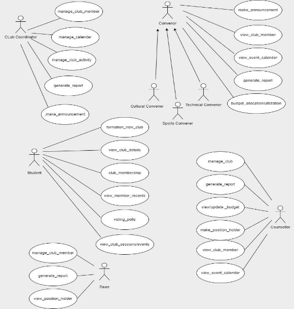

## FUSION ERP 

### SOFTWARE REQUIREMENTS SPECIFICATIONS

### MODULE: SA-3 GYMKHANA (WEB) 
**FACULTY MENTOR:** Dr. Vijaypal Singh Rathor  

**TEAM MEMBERS:**  
- Anurag Goswami (21BCS028) [Mentor]  
- Rishabh Sharma (21BCS174)  
- Rohit Raj (21BCS178)  
- Shobhit Kushwaha (21BCS194)  
- Pulivarthi Mahesh (21BCS168)  
- Rohan Parmar (21BCS176)  

---

### 1. Introduction

#### 1.1 Introduction about Fusion
Fusion ERP is an online web service portal that provides a centralized platform for accessing, collecting, and managing various services related to the operations of an institute, particularly concerning the student body, such as:

- Course Registration and Management
- Mess Committee
- Gymkhana
- Examination
- Hostel Management
- Placement Cell
- Primary Health Centre (PHC)

Additionally, it encompasses various departments involved in student activities as well as those that support these major departments.

#### 1.2 Purpose of Gymkhana Web Module
The Gymkhana web module is a part of the online web service portal responsible for the following:

1. Viewing details of all clubs, including their activity calendar, current coordinator, and co-coordinator.
2. Submitting applications for new clubs and applying for membership in existing clubs. The module features detailed forms to facilitate such services.
3. Users (students, faculty) can view ongoing or upcoming club sessions and events.
4. Users can access public details related to the members of the clubs (both current and previous).
5. Users can participate in elections and request nominations for head positions in a club.

#### 1.3 Scope of the Module

**Functionalities:**

- Hold Elections
- Ask for Nominations
- View Club Details
- View Member Records
- Form New Clubs
- Apply for Membership of Clubs
- Appoint Coordinators of Clubs
- Allocate Budget to Clubs
- Create and View Club Sessions and Events

**Actors:**

- Dean
- Counsellor
- Convener
- Club Coordinator
- Student

---

### 2. User/Actor Description (Characteristics)

#### 2.1 Dean
- **View Budget:** Gain a comprehensive view of the club's financial landscape, ensuring fiscal responsibility and strategic resource allocation.
- **Generate Reports:** Access detailed reports to evaluate the club's performance and contributions, facilitating informed decision-making.
- **View Position Holders:** Easily view and acknowledge outstanding contributors within the club, recognizing and appreciating their efforts.

#### 2.2 Counsellor
- **Manage Clubs:** Facilitate and guide the growth of clubs, ensuring alignment with the institution's values and goals.
- **View & Update Budget:** Monitor and update the financial aspects of clubs, promoting responsible resource management.
- **Generate Reports:** Access insightful reports for an in-depth understanding of club dynamics and contributions.
- **Manage Position Holders:** Acknowledge and support outstanding contributors, fostering a culture of recognition and motivation.
- **View Club Members:** Easily access and manage club members, fostering a sense of inclusivity and engagement.
- **View Event Calendar:** Stay connected with club activities by viewing members, events, and calendars, promoting holistic student development.

#### 2.3 Convenor
**Sub Actors:**
- Cultural Convenor
- Sports Convenor
- Technical Convenor

- **View Event Calendar:** Stay informed about upcoming events, ensuring effective planning and coordination among different club sectors.
- **View Club Members:** Easily access and manage club members, fostering a sense of inclusivity and engagement.
- **Budget Allocation & Utilization:** Efficiently allocate and monitor budgetary resources to optimize the impact of cultural, sports, and technical events.
- **Generate Reports:** Access detailed reports to assess the success of events and identify areas for improvement.
- **Make Announcements:** Effectively communicate updates and critical information to members, creating a cohesive and informed community.

#### 2.4 Club Coordinator
- **Manage All Club Members:** Effortlessly oversee and engage with all club members, fostering a sense of community and participation.
- **Manage Calendar:** Seamlessly organize and coordinate club activities, ensuring a well-planned and dynamic schedule.
- **Manage Club Activities:** Streamline the execution of club activities, from planning to execution, to enhance the overall club experience.
- **Generate Reports:** Access comprehensive reports for insightful analysis, aiding in data-driven decision-making for continuous improvement.
- **Make Announcements:** Effectively communicate updates and vital information to the entire club, fostering transparency and engagement.

#### 2.5 Student
- **Formation of New Clubs:** Users can initiate the creation of new clubs, providing details like name and purpose for others to join.
- **Applying for Membership of Existing Clubs:** Interested individuals can apply for membership in established clubs by submitting relevant information and meeting criteria.

---

### 3. User Requirements

[Note: You may want to add specific user requirements for each actor here to further detail functionalities.]

---

### 4. Conclusion

The Gymkhana module is designed to enhance student engagement, streamline club management, and promote effective communication within the institution. Through the functionalities outlined above, it aims to provide a comprehensive platform for students and faculty to collaborate and participate in club activities.

***3. Functional Requirements*** 

1. ***Use Case Diagram*** 

***C*** 

2. ***Use Case Description*** 
1. ***Dean*** 

<table><tr><th colspan="1" valign="top">UC ID </th><th colspan="2" valign="top">UC#1  </th></tr>
<tr><td colspan="1">Use case Name </td><td colspan="2" valign="top">manage_club_member </td></tr>
<tr><td colspan="1" valign="top">Description </td><td colspan="2" valign="top">Maintains an accurate and up-to-date database of club members </td></tr>
<tr><td colspan="1" valign="top">Actor </td><td colspan="2" valign="top">Dean</td></tr>
<tr><td colspan="1" valign="top">Precondition </td><td colspan="2" valign="top">Club should exist </td></tr>
<tr><td colspan="1" rowspan="2" valign="top">Main Flow </td><td colspan="1" valign="top">1\. </td><td colspan="1" valign="top">
`  `The Club Coordinator facilitates the enrolment of new members, 

ensuring they follow proper registration procedures.

`  `Existing members are encouraged to renew their memberships, with 

the coordinator overseeing the renewal process. 
</td></tr>
<tr><td colspan="1" valign="top">2\. </td><td colspan="1" valign="top">
Maintaining an up-to-date member database, including contact details and membership status.

Tracking and recording member attendance at meetings and events.
</td></tr>
<tr><td colspan="1" valign="top">Post Condition </td><td colspan="2" valign="top">
The club's membership database is updated with accurate information, including new enrolments and membership renewals. 

Members are well-informed about the latest club updates, events, and relevant information through effective communication channels.
</td></tr>
<tr><td colspan="1" valign="top">Alternate Flow </td><td colspan="2"></td></tr>
<tr><td colspan="1" valign="top">Sub Flow </td><td colspan="2"></td></tr>
<tr><td colspan="1" valign="top">Global Alternate Flow </td><td colspan="1"></td><td colspan="1"></td></tr>
</table>

|UC ID |UC#2  ||
| - | - | :- |
|Use case Name |generate\_report ||
|Description |generate reports that provide insights into various aspects of club activities, membership, and performance for effective decision-making and planning. ||
|Actor |Dean||
|Preconditio n |Relevant data, including membership information, event details, and financial records, is available in the system. ||
|Main Flow |1\. |
`  `The Dean(S) defines the parameters for the report, specifying the time 

range, type of report (e.g., membership, financial, event attendance), and any specific criteria. 
|

<table><tr><th colspan="1" rowspan="2"></th><th colspan="1"></th><th colspan="1"></th></tr>
<tr><td colspan="1" valign="top">2\. </td><td colspan="1" valign="top">The Dean(S) may choose to export the report in various formats (e.g., PDF, Excel) or share it with club leaders and members through the club management system or other communication channels.</td></tr>
<tr><td colspan="1" valign="top">Post Condition </td><td colspan="2" valign="top">
The Dean(S) utilizes the report to make informed decisions for the improvement and growth of the club. 

If shared, club leaders and members have access to relevant information for transparency and collaboration.
</td></tr>
<tr><td colspan="1" valign="top">Alternate Flow </td><td colspan="2"></td></tr>
<tr><td colspan="1" valign="top">Sub Flow </td><td colspan="2"></td></tr>
<tr><td colspan="1" valign="top">Global Alternate Flow </td><td colspan="1"></td><td colspan="1"></td></tr>
</table>

|UC ID |UC#3  ||
| - | - | :- |
|Use case Name |view\_position\_holder||
|Description |Can view the Coordinator and Co-Coordinator of the Clubs ||
|Actor |Dean||
|Precondition |Club should exist ||
|Main Flow |1\. |
`  `Easily view and acknowledge outstanding contributors within 

the club, recognizing and appreciation.
|
|Post Condition |||
|Alternate Flow |||
|Sub Flow |||
|Global Alternate Flow |||
2. ***Counsellor*** 

<table><tr><th colspan="1" valign="top">UC ID </th><th colspan="2" valign="top">UC#1 </th></tr>
<tr><td colspan="1" valign="top">Use case Name </td><td colspan="2" valign="top">manage_club </td></tr>
<tr><td colspan="1" valign="top">Description </td><td colspan="2" valign="top">Counselor should accept/reject the new clubs that are forwarded by Convenor </td></tr>
<tr><td colspan="1" valign="top">Actor </td><td colspan="2" valign="top">Counselor </td></tr>
<tr><td colspan="1" valign="top">Precondition </td><td colspan="2" valign="top">Club should not exist </td></tr>
<tr><td colspan="1" rowspan="2" valign="top">Main Flow </td><td colspan="1" valign="top">1\. </td><td colspan="1" valign="top">
`  `Students can propose the formation of new clubs to the

`  `convenor with proper documentation of funds required for the   club and what is the purpose of the club.
</td></tr>
<tr><td colspan="1" valign="top">2\. </td><td colspan="1" valign="top">`  `Then the application is forwarded to the Counselor through the   Convenor for the final approval </td></tr>
<tr><td colspan="1" valign="top">Post Condition </td><td colspan="2" valign="top">
Club is formed and then coordinators, co-coordinators, and faculty incharge are to be selected.

Students are notified accordingly.
</td></tr>
<tr><td colspan="1" valign="top">Alternate Flow </td><td colspan="2"></td></tr>
<tr><td colspan="1" valign="top">Sub Flow </td><td colspan="2"></td></tr>
<tr><td colspan="1" valign="top">Global Alternate Flow </td><td colspan="1"></td><td colspan="1"></td></tr>
</table>

|UC ID |UC#2 |
| - | - |
|Use case Name |generate\_report |
|Description |The event  report of the event or the fest will be sent to the counselor by the dean |
|Actor |Counselor |
|Precondition |There should be an event being conducted in the college.|

<table><tr><th colspan="1" rowspan="2" valign="top">Main Flow </th><th colspan="1" valign="top">1\. </th><th colspan="1" valign="top">`  `The dean students will send the event report to the counselor.</th></tr>
<tr><td colspan="1" valign="top">2\. </td><td colspan="1" valign="top">`  `The counselor will be notified. </td></tr>
<tr><td colspan="1" valign="top">Post Condition </td><td colspan="2" valign="top">There should be an event being conducted in the college.</td></tr>
<tr><td colspan="1" valign="top">Alternate Flow </td><td colspan="2"></td></tr>
<tr><td colspan="1" valign="top">Sub Flow </td><td colspan="2"></td></tr>
<tr><td colspan="1" valign="top">Global Alternate Flow </td><td colspan="1"></td><td colspan="1"></td></tr>
</table>

<table><tr><th colspan="1" valign="top">UC ID </th><th colspan="2" valign="top">UC#3 </th></tr>
<tr><td colspan="1" valign="top">Use case Name </td><td colspan="2" valign="top">view/update_budget </td></tr>
<tr><td colspan="1" valign="top">Description </td><td colspan="2" valign="top">The budget of the event or any thing will be sent to the counselor by the dean </td></tr>
<tr><td colspan="1" valign="top">Actor </td><td colspan="2" valign="top">Counselor </td></tr>
<tr><td colspan="1" valign="top">Precondition </td><td colspan="2" valign="top">There should be a valid reason to view or update the budget. </td></tr>
<tr><td colspan="1" rowspan="2" valign="top">Main Flow </td><td colspan="1" valign="top">1\. </td><td colspan="1" valign="top">`  `The counselor will update the budget according to necessity.</td></tr>
<tr><td colspan="1" valign="top">2\. </td><td colspan="1" valign="top">`  `The budget will be updated. </td></tr>
<tr><td colspan="1" valign="top">Post Condition </td><td colspan="2" valign="top">The budget will be utilized accordingly. </td></tr>
</table>

Alternate Flow   If budget is not proper ask dean to resubmit it 

Sub Flow Global Alternate Flow 

<table><tr><th colspan="1" valign="top">UC ID </th><th colspan="2" valign="top">UC#4 </th></tr>
<tr><td colspan="1" valign="top">Use case Name </td><td colspan="2" valign="top">make_position_holder </td></tr>
<tr><td colspan="1" valign="top">Description </td><td colspan="2" valign="top">The counselor will be able to assign coordinator and coordinator responsibilities to students. </td></tr>
<tr><td colspan="1" valign="top">Actor </td><td colspan="2" valign="top">Counselor </td></tr>
<tr><td colspan="1" valign="top">Precondition </td><td colspan="2" valign="top">There should be a valid club for which counselor assign different roles.</td></tr>
<tr><td colspan="1" rowspan="2" valign="top">Main Flow </td><td colspan="1" valign="top">1\. </td><td colspan="1" valign="top">
`  `After the time period of the coco and co has been completed 

so the counselor changes the designation
</td></tr>
<tr><td colspan="1" valign="top">2\. </td><td colspan="1" valign="top">`  `Counselor sets the new student as the co and the coco.</td></tr>
<tr><td colspan="1" valign="top">Post Condition </td><td colspan="2" valign="top">Students are notified accordingly.</td></tr>
<tr><td colspan="1" valign="top">Alternate Flow </td><td colspan="2" valign="top">
`  `If something went wrong or the Counselor has some objection 

against the changes then the convenor is notified and is requested to re enter the new co and coco.
</td></tr>
<tr><td colspan="1" valign="top">Sub Flow </td><td colspan="2"></td></tr>
<tr><td colspan="1" valign="top">Global Alternate Flow </td><td colspan="1"></td><td colspan="1"></td></tr>
</table>

<table><tr><th colspan="1" valign="top">UC ID </th><th colspan="2" valign="top">UC#5 </th></tr>
<tr><td colspan="1" valign="top">Use case Name </td><td colspan="2" valign="top">view_club_members </td></tr>
<tr><td colspan="1" valign="top">Description </td><td colspan="2" valign="top">This shows all the details of the club members associated with a particular club. </td></tr>
<tr><td colspan="1" valign="top">Actor </td><td colspan="2" valign="top">Counselor </td></tr>
<tr><td colspan="1" valign="top">Precondition </td><td colspan="2" valign="top">There should be a valid club with associated club members. </td></tr>
<tr><td colspan="1" rowspan="2" valign="top">Main Flow </td><td colspan="1" valign="top">1\. </td><td colspan="1" valign="top">
`  `The counselor selects the club to see the members of 

respected clubs. 
</td></tr>
<tr><td colspan="1" valign="top">2\. </td><td colspan="1" valign="top">`  `The list of members of clubs is shown. </td></tr>
<tr><td colspan="1" valign="top">Post Condition </td><td colspan="2" valign="top">The budget will be utilized accordingly. </td></tr>
<tr><td colspan="1" valign="top">Alternate Flow </td><td colspan="2"></td></tr>
<tr><td colspan="1" valign="top">Sub Flow </td><td colspan="2"></td></tr>
<tr><td colspan="1" valign="top">Global Alternate Flow </td><td colspan="1"></td><td colspan="1"></td></tr>
</table>

<table><tr><th colspan="1" valign="top">UC ID </th><th colspan="2" valign="top">UC#6 </th></tr>
<tr><td colspan="1" valign="top">Use case Name </td><td colspan="2" valign="top">view_event_calender </td></tr>
<tr><td colspan="1" valign="top">Description </td><td colspan="2" valign="top">This shows all the details of the events happening in college.</td></tr>
<tr><td colspan="1" valign="top">Actor </td><td colspan="2" valign="top">Counselor </td></tr>
<tr><td colspan="1" valign="top">Precondition </td><td colspan="2" valign="top">The event calendar is already uploaded on portal. </td></tr>
<tr><td colspan="1" rowspan="2" valign="top">Main Flow </td><td colspan="1" valign="top">1\. </td><td colspan="1" valign="top">
`  `The counselor views the timeline of upcoming events in the 

college. 
</td></tr>
<tr><td colspan="1" valign="top">. </td><td colspan="1"></td></tr>
<tr><td colspan="1" valign="top">Post Condition </td><td colspan="2"></td></tr>
<tr><td colspan="1" valign="top">Alternate Flow </td><td colspan="2"></td></tr>
<tr><td colspan="1" valign="top">Sub Flow </td><td colspan="2"></td></tr>
<tr><td colspan="1" valign="top">Global Alternate Flow </td><td colspan="1"></td><td colspan="1"></td></tr>
</table>
3. ***Convenor*** 

UC ID  UC#1 

Use case Name  make\_announcement 

Description  Creates and publish any new announcement using the notification 

module 

Actor  Convenor 

Precondition  Convener must be logged in using the credentials provided 

Main Flow  1.  Convener logs into the fusion portal 

2. Uses the provided form to create a new notification 
2. Pushes the new notification to dashboard by add button 

|Alternate Flow ||||
| - | :- | :- | :- |
|||||
|Sub Flow ||||
|Global ||||
|Alternate ||||
|Flow ||||
|||||

<table><tr><th colspan="1" valign="top">UC ID </th><th colspan="3" valign="top">UC#2 </th></tr>
<tr><td colspan="1" valign="top">Use case Name </td><td colspan="3" valign="top">view_club_members </td></tr>
<tr><td colspan="1" valign="top">Description </td><td colspan="3" valign="top">Convener can view the registered club members </td></tr>
<tr><td colspan="1" valign="top">Actor </td><td colspan="3" valign="top">Convener </td></tr>
<tr><td colspan="1" valign="top">Precondition </td><td colspan="3" valign="top">Club must exist </td></tr>
<tr><td colspan="1" rowspan="2" valign="top">Main Flow </td><td colspan="1" rowspan="3" valign="top">1\. </td></tr>
<tr><td colspan="1" valign="top"></td></tr>
<tr><td colspan="1" valign="top">Alternate Flow </td><td colspan="1" valign="top">` `If club does not exit new club can be added </td></tr>
<tr><td colspan="1" valign="top">Sub Flow </td><td colspan="3"></td></tr>
<tr><td colspan="1" valign="top">
Global Alternate 

Flow 
</td><td colspan="1"></td><td colspan="2"></td></tr>
</table>

<table><tr><th colspan="1" valign="top">UC ID </th><th colspan="3" valign="top">UC#3 </th></tr>
<tr><td colspan="1">Use case Name </td><td colspan="3" valign="top">View/update_activity_calendar </td></tr>
<tr><td colspan="1" valign="top">Description </td><td colspan="3">Make the activity calendar of the college and upload it on the portal </td></tr>
<tr><td colspan="1" valign="top">Actor </td><td colspan="3" valign="top">Convener </td></tr>
<tr><td colspan="1" valign="top">Precondition </td><td colspan="3" valign="top">All events need to be decided and their dates need to be fixed </td></tr>
<tr><td colspan="1" rowspan="2" valign="top">Main Flow </td><td colspan="1" valign="top">1\. </td><td colspan="2" valign="top">Conveners and councellors make the event calendar listing all the fest dates ans further club activities </td></tr>
<tr><td colspan="1" valign="top">2\. </td><td colspan="2" valign="top">Dean(S) approves the calendar and publish it. </td></tr>
<tr><td colspan="1" valign="top">Post Condition </td><td colspan="3" valign="top">Activities should not clash with each other and other academic affairs or semester examination. </td></tr>
<tr><td colspan="1" valign="top">Alternate Flow </td><td colspan="3" valign="top">if any event clashes then it need to be changed </td></tr>
<tr><td colspan="1" valign="top">Sub Flow </td><td colspan="3"></td></tr>
<tr><td colspan="1" valign="top">
Global Alternate 

Flow 
</td><td colspan="2"></td><td colspan="1"></td></tr>
</table>

<table><tr><th colspan="1" valign="top">UC ID </th><th colspan="4" valign="top">UC#4 </th></tr>
<tr><td colspan="1">Use case Name </td><td colspan="4" valign="top">Generate_report </td></tr>
<tr><td colspan="1" valign="top">Description </td><td colspan="4" valign="top">Reports of each event are created and  submitted to co-ordinator and co-coordinator by convenor </td></tr>
<tr><td colspan="1">Actor </td><td colspan="4">Convenor </td></tr>
<tr><td colspan="1" valign="top">Precondition </td><td colspan="4" valign="top">Event report should be created by convenor </td></tr>
<tr><td colspan="1" rowspan="3" valign="top">Main Flow </td><td colspan="1" valign="top">1\.</td><td colspan="1">Event report is created by convenor which contains detailed information of the event such as date, time, etc. </td></tr>
<tr><td colspan="1" rowspan="2" valign="top">2\.</td><td colspan="1" valign="top">This report is submitted to co-ordintor and co_coordintor by convenor </td></tr>
<tr><td colspan="1" valign="top"></td><td colspan="1" valign="top"></td></tr>
</table>

|Post Condition |In case of any clash it needs to be rectified by discussing with club co- ordinators  ||
| :- | :- | :- |
|Sub Flow |||
|Global Alternate Flow |||
UC ID  UC#5 

Use case  Budget\_allocation/utilization Name 

Description  Convener has to check the proper utilization and allocation for club need in 

accordance to the event 

Actor  Convener 

Precondition Need must exist for approval of new budget 

Main Flow  1.  Convener has to check the  Pass Budget if it is in accordance  

need of the cub 

2\.  Convener has to forward  Budget to the higher authorities for 

the 

approval 

Alternate  If the budget does not  the needs of the club it must be  flow  match with  discussion with club members 

Changed according to the  

Post  Budget will be allotted when approved by Senate Condition 

Sub Flow 

Global Alternate Flow 

4. ***Club Coordinator*** 

<table><tr><th colspan="1" valign="top">UC ID </th><th colspan="3" valign="top">UC#1 </th></tr>
<tr><td colspan="1">Use case Name </td><td colspan="3" valign="top">manage_club_member </td></tr>
<tr><td colspan="1" valign="top">Description </td><td colspan="3" valign="top">Maintains an accurate and up-to-date database of club members </td></tr>
<tr><td colspan="1" valign="top">Actor </td><td colspan="3" valign="top">Club-coordinator</td></tr>
<tr><td colspan="1" valign="top">Precondition </td><td colspan="3" valign="top">Club should exist </td></tr>
<tr><td colspan="1" rowspan="3" valign="top">Main Flow </td><td colspan="2" valign="top">
The Club Coordinator facilitates the enrolment of new members, ensuring they follow proper registration procedures.

Existing members are encouraged to renew their memberships, with the coordinator overseeing the renewal process. 
</td></tr>
<tr><td colspan="1" valign="top"></td><td colspan="2" valign="top"></td></tr>
<tr><td colspan="1" valign="top">2\. </td><td colspan="2" valign="top">
Maintaining an up-to-date member database, including contact details and membership status.

Tracking and recording member attendance at meetings and events.
</td></tr>
<tr><td colspan="1" valign="top">Post Condition</td><td colspan="3" rowspan="4" valign="top">
The club's membership database is updated with accurate information, including new enrolments and membership renewals.

Members are well-informed about the latest club updates, events, and relevant information through effective communication channels.
</td></tr>
<tr><td colspan="1" valign="top">Alternate Flow </td></tr>
<tr><td colspan="1" valign="top">Sub Flow </td></tr>
<tr><td colspan="1" valign="top">
Global Alternate 

Flow 
</td></tr>
</table>
UC ID  UC#2 

Use case  manage\_calender Name 

Description  To efficiently manage and coordinate club events and activities through 

an organized and up-to-date calendar. 

Actor  Club-coordinator

Precondition  The Club Coordinator has access to the club management system. Main Flow  1.  The coordinator initiates the scheduling of new events, meetings, or 

activities by providing necessary details such as title, date, time, venue, and any relevant notes. 

<table><tr><th colspan="1" rowspan="2"></th><th colspan="1"></th><th colspan="1" valign="top">The system updates the calendar with the newly scheduled event, ensuring it is visible to all club members. </th></tr>
<tr><td colspan="1" valign="top">2\. </td><td colspan="1" valign="top">The coordinator configures notifications for upcoming events to be sent to club members, ensuring they are well-informed in advance.</td></tr>
<tr><td colspan="1" valign="top">Post Condition </td><td colspan="2" rowspan="4" valign="top">
The club calendar is up-to-date, reflecting all scheduled events, meetings, and activities. 

Collaboration with club leadership ensures that the calendar aligns with the overall vision and goals of the club.

</td></tr>
<tr><td colspan="1" valign="top">Alternate Flow</td></tr>
<tr><td colspan="1" valign="top">Sub Flow </td></tr>
<tr><td colspan="1" valign="top">Global Alternate Flow </td></tr>
</table>

<table><tr><th colspan="1" valign="top">UC ID </th><th colspan="2" valign="top">UC#3 </th></tr>
<tr><td colspan="1">Use case Name </td><td colspan="2" valign="top">manage_club_activity </td></tr>
<tr><td colspan="1" valign="top">Description </td><td colspan="2" valign="top">To efficiently plan, organize, and oversee various club activities. </td></tr>
<tr><td colspan="1" valign="top">Actor </td><td colspan="2" valign="top">Club-coordinator</td></tr>
<tr><td colspan="1" valign="top">Precondition </td><td colspan="2" valign="top">The Club Coordinator has access to the club management system. </td></tr>
<tr><td colspan="1" rowspan="3" valign="top">Main Flow </td></tr>
<tr><td colspan="1" valign="top"></td><td colspan="1" valign="top"></td></tr>
<tr><td colspan="1" valign="top">2\. </td><td colspan="1" valign="top">The coordinator sets up a registration system for members to sign up and participate in the activities.</td></tr>
<tr><td colspan="1" valign="top">Post Condition</td><td colspan="2" rowspan="3" valign="top">The club calendar is updated to reflect the completion of activities.</td></tr>
<tr><td colspan="1" valign="top">Alternate Flow</td></tr>
<tr><td colspan="1" valign="top">Sub Flow </td></tr>
</table>
Global Alternate 

Flow 

<table><tr><th colspan="1" valign="top">UC ID </th><th colspan="2" valign="top">UC#4 </th></tr>
<tr><td colspan="1">Use case Name </td><td colspan="2" valign="top">generate_report </td></tr>
<tr><td colspan="1" valign="top">Description </td><td colspan="2">generate reports that provide insights into various aspects of club activities, membership, and performance for effective decision-making and planning. </td></tr>
<tr><td colspan="1" valign="top">Actor </td><td colspan="2" valign="top">Club-coordinator</td></tr>
<tr><td colspan="1" valign="top">Precondition </td><td colspan="2">Relevant data, including membership information, event details, and financial records, is available in the system. </td></tr>
<tr><td colspan="1" rowspan="2" valign="top">Main Flow </td><td colspan="1" valign="top">1\. </td><td colspan="1" valign="top">The coordinator defines the parameters for the report, specifying the time range, type of report (e.g., membership, financial, event attendance), and any specific criteria. </td></tr>
<tr><td colspan="1" valign="top">2\. </td><td colspan="1" valign="top">The coordinator may choose to export the report in various formats (e.g., PDF, Excel) or share it with club leaders and members through the club management system or other communication channels.</td></tr>
<tr><td colspan="1" valign="top">Post Condition </td><td colspan="2" rowspan="4" valign="top">
The coordinator utilizes the report to make informed decisions for the improvement and growth of the club. 

If shared, club leaders and members have access to relevant information for transparency and collaboration.

</td></tr>
<tr><td colspan="1" valign="top">Alternate Flow </td></tr>
<tr><td colspan="1" valign="top">Sub Flow </td></tr>
<tr><td colspan="1" valign="top">Global Alternate Flow </td></tr>
</table>

<table><tr><th colspan="1" valign="top">UC ID </th><th colspan="2" valign="top">UC#5 </th></tr>
<tr><td colspan="1">Use case Name </td><td colspan="2" valign="top">make_announcement </td></tr>
<tr><td colspan="1" valign="top">Description </td><td colspan="2">Announcement of important information, updates to club members through the club management system. </td></tr>
<tr><td colspan="1" valign="top">Actor </td><td colspan="2" valign="top">Club-coordinator</td></tr>
<tr><td colspan="1" valign="top">Precondition </td><td colspan="2" valign="top">Relevant information or announcements are available for communication. </td></tr>
<tr><td colspan="1" rowspan="2" valign="top">Main Flow </td><td colspan="1" valign="top">1\. </td><td colspan="1" valign="top">
The coordinator creates a new announcement, including the title, content, and any relevant details such as date, time, or associated events. 

The coordinator determines the target audience for the announcement, such as all members, specific committees, or leaders, ensuring that the information is directed appropriately. 
</td></tr>
<tr><td colspan="1" valign="top">2\. </td><td colspan="1" valign="top">Club members receive notifications through the club management system</td></tr>
<tr><td colspan="1" valign="top">Post Condition </td><td colspan="2" rowspan="4" valign="top">
Club members are informed and notified about the announcement through appropriate channels.

</td></tr>
<tr><td colspan="1" valign="top">Alternate Flow </td></tr>
<tr><td colspan="1" valign="top">Sub Flow </td></tr>
<tr><td colspan="1" valign="top">Global Alternate Flow </td></tr>
</table>
5. ***Student*** 

<table><tr><th colspan="1" valign="top">UC ID </th><th colspan="3" valign="top">UC#1 </th></tr>
<tr><td colspan="1" valign="top">Use case Name </td><td colspan="3" valign="top">new_club_form </td></tr>
<tr><td colspan="1" valign="top">Description </td><td colspan="3" valign="top">proposal for the formation of new club </td></tr>
<tr><td colspan="1" valign="top">Actor </td><td colspan="3" valign="top">Student </td></tr>
<tr><td colspan="1" valign="top">Precondition </td><td colspan="3" valign="top">Club should not exist </td></tr>
<tr><td colspan="1" rowspan="3" valign="top">Main Flow </td><td colspan="2" valign="top">
Students can propose the formation of new clubs to the 

convenor with proper documentation of funds required for the 

club and what is the purpose of the club. 
</td></tr>
<tr><td colspan="1" valign="top"></td><td colspan="2" valign="top"></td></tr>
<tr><td colspan="1" valign="top">2\. </td><td colspan="2" valign="top">
Then the application is forwarded to the Dean (S) through the 

counsellors for the final approval 
</td></tr>
<tr><td colspan="1" valign="top">Post Condition </td><td colspan="3" rowspan="4" valign="top">Club is formed and then coordinators, co-coordinators, and faculty incharge are to be selected </td></tr>
<tr><td colspan="1" valign="top">Alternate Flow </td></tr>
<tr><td colspan="1" valign="top">Sub Flow </td></tr>
<tr><td colspan="1" valign="top">Global Alternate Flow </td></tr>
</table>
UC ID  UC#2 

Use case Name view\_club\_details 

Description  this shows the details of the all the clubs present in the gymkhana 

who are the co ordinators , co coordinators etc.. 

Actor  Students, dean students,mess incharge,counsellors 

Precondition  There should be representative from every batch  

Main Flow  1.  the actor selects the club to which he wants to know the info 

about  

2\.  The data of the respective club will be shown  

Post Condition Alternate Flow 

Sub Flow  

Global Alternate   Flow  

<table><tr><th colspan="1" valign="top">UC ID </th><th colspan="3" valign="top">UC#3 </th></tr>
<tr><td colspan="1" valign="top">Use case Name</td><td colspan="3" valign="top">` `club_membership_form </td></tr>
<tr><td colspan="1" valign="top">Description </td><td colspan="3" valign="top">Form for getting enrolled in a club </td></tr>
<tr><td colspan="1" valign="top">Actor </td><td colspan="3" valign="top">Student </td></tr>
<tr><td colspan="1" valign="top">Precondition </td><td colspan="3" valign="top">Club should exist </td></tr>
<tr><td colspan="1" rowspan="3" valign="top">Main Flow </td><td colspan="2" valign="top">Student who are interested to get enrolled in a particular club, fills this form. </td></tr>
<tr><td colspan="1" valign="top"></td><td colspan="2" valign="top"></td></tr>
<tr><td colspan="1" valign="top">2\. </td><td colspan="2" valign="top">Student information is verified and student is enrolled in that club. </td></tr>
<tr><td colspan="1" valign="top">Post Condition </td><td colspan="3" rowspan="4" valign="top">Student is enrolled in that club and his information is updated in members record. </td></tr>
<tr><td colspan="1" valign="top">Alternate Flow </td></tr>
<tr><td colspan="1" valign="top">Sub Flow </td></tr>
<tr><td colspan="1" valign="top">Global Alternate Flow </td></tr>
</table>

|UC ID |UC#4 |
| - | - |
|Use case Name |view\_club\_members |
|Description |Convener can view the registered club members |
|Actor |Student |
|Precondition |Club must exist |

<table><tr><th colspan="1" rowspan="2" valign="top">Main Flow </th><th colspan="2" valign="top">Convener can view the details of the  registered student for a specific club </th></tr>
<tr><td colspan="1" valign="top"></td><td colspan="2" valign="top"></td></tr>
<tr><td colspan="1"></td><td colspan="1" rowspan="2" valign="top"></td><td colspan="2"></td></tr>
<tr><td colspan="1" valign="top">Alternate Flow </td></tr>
<tr><td colspan="1" valign="top">Sub Flow </td><td colspan="1"></td><td colspan="2"></td></tr>
<tr><td colspan="1" valign="top">Global Alternate </td><td colspan="1"></td><td colspan="2"></td></tr>
<tr><td colspan="1" valign="top">Flow </td><td colspan="1"></td><td colspan="2"></td></tr>
<tr><td colspan="1"></td><td colspan="1"></td><td colspan="2"></td></tr>
</table>

<table><tr><th colspan="1" valign="top">UC ID </th><th colspan="2" valign="top">UC#5 </th></tr>
<tr><td colspan="1" valign="top">Use case Name </td><td colspan="2" valign="top">vooting_polls </td></tr>
<tr><td colspan="1" valign="top">Description </td><td colspan="2" valign="top">Students can cast their votes for various elections held like senate election. </td></tr>
<tr><td colspan="1" valign="top">Actor </td><td colspan="2" valign="top">Student </td></tr>
<tr><td colspan="1" valign="top">Precondition </td><td colspan="2" valign="top">Candidate for whom the vote is casted should exist. </td></tr>
<tr><td colspan="1" rowspan="3" valign="top">
Main Flow 

Post Condition 
</td><td colspan="1" valign="top">1\. </td><td colspan="1" valign="top">Election candidate should be verified and listed </td></tr>
<tr><td colspan="1" valign="top">2\. </td><td colspan="1" valign="top">student can cast their votes for verified and listed candidate only </td></tr>
<tr><td colspan="2" rowspan="4" valign="top">
candidates count of vote increase 

</td></tr>
<tr><td colspan="1" valign="top">Alternate Flow </td></tr>
<tr><td colspan="1" valign="top">Sub Flow </td></tr>
<tr><td colspan="1" valign="top">Global Alternate Flow </td></tr>
</table>

|UC ID |UC#6 |
| - | - |
|Use case Name|` `View\_club\_sessions |
|Description |Students can view the time table for the club sessions and events |

<table><tr><th colspan="1" valign="top">Actor </th><th colspan="5" valign="top">Student </th></tr>
<tr><td colspan="1" valign="top">Precondition </td><td colspan="5" valign="top">Student must exist in the club records </td></tr>
<tr><td colspan="1" rowspan="2" valign="top">Main Flow </td><td colspan="2" valign="top">1\. </td><td colspan="3" valign="top">Student can view the club sessions and events of the registered club </td></tr>
<tr><td colspan="1" rowspan="5" valign="top">2\. </td><td colspan="3" valign="top">Attendance(RSVP) can be done through the fusion portal gymkhana page </td></tr>
<tr><td colspan="1" valign="top">Post Condition </td><td colspan="2" rowspan="4" valign="bottom">

</td></tr>
<tr><td colspan="1" valign="top">Alternate Flow </td></tr>
<tr><td colspan="1" valign="top">Sub Flow </td></tr>
<tr><td colspan="1" valign="top">Global Alternate Flow </td></tr>
</table>
3. ***Other Functional Requirements***
1. ***Notification Module*** 

   The Notification module is responsible for managing and disseminating important information within the organization. It facilitates the sending of notifications related to event approvals, join requests, critical updates, and other relevant announcements. Notifications are prominently displayed on the dashboard for immediate attention. 

2. ***Role Assignment by Super Admin***

   This functionality enables the Super Admin to assign specific roles to counsellors, co-coordinators, and coordinators. Super Admin has the authority to define and modify the responsibilities associated with each role, ensuring a structured and organized hierarchy within the system. 

3. ***Display of New Messages on Dashboard***

   The system must dynamically showcase new messages on the dashboard, providing users with a quick overview of recent communications. This ensures that important messages are promptly noticed and attended to by the relevant users. 

4. ***Approval-Based Addition of New Students to Clubs***

   New students can be added to clubs only after approval, enhancing the control over club membership. This feature involves an approval process, ensuring that only eligible students are integrated into the respective clubs.

5. ***Alerts for Critical Inventory Levels and Updates***

   The module includes an alert system that notifies administrators and relevant personnel about critical inventory levels and other essential updates. This ensures timely actions are taken to address inventory shortages or other important matters. 

6. ***Participation in Voting Polls*** 

   The system allows users, especially club members, to actively participate in voting polls. This feature fosters engagement and democratic decision-making within the organization. 

7. ***View Club Members*** 

   Users with the appropriate permissions can access and view the list of members within a specific club. This feature facilitates effective club management and communication among members. 

8. ***View Club Information and Sessions***

   Users, depending on their roles, can view detailed information about clubs, including their purpose, activities, and upcoming sessions. This feature promotes 

   transparency and awareness among club members regarding scheduled events and club-related information. 

4. ***Other Constraints*** 
1. ***User Interfaces*** 

   The user interface should comply with the colour scheming and dashboard design of the FUSIONIIT. Users should be able to navigate from one functionality to other. Inter module navigation should be smooth. All the functionalities should be easy to use, and no specific training should be required for the usage of the module

2. ***Tech Stack Used*** 

   Python, Django, PostgreSQL*** 

3. ***Business Rules*** 

   **Club Members Enrolment Based on Registration Fees:**

Club members must pay the specified registration fees before joining a club. This rule ensures financial transparency and fair access to club benefits, contributing to the sustainable operation of clubs within the organization. 

**Appointment of Club Coordinators and Coordinators Based on Majority Criteria:** 

Club coordinators and coordinators are appointed based on a majority criteria set by the academic section. Through a voting or approval process, candidates with majority support assume leadership roles, promoting a democratic and participatory approach in selecting individuals for these positions.** 

4. ***Non-Functional Requirements*** 
1. ***Performance*** 

   A college portal's performance is a crucial non-functional need that guarantees the system reacts quickly to user input. This calls for low downtime, speedy page loads, and effective data processing. The smooth and responsive user experience that an optimized performance ensures is crucial for staff, instructors, and students who depend on the portal for a variety of administrative and academic activities. 

2. ***Security*** 

   For a college portal handling sensitive student and institutional data, security is critical. It is imperative to put strong security measures in place to guard against data breaches, 

   unauthorized access, and other cyberthreats. These measures include encryption, authentication, and access controls. Reliability and privacy of the data kept in the portal are contingent upon a strong security framework.

3. ***Usability*** 

   Usability is centred on how easy it is to use the college portal. Users of all technical skill levels can engage with the portal effectively thanks to its simple and intuitive interface. Setting usability as a top priority increases user satisfaction, lowers the learning curve, and encourages academics, administrative staff, and students to utilize the portal frequently.

4. ***Maintainability***  

   The college portal's maintainability refers to how easily it can be updated, changed, and maintained over time. Updates, bug repairs, and the addition of new features may all be completed quickly on a well-maintained system. By doing this, you may lengthen the portal's lifecycle and save overall maintenance costs by ensuring that it can adapt to changing institutional requirements and technology improvements.

5. ***Scalability*** 

   A college portal must be scalable to handle different usage levels. The portal should be able to handle increases in traffic without experiencing any performance deterioration as the user base grows or during periods of heightened activity. To ensure that the site is future-proof and capable of keeping up with changing user demands and technology improvements, scalability is crucial. 

5. ***Module dependencies with other fusion modules***
1. ***Awards and Scholarships Module***

   The Awards and Scholarships module recognizes and rewards exceptional student achievements, distributing awards for academic excellence, sports accomplishments, and 

   leadership qualities. It also oversees the allocation of scholarships, considering factors such as academic performance, financial need, and special talents.

2. ***Purchase and Store Module***

   Managing organizational merchandise, the Purchase and Store module ensures efficient inventory tracking, order processing, and restocking. It streamlines the procurement process, handling everything from order placement to payment and fulfilment. 

3. ***Notification Module***

   Essential for communication, the Notification module handles the approval of join requests, sends event notifications, and serves as a centralized platform for important announcements. It keeps members informed about crucial events, decisions, and general updates. 

4. ***Dashboard Module*** 

   The Dashboard module provides a centralized interface for users, displaying real-time notifications, facilitating message management, and offering an overview of recent activities and important notices. It streamlines user interactions within the organization. 
