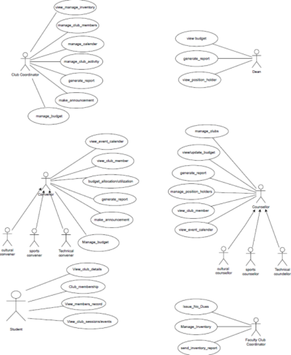

# FUSION ERP

## SOFTWARE REQUIREMENTS SPECIFICATIONS

### MODULE: SA-3 GYMKHANA (WEB)

**FACULTY MENTOR:**  
**●** DR. VIJAYPAL SINGH RATHOR

**TEAM MEMBERS:**  
**●** ANURAG GOSWAMI (21BCS028) [MENTOR]  
**●** RISHABH SHARMA (21BCS174)  
**●** ROHIT RAJ (21BCS178)  
**●** SHOBHIT KUSHWAHA (21BCS194)  
**●** PULIVARTHI MAHESH (21BCS168)  
**●** ROHAN PARMAR (21BCS176)  

---

### 1. Introduction

#### 1.1 Introduction about Fusion

Fusion ERP is an online web service portal that provides a centralized platform for accessing, collecting, and managing various services related to the student body at the institute, including:

- Course Registration and Management
- Mess Committee
- Gymkhana
- Examination
- Hostel Management
- Placement Cell
- Primary Health Centre (PHC)

This portal supports the activities of students and various departments involved in these operations.

#### 1.2 Purpose of the Gymkhana Web Module

The Gymkhana web module is part of the online web service portal responsible for the following functionalities:

1. Viewing details of all clubs, including their activity calendar, current coordinator, and co-coordinator.
2. Submitting applications for new clubs and applying for membership in existing clubs through detailed forms.
3. Allowing users (students, faculty) to view ongoing or upcoming club sessions and events.
4. Accessing public details related to current and previous club members.
5. Participating in elections and nominating head figures in a club.

#### 1.3 Scope of the Module

**Functionalities:**
- Ask for Nominations
- View Club Details
- View Member Records
- Form New Clubs
- Apply for Membership of Clubs
- Appoint Coordinators of Clubs
- Allocate Budgets to Clubs
- Create and View Club Sessions and Events

**Actors:**
- Dean
- Counsellor
- Convener
- Club Coordinator
- Student
- Faculty Club Coordinator (FIC)

---

### 2. User/Actor Description (Characteristics)

#### 2.1 Dean
- **View Budget:** Gain a comprehensive view of the club's financial landscape, ensuring fiscal responsibility and strategic resource allocation.
- **Generate Reports:** Access detailed reports to evaluate the club's performance and contributions, facilitating informed decision-making.
- **View Position Holders:** Easily view and acknowledge outstanding contributors within the club, recognizing and appreciating their efforts.

#### 2.2 Counsellor
**Sub Actors:**
1. Cultural Counsellor
2. Sports Counsellor
3. Technical Counsellor

- **Manage Clubs:** Facilitate and guide the growth of clubs, ensuring they align with the institution's values and goals.
- **View & Update Budget:** Monitor and update the financial aspects of the clubs, promoting responsible resource management.
- **Generate Report:** Access insightful reports for an in-depth understanding of club dynamics and contributions.
- **Manage Position Holders:** Acknowledge and support outstanding contributors, fostering a culture of recognition and motivation.
- **View Club Members:** Easily access and manage club members, fostering inclusivity and engagement.
- **View Event Calendar:** Stay connected with club activities by viewing members, events, and calendars, promoting holistic student development.

#### 2.3 Convenor
**Sub Actors:**
1. Cultural Convenor
2. Sports Convenor
3. Technical Convenor

- **View Event Calendar:** Stay informed about upcoming events, ensuring effective planning and coordination between different club sectors.
- **View Club Members:** Easily access and manage club members, fostering inclusivity and engagement.
- **Budget Allocation & Utilization:** Efficiently allocate and monitor budgetary resources to optimize the impact of cultural, sports, and technical events.
- **Generate Reports:** Access detailed reports to assess the success of events and identify areas for improvement.
- **Make Announcements:** Effectively communicate updates and critical information to members, creating a cohesive and informed community.
- **Manage Budget:** Oversee the budget for different clubs in action and request updates as needed.

#### 2.4 Club Coordinator
- **Manage All Club Members:** Oversee and engage with all club members, fostering a sense of community and participation.
- **Manage Calendar:** Organize and coordinate club activities, ensuring a well-planned and dynamic schedule.
- **Manage Club Activities:** Streamline the execution of club activities, enhancing the overall club experience.
- **Generate Reports:** Access comprehensive reports for insightful analysis, aiding in data-driven decision-making for continuous improvement.
- **Make Announcements:** Communicate updates and vital information to the entire club, fostering transparency and engagement.
- **Manage Budget:** Oversee the budget for different clubs in action and request updates as needed.
- **View & Manage Inventory:** Allocate and provide necessary equipment to students and request new inventory for events.

#### 2.5 Student
- **View Club Details:** Users can view details and event information for clubs of interest.
- **Apply for Membership of Existing Clubs:** Interested individuals can apply for membership in established clubs by submitting relevant information and meeting criteria.
- **View Member Records:** Access current members of a particular club and their representatives.
- **View Club Sessions and Events:** View ongoing and upcoming sessions and events for any club they participate in.

#### 2.6 Faculty Club Coordinator
- **Issue No Dues:** Update the no dues for any student when issuing/recovering any inventory.
- **Manage Inventory:** Allocate and provide necessary equipment to students and request new inventory for events.
- **Generate Inventory Reports:** Access comprehensive reports for insightful analysis, aiding in inventory-driven decision-making for continuous improvement.

***3. Functional Requirements 3.1 Use Case Diagram***

***C***

***3.2 Use Case Description*** 

***3.2.1 Dean*** 

|UC ID |UC#1||
| :- | :- | :- |
|Use case Name |view budget||
|Description |The budget of the event or club can be viewed by dean||
|Actor |Dean||
|Precondition |Cub budget must be approved before||
|Main Flow |1\. |The Dean can view the budget for any club or any ongoing event.|
|
Post Condition 

Alternate Flow Sub Flow
|The budget will be utilized accordingly.||
|Global Alternate Flow|||

|UC ID |UC#2|
| :- | :- |
|
Use case 

Name
|generate\_report|
|Description |generate reports that provide insights into various aspects of club activities, membership, and performance for effective decision-making and planning.|
|Actor |Dean|
|Preconditio n|Relevant data, including membership information, event details, and financial records, is available in the system.|

Main Flow 1. The Dean(S) defines the parameters for the report, specifying the time range, type of report (e.g., membership, financial, event attendance), 

and any specific criteria.

||2\. |The Dean(S) may choose to export the report in various formats (e.g., PDF, Excel) or share it with club leaders and members through the club management system or other communication channels.|
| :- | :- | :- |
|
Post 

Condition
|
The Dean(S) utilizes the report to make informed decisions for the improvement and growth of the club. 

If shared, club leaders and members have access to relevant information for transparency and collaboration.
||
|
Alternate 

Flow
|||
|Sub Flow|||
|
Global 

Alternate 

Flow
|||

|UC ID |UC#3||
| :- | :- | :- |
|
Use case 

Name
|view\_position\_holder||
|Description |Can view the Coordinator and Co-Coordinator of the Clubs||
|Actor |Dean||
|Precondition |Club should exist||
|Main Flow |1\. |Easily view and acknowledge outstanding contributors within the club, recognizing and appreciation.|
|
Post 

Condition
|||
|
Alternate 

Flow 

Sub Flow 

Global 

Alternate 

Flow
|||

***3.2.2 Counsellor***

<table><tr><th valign="top">UC ID </th><th colspan="2" valign="top">UC#1</th></tr>
<tr><td valign="top">Use case Name </td><td colspan="2" valign="top">manage_club</td></tr>
<tr><td valign="top">Description </td><td colspan="2" valign="top">Counselor should accept/reject the new clubs that are forwarded by Convenor</td></tr>
<tr><td valign="top">Actor </td><td colspan="2" valign="top">Counselor</td></tr>
<tr><td valign="top">Precondition </td><td colspan="2" valign="top">Club should not exist</td></tr>
<tr><td rowspan="2" valign="top">
Main Flow 

Post Condition Alternate Flow
</td><td valign="top">1\. </td><td valign="top">
Students can propose the formation of new clubs to the 

convenor with proper documentation of funds required for the 

club and what is the purpose of the club.
</td></tr>
<tr><td colspan="2" valign="top">
2\. Then the application is forwarded to the Counselor through the 

Convenor for the final approval 

Club is formed and then coordinators, co-coordinators, and faculty incharge are to be selected. 

Students are notified accordingly.
</td></tr>
<tr><td valign="top">Sub Flow</td><td colspan="2" valign="top"></td></tr>
<tr><td valign="top">Global Alternate Flow</td><td valign="top"></td><td valign="top"></td></tr>
</table>

|UC ID |UC#2|
| :- | :- |
|Use case Name |generate\_report|
|
Description 

Actor 
|
The event report of the event or the fest will be sent to the counselor by the dean 

Counselor
|
|Precondition |There should be an event being conducted in the college.|

<table><tr><th rowspan="2" valign="top">Main Flow </th><th valign="top">1\. </th><th valign="top">The dean students will send the event report to the counselor.</th></tr>
<tr><td valign="top">2\. </td><td valign="top">The counselor will be notified.</td></tr>
<tr><td valign="top">Post Condition </td><td colspan="2" valign="top">There should be an event being conducted in the college.</td></tr>
<tr><td valign="top">Alternate Flow</td><td colspan="2" valign="top"></td></tr>
</table>

Sub Flow 

Global Alternate 

Flow 

|UC ID |UC#3|
| :- | :- |
|Use case Name |view/update\_budget|
|Description |The budget of the event or any thing will be sent to the counselor by the dean|
|Actor |Counselor|
|Precondition |There should be a valid reason to view or update the budget.|

Main Flow 1. The counselor will update the budget according to necessity. 

2\. The budget will be updated. 

Post Condition The budget will be utilized accordingly.

|Alternate Flow |If budget is not proper ask dean to resubmit it||
| :- | :- | :- |
|Sub Flow|||
|Global Alternate Flow|||

<table><tr><th valign="top">UC ID </th><th colspan="2" valign="top">UC#4</th></tr>
<tr><td valign="top">Use case Name </td><td colspan="2" valign="top">make_position_holder</td></tr>
<tr><td valign="top">Description </td><td colspan="2" valign="top">The counselor will be able to assign coordinator and coordinator responsibilities to students.</td></tr>
<tr><td valign="top">Actor </td><td colspan="2" valign="top">Counselor</td></tr>
<tr><td valign="top">Precondition </td><td colspan="2" valign="top">There should be a valid club for which counselor assign different roles.</td></tr>
<tr><td rowspan="2" valign="top">Main Flow </td><td valign="top">1\. </td><td valign="top">After the time period of the coco and co has been completed so the counselor changes the designation</td></tr>
<tr><td valign="top">2\. </td><td valign="top">Counselor sets the new student as the co and the coco.</td></tr>
<tr><td valign="top">Post Condition </td><td colspan="2" valign="top">Students are notified accordingly.</td></tr>
<tr><td valign="top">Alternate Flow </td><td colspan="2" valign="top">
If something went wrong or the Counselor has some 

objection against the changes then the convenor is notified and is requested to re enter the new co and coco.
</td></tr>
<tr><td valign="top">Sub Flow</td><td colspan="2" valign="top"></td></tr>
</table>

Global Alternate

Flow

|UC ID |UC#5||
| :- | :- | :- |
|Use case Name |view\_club\_members||
|Description |This shows all the details of the club members associated with a particular club.||
|Actor |Counselor||
|Precondition |There should be a valid club with associated club members.||
|
Main Flow 

Post Condition 
|
1\. The counselor selects the club to see the members of respected clubs. 

2\. The list of members of clubs is shown. 

The budget will be utilized accordingly.
||
|Alternate Flow|||
|Sub Flow|||
|Global Alternate Flow|||

<table><tr><th valign="top">UC ID </th><th colspan="2" valign="top">UC#6</th></tr>
<tr><td valign="top">Use case Name </td><td colspan="2" valign="top">view_event_calender</td></tr>
<tr><td valign="top">Description </td><td colspan="2" valign="top">This shows all the details of the events happening in college.</td></tr>
<tr><td valign="top">Actor </td><td colspan="2" valign="top">Counselor</td></tr>
<tr><td valign="top">Precondition </td><td colspan="2" valign="top">The event calendar is already uploaded on portal.</td></tr>
<tr><td rowspan="2" valign="top">
Main Flow 

Post Condition
</td><td valign="top">1\. </td><td valign="top">The counselor views the timeline of upcoming events in the college.</td></tr>
<tr><td colspan="2" valign="top">.</td></tr>
<tr><td valign="top">Alternate Flow</td><td colspan="2" valign="top"></td></tr>
<tr><td valign="top">Sub Flow</td><td colspan="2" valign="top"></td></tr>
<tr><td valign="top">Global Alternate Flow</td><td valign="top"></td><td valign="top"></td></tr>
</table>

***3.2.3 Convenor*** 

<table><tr><th valign="top">UC ID </th><th colspan="2" valign="top">UC#1</th></tr>
<tr><td valign="top"></td><td colspan="2" valign="top">Use case Name make_announcement</td></tr>
<tr><td valign="top">Description </td><td colspan="2" valign="top">Creates and publish any new announcement using the notification module</td></tr>
<tr><td valign="top">Actor </td><td colspan="2" valign="top">Convenor</td></tr>
<tr><td valign="top">Precondition </td><td colspan="2" valign="top">Convener must be logged in using the credentials provided</td></tr>
<tr><td rowspan="3" valign="top">Main Flow </td><td valign="top">1\. </td><td valign="top">Convener logs into the fusion portal</td></tr>
<tr><td valign="top">2\. </td><td valign="top">Uses the provided form to create a new notification</td></tr>
<tr><td valign="top">3\. </td><td valign="top">Pushes the new notification to dashboard by add button</td></tr>
<tr><td valign="top">Alternate Flow</td><td colspan="2" valign="top"></td></tr>
<tr><td valign="top">
Sub Flow 

Global 

Alternate 

Flow
</td><td colspan="2" valign="top"></td></tr>
</table>

|UC ID |UC#2||
| :- | :- | :- |
||Use case Name view\_club\_members||
|Description |Convener can view the registered club members||
|Actor |Convener||
|
Precondition 

Main Flow 
|
Club must exist 

1\. Convener can view the details of the registered student for a specific club
||
|Alternate Flow ||If club does not exit new club can be added|

Sub Flow

|
Global 

Alternate 

Flow
|||
| :- | :- | :- |

<table><tr><th valign="top">UC ID </th><th colspan="2" valign="top">UC#3</th></tr>
<tr><td valign="top">
Use case 

Name
</td><td colspan="2" valign="top">View/update_calendar</td></tr>
<tr><td valign="top">Description </td><td colspan="2" valign="top">Make the activity calendar of the college and upload it on the portal</td></tr>
<tr><td valign="top">Actor </td><td colspan="2" valign="top">Convener</td></tr>
<tr><td valign="top"></td><td colspan="2" valign="top">Precondition All events need to be decided and their dates need to be fixed</td></tr>
<tr><td rowspan="2" valign="top">Main Flow </td><td valign="top"></td><td valign="top">1\. Conveners and councellors make the event calendar listing all the fest dates ans further club activities</td></tr>
<tr><td valign="top"></td><td valign="top">2\. Dean(S) approves the calendar and publish it.</td></tr>
<tr><td valign="top">
Post 

Condition 

Alternate 

Flow 

Sub Flow 

Global 

Alternate 

Flow
</td><td colspan="2" valign="top">
Activities should not clash with each other and other academic affairs or semester examination. 

if any event clashes then it need to be changed
</td></tr>
</table>

|UC ID |UC#4|
| :- | :- |
|
Use case 

Name
|Generate\_report|
|Description |Reports of each event are created and submitted to co-ordinator and co-coordinator by convenor|
|Actor |Convenor|
||Precondition Event report should be created by convenor|

<table><tr><th rowspan="2" valign="top">Main Flow </th><th valign="top">
1 

.
</th><th colspan="2" valign="top">Event report is created by convenor which contains detailed information of the event such as date, time, etc.</th></tr>
<tr><td valign="top">
2 

.
</td><td colspan="2" valign="top">This report is submitted to co-ordintor and co_coordintor by convenor</td></tr>
<tr><td valign="top">
Post 

Condition
</td><td colspan="3" valign="top">In case of any clash it needs to be rectified by discussing with club co-ordinators</td></tr>
<tr><td valign="top">Sub Flow</td><td colspan="3" valign="top"></td></tr>
<tr><td valign="top">
Global 

Alternate 

Flow
</td><td colspan="2" valign="top"></td><td valign="top"></td></tr>
</table>

|UC ID |UC#5||
| :- | :- | :- |
|Use case Name|Budget\_allocation/utilization||
||Description Convener has to check the proper utilization and allocation for club need in accordance to the event||
|Actor |Convener||
||PreconditionNeed must exist for approval of new budget||
|Main Flow |
1\. 

2\. 
|
Convener has to check the 

Pass Budget if it is in accordance 

need of the cub 

Convener has to forward 

Budget to the higher authorities for 

the 

approval
|
|
Alternate 

flow
||
If the budget does not 

the needs of the club it must be 

match with 

discussion with club members

Changed according to the 
|
|
Post 

Condition
|Budget will be allotted when approved by Senate||

Sub Flow 

Global Alternate 

Flow

|UC ID |UC#6||
| :- | :- | :- |
|Use case Name|Manage Budget||
||Description Convener has to check the proper utilization of budget||
|Actor |Convener||
||PreconditionNeed must exist for approval of new budget||
|Main Flow |1\. |
Convener has to check the 

Pass Budget if it is in accordance

need of the cub 
|

Alternate flow 

Post 

Condition Sub Flow 

If the budget does not match with 

Changed according to the 

the needs of the club it must be discussion with club members 

|
Global Alternate 

Flow
|||
| :- | :- | :- |

***3.2.4 Club Coordinator***

|UC ID |UC#1|
| -: | :- |
|
Use case 

Name
|manage\_club\_member|

<table><tr><th valign="top">Description </th><th colspan="2" valign="top">Maintains an accurate and up-to-date database of club members</th></tr>
<tr><td valign="top">Actor </td><td colspan="2" valign="top">Club-coordinator</td></tr>
<tr><td valign="top">Precondition </td><td colspan="2" valign="top">Club should exist</td></tr>
<tr><td rowspan="2" valign="top">Main Flow </td><td valign="top">1\. </td><td valign="top">
The Club Coordinator facilitates the enrolment of new members, ensuring they follow proper registration procedures. 

Existing members are encouraged to renew their memberships, with the coordinator overseeing the renewal process.
</td></tr>
<tr><td valign="top">2\. </td><td valign="top">
Maintaining an up-to-date member database, including contact details and membership status. 

Tracking and recording member attendance at meetings and events.
</td></tr>
<tr><td valign="top">Post Condition </td><td colspan="2" valign="top">
The club's membership database is updated with accurate information, includingnew enrolments and membership renewals. 

Members are well-informed about the latest club updates, events, and relevant information through effective communication channels.
</td></tr>
<tr><td valign="top">Alternate Flow Sub Flow</td><td colspan="2" valign="top"></td></tr>
<tr><td valign="top">
Global 

Alternate 

Flow
</td><td valign="top"></td><td valign="top"></td></tr>
</table>

|UC ID |UC#2|
| :- | :- |
|
Use case 

Name 

Description 
|
manage\_calender 

To efficiently manage and coordinate club events and activities through anorganized and up-to-date calendar.
|
|Actor |Club-coordinator|
|Precondition |The Club Coordinator has access to the club management system.|

Main Flow 1. The coordinator initiates the scheduling of new events, meetings, or activities by providing necessary details such as title, date, time, venue, 

and any relevant notes.

The system updates the calendar with the newly scheduled event, ensuring it is visible to all club members. 

||2\. |The coordinator configures notifications for upcoming events to be sent toclub members, ensuring they are well-informed in advance.|
| :- | :- | :- |
|
Post 

Condition
|
The club calendar is up-to-date, reflecting all scheduled events, meetings, and activities. 

Collaboration with club leadership ensures that the calendar aligns with the overall vision and goals of the club.
||
|Alternate Flow|||

Sub Flow 

Global 

Alternate 

Flow 

|UC ID |UC#3||
| :- | :- | :- |
|
Use case 

Name
|manage\_club\_activity||
|Description |To efficiently plan, organize, and oversee various club activities.||
|
Actor 

Precondition 
|
Club-coordinator 

The Club Coordinator has access to the club management system.
||
|Main Flow |1\. |For each planned activity, the coordinator provides details such as the name, date, time, location, purpose, and any specific requirements.|

2\. The coordinator sets up a registration system for members to sign up and participate in the activities.

|Post Condition |The club calendar is updated to reflect the completion of activities.||
| :-: | :- | :- |
|Alternate Flow|||
|Sub Flow|||
|
Global 

Alternate 

Flow
|||

<table><tr><th valign="top">UC ID </th><th colspan="2" valign="top">UC#4</th></tr>
<tr><td valign="top">
Use case 

Name
</td><td colspan="2" valign="top">generate_report</td></tr>
<tr><td valign="top">Description </td><td colspan="2" valign="top">generate reports that provide insights into various aspects of club activities, membership, and performance for effective decision-making and planning.</td></tr>
<tr><td valign="top">Actor </td><td colspan="2" valign="top">Club-coordinator</td></tr>
<tr><td valign="top">Precondition </td><td colspan="2" valign="top">Relevant data, including membership information, event details, and financial records, is available in the system.</td></tr>
<tr><td rowspan="2" valign="top">
Main Flow 

Post 

Condition
</td><td valign="top">1\. </td><td valign="top">The coordinator defines the parameters for the report, specifying the time range, type of report (e.g., membership, financial, event attendance), and any specific criteria.</td></tr>
<tr><td colspan="2" valign="top">
2\. The coordinator may choose to export the report in various formats (e.g., PDF, Excel) or share it with club leaders and members through the club management system or other communication channels. 

The coordinator utilizes the report to make informed decisions for the improvement and growth of the club. 

If shared, club leaders and members have access to relevant information for transparency and collaboration.
</td></tr>
</table>

Alternate 

Flow

|Sub Flow|||
| :- | :- | :- |
|
Global 

Alternate 

Flow
|||

<table><tr><th valign="top">UC ID </th><th colspan="2" valign="top">UC#5</th></tr>
<tr><td valign="top">
Use case 

Name
</td><td colspan="2" valign="top">make_announcement</td></tr>
<tr><td valign="top">Description </td><td colspan="2" valign="top">Announcement of important information, updates to club members through the club management system.</td></tr>
<tr><td valign="top">Actor </td><td colspan="2" valign="top">Club-coordinator</td></tr>
<tr><td valign="top">Precondition </td><td colspan="2" valign="top">Relevant information or announcements are available for communication.</td></tr>
<tr><td rowspan="2" valign="top">Main Flow </td><td valign="top">1\. </td><td valign="top">
The coordinator creates a new announcement, including the title, content, and any relevant details such as date, time, or associated events. 

The coordinator determines the target audience for the announcement, suchas all members, specific committees, or leaders, ensuring that the information is directed appropriately.
</td></tr>
<tr><td valign="top">2\. </td><td valign="top">Club members receive notifications through the club management system</td></tr>
<tr><td valign="top">
Post 

Condition
</td><td colspan="2" valign="top">Club members are informed and notified about the announcement through appropriate channels.</td></tr>
<tr><td valign="top">
Alternate 

Flow
</td><td colspan="2" valign="top"></td></tr>
<tr><td valign="top">Sub Flow</td><td colspan="2" valign="top"></td></tr>
</table>

|
Global 

Alternate 

Flow
|||
| :- | :- | :- |

|UC ID |UC#6||
| :- | :- | :- |
|Use case Name|Manage Budget||
|Actor |Description Convener has to check the proper utilization of budget Club cordinator||
||PreconditionNeed must exist for approval of new budget||
|Main Flow |1\. |
Convener has to check the 

Pass Budget if it is in accordance

need of the cub 
|
|
Alternate 

flow
||
If the budget does not 

the needs of the club it must be 

match with 

discussion with club members

Changed according to the 
|
|
Post 

Condition
|||

Sub Flow 

Global Alternate 

Flow

|UC ID |UC#7||
| :- | :- | :- |
|Use case Name|View manage inventory||
||Description Club coordinator has to check the proper utilization of budget||
|Actor |CLub coordinator||
|Precondition|||
|
Main Flow 

Alternate 

flow
|1\. |
Can allocate and provide 

necessary equipment to 

students and request for new 

inventory for events.
|
|
Post 

Condition
|||

Sub Flow 

Global Alternate 

Flow

***3.2.5 Student*** 

<table><tr><th valign="top">UC ID </th><th colspan="2" valign="top">UC#1</th></tr>
<tr><td valign="top"></td><td colspan="2" valign="top">Use case Name view_club_details</td></tr>
<tr><td valign="top">
Description 

Actor 
</td><td colspan="2" valign="top">
this shows the details of the all the clubs present in the gymkhana who are the co ordinators , co coordinators etc.. 

Students, dean students,mess incharge,counsellors
</td></tr>
<tr><td valign="top">Precondition </td><td colspan="2" valign="top">There should be representative from every batch</td></tr>
<tr><td rowspan="2" valign="top">
Main Flow 

Post Condition 

Alternate Flow Sub Flow
</td><td valign="top">1\. </td><td valign="top">the actor selects the club to which he wants to know the infoabout</td></tr>
<tr><td colspan="2" valign="top">2\. The data of the respective club will be shown</td></tr>
<tr><td valign="top">Global Alternate Flow</td><td valign="top"></td><td valign="top"></td></tr>
</table>

|UC ID |UC#2||
| :- | :- | :- |
||Use case Nameclub\_membership\_form||
|Description |Form for getting enrolled in a club||
|Actor |Student||
|Precondition |Club should exist||
|Main Flow |1\. |Student who are interested to get enrolled in a particular club, fills this form.|

||2\. |Student information is verified and student is enrolled in that club.|
| :- | :- | :- |
||Post Condition Student is enrolled in that club and his information is updated in members record.||
|Alternate Flow|||
|Sub Flow|||
|
Global 

Alternate 

Flow
|||

|UC ID |UC#3||
| :- | :- | :- |
||Use case Name view\_club\_members||
|Description |Convener can view the registered club members||
|Actor |Student||
|Precondition |Club must exist||
|Main Flow |1\. |Convener can view the details of the registered student for a specific club|
|Alternate Flow ||If club does not exit new club can be added|
|Sub Flow|||
|
Global 

Alternate 

Flow
|||

|UC ID |UC#4|
| :- | :- |
||Use case Name View\_club\_sessions|

<table><tr><th valign="top">Description </th><th colspan="2" valign="top">Students can view the time table for the club sessions and events</th></tr>
<tr><td valign="top">Actor </td><td colspan="2" valign="top">Student</td></tr>
<tr><td valign="top">Precondition </td><td colspan="2" valign="top">Student must exist in the club records</td></tr>
<tr><td rowspan="2" valign="top">Main Flow </td><td valign="top">1\. </td><td valign="top">Student can view the club sessions and events of the registered club</td></tr>
<tr><td valign="top">2\. </td><td valign="top">Attendance(RSVP) can be done through the fusion portal gymkhana page</td></tr>
<tr><td valign="top">Post Condition</td><td colspan="2" valign="top"></td></tr>
<tr><td valign="top">Alternate Flow Sub Flow</td><td colspan="2" valign="top"></td></tr>
<tr><td valign="top">Global AlternateFlow</td><td valign="top"></td><td valign="top"></td></tr>
</table>

***3.2.6 Faculty Club Coordinator*** 

|UC ID |UC#1|
| :- | :- |
|Use case Name|manage inventory|
||Description Faculty Club coordinator has to check the proper utilization of budget|
|Actor |Faculty Club coordinator|
|Precondition||

Main Flow 1. Can allocate and provide 

necessary equipment to 

students and request for new 

inventory for events.

|
Alternate 

flow
|||
| :- | :- | :- |
|
Post 

Condition
|||

Sub Flow 

|
Global Alternate 

Flow
|||
| :- | :- | :- |

|UC ID |UC#2||
| :- | :- | :- |
|
Use case 

Name 

Description 
|
Generate\_inventory\_report 

Inventory Reports of each club are created by Faculty Club coordinator
||
|Actor |Faculty Club coordinator||
||Precondition Budget must be approved||
|Main Flow |
1 

.
|Inventory report is created by Faculty Club coordinator which contains detailed information of the available inventory.|
|
Post 

Condition
|In case of any clash it needs to be rectified by discussing with club co-ordinators||

Sub Flow 

Global 

Alternate 

Flow 

|UC ID |UC#3|
| :- | :- |
|
Use case 

Name
|generate no dues|

Description Inventory Reports of each club are created by Faculty Club coordinator

|Actor |Faculty Club coordinator|||
| :- | :- | :- | :- |
||Precondition Budget must be approved|||
|Main Flow |
1 

.
|Can issue no dues for a student while returning the borrowed inventory||
|
Post 

Condition
||||
|Sub Flow||||
|
Global 

Alternate 

Flow
||||

### 3.3 Other Functional Requirements

#### 3.3.1 Notification Module
The Notification module is responsible for managing and disseminating important information within the organization. It facilitates the sending of notifications related to event approvals, join requests, critical updates, and other relevant announcements. Notifications are prominently displayed on the dashboard for immediate attention.

#### 3.3.2 Role Assignment by Super Admin
This functionality enables the Super Admin to assign specific roles to counsellors, co-coordinators, and coordinators. The Super Admin has the authority to define and modify the responsibilities associated with each role, ensuring a structured and organized hierarchy within the system.

#### 3.3.3 Display of New Messages on Dashboard
The system must dynamically showcase new messages on the dashboard, providing users with a quick overview of recent communications. This ensures that important messages are promptly noticed and attended to by the relevant users.

#### 3.3.4 Approval-Based Addition of New Students to Clubs
New students can be added to clubs only after approval, enhancing control over club membership. This feature involves an approval process, ensuring that only eligible students are integrated into the respective clubs.

#### 3.3.5 Alerts for Critical Inventory Levels and Updates
The module includes an alert system that notifies administrators and relevant personnel about critical inventory levels and other essential updates. This ensures timely actions are taken to address inventory shortages or other important matters.

#### 3.3.6 Participation in Voting Polls
The system allows users, especially club members, to actively participate in voting polls. This feature fosters engagement and democratic decision-making within the organization.

#### 3.3.7 View Club Members
Users with the appropriate permissions can access and view the list of members within a specific club. This feature facilitates effective club management and communication among members.

#### 3.3.8 View Club Information and Sessions
Users, depending on their roles, can view detailed information about clubs, including their purpose, activities, and upcoming sessions. This feature promotes transparency and awareness among club members regarding scheduled events and club-related information.

### 3.4 Other Constraints

#### 3.4.1 User Interfaces
The user interface should comply with the color scheme and dashboard design of FUSIONIIT. Users should be able to navigate smoothly from one functionality to another. All functionalities should be easy to use, and no specific training should be required for the module's usage.

#### 3.4.2 Tech Stack Used
- **Languages/Frameworks:** Python, Django
- **Database:** PostgreSQL

#### 3.4.3 Business Rules
- **Club Members Enrollment Based on Registration Fees:** Club members must pay the specified registration fees before joining a club. This rule ensures financial transparency and fair access to club benefits, contributing to the sustainable operation of clubs within the organization.
  
- **Appointment of Club Coordinators and Coordinators Based on Majority Criteria:** Club coordinators and coordinators are appointed based on majority criteria set by the academic section. Through a voting or approval process, candidates with majority support assume leadership roles, promoting a democratic and participatory approach in selecting individuals for these positions.

---

### 4. Non-Functional Requirements

#### 4.1 Performance
A college portal's performance is crucial, ensuring the system responds quickly to user input. This requires low downtime, speedy page loads, and efficient data processing. A smooth and responsive user experience is essential for staff, instructors, and students who depend on the portal for various administrative and academic activities.

#### 4.2 Security
Security is critical for a college portal handling sensitive student and institutional data. Strong security measures must be implemented to guard against data breaches, unauthorized access, and other cyber threats. These measures include encryption, authentication, and access controls. The reliability and privacy of the data stored in the portal depend on a robust security framework.

#### 4.3 Usability
Usability focuses on how easy it is to use the college portal. A simple and intuitive interface enables users of all technical skill levels to engage effectively with the portal. Prioritizing usability enhances user satisfaction, reduces the learning curve, and encourages frequent use by academics, administrative staff, and students.

#### 4.4 Maintainability
Maintainability refers to how easily the college portal can be updated, modified, and maintained over time. A well-maintained system allows for quick updates, bug fixes, and the addition of new features. This extends the portal's lifecycle and reduces overall maintenance costs by ensuring adaptability to changing institutional needs and technological advancements.

#### 4.5 Scalability
The college portal must be scalable to handle varying usage levels. It should manage increases in traffic without performance degradation as the user base grows or during peak activity periods. Scalability is crucial to ensure the portal is future-proof and can adapt to evolving user demands and technological improvements.

---

### 5. Module Dependencies with Other Fusion Modules

#### 5.1 Awards and Scholarships Module
The Awards and Scholarships module recognizes and rewards exceptional student achievements, distributing awards for academic excellence, sports accomplishments, and leadership qualities. It also oversees scholarship allocation, considering factors such as academic performance, financial need, and special talents.

#### 5.2 Purchase and Store Module
Managing organizational merchandise, the Purchase and Store module ensures efficient inventory tracking, order processing, and restocking. It streamlines the procurement process, handling everything from order placement to payment and fulfillment.

#### 5.3 Notification Module
Essential for communication, the Notification module manages the approval of join requests, sends event notifications, and serves as a centralized platform for important announcements. It keeps members informed about crucial events, decisions, and general updates.

#### 5.4 Dashboard Module
The Dashboard module provides a centralized interface for users, displaying real-time notifications, facilitating message management, and offering an overview of recent activities and important notices. It streamlines user interactions within the organization.
