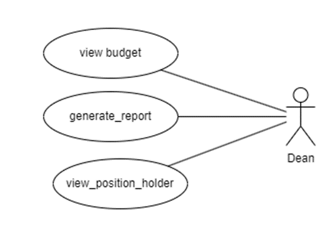
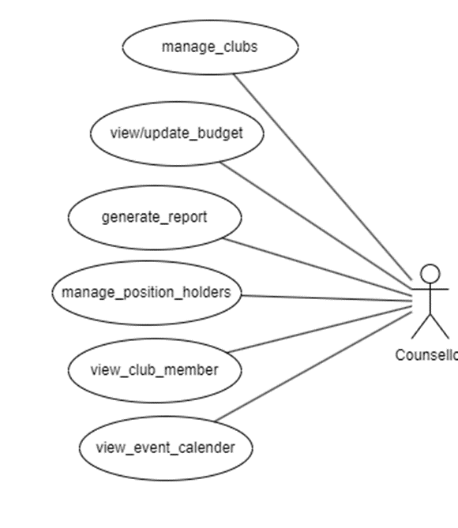
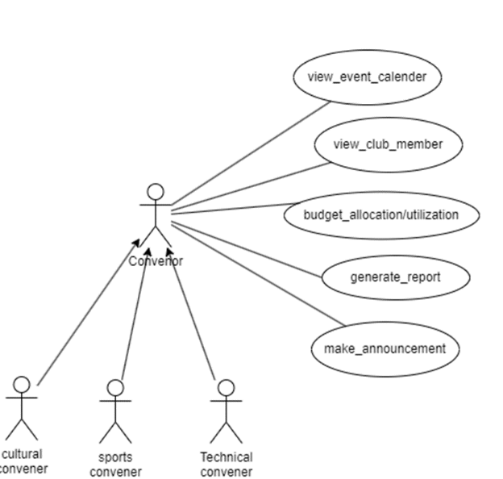
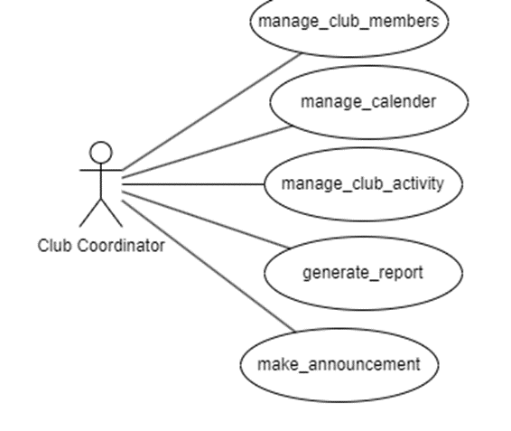

# Figma Profiles for GYMKHANA (Mobile)

**Student Mentor:** Hardik Sharma (21BCS092)

**Teammates:**
- Anushri Thakre (21BCS029)
- Bhawna Chilwal (21BCS057)
- Suyash Suman (21BCS217)
- Suman Kumar (21BCS214)
- Govind Kumar (21BCS088)

---

## 1. Module Description

The Gymkhana mobile module serves as a portable extension of the online web service portal, providing users with on-the-go access to various features related to club management and participation. Key functionalities of the Gymkhana mobile module include:

### Club Details Viewing
Users can easily access and view detailed information about all the clubs, including their activity calendars, current coordinators, and upcoming events directly from their mobile devices.

### Club Applications and Memberships
The module allows users to submit applications for new clubs and apply for membership in existing clubs. The mobile interface features user-friendly forms to streamline the application and membership processes.

### Club Sessions and Events
Users, whether students or faculty, can check and stay updated on ongoing or upcoming club sessions and events through the mobile module. This ensures that they remain informed about club activities at all times.

### Member Details
The mobile module enables users to access public details related to club members, both current and previous. This feature fosters transparency and community engagement within the club environment.

Overall, the Gymkhana mobile module extends the functionality of the web service portal to mobile devices, offering a convenient and accessible way for users to engage with club-related activities and services while on the move.

---

## 2. Actors

### 2.1 Student Dean
- **View Budget:** Gain a comprehensive view of the club's financial landscape, ensuring fiscal responsibility and strategic resource allocation.
- **Generate Reports:** Access detailed reports to evaluate the club's performance and contributions, facilitating informed decision-making.
- **View Position Holders:** Easily view and acknowledge outstanding contributors within the club, recognizing and appreciating their efforts.

### 2.2 Counselor
- **Manage Clubs:** Facilitate and guide the growth of clubs, ensuring they align with the institution's values and goals.
- **View & Update Budget:** Monitor and update the financial aspects of clubs, promoting responsible resource management.
- **Generate Reports:** Access insightful reports for an in-depth understanding of club dynamics and contributions.
- **Manage Position Holders:** Acknowledge and support outstanding contributors, fostering a culture of recognition and motivation.
- **View Club Members:** Easily access and manage club members, fostering a sense of inclusivity and engagement.
- **View Event Calendar:** Stay connected with club activities by viewing members, events, and calendars, promoting holistic student development.

### 2.3 Convenor
**Sub Actors:**
1. Cultural Convenor
2. Sports Convenor
3. Technical Convenor

- **View Event Calendar:** Stay informed about upcoming events, ensuring effective planning and coordination between different club sectors.
- **View Club Members:** Easily access and manage club members, fostering a sense of inclusivity and engagement.
- **Budget Allocation & Utilization:** Efficiently allocate and monitor budgetary resources to optimize the impact of cultural, sports, and technical events.
- **Generate Reports:** Access detailed reports to assess the success of events and identify areas for improvement.
- **Make Announcements:** Effectively communicate updates and critical information to members, creating a cohesive and informed community.

### 2.4 Club Coordinator
- **Manage All Club Members:** Effortlessly oversee and engage with all club members, fostering a sense of community and participation.
- **Manage Calendar:** Seamlessly organize and coordinate club activities, ensuring a well-planned and dynamic schedule.
- **Manage Club Activities:** Streamline the execution of club activities, from planning to execution, to enhance the overall club experience.
- **Generate Reports:** Access comprehensive reports for insightful analysis, aiding in data-driven decision-making for continuous improvement.
- **Make Announcements:** Effectively communicate updates and vital information to the entire club, fostering transparency and engagement.

---

## 3. Figma Link
[Access Figma Profile Designs](https://www.figma.com/file/OzSIraRTFvdJ9ukOy0W0sJ/PR-assignment-3?type=design&node-id=0-1&mode=design&t=lFcOMrFLaY1h9OoJ-0)

---

## 4. Figma Profile Design Guidelines and Additional Considerations

### 4.1 Cross-Platform Compatibility
- Verify that Figma designs and features are compatible across both web and app versions.

### 4.2 Dimension Standardization
- Ensure all Figma designs have the same dimensions: 1920 x 1080 for web and around 360px width for mobile.

### 4.3 Actor-oriented Use Case-Based Design
- Strictly base all Figma designs on use cases of actors and maintain consistency with previous and newly added designs.
- Each actor should have a different page in Figma.
- If Figma profiles are already existing, ensure all actors have their own profiles and wireframe those across all use cases for that actor.

### 4.4 Reference for Previous Designs
Figma link for reference (Figma profiles created by the previous batch): [Previous Figma Profiles](https://www.figma.com/file/pzhw34xBvEK0hm5Yx4bh0P/Fusion-APP?type=design&node-id=0%3A1&mode=design&t=J0f6T5YoUiKbp17u-1)

