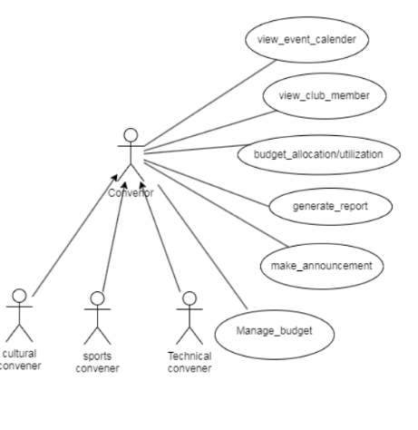
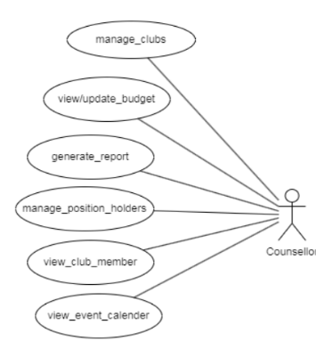
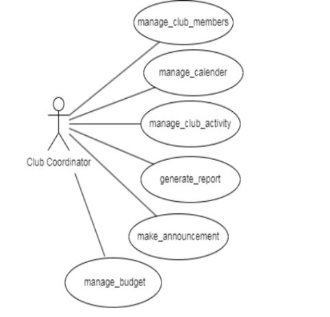
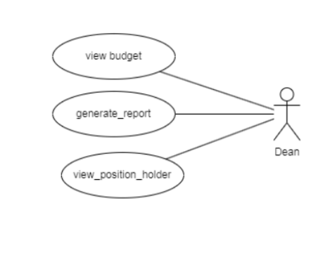
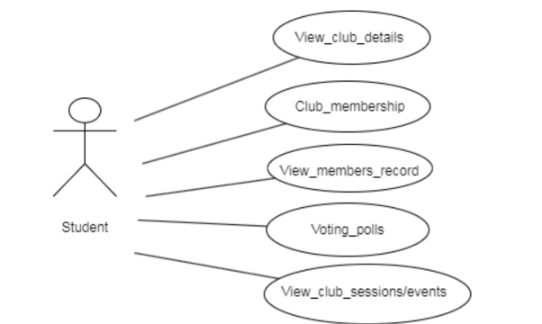

# Figma Profiles for Gymkhana Web Module

**Mentor:**  
**Vijaypal Singh Rathor**

**Student Mentor:**  
**21BCS028 - Anurag Goswami**

**Team:**  
- **21BCS194 - Shobhit Kushwaha**  
- **21BCS174 - Rishabh Sharma**  
- **21BCS178 - Rohit Raj**  
- **21BCS176 - Rohan Parmar**  
- **21BCS168 - Pulivarthi Mahesh**  

## 1. Module Description

Fusion ERP is an Online Web Service Portal that provides a centralized platform for accessing, collecting, and managing various services related to institute operations for the student body, such as:
- Course Registration and Management
- Mess Committee
- Gymkhana
- Examination
- Hostel Management
- Placement Cell
- Primary Health Centre (PHC)

and other departments involved in student activities as well as those that support these major departments.

<Use case specifications of the module>

[FUSION_ERP\[2\]](https://docs.google.com/document/d/1Y3pNVTc2Ul5xY09O2r36fBgRumkuSOsjWmr9teJ57dc/edit?usp=sharing)

---

## 2. Actors

### 2.1 Convener
- **View event calendar:** Stay informed about upcoming events, ensuring effective planning and coordination between different club sectors.
- **View club members:** Easily access and manage club members, fostering a sense of inclusivity and engagement.
- **Budget allocation & utilization:** Efficiently allocate and monitor budgetary resources to optimize the impact of cultural, sports, and technical events.
- **Generate reports:** Access detailed reports to assess the success of events and identify areas for improvement.
- **Make announcements:** Effectively communicate updates and critical information to members, creating a cohesive and informed community.

### 2.2 Counsellor
- **Manage clubs:** Facilitate and guide the growth of clubs, ensuring they align with the institution's values and goals.
- **View & Update budget:** Monitor and update the financial aspects of the clubs, promoting responsible resource management.
- **Generate report:** Access insightful reports for an in-depth understanding of club dynamics and contributions.
- **Manage position holders:** Acknowledge and support outstanding contributors, fostering a culture of recognition and motivation.
- **View club members:** Easily access and manage club members, fostering a sense of inclusivity and engagement.
- **View event calendar:** Stay connected with club activities by viewing members, events, and calendars, promoting holistic student development.

### 2.3 Club Coordinator
- **Manage all the club members:** Effortlessly oversee and engage with all club members, fostering a sense of community and participation.
- **Manage calendar:** Seamlessly organize and coordinate club activities, ensuring a well-planned and dynamic schedule.
- **Manage club activities:** Streamline the execution of club activities, from planning to execution, to enhance the overall club experience.
- **Generate reports:** Access comprehensive reports for insightful analysis, aiding in data-driven decision-making for continuous improvement.
- **Make announcements:** Effectively communicate updates and vital information to the entire club, fostering transparency and engagement.

### 2.4 Dean
- **View budget:** Gain a comprehensive view of the club's financial landscape, ensuring fiscal responsibility and strategic resource allocation.
- **Generate reports:** Access detailed reports to evaluate the club's performance and contributions, facilitating informed decision-making.
- **View position holders:** Easily view and acknowledge outstanding contributors within the club, recognizing and appreciating their efforts.

### 2.5 Student
- **View Club Details:** Everyone can view the details and event information of the clubs they are interested in.
- **Applying for membership of existing clubs:** Interested individuals can apply for membership in established clubs by submitting relevant information and meeting criteria.
- **View member records:** Interested individuals can view the current members of a particular club and their representatives.
- **Voting polls:** A specific set of students can cast their votes for the intended poll by the authority.
- **View club sessions and events:** Interested individuals of a club can view the ongoing and upcoming sessions and events for any club they have participated in.

---

## Figma Profile Design Guidelines and Additional Considerations

### 5.1 Cross-Platform Compatibility
- The Figma designs and features are compatible across both web and app versions.

### 5.2 Dimension Standardization
- All Figma designs have the same dimensions: 1920 x 1080 for web and around 360px width for mobile.

### 5.3 Actor-oriented Use Case-Based Design
- Strictly base all Figma designs on the use cases of actors and maintain consistency with previous and newly added designs.
- Each actor should have a different page in Figma.
- If the Figma profiles are already existing, make sure all the actors have their own Figma profiles and wireframe those across all use cases for that actor.

**Updated Figma link for all profiles:**  
[Fusion APP](https://www.figma.com/file/pzhw34xBvEK0hm5Yx4bh0P/Fusion-APP?type=design&node-id=0%3A1&mode=design&t=J0f6T5YoUiKbp17u-1)  
[Gymkhana Module](https://www.figma.com/file/cjaTKXanJLKatb5qdqGDbV/Gymkhana-Module?type=design&node-id=0%3A1&mode=design&t=UPGhEROSEV0lc956-1)

**Assignment 3 Doc Link:**  
[Assignment 3 Gymkhana Web Figma Profiles](https://docs.google.com/document/d/1u9aIhPi6VJhz-aze0m09N-bVHOBM4ZpOqCLhz2iTiiQ/edit)
