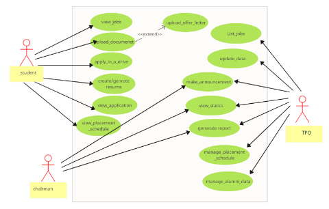

# Fusion ERP

## Software Requirements Specification

### SA-4 - Placement Cell

---

**Prepared by:**  
- **(21bcs044) Athira**  
- **(21bcs137) Haritha**  
- **(21bcs135) Shivani**  
- **(21bcs220) Ruthvika**  
- **(21bcs230) Deepthi**  

**Student Mentor:**  
**Rahul Shankla**

---

## Table of Contents

1. **Introduction**  
   1.1 Introduction about Fusion  
   1.2 Purpose of the Module  
   1.3 Scope of the Module  

2. **User/Actor Description (Characteristics)**  

3. **Functional Requirements**  
   3.1 Use Case Diagram  
   3.2 Use Case Description  
   3.3 Other Functional Requirements  
   3.4 Other Constraints  
   3.4.1 User Interfaces  
   3.4.2 Software (Tech) Stack Used  

4. **Non-Functional Requirements**  

5. **Module Dependencies with Other Fusion Modules**  
   5.1 UI Level  
   5.2 DB Level Dependencies  
   5.3 Module Level Dependencies  

---

## 1. Introduction

### 1.1 Introduction about Fusion – A Brief Description

FusionIIIT stands as a testament to the seamless integration and automation of diverse functions within PDPM Indian Institute of Information Technology, Design and Manufacturing, Jabalpur. Crafted with precision using the Dart and Flutter framework, this initiative is a student-driven endeavor designed to elevate the institute's operational landscape. Encompassing everything from efficient administration management to academic prowess and miscellaneous departmental tasks, FusionIIIT is a holistic solution that harmonizes the intricacies of campus life.

Imagine it as a digital wizard that takes care of everything, from organizing administrative tasks to making academics smoother. It's not just limited to the usual tasks; FusionIIIT engages various departments and sections, ensuring every corner of campus life runs smoothly.

On the administrative side, it handles complicated paperwork and processes. For academics, it brings a digital touch, making learning and managing courses easier. But it doesn't stop there; FusionIIIT acts as a friendly companion for all different parts of the campus, ensuring everything works well.

In simpler terms, FusionIIIT is not just a tool – it's a helpful friend, making life at PDPM IIITDM Jabalpur more organized and enjoyable for everyone.

### 1.2 Purpose of the Module

The purpose of the **Placement Cell Module** is to facilitate and streamline the processes related to placement activities at IIIT Jabalpur. This module is designed to manage placement-related interactions, recruitment activities, and informational flow among students, placement officers, and the chairman. It aids in efficient job posting updates, managing student profiles, application scheduling, placement statistics, reporting, and enhanced accessibility for students.

### 1.3 Scope of the Module

The placement cell module caters to three primary actors: **students, the placement officer,** and **the chairman**. The primary focus is to allow students to create and manage detailed profiles showcasing their academic achievements, skills, and interests by submitting relevant documents and updating resumes. It also aids in job searching, applications, tracking the status of applications, and managing interview schedules. Additionally, it allows the placement officer to generate reports on placement trends, success rates, and other relevant metrics, as well as to schedule and manage the placement calendar, which includes events, workshops, and interviews.

---

## 2. User/Actor Characteristics

### 2.1 Student

Students represent individuals studying at **PDPM IIITDM Jabalpur** and must have a roll number and an official institute email ID, which is necessary for accessing the system.

**Role:**  
Students participate in placement drives, workshops, and receive updates on statistics.

**Specific Functionalities:**
- **Profile Updates:** Students can regularly update their profiles to generate CVs.
- **Placement Notifications:** Final-year students receive notifications when companies visit for placements and can decide whether to apply.
- **PBI Notifications:** Third-year students receive notifications for pre-placement offers and can choose whether to apply.
- **Placement Summary Access:** Students can refer to past placement data and statistics.
- **Upcoming Schedules:** Students can see the schedule of companies coming for recruitment.

### 2.2 Placement Officer

The **Placement Officer** is responsible for coordinating with company HR executives to schedule interviews and plan recruitment events. This role requires having a **PF number** and an official institute email address for system access.

**Role:**  
The Placement Officer manages the overall operations of the placement cell, including scheduling placements, generating reports, and confirming the authenticity of the students.

**Specific Functionalities:**
- **Scheduling:** Coordinate placement events and interviews.
- **Reporting:** Generate reports related to student placements and trends.
- **Data Verification:** Confirm the authenticity of student profiles and information.

**2.3 	Chair man :**  	 

The Placement Chairman is the person who holds an upper authority in handling the Placement Cell Operations. 

**Specific Functionalities:** 

- The Placement Chairman holds the authority to oversee and review all activities conducted by the Placement Officer.  
- The Chairman can document visits to various companies and is empowered to recommend the postponement of a company's visit to the campus.  
- The Placement Chairman has the prerogative to furnish a list of companies to the Placement Officer, advising them to later approach these companies for potential campus recruitment sessions**.** 

**3. Functional Requirements** 

**3.1** 	**Use Case Diagram** 

**3.2** 	**Use case Description** 

<This section describes each use case in the use case diagram in all details. An example use case description is given below>  

<table><tr><th valign="top"><b>UC ID</b> </th><th colspan="3" valign="top">UC#1 </th><th valign="top"> </th></tr>
<tr><td valign="top"><b>Use case Name</b> </td><td colspan="3" valign="top"><b>View_jobs</b> </td><td valign="top"> </td></tr>
<tr><td valign="top"><b>Description</b> </td><td colspan="3" valign="top">The "View_jobs" use case allows the student to view the jobs available for the student to apply </td><td valign="top"> </td></tr>
<tr><td valign="top"><b>Actor</b> </td><td colspan="3" valign="top">student </td><td valign="top"> </td></tr>
<tr><td valign="top"><b>Precondition</b> </td><td colspan="3" valign="top">The student is logged into the system </td><td valign="top"> </td></tr>
<tr><td rowspan="3" valign="top"><b>Main Flow</b> </td><td>1 </td><td colspan="2">The Student navigates to the "View_jobs" section. </td><td valign="top"> </td></tr>
<tr><td>2 </td><td colspan="2">The system displays the list of jobs to register.  </td><td valign="top"> </td></tr>
<tr><td>3 </td><td colspan="2">The Student selects to view the details and requirements of the job. [A1] </td><td valign="top"> </td></tr>
<tr><td valign="top"><b>Post conditions</b>  </td><td colspan="3" valign="top">The information is reflected in the database. </td><td valign="top"> </td></tr>
<tr><td rowspan="2" valign="top"><b>Alternate Flow</b> </td><td rowspan="2" valign="top">A1 </td><td valign="top">1 </td><td valign="top">If the student is interested in applying for the job, he/she clicks it.[S1] </td><td valign="top"> </td></tr>
<tr><td valign="top">2 </td><td valign="top">He/she is directed to the corresponding website. </td><td valign="top"> </td></tr>
<tr><td valign="top"><b>Sub Flow</b> </td><td colspan="3" valign="top">The system displays the requirements needed for the job and further job details. </td><td> </td></tr>
<tr><td rowspan="2" valign="top"><b>Global Alternate Flow</b> </td><td valign="top">GA1 </td><td colspan="2" valign="top">The Student can ‘cancel’ the procedure at any time by exercising such an option and will be directed to the dashboard. </td><td> </td></tr>
<tr><td valign="top">GA2 </td><td colspan="2" valign="top">
If a technical error occurs during the execution of any action (e.g., database failure, server issues), the system displays an error message and logs the incident. 

 

 

 
</td><td>
 

 
</td></tr>
</table>

<table><tr><th valign="top"><b>UC ID</b> </th><th colspan="3" valign="top">UC#2 </th><th valign="top"> </th></tr>
<tr><td valign="top"><b>Use case Name</b> </td><td colspan="3" valign="top"><b>apply_in_a_drive</b> </td><td valign="top"> </td></tr>
<tr><td valign="top"><b>Description</b> </td><td colspan="3" valign="top">The "apply_in_a_drive" use case allows the student to apply for the available jobs </td><td valign="top"> </td></tr>
<tr><td valign="top"><b>Actor</b> </td><td colspan="3" valign="top">Student </td><td valign="top"> </td></tr>
<tr><td valign="top"><b>Precondition</b> </td><td colspan="3" valign="top">The student is logged in into the system. </td><td valign="top"> </td></tr>
<tr><td rowspan="3" valign="top"><b>Main Flow</b> </td><td>1 </td><td colspan="2">The student navigates to the "Apply in a drive" section. </td><td valign="top"> </td></tr>
<tr><td>2 </td><td colspan="2">The system displays the list of jobs to apply </td><td valign="top"> </td></tr>
<tr><td>3 </td><td colspan="2">The student selects a job to apply. [A1][A2] </td><td valign="top"> </td></tr>
<tr><td valign="top"><b>Post conditions</b>  </td><td colspan="3" valign="top">The updated information is reflected in the database. </td><td valign="top"> </td></tr>
<tr><td rowspan="8" valign="top"><b>Alternate Flow</b> </td><td rowspan="2" valign="top">A1 </td><td valign="top">1 </td><td valign="top">The job is not yet applied. The Student selects the "Apply" action. </td><td valign="top"> </td></tr>
<tr><td valign="top">2 </td><td valign="top">The system updates the status to "Applied" and the same is reflected to the Intender. </td><td valign="top"> </td></tr>
<tr><td rowspan="6" valign="top">A2 </td><td rowspan="3" valign="top">1 </td><td rowspan="3" valign="top">The Student selects the "Not interested" action.  </td><td valign="top"> </td></tr>
<tr><td> </td></tr>
<tr><td> </td></tr>
<tr><td rowspan="3" valign="top">2 </td><td rowspan="3" valign="top">The system updates the booking status to not interested and the same is reflected to the Intender. </td><td> </td></tr>
<tr><td> </td></tr>
<tr><td> </td></tr>
<tr><td valign="top"><b>Sub Flow</b> </td><td colspan="3" valign="top">NIL </td><td> </td></tr>
<tr><td valign="top"><b>Global Alternate Flow</b> </td><td valign="top">GA </td><td colspan="2" valign="top">
The student can ‘cancel’ the procedure at any time by exercising such an option and will be directed to the dashboard. 

 
</td><td>
 

 

 
</td></tr>
</table>

<table><tr><th valign="top"><b>UC ID</b> </th><th colspan="3" valign="top">UC#3 </th><th valign="top"> </th></tr>
<tr><td valign="top"><b>Use case Name</b> </td><td colspan="3" valign="top"><b>Upload_documents</b> </td><td valign="top"> </td></tr>
<tr><td valign="top"><b>Description</b> </td><td colspan="3" valign="top">The "upload documents" use case allows the student to upload his/her documents. </td><td valign="top"> </td></tr>
<tr><td valign="top"><b>Actor</b> </td><td colspan="3" valign="top">Student </td><td valign="top"> </td></tr>
<tr><td valign="top"><b>Precondition</b> </td><td colspan="3" valign="top">The Student is logged in into the system. </td><td valign="top"> </td></tr>
<tr><td rowspan="3" valign="top"><b>Main Flow</b> </td><td>1 </td><td colspan="2">The Student navigates to the "upload documents" section. </td><td valign="top"> </td></tr>
<tr><td>2 </td><td colspan="2">The student upload his/her documents.[A1][A2] </td><td valign="top"> </td></tr>
<tr><td>3 </td><td colspan="2">The student then submits the documents.  </td><td valign="top"> </td></tr>
<tr><td valign="top"><b>Post conditions</b>  </td><td colspan="3" valign="top">The documents are saved in the database. </td><td valign="top"> </td></tr>
<tr><td rowspan="8" valign="top"><b>Alternate Flow</b> </td><td rowspan="2" valign="top">A1 </td><td valign="top">1 </td><td valign="top">If the student accepts a job offer. The student uploads his/her offer letter </td><td valign="top"> </td></tr>
<tr><td valign="top">2 </td><td valign="top">The system updates the same is reflected to the Intender. </td><td valign="top"> </td></tr>
<tr><td rowspan="6" valign="top">A2 </td><td rowspan="3" valign="top">1 </td><td rowspan="3" valign="top">The student submits further relevant documents. </td><td valign="top"> </td></tr>
<tr><td> </td></tr>
<tr><td> </td></tr>
<tr><td rowspan="3" valign="top">2 </td><td rowspan="3" valign="top">The system updates and the same is reflected to the Intender. </td><td> </td></tr>
<tr><td> </td></tr>
<tr><td> </td></tr>
<tr><td valign="top"><b>Sub Flow</b> </td><td colspan="3" valign="top">NIL </td><td> </td></tr>
<tr><td rowspan="2" valign="top"><b>Global Alternate Flow</b> </td><td valign="top">GA1 </td><td colspan="2" valign="top">The Student can ‘cancel’ the procedure at any time by exercising such an option and will be directed to the dashboard. </td><td> </td></tr>
<tr><td valign="top">GA2 </td><td colspan="2" valign="top">
If a technical error occurs during the execution of any action (e.g., database failure, server issues), the system displays an error message and logs the incident. 

 

 

 
</td><td>
 

 
</td></tr>
</table>

<table><tr><th valign="top"><b>UC ID</b> </th><th colspan="3" valign="top">UC#4 </th><th valign="top"> </th></tr>
<tr><td valign="top"><b>Use case Name</b> </td><td colspan="3" valign="top"><b>Create /generate resume</b> </td><td valign="top"> </td></tr>
<tr><td valign="top"><b>Description</b> </td><td colspan="3" valign="top">The "create/generate resume" use case allows the student at the college hostel to create, generate, review, edit, and view his/her resume through the Fusion portal. </td><td valign="top"> </td></tr>
<tr><td valign="top"><b>Actor</b> </td><td colspan="3" valign="top">Student </td><td valign="top"> </td></tr>
<tr><td valign="top"><b>Precondition</b> </td><td colspan="3" valign="top">The student is logged in into the system. </td><td valign="top"> </td></tr>
<tr><td rowspan="4" valign="top"><b>Main Flow</b> </td><td>1 </td><td colspan="2">The student navigates to the "create/generate" section. </td><td valign="top"> </td></tr>
<tr><td>2 </td><td colspan="2">The system displays the existing resume. </td><td valign="top"> </td></tr>
<tr><td>3 </td><td colspan="2">The student selects to create/generate his/her resume. [A1] </td><td valign="top"> </td></tr>
<tr><td>4 </td><td colspan="2">The student views the complete resume information. </td><td valign="top"> </td></tr>
<tr><td valign="top"><b>Post conditions</b>  </td><td colspan="3" valign="top">The updated/New resume is reflected in the database. </td><td valign="top"> </td></tr>
<tr><td rowspan="2" valign="top"><b>Alternate Flow</b> </td><td rowspan="2" valign="top">A1 </td><td valign="top">1 </td><td valign="top">The student will select the desired template from the given templates. </td><td valign="top"> </td></tr>
<tr><td valign="top">2 </td><td valign="top">The student will add the necessary extra information to the resume and click “create”. </td><td valign="top"> </td></tr>
<tr><td valign="top"><b>Sub Flow</b> </td><td colspan="3" valign="top">NIL </td><td> </td></tr>
<tr><td rowspan="2" valign="top"><b>Global Alternate Flow</b> </td><td valign="top">GA1 </td><td colspan="2" valign="top">The student can ‘cancel’ the procedure at any time by exercising such an option and will be directed to the dashboard. </td><td> </td></tr>
<tr><td valign="top">GA2 </td><td colspan="2" valign="top">
If a technical error occurs during the execution of any action (e.g., database failure, server issues), the system displays an error message and logs the incident. 

 

 
</td><td>
 

 
</td></tr>
</table>

<table><tr><th valign="top"><b>UC ID</b> </th><th colspan="3" valign="top">UC#5 </th><th valign="top"> </th></tr>
<tr><td valign="top"><b>Use case Name</b> </td><td colspan="3" valign="top"><b>View_applications</b> </td><td valign="top"> </td></tr>
<tr><td valign="top"><b>Description</b> </td><td colspan="3" valign="top">The “View Application” feature in the Fusion portal is designed to enable college students to easily manage their job applications. This functionality allows students to review, edit, cancel, and view details related to their submitted job applications. </td><td valign="top"> </td></tr>
<tr><td valign="top"><b>Actor</b> </td><td colspan="3" valign="top">Student </td><td valign="top"> </td></tr>
<tr><td valign="top"><b>Precondition</b> </td><td colspan="3" valign="top">The student is logged in into the system. </td><td valign="top"> </td></tr>
<tr><td rowspan="4" valign="top"><b>Main Flow</b> </td><td>1 </td><td colspan="2">The student navigates to the "view applications" section. </td><td valign="top"> </td></tr>
<tr><td>2 </td><td colspan="2">The system displays the list of applications. </td><td valign="top"> </td></tr>
<tr><td>3 </td><td colspan="2">The student selects to review the list of applications. [A1] </td><td valign="top"> </td></tr>
<tr><td>4 </td><td colspan="2">The student views the applications information. [A2] </td><td valign="top"> </td></tr>
<tr><td valign="top"><b>Post conditions</b>  </td><td colspan="3" valign="top">The updated applications information is reflected in the database. </td><td valign="top"> </td></tr>
<tr><td rowspan="7" valign="top"><b>Alternate Flow</b> </td><td valign="top">A1 </td><td valign="top">1 </td><td valign="top">The application is not yet viewed. The student selects to “view” the applications. </td><td valign="top"> </td></tr>
<tr><td rowspan="6" valign="top">A2 </td><td rowspan="3" valign="top">1 </td><td rowspan="3" valign="top">The system will show all the details of applications. </td><td valign="top"> </td></tr>
<tr><td> </td></tr>
<tr><td> </td></tr>
<tr><td rowspan="3" valign="top">2 </td><td rowspan="3" valign="top">The student can see the application details. </td><td> </td></tr>
<tr><td> </td></tr>
<tr><td> </td></tr>
<tr><td valign="top"><b>Sub Flow</b> </td><td colspan="3" valign="top">NIL </td><td> </td></tr>
<tr><td rowspan="2" valign="top"><b>Global Alternate Flow</b> </td><td valign="top">GA1 </td><td colspan="2" valign="top">The student can ‘cancel’ the procedure at any time by exercising such an option and will be directed to the dashboard. </td><td> </td></tr>
<tr><td valign="top">GA2 </td><td colspan="2" valign="top">
If a technical error occurs during the execution of any action (e.g., database failure, server issues), the system displays an error message and logs the incident. 

 

 
</td><td>
 

 
</td></tr>
</table>

<table><tr><th valign="top"><b>UC ID</b> </th><th colspan="3" valign="top">UC#6 </th><th valign="top"> </th></tr>
<tr><td valign="top"><b>Use case Name</b> </td><td colspan="3" valign="top"><b>View_placement_schedule</b> </td><td valign="top"> </td></tr>
<tr><td valign="top"><b>Description</b> </td><td colspan="3" valign="top">The "view placement schedule" use case allows the student at the college to view the placement schedule through the Fusion portal. </td><td valign="top"> </td></tr>
<tr><td valign="top"><b>Actor</b> </td><td colspan="3" valign="top">Student </td><td valign="top"> </td></tr>
<tr><td valign="top"><b>Precondition</b> </td><td colspan="3" valign="top">The student is logged in into the system. </td><td valign="top"> </td></tr>
<tr><td rowspan="3" valign="top"><b>Main Flow</b> </td><td>1 </td><td colspan="2">The student navigates to the "view placement schedule" section. </td><td valign="top"> </td></tr>
<tr><td>2 </td><td colspan="2">The system displays the placement schedule. </td><td valign="top"> </td></tr>
<tr><td>3 </td><td colspan="2">The student can view the placement schedule. </td><td valign="top"> </td></tr>
<tr><td valign="top"><b>Post conditions</b>  </td><td colspan="3" valign="top">The updated information is reflected in the database. </td><td valign="top"> </td></tr>
<tr><td valign="top"><b>Alternate Flow</b> </td><td valign="top">NIL </td><td valign="top"> </td><td valign="top"> </td><td valign="top"> </td></tr>
<tr><td valign="top"><b>Sub Flow</b> </td><td colspan="3" valign="top">NIL </td><td> </td></tr>
<tr><td rowspan="2" valign="top"><b>Global Alternate Flow</b> </td><td valign="top">GA1 </td><td colspan="2" valign="top">The student can ‘cancel’ the procedure at any time by exercising such an option and will be directed to the dashboard. </td><td> </td></tr>
<tr><td valign="top">GA2 </td><td colspan="2" valign="top">
If a technical error occurs during the execution of any action (e.g., database failure, server issues), the system displays an error message and logs the incident. 

 

 
</td><td>
 

 
</td></tr>
</table>

<table><tr><th valign="top"><b>UC ID</b> </th><th colspan="3" valign="top">UC#7 </th><th valign="top"> </th></tr>
<tr><td valign="top"><b>Use case Name</b> </td><td colspan="3" valign="top"><b>List_jobs</b> </td><td valign="top"> </td></tr>
<tr><td valign="top"><b>Description</b> </td><td colspan="3" valign="top">The "list jobs" use case allows the TPO of the college to list the jobs that different companies offer and can also update it through the Fusion portal. </td><td valign="top"> </td></tr>
<tr><td valign="top"><b>Actor</b> </td><td colspan="3" valign="top">The Placement Officer (TPO) </td><td valign="top"> </td></tr>
<tr><td valign="top"><b>Precondition</b> </td><td colspan="3" valign="top">The TPO is logged into the system </td><td valign="top"> </td></tr>
<tr><td rowspan="3" valign="top"><b>Main Flow</b> </td><td>1 </td><td colspan="2">The TPO checks the list of the jobs </td><td valign="top"> </td></tr>
<tr><td>2 </td><td colspan="2">The system displays the list of the jobs of different companies. [A1]  </td><td valign="top"> </td></tr>
<tr><td>3 </td><td colspan="2">The TPO can add the new jobs in the list or remove the outdated jobs </td><td valign="top"> </td></tr>
<tr><td valign="top"><b>Post conditions</b>  </td><td colspan="3" valign="top">The updated list of the jobs is reflected in the database. </td><td valign="top"> </td></tr>
<tr><td rowspan="2" valign="top"><b>Alternate Flow</b> </td><td rowspan="2" valign="top">A1 </td><td valign="top">1 </td><td valign="top">The job shows outdated </td><td valign="top"> </td></tr>
<tr><td valign="top">2 </td><td valign="top">The TPO removes and update the list </td><td valign="top"> </td></tr>
<tr><td valign="top"><b>Sub Flow</b> </td><td colspan="3" valign="top">NIL </td><td> </td></tr>
<tr><td rowspan="2" valign="top"><b>Global Alternate Flow</b> </td><td valign="top">GA1 </td><td colspan="2" valign="top">The TPO can ‘cancel’ the procedure at any time by exercising such an option and will be directed to the dashboard. </td><td> </td></tr>
<tr><td valign="top">GA2 </td><td colspan="2" valign="top">
If a technical error occurs during the execution of any action (e.g., database failure, server issues), the system displays an error message and logs the incident. 

 

 
</td><td>
 

 
</td></tr>
</table>

<table><tr><th valign="top"><b>UC ID</b> </th><th colspan="3" valign="top">UC#8 </th><th valign="top"> </th></tr>
<tr><td valign="top"><b>Use case Name</b> </td><td colspan="3" valign="top"><b>Make announcements</b> </td><td valign="top"> </td></tr>
<tr><td valign="top"><b>Description</b> </td><td colspan="3" valign="top">The "Make announcements" use case allows the Placement Officer/chairman to make an announcement on the jobs or share any important information through the Fusion portal. </td><td valign="top"> </td></tr>
<tr><td valign="top"><b>Actor</b> </td><td colspan="3" valign="top">The Placement Officer/chairman </td><td valign="top"> </td></tr>
<tr><td valign="top"><b>Precondition</b> </td><td colspan="3" valign="top">The Placement Officer/chairman is logged in into the system. </td><td valign="top"> </td></tr>
<tr><td rowspan="4" valign="top"><b>Main Flow</b> </td><td>1 </td><td colspan="2">The Placement Officer/chairman navigates to the "Placement Module" section. </td><td valign="top"> </td></tr>
<tr><td>2 </td><td colspan="2">The Placement Officer/chairman navigates to the "Make announcement" section. </td><td valign="top"> </td></tr>
<tr><td>3 </td><td colspan="2">The Placement Officer/chairman selects create announcement. [A1] </td><td valign="top"> </td></tr>
<tr><td>4 </td><td colspan="2">The Placement Officer/chairman views the announcement.  </td><td valign="top"> </td></tr>
<tr><td valign="top"><b>Post conditions</b>  </td><td colspan="3" valign="top">The created announcement is sent to all the actors via notification module. </td><td valign="top"> </td></tr>
<tr><td rowspan="2" valign="top"><b>Alternate Flow</b> </td><td rowspan="2" valign="top">A1 </td><td valign="top">1 </td><td valign="top">The Placement Officer/chairman creates the notification and select the “Publish” option. </td><td valign="top"> </td></tr>
<tr><td valign="top">2 </td><td valign="top">The system sends the message and the same is reflected to the Intender. </td><td valign="top"> </td></tr>
<tr><td valign="top"><b>Sub Flow</b> </td><td colspan="3" valign="top">NIL </td><td> </td></tr>
<tr><td rowspan="2" valign="top"><b>Global Alternate Flow</b> </td><td valign="top">GA1 </td><td colspan="2" valign="top">The Placement Officer/chairman can ‘cancel’ the procedure at any time by exercising such an option and will be directed to the dashboard. </td><td> </td></tr>
<tr><td valign="top">GA2 </td><td colspan="2" valign="top">
If a technical error occurs during the execution of any action (e.g., database failure, server issues), the system displays an error message and logs the incident. 

 

 
</td><td>
 

 
</td></tr>
</table>

<table><tr><th valign="top"><b>UC ID</b> </th><th colspan="2" valign="top">UC#9 </th><th valign="top"> </th></tr>
<tr><td valign="top"><b>Use case Name</b> </td><td colspan="2" valign="top"><b>View statistics</b> </td><td valign="top"> </td></tr>
<tr><td valign="top"><b>Description</b> </td><td colspan="2" valign="top">This use case represents the interaction of a Placement Officer/Chairman with the system to review Placement statistics. </td><td valign="top"> </td></tr>
<tr><td valign="top"><b>Actor</b> </td><td colspan="2" valign="top">The Placement Officer/chairman </td><td valign="top"> </td></tr>
<tr><td valign="top"><b>Precondition</b> </td><td colspan="2" valign="top">The Placement Officer/chairman is logged in into the system. </td><td valign="top"> </td></tr>
<tr><td rowspan="4" valign="top"><b>Main Flow</b> </td><td>1 </td><td>The Placement Officer/chairman navigates to the "Placement Module" section. </td><td valign="top"> </td></tr>
<tr><td>2 </td><td>The Placement Officer/chairman navigates to the "View Statistics" section. </td><td valign="top"> </td></tr>
<tr><td>3 </td><td>A screen displaying all the statistics in the Recent-First order is displayed. Records can also be filtered. </td><td valign="top"> </td></tr>
<tr><td>4 </td><td>Batch Statistics can be viewed by clicking on the Batch statistics tab. </td><td valign="top"> </td></tr>
<tr><td valign="top"><b>Alternate Flow</b> </td><td colspan="2" valign="top">NA </td><td valign="top"> </td></tr>
<tr><td valign="top"><b>Post conditions</b>  </td><td colspan="2" valign="top">NA </td><td valign="top"> </td></tr>
<tr><td valign="top"><b>Sub Flow</b> </td><td colspan="2" valign="top">NA </td><td> </td></tr>
<tr><td rowspan="2" valign="top"><b>Global Alternate Flow</b> </td><td valign="top">GA1 </td><td valign="top">The Placement Officer/chairman can ‘cancel’ the procedure at any time by exercising such an option and will be directed to the dashboard. </td><td> </td></tr>
<tr><td valign="top">GA2 </td><td valign="top">
If a technical error occurs during the execution of any action (e.g., database failure, server issues), the system displays an error message and logs the incident. 

 

 
</td><td>
 

 
</td></tr>
</table>

<table><tr><th valign="top"><b>UC ID</b> </th><th colspan="3" valign="top">UC#10 </th><th valign="top"> </th></tr>
<tr><td valign="top"><b>Use case Name</b> </td><td colspan="3" valign="top"><b>Generate_report</b> </td><td valign="top"> </td></tr>
<tr><td valign="top"><b>Description</b> </td><td colspan="3" valign="top">The "<b>generate report</b> " use case allows the Placement Officer/chairman to generate the reports according to the statistic through the Fusion portal. </td><td valign="top"> </td></tr>
<tr><td valign="top"><b>Actor</b> </td><td colspan="3" valign="top">The Placement Officer/chairman </td><td valign="top"> </td></tr>
<tr><td valign="top"><b>Precondition</b> </td><td colspan="3" valign="top">The Placement Officer/chairman is logged in into the system. </td><td valign="top"> </td></tr>
<tr><td rowspan="4" valign="top"><b>Main Flow</b> </td><td>1 </td><td colspan="2">The Placement Officer/chairman navigates to the "generate report" section. </td><td valign="top"> </td></tr>
<tr><td>2 </td><td colspan="2">The Placement Officer/chairman enters the timeline, the data he/she wants. </td><td valign="top"> </td></tr>
<tr><td>3 </td><td colspan="2">The system generates the table according to the information. [A1] </td><td valign="top"> </td></tr>
<tr><td>4 </td><td colspan="2">The Placement Officer/chairman views the report. [A2] </td><td valign="top"> </td></tr>
<tr><td valign="top"><b>Post conditions</b>  </td><td colspan="3" valign="top">The updated information is reflected in the database. </td><td valign="top"> </td></tr>
<tr><td rowspan="8" valign="top"><b>Alternate Flow</b> </td><td rowspan="2" valign="top">A1 </td><td valign="top">1 </td><td valign="top">The Placement Officer/chairman selects the "Print" action. </td><td valign="top"> </td></tr>
<tr><td valign="top">2 </td><td valign="top">The system creates a pdf of the reports and prints it. </td><td valign="top"> </td></tr>
<tr><td rowspan="6" valign="top">A2 </td><td rowspan="3" valign="top">1 </td><td rowspan="3" valign="top">The Placement Officer/chairman selects the "Add info" action and make changes to entered information.  </td><td valign="top"> </td></tr>
<tr><td> </td></tr>
<tr><td> </td></tr>
<tr><td rowspan="3" valign="top">2 </td><td rowspan="3" valign="top">The system creates a pdf of the reports and prints it. </td><td> </td></tr>
<tr><td> </td></tr>
<tr><td> </td></tr>
<tr><td valign="top"><b>Sub Flow</b> </td><td colspan="3" valign="top">NIL </td><td> </td></tr>
<tr><td rowspan="2" valign="top"><b>Global Alternate Flow</b> </td><td valign="top">GA1 </td><td colspan="2" valign="top">The Placement Officer/chairman can ‘cancel’ the procedure at any time by exercising such an option and will be directed to the dashboard. </td><td> </td></tr>
<tr><td valign="top">GA2 </td><td colspan="2" valign="top">
If a technical error occurs during the execution of any action (e.g., database failure, server issues), the system displays an error message and logs the incident. 

 

 
</td><td>
 

 
</td></tr>
</table>

<table><tr><th valign="top"><b>UC ID</b> </th><th colspan="2" valign="top">UC#11 </th><th valign="top"> </th></tr>
<tr><td valign="top"><b>Use case Name</b> </td><td colspan="2" valign="top"><b>Manage_placement_schedule</b> </td><td valign="top"> </td></tr>
<tr><td valign="top"><b>Description</b> </td><td colspan="2" valign="top">The "Manage placement schedule” use case allows the TPO of the college to manage the schedule of the placements through the Fusion portal. </td><td valign="top"> </td></tr>
<tr><td valign="top"><b>Actor</b> </td><td colspan="2" valign="top">TPO </td><td valign="top"> </td></tr>
<tr><td valign="top"><b>Precondition</b> </td><td colspan="2" valign="top">The TPO is logged in into the system. </td><td valign="top"> </td></tr>
<tr><td rowspan="4" valign="top"><b>Main Flow</b> </td><td>1 </td><td>The TPO navigates to the "Manage placement schedule" section. </td><td valign="top"> </td></tr>
<tr><td>2 </td><td>
The system generates a form to be filled with event details 

 

 
</td><td valign="top"> </td></tr>
<tr><td>3 </td><td>The TPO fills the form specifying the dated events of the company </td><td valign="top"> </td></tr>
<tr><td>4 </td><td>The system returns to the “manage placement schedule” </td><td valign="top"> </td></tr>
<tr><td valign="top"><b>Post conditions</b>  </td><td colspan="2" valign="top">The updated information is reflected in the database. </td><td valign="top"> </td></tr>
<tr><td valign="top"><b>Alternate flow</b> </td><td colspan="2" valign="top">NIL </td><td valign="top"> </td></tr>
<tr><td valign="top"><b>Sub Flow</b> </td><td colspan="2" valign="top">NIL </td><td> </td></tr>
<tr><td rowspan="2" valign="top"><b>Global Alternate Flow</b> </td><td valign="top">GA1 </td><td valign="top">The TPO can ‘cancel’ the procedure at any time by exercising such an option and will be directed to the dashboard. </td><td> </td></tr>
<tr><td valign="top">GA2 </td><td valign="top">
If a technical error occurs during the execution of any action (e.g., database failure, server issues), the system displays an error message and logs the incident. 

 

 
</td><td>
 

 
</td></tr>
</table>

<table><tr><th valign="top"><b>UC ID</b> </th><th colspan="2" valign="top">UC#12 </th><th valign="top"> </th></tr>
<tr><td valign="top"><b>Use case Name</b> </td><td colspan="2" valign="top"><b>Update_data</b> </td><td valign="top"> </td></tr>
<tr><td valign="top"><b>Description</b> </td><td colspan="2" valign="top">The "update data " use case allows the TPO/Chairman of the college to add or announce any events in the college or add the new jobs in the list.  </td><td valign="top"> </td></tr>
<tr><td valign="top"><b>Actor</b> </td><td colspan="2" valign="top">TPO/Chairman </td><td valign="top"> </td></tr>
<tr><td valign="top"><b>Precondition</b> </td><td colspan="2" valign="top">The TPO/Chairman is logged in into the system. </td><td valign="top"> </td></tr>
<tr><td rowspan="4" valign="top"><b>Main Flow</b> </td><td>1 </td><td>The TPO/Chairman navigates to the "update data" section. </td><td valign="top"> </td></tr>
<tr><td>2 </td><td>The system displays the list of jobs or events with its respective status.  </td><td valign="top"> </td></tr>
<tr><td>3 </td><td>The TPO/Chairman updates the data </td><td valign="top"> </td></tr>
<tr><td>4 </td><td>The system updates the information. </td><td valign="top"> </td></tr>
<tr><td valign="top"><b>Post conditions</b>  </td><td colspan="2" valign="top">The updated information is reflected in the database. </td><td valign="top"> </td></tr>
<tr><td valign="top"><b>Alternate Flow</b> </td><td colspan="2" valign="top">NIL </td><td valign="top"> </td></tr>
<tr><td valign="top"><b>Sub Flow</b> </td><td colspan="2" valign="top">NIL </td><td valign="top"> </td></tr>
<tr><td rowspan="2" valign="top"><b>Global Alternate Flow</b> </td><td valign="top">GA1 </td><td valign="top">The TPO/Chairman can ‘cancel’ the procedure at any time by exercising such an option and will be directed to the dashboard. </td><td valign="top"> </td></tr>
<tr><td valign="top">GA2 </td><td valign="top">
If a technical error occurs during the execution of any action (e.g., database failure, server issues), the system displays an error message and logs the incident 

 
</td><td valign="top"> </td></tr>
</table>

<table><tr><th valign="top"><b>UC ID</b> </th><th colspan="2" valign="top">UC#13 </th><th valign="top"> </th></tr>
<tr><td valign="top"><b>Use case Name</b> </td><td colspan="2" valign="top">
<b>mange_alumni_data</b> 

 
</td><td valign="top"> </td></tr>
<tr><td valign="top"><b>Description</b> </td><td colspan="2" valign="top">The "Manage alumni data" use case allows the TPO of the college to maintain the data of old students of the college through the Fusion portal. </td><td valign="top"> </td></tr>
<tr><td valign="top"><b>Actor</b> </td><td colspan="2" valign="top">TPO </td><td valign="top"> </td></tr>
<tr><td valign="top"><b>Precondition</b> </td><td colspan="2" valign="top">The TPO is logged in into the system. </td><td valign="top"> </td></tr>
<tr><td rowspan="3" valign="top"><b>Main Flow</b> </td><td>1 </td><td>
The TPO navigates to the "Manage alumni data" section. 

 
</td><td valign="top"> </td></tr>
<tr><td>2 </td><td>The system displays the list of the students who passed out of the college in the last years. </td><td valign="top"> </td></tr>
<tr><td>3 </td><td>The TPO adds the new students name and their entire data to the list. </td><td valign="top"> </td></tr>
<tr><td valign="top"><b>Post conditions</b>  </td><td colspan="2" valign="top">The updated information is reflected in the database. </td><td valign="top"> </td></tr>
<tr><td valign="top"><b>Alternate flow</b> </td><td colspan="2" valign="top">NIL </td><td valign="top"> </td></tr>
<tr><td valign="top"><b>Sub Flow</b> </td><td colspan="2" valign="top">NIL </td><td> </td></tr>
<tr><td rowspan="2" valign="top"><b>Global Alternate Flow</b> </td><td valign="top">GA1 </td><td valign="top">The TPO can ‘cancel’ the procedure at any time by exercising such an option and will be directed to the dashboard. </td><td> </td></tr>
<tr><td valign="top">GA2 </td><td valign="top">
If a technical error occurs during the execution of any action (e.g., database failure, server issues), the system displays an error message and logs the incident. 

 

 
</td><td>
 

 
</td></tr>
</table>

**3.3. Other Functional Requirements** 

1. This module will make use of the **communication module** for notifying and alerting students about new companies, status of their applications, reminders of deadlines and so on. 
2. This module also depends on **examination module** for getting the details of students regarding their grades in different courses they have taken. 
3. Automated email or SMS notifications for interview confirmations, rejections, or updates. 
4. The **Super admin** of Fusion should be able to assign roles for the placement officer and chairman. 
5. The documents and offer letters uploaded by the students might be verified by the placement officer to prevent malpractices. 
6. Changes in the placement officer might happen time to time based on administrative decisions. 

**3.4 Other constraints** 

**3.4.1** 	**User Interfaces** 

Flutter framework: UI development must adhere to Flutter's guidelines and best 

practices. 

Cross-platform compatibility: UI elements must render consistently across Android, iOS, 

and potentially web. 

State management: Efficient management of UI state and data flow using appropriate 

Flutter techniques (e.g., Provider, BLoC, MobX). 

Navigation: Clear and intuitive navigation patterns tailored for mobile experiences. 

Device-specific features: Leverage device features like cameras, GPS, or sensors as 

needed for specific use cases. 

**3.4.2** 	**Tech Stack Used** 

Frontend: Flutter (Dart programming language) 

Backend: Django (Python), PostgreSQL 

API communication: RESTful APIs for data exchange between frontend and backend. 

Libraries and frameworks: Potential use of additional libraries for: 

Authentication (e.g., Django REST framework authentication) 

**3.4.3**	**Business rules (if any)** 

- Define a code of conduct for students participating in placement activities, outlining expected behaviour during interviews. 
- Ensure that all placement activities comply with relevant laws, regulations, and ethical standards. 
- Set guidelines for students regarding the acceptance of job offers, including deadlines for response and consequences for reneging on accepted offers. 
## 4. Non-Functional Requirement

### 4.1 Performance

The system response to user interaction should be spontaneous. Response time for submission of documents, interview updates, and notifications should be minimum.

### 4.2 Scalability

The system should handle a mass of concurrent users. System performance should be evaluated under increasing load conditions.

### 4.3 Availability

The system should be available 99.9% of the time.

### 4.4 Security

Ensure data confidentiality and integrity. Role-based authorization ensures that users can only perform actions relevant to their designated roles.

## 5. Module Dependencies with Other Fusion Modules

### 5.1 UI Level

Independent of other modules at the UI level.

### 5.2 DB Level Dependencies

Dependent on student list, grades list.

### 5.3 Module Level Dependencies

Dependent on the examination module for gradually updating the credits, given the student has finished and their performance.
