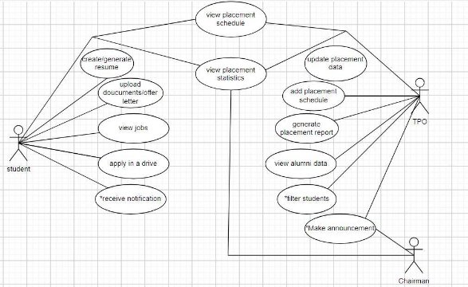

# Fusion ERP

## Software Requirements Specification

### for

## SA4 - PLACEMENT CELL

**Faculty Mentor:**

Dr. Pritee Khanna

**Prepared by:**

Akshay Anand - 21BCS015  
Kush Batla - 21BCS120  
Ayush Shinde - 21BCS047  
Hardik Rana - 21BEC091  
Vaibhavi Bhosale - 21BCS233  

**Mentor:**

Rahul Sankhla - 21BCS169  

## 1. Introduction

### 1.1 Introduction about Fusion – A Brief Description

FusionIIIT stands as a remarkable example of seamlessly integrating and automating diverse functions within PDPM Indian Institute of Information Technology, Design, and Manufacturing, Jabalpur. Developed meticulously using Python3 and driven by the Django Web framework, this student-led initiative aims to enhance the operational landscape of the institute. Covering a spectrum from efficient administration management to academic excellence and various departmental tasks, FusionIIIT stands out as a comprehensive solution that deals with all the complexities of campus life, from optimizing administrative processes to ensuring smoother academic journeys. FusionIIIT actively engages with various departments and sections, ensuring a seamless flow in every nook of campus life.

On the administrative side, FusionIIIT adeptly manages intricate paperwork and processes. In the academic sphere, it introduces a digital touch, simplifying learning and course management. Yet, FusionIIIT transcends its roles; it's more like a congenial companion, consistently contributing to the efficiency of life at PDPM IIITDM Jabalpur.

To put it simply, FusionIIIT goes beyond being just a tool; it embodies a supportive companion, significantly contributing to a more organized and enjoyable campus life experience for everyone at PDPM IIITDM Jabalpur.

### 1.2 Purpose of the Module

The Placement Cell module facilitates streamlined student-employer interaction, including resume creation and tracking, employer communication, interview scheduling, feedback collection, and analytics. It efficiently manages the logistics of interview scheduling, ensuring timely coordination between students and employers, enhancing the overall placement process.

### 1.3 Scope of the Module

The Placement Cell module at IIIT Jabalpur encompasses three primary actors: students, the chairman, and the Training and Placement Officer (TPO). Students utilize the module for tasks such as resume creation, submission, and interview scheduling, actively participating in the placement process. The chairman provides strategic guidance, offering oversight to ensure alignment with the institute's goals. The TPO plays a crucial role in managing day-to-day operations, facilitating communication between students and employers, overseeing interview scheduling logistics, and maintaining the overall efficiency of the placement process. This collaborative engagement among students, the chairman, and the TPO optimizes the placement experience, promoting successful interactions between students and potential employers at IIIT Jabalpur.

## 2. User/Actor Characteristics

### 2.1 Student

Represents individuals who intend to use this module for the Placement Cell and receive notifications of placement events, placement statistics, alumni details, generate CVs, etc. Students are divided based on program, discipline, year of joining, etc.

#### Specific Functionalities:

- A student can update his/her profile regularly so that the data can be extracted to generate his/her respective CV.
- A final year student will receive a notification when a company visits the campus for placement and he/she fulfills the criteria. He/she can decide whether he/she wants to apply for the company or not.
- Any student can refer to the past data pertaining to the previous year's Placement Summary (Visiting Companies, Packages Offered, Alumni Information, Positions Offered).
- A student can see the upcoming schedule of all the companies coming for recruitment.
- Shortlisted students will receive notifications regarding the placement rounds and current status.

### 2.2 Training and Placement Officer

A Placement Officer is the person who is in charge of contacting the company HR Executives for interview dates and scheduling events. He/She should have a PF number and an official institute email ID, which should be used for accessing the system.

#### Specific Functionalities:

- The Placement Officer will update all the records associated with the past placements offered on campus.
- The Placement Officer will regularly update the upcoming schedules of the companies.
- The Placement Officer will have the functionality to filter out students according to the company requirements and then send them notifications regarding whether they want to sit in the interview or not.
- The Placement Officer will enter information regarding the students selected or shortlisted and also send notifications to the respective students.
- The Placement Officer can check the validity and authenticity of the data entered by the students.

### 2.3 Chairman

The Placement Chairman is the person who holds upper authority in handling the Placement Cell operations. He/She should have a PF number and an official institute email ID, which should be used for accessing the system.

#### Specific Functionalities:

- The Placement Chairman can view placement statistics.
- The Placement Chairman can generate reports about the placement statistics.
- The Placement Chairman can make announcements regarding upcoming job fairs, campus recruitment drives, workshops, training programs, guest lectures, etc.

## 3. Functional Requirements

### 3.1 Use Case Diagram

2. **Use case Description i.**

 

|**UC ID**|UC#1||
| - | - | :- |
|**Use case Name**|create/generate\_resume||
|**Description**|This use case represents the interaction of a student with the system to view his/her CV.||
|**Actor**|Student||
|**Precondition**|The student must be logged in into the system.||
|**Main Flow**|1|The student chose the option to go to the ‘Placement Module’.|

<table><tr><th colspan="1" rowspan="3"></th><th colspan="1" valign="top">2</th><th colspan="1" valign="top">The system presents an option to create or generate the CV. He/she selects the relevant fields which he/she wants on the CV.</th></tr>
<tr><td colspan="1" valign="top">3</td><td colspan="1" valign="top">The student is redirected to a New Tab.</td></tr>
<tr><td colspan="1">4</td><td colspan="1">A report is generated with all the details pertaining to the student.</td></tr>
<tr><td colspan="1"><b>Post conditions</b> </td><td colspan="2">A report containing all the details and preferences selected by the student is generated and available for viewing or download.</td></tr>
<tr><td colspan="1"><b>Alternate Flow</b></td><td colspan="1">A1</td><td colspan="1">NA</td></tr>
<tr><td colspan="1"></td><td colspan="1" valign="top">A2</td><td colspan="1" valign="top">NA</td></tr>
<tr><td colspan="1"></td><td colspan="1" valign="top">A3</td><td colspan="1" valign="top">NA</td></tr>
<tr><td colspan="1"><b>Sub Flow</b></td><td colspan="2">NA</td></tr>
</table>

**ii.**

|**Use Case ID**|UC#2|||
| - | - | :- | :- |
|**Use Case Name**|Update Data(placement)|||
|**Description**|
This use case represents the interaction of a Placement Officer with the system to update Placement Records.

For this, the placement officer has to fill up a form specifying student details.
|||
|**Actor**|Placement Officer|||
|**Precondition**|The Placement Officer Must be logged into the dashboard.|||
|**Main Flow**|1|The Placement Officer chose the Placement Module option.||
||2|The Placement Officer selects the Past Records tab in the Placement Statistics Sidebar tab option.||
||3|The Placement Officer can search the record to be deleted. Or simultaneously add a new record by clicking on the Add button.||
||4|The Placement Officer clicks on the delete button corresponding to the respective student.||
||5|The system returns to the Placement Module.||
|**Post Conditions**|The details are successfully received by the system and reflected in the database.|||
|**Alternate Flow**|A1|The placement officer selects Delete a record.||
|||Post Condition: respective actions are done.||
|**Sub Flow**||NA||
|**Global Alternate Flow**|GA 1|The Placement Officer can ‘cancel’ the procedure at any time by clicking on the dashboard option.||
|||Post-condition – The system returns to the dashboard.||

**iii.**

|**Use Case ID**|UC#3|||
| - | - | :- | :- |
|**Use Case Name**|add\_placement\_schedule|||
|**Description**|
This use case represents the interaction of a Placement Officer with the system to maintain Placement schedule.

For this, the Placement officer has to fill up a form specifying dated events of any company.
|||
|**Actor**|Placement Officer|||
|**Precondition**|The Placement Officer Must be logged into the dashboard.|||
|**Main Flow**|1|The Placement Officer chose the Placement Module option.||
||2|The Placement Officer selects the Placement Schedule/activity tab from the Sidebar.||
||3|The system generates a form to be filled with the event details. On submitting, the event is scheduled.||
||4|The system returns to the Placement Module.||
|**Post Conditions**|The details are successfully received by the system and reflected in the database. Notifications are sent to respective people.|||
|**Alternate Flow**|NA|||
|**Sub Flow**|NA|||
|**Global Alternate Flow**|GA 1|The Placement Officer can ‘cancel’ the procedure at any time by clicking on the dashboard option.||
|||Post-condition – The system returns to the dashboard.||

**iv.**

**Use Case ID** UC#4

**Use Case Name** View\_placement\_schedule

**Description** This use case represents the interaction of a Placement

Officer/chairman with the system to maintain Placement schedule. For this, the Placement officer/chairman has to fill up a form specifying dated events of any company.

**Actor** Placement Officer/Student

**Precondition** The Placement Officer/Student Must be logged into the dashboard. **Main Flow** 1

2

3

**Post Conditions** The details are successfully received by the system and reflected in

the database. Notifications are sent to respective people.

**Alternate Flow** NA **Sub Flow** NA

|**Global Alternate Flow**|GA 1|The Placement Officer/chairman can ‘cancel’ the procedure at any time by clicking on the dashboard option.|
| :- | - | :- |
|||Post-condition – The system returns to the dashboard.|

**v.**

|**Use Case ID**|UC#5|||
| - | - | :- | :- |
|**Use Case Name**|View\_placement\_schedule\_activity|||
|**Description**|For this, the student has to fill up a form specifying dated events of any company.|||
|**Actor**|Student|||
|**Precondition**|The Student Must be logged into the dashboard.|||
|**Main Flow**|1|The Student chose the Placement Module option.||
||2|The Student selects the Placement activity / Schedule tab from the Sidebar.||
||3|The system generates a list of the scheduled events in the chronological order along with the indication that he/she accepted/rejected the event invitation.||
|**Post Conditions**|The details are successfully received by the system and reflected in the database. Notifications are sent to respective people.|||
|**Alternate Flow**|NA|||
|**Sub Flow**|NA|||
|**Global Alternate Flow**|GA 1|The Placement Officer can ‘cancel’ the procedure at any time by clicking on the dashboard option.||
|||Post-condition – The system returns to the dashboard.||

**vi.**

|**Use Case ID**|UC#6||
| - | - | :- |
|**Use Case Name**|view\_placement\_statistics||
|**Description**|This use case represents the interaction of a Placement Officer/Chairman with the system to review Placement statistics.||
|**Actor**|Placement Officer/Chairman||
|**Precondition**|The Placement Officer/Chairman Must be logged into the dashboard.||
|**Main Flow**|1|The Placement Officer/Chairman chose the Placement Module option.|
||2|The Placement Officer/Chairman selects the Placement Statistics option.|

||3|A screen displaying all the statistics in the Recent-First order is displayed. Records can also be filtered.||
| :- | - | :- | :- |
||4|Batch Statistics can be viewed by clicking on the Batch statistics tab.||
|**Post Conditions**|NA|||
|**Alternate Flow**|NA|||
|**Sub Flow**|NA|||
|**Global Alternate Flow**|GA 1|The Placement Officer can ‘cancel’ the procedure at any time by clicking on the dashboard option.||

**vii.**

|**Use Case ID**|UC#7|||
| - | - | :- | :- |
|**Use Case Name**|Generate report|||
|**Description**|This use case generates reports about the placement statistics|||
|**Actor**|Placement officer/Chairman|||
|**Precondition**|The Placement Chairman Must be logged into the dashboard.|||
|**Main Flow**|1|The Placement Chairman chose the Placement Statistics option.||
||2|The Placement Chairman then generates reports about the placement statistics||
|**Post Conditions**|NA|||
|**Alternate Flow**|NA|||
|**Sub Flow**|NA|||
|**Global Alternate Flow**|GA 1|The Placement Chairman can ‘cancel’ the procedure at any time by clicking on the dashboard option.||
|||Post-condition – The system returns to the dashboard.||
|**Use Case ID**|UC#7|||
|**Use Case Name**|Generate report|||
|**Description**|This use case generates reports about the placement statistics|||
|**Actor**|Placement officer/Chairman|||
|**Precondition**|The Placement Chairman Must be logged into the dashboard.|||
|**Main Flow**|1|The Placement Chairman chose the Placement Statistics option.||

**viii.**

|**Use Case ID**|UC#8|
| - | - |
|**Use Case Name**|Make announcement|
|**Description**|This use case gives the latest updates on the placement process|
|**Actor**|Placement Chairman|

|**Precondition**|The Placement Chairman Must be logged into the dashboard.||
| - | - | :- |
|**Main Flow**|1|PLACEMENT CHAIRMAN chooses to write a new announcement|
||2|The announcement gets published|
|**Post Conditions**|NA||
|**Alternate Flow**|NA||
|**Sub Flow**|NA||
|**Global Alternate Flow**|NA||

**ix.**

<table><tr><th colspan="1" valign="top"><b>Use Case ID</b></th><th colspan="2" valign="top">UC#9</th></tr>
<tr><td colspan="1" valign="top"><b>Use Case Name</b></td><td colspan="2" valign="top">upload_offer_letter/upload documents</td></tr>
<tr><td colspan="1" valign="top"><b>Description</b></td><td colspan="2" valign="top">This use case represents the interaction between the student and the system by allowing students to upload the offer letter or any other documents.</td></tr>
<tr><td colspan="1" valign="top"><b>Actor</b></td><td colspan="2" valign="top">Students</td></tr>
<tr><td colspan="1" valign="top"><b>Precondition</b></td><td colspan="2" valign="top">The Student Must be logged into the dashboard.</td></tr>
<tr><td colspan="1" valign="top"><b>Main Flow</b></td><td colspan="1" valign="top">1</td><td colspan="1">The student chose the option to go to the “Placement module”.</td></tr>
<tr><td colspan="1"></td><td colspan="1" valign="top">2</td><td colspan="1">The system presents the option to upload the offer letter or any other documents. He/She uploads the relevant files in the relevant fields.</td></tr>
<tr><td colspan="1" valign="top"><b>Post Conditions</b></td><td colspan="2" valign="top">The uploads are successfully received by the system and reflected in the database.</td></tr>
<tr><td colspan="1" rowspan="2" valign="top"><b>Alternate Flow</b></td><td colspan="2" valign="top">The system verifies the size of the uploaded files.</td></tr>
<tr><td colspan="2" valign="top">Postcondition- An error message is displayed to resize and upload the file</td></tr>
<tr><td colspan="1" valign="top"><b>Sub Flow</b></td><td colspan="2" valign="top">NA</td></tr>
<tr><td colspan="1"><b>Global Alternate Flow</b></td><td colspan="2" valign="top">NA</td></tr>
</table>

**x.**

|**Use Case ID**|UC#10||
| - | - | :- |
|**Use Case Name**|view\_past\_placement\_records||
|**Description**|
This use case represents the interaction of a student with the system to view past placement records and summary.

For this, the student has to filter data according to his requirements.
||
|**Actor**|Student||
|**Precondition**|The Student Must be logged into the dashboard.||
|**Main Flow**|1|The student chose the option to go to the ‘Placement Module’.|
||2|The system generates a screen showcasing all the valid placement cell facilities available to students.|
| :- | - | :- |
||3|The student selects the Placement Statistics sidebar tab option.|
||4|The system generates a screen consisting of filters (Company, Year; etc) to view specific data. The student enters filters. [A1]|
||5|A list of records is generated.|
||6|The student returns to the dashboard after viewing the records.|
|**Post Conditions**|NA||

**xi.**

|**Use Case ID**|UC#11|||
| - | - | :- | :- |
|**Use Case Name**|recieve\_notifications|||
|**Description**|This use case represents the interaction of a student with the system to view and respond to his/her important notifications regarding the companies visiting and their interview schedule.|||
|**Actor**|Student|||
|**Precondition**|The Student Must be logged into the dashboard.|||
|**Main Flow**|1|The student goes to the placement module.||
||2|The system generates the placement activity/ schedule page.||
||3|The student can view his/her notifications in the right side panel.||
||4|The student can respond to the important notifications from the notification panel itself.||
|**Post Conditions**|The response to the notifications is recorded in the database and is reflected at other valid screens.|||
|**Alternate Flow**|NA|||
|**Sub Flow**|NA|||
|**Global Alternate Flow**|GA 1|The student can return to the dashboard at any time by clicking on the dashboard option.||
|||Post-condition – The system returns to the student dashboard.||
|**Use Case ID**|UC#\*|||
|**Use Case Name**|recieve\_notifications|||
|**Description**|This use case represents the interaction of a student with the system to view and respond to his/her important notifications regarding the companies visiting and their interview schedule.|||

**xii.**

|**Use Case ID**|UC#12|
| - | - |
|**Use Case Name**|Alumni data|

|**Description**|This use case allows to view alumni data||
| - | - | :- |
|**Actor**|Placement officer||
|**Precondition**|The Placement officer Must be logged into the dashboard.||
|**Main Flow**|1|The officer selects the batch and student|
||2|The officer gets details of the alumni|
|**Post Conditions**|NA||
|**Alternate Flow**|NA||
|**Sub Flow**|NA||
|**Global Alternate Flow**|NA||
|**Use Case ID**|UC#12||
|**Use Case Name**|Alumni data||
|**Description**|This use case allows to view alumni data||
|**Actor**|Placement officer||
|**Precondition**|The Placement officer Must be logged into the dashboard.||

**xiii.**

|**Use Case ID**|UC#13||
| - | - | :- |
|**Use Case Name**|view\_jobs||
|**Description**|This use case allows to see the available jobs||
|**Actor**|Students||
|**Precondition**|The Student Must be logged into the dashboard.||
|**Main Flow**|1|The student chose the option to go to the “Placement module”.|
||2|The student chose the jobs option|
|**Post Conditions**|NA||
|**Alternate Flow**|NA||
|**Sub Flow**|NA||

**xiv.**

|**Use Case ID**|UC#14||
| - | - | :- |
|**Use Case Name**|apply\_in\_a\_drive||
|**Description**|This use case allows to apply for jobs||
|**Actor**|Students||
|**Precondition**|The Student Must be logged into the dashboard.||
|**Main Flow**|1|The student choose the job he wants to apply for|
||2|he/she applies for the job|
|**Post Conditions**|NA||

|**Alternate Flow**|NA|
| - | - |
|**Sub Flow**|NA|
## 3.3 Other Functional Requirements

- This module will make use of the communication module for sending notifications and alerts to various actors involved in the module suitably for placement sessions, announcements, and other organized events.
- Automated email and SMS notifications for placement sessions, announcements, and other organized events.
- The Super Admin of Fusion should be able to assign roles for the Chairman.
- The system should be able to generate CVs for the students.

## 3.4 Other Constraints

### 1. User Interfaces

The user interface should align with FUSIONIIIT's color scheme and dashboard design for visual consistency. Implement a clear navigation menu, standard patterns, and clickable elements for smooth inter-module navigation. Maintain an intuitive design to minimize the learning curve, ensuring that users can easily access functionalities without specific training.

### 2. Technology Stack Used

- **Frontend**: HTML, CSS
- **Backend**: Django (Python), PostgreSQL
- **API Communication**: RESTful APIs for data exchange between frontend and backend.
- **Libraries and Frameworks**: Potential use of additional libraries for:
  - **Authentication** (e.g., Django REST framework authentication)

### 3. Data Migration

Existing data from the college database, including the data of the students, placement statistics, etc., needs to be migrated to the Fusion database.

### 4. Business Rules

1. Only students who are registered and have cleared all their dues (including tuition fees) should be eligible to participate in placement activities.
2. Each placement opportunity (such as a job or internship position) should have a specified number of openings, and students should not be allowed to apply for a position once its capacity is filled.
3. Students should be allowed to apply for placement opportunities only during a specified placement registration period, which is communicated in advance.
4. If certain placement opportunities require prerequisites (such as specific courses completed, a certain GPA, skills, or experiences), only students who meet these prerequisites should be allowed to apply for these opportunities.

## 4. Non-Functional Requirements

### 1. Performance Requirements

The system should maintain high responsiveness during peak placement seasons and be capable of supporting a high number of concurrent users accessing placement-related features. It must also be scalable to accommodate an increasing number of students, companies, and job listings.

### 2. Reliability and Availability

The Placement Cell Module should ensure high availability and reliability during crucial periods such as job application deadlines, interview scheduling, and result announcements to prevent any disruption in placement activities.

### 3. Security Requirements

In addition to secure authentication, the system should maintain confidentiality of student records, employer information, and job application details.

### 4. Compatibility

The system should be compatible with widely-used operating systems, including mobile platforms, to facilitate easy access for students, faculty, and employers. This includes ensuring a seamless experience on web browsers for desktop users.

### 5. Maintainability

The source code for the Placement Cell Module should be well-documented, adhere to coding standards, and be structured to allow easy updates and integrations, such as adding new features for placement analytics, employer feedback, and student performance tracking.

## 5. Module Dependencies with Other Fusion Modules

### 5.1. UI Level

The Placement Cell module in Fusion relies on the integration with other modules at the UI level.

#### UI Integration with:

1. **Notification Panel Integration**: Important placement-related notifications are displayed in the UI.
2. **Course Management (AC3)**: Allow students to link their academic performance and course completions to their placement profiles and CVs.
3. **Dashboards (GAD5)**: Dashboard will be used for visual representation of the registered student data.

### 5.2. Module Level Dependencies

- **Program and Curriculum (AC1)**: The Placement Cell needs information about programs and curricula to understand students' academic backgrounds and specializations. Helps in matching students with suitable job profiles and internships based on their academic curriculum.
- **Examination (AC7)**: Academic performance and exam results are often criteria for eligibility in placements.
- **Dashboard (GAD5)**: Dashboards provide a comprehensive view of various metrics and data points which can be used for better decision-making in placements.
- **Navigation Module**: Placement Module collaborates with Navigation Module to ensure a user-friendly interface and smooth transitions between modules.

### 5.3. DB Level Dependencies

Course Registration module in Fusion at the DB Level Dependencies with other modules:

1. **PlacementStatus Model**: It has foreign key relationships with NotifyStudent and Student models.
   - **Shared Data**: This model represents the status of placements for students, linking to the Student model.
  
2. **NotifyStudent Model**: It has a foreign key relationship with the PlacementSchedule model.
   - **Shared Data**: This model represents notifications sent to students regarding placements, linking to the PlacementSchedule model.

3. **PlacementRecord Model**:
   - **Dependencies**: This model represents records of placements and has a relationship with the StudentRecord model, allowing tracking of student placement records.

4. **StudentRecord Model**:
   - **Shared Data**: This model represents records related to students, such as educational and placement records.
   - **Dependencies**: It links to the PlacementRecord model to associate students with their placement records.

5. **StudentPlacement Model**:
   - **Shared Data**: This model represents additional placement-related information for students, such as debar status, placement type, and placement date.
   - **Use**: It serves as an extension of the Student model, providing information specific to the student's placement status.
