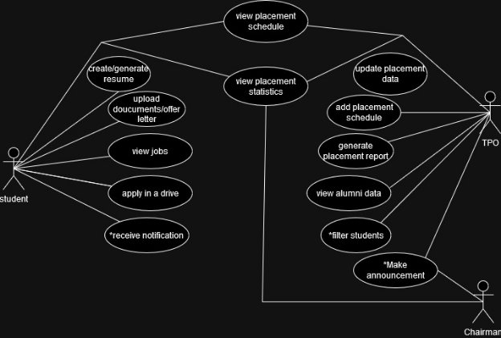

# Figma Profiles for Placement Cell - App

---

## 1. Module Description

The **Placement Cell Module** aims to facilitate and streamline placement activities at IIIT Jabalpur. It manages interactions between students, placement officers, and the chairman, handling recruitment, job posting updates, student profiles, applications, and placement statistics. The module enhances accessibility for students and efficiently manages placement-related processes.

  

*(Final Use Case Diagram after consulting Omvir Sir, TPO)*

---

## 2. Actors

### 2.1 Student

Represents students of **PDPM IIITDM Jabalpur**, identified by a roll number and official institute email ID, which is essential for system access.

**Role:**  
Students participate in placement drives, workshops, and stay updated on placement statistics.

**Specific Functionalities:**
- **Profile Updates:** Students can regularly update their profiles to generate CVs.
- **Placement Notifications:** Final-year students are notified when companies visit for placements. They can choose to apply based on criteria.
- **PBI Notifications:** Third-year students receive notifications for pre-placement offers and can decide whether to apply.
- **Placement Summary:** Students can access past placement data and statistics.
- **Company Schedules:** Students can view upcoming recruitment schedules.

[Figma Profile for Student](https://www.figma.com/file/Z4gQFIewPP56KLVqM9F8l6/fusion_mobile_placement_cell-Student?type=design&node-id=0-1&mode=design&t=4pSHBohorXqQCdqs-0)

---

### 2.2 Training & Placement Officer (TPO)

The **Placement Officer** coordinates with company HR executives to schedule interviews and plan recruitment events. The officer requires a **PF number** and official institute email ID for system access.

**Role:**  
Manages placement cell operations like scheduling, generating reports, and confirming student authenticity.

**Specific Functionalities:**
- **Records Management:** The officer updates records related to past and upcoming placements.
- **Student Notifications:** Filters students based on company requirements and sends notifications for interviews.
- **Shortlisting:** Enters and manages the list of selected or shortlisted students.
- **Higher Studies Information:** Records information on students pursuing higher studies.
- **Data Verification:** Verifies the accuracy of student-submitted data.
- **Restrict Participation:** Can restrict students from participating in placement activities.

[Figma Profile for TPO](https://www.figma.com/file/J6emX1D9nAKUtmRyqC2Ak5/fusion_mobile_placement_cell-TPO?type=design&node-id=0-1&mode=design&t=c1IiGpmC9cxUiUDv-0)

---

### 2.3 Chairman

The **Placement Chairman** holds higher authority in managing placement cell operations.

**Specific Functionalities:**
- **Overseeing Activities:** Reviews all actions carried out by the Placement Officer.
- **Company Visits:** Documents visits and can recommend postponing a company's visit.
- **Company Recommendations:** Suggests companies to the Placement Officer for potential recruitment sessions.

[Figma Profile for Chairman](https://www.figma.com/file/1up9jlzgNCh5MIrdyjo8BB/fusion_mobile_placement_cell-Chairman?type=design&node-id=0-1&mode=design&t=8T2VQ6UAER2c7nYs-0)

---

## 3. Figma Profile Design Guidelines and Additional Considerations

### 5.1 Cross-Platform Compatibility:
- Ensure Figma designs and features are compatible across both web and mobile versions.

### 5.2 Dimension Standardization:
- All Figma designs should maintain a standard dimension of around 360px width for mobile.

### 5.3 Actor-Oriented, Use Case-Based Design:
- Strictly adhere to use cases of actors when designing Figma profiles to ens
